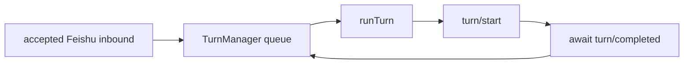

# Issue #63 implementation plan (historical)

> **Archived 2026-09-01.** Extracted from the non-blocking dispatcher
> inbound domain page: the pre-issue-#63 shape and the imperative
> implementation plan are history, not current contract. The living
> contract stays on
> [/.agents/domains/non-blocking-dispatcher-inbound.md](/.agents/domains/non-blocking-dispatcher-inbound.md).

## Pre-Issue #63 Artifact

Before issue #63, the dispatcher inbound path was a process-local serialized
turn worker:

`TurnManager.drainLoop()` awaits `processBatch()`, and `processBatch()` awaits
`runTurn()`. `runTurn()` submits `turn/start` and resolves only after
`turn/completed`. A long Codex turn therefore blocks later accepted Feishu
messages from reaching Codex.

The channel added one received reaction after the old Codex runtime
`enqueueInbound()` path returned true. Issue #63 first replaced this historical
path with a three-state channel-owned reaction flow. That progress surface is
also historical: COT cards now present automatic conversation progress.

## Code Changes

`/packages/agent-runtime/codex/src/turn-manager.ts`

- Remove same-chat coalescing and the completion-gated `drainLoop()` /
  `processBatch()` queue as the inbound submission gate.
- Keep process-local `message_id` dedupe.
- Replace `enqueue(input): boolean` with an async per-message submission path:
  accepted, deduped input is formatted as one prompt/envelope and submitted via
  `turn/start` immediately.
- Return a delivery result to the runtime/server so the channel can switch the
  reaction to in-progress at the `turn/start` acceptance point.
- Do not use active turn ids as inbound routing state. Do not call `turn/steer`
  for normal inbound.

`/packages/dreamux/src/service/dispatcher-service/index.ts`

- Keep the Dispatcher Service as the neutral runtime/channel bridge.
- Forward each Channel provider delivery request to the selected Agent Runtime
  and return the real `InboundDeliveryResult`, including duplicate, submitted,
  and failed information.
- Do not introduce a dispatcher-level mutex, production observer, or
  active/idle branch.
- Inject the neutral conversation projection into the dispatcher agent. This
  observation path does not delay or alter delivery.

`/packages/agent-runtime/codex/src/events.ts`

- Split the current `runTurn()` shape so production inbound can call a
  `submitTurnStart()`-style helper that sends `turn/start` and resolves on the
  RPC acceptance ack.
- The old `runTurn()` shape (`turn/start` plus await `turn/completed`) must not
  remain on the Feishu inbound path. It can remain only as a test/diagnostic
  helper if still useful.
- Do not add a `turn/steer` helper for normal Feishu inbound.

`/packages/channel/feishu-channel/src/feishu-channel.ts`

- Do not add, replace, or clean up automatic reactions during inbound delivery.
- Subscribe the session COT adapter to the neutral conversation event source.
  Dispatcher events render only when their frozen `channel_origin` belongs to
  this session; foreign and origin-less dispatcher streams are strict no-ops.
- Keep `reply` and the deliberate model-facing `react` tool independent of the
  automatic progress surface.

`/packages/channel/feishu-channel/src/feishu-message.ts`

- Keep the existing discrete `<feishu_message>` envelope and routing metadata
  (`chat_id`, `message_id`, `sender_id`, `sender_name`, `create_time`) so the
  model can reply to the correct source message after interleaving.

