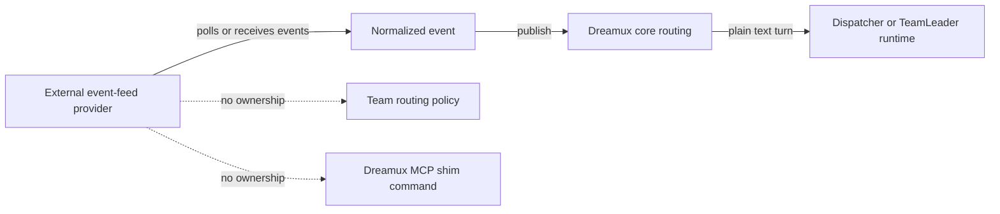

# Subscribe Channel Event Feeds

Status: Archived exploration, not current implementation guidance.

This document preserves the short-lived subscribe-channel exploration from the
Dispatcher isomorphism work. The active Dreamux contract no longer exposes
subscribe-channel provider types, config, loaders, MCP shims, admin methods, or
session lifecycles. Do not implement from this archive without writing a new
proposal and re-establishing current source-level boundaries.

## Problem Explored

The idea was to let one-way event feeds, such as GitHub issue or pull request
comments, push structured text into Dreamux without pretending to be a
conversational chat channel. The key distinction was that event feeds do not own
chat ids, reply/react behavior, Team channel binding, or channel egress
authorization.

## Archived Shape

The explored boundary was:

- provider packages own platform I/O, filtering, event formatting, and provider
  credentials;
- Dreamux core owns routing policy, Dispatcher or TeamLeader target selection,
  runtime input semantics, admin socket routing, and MCP shim command assembly;
- event-feed input should be a Dreamux-owned plain text input path, not a
  conversational `channelInput` turn.

## GitHub Polling Notes

Webhook delivery was rejected for the immediate alpha because the running host
had no public IP. A polling-based GitHub provider was investigated instead.

The narrowed alpha scope would have been:

- read-only GitHub polling provider in a separate package, not in core;
- issue comments and pull request review comments only;
- no outbound GitHub MCP tools;
- no GitHub App installation flow;
- no `actions` filter that pretends REST list endpoints have webhook action
  semantics;
- provider-level polling with stable event ids based on GitHub object id plus
  update timestamp;
- minimum persisted cursor per subscription to avoid replay storms after
  restart;
- `start()` arms background polling without waiting for the first network poll;
- `close()` cancels or drains in-flight polling and guarantees no publish after
  it resolves;
- core-owned target routing, with missing or closed Team targets dropping the
  event as stopped instead of crashing the provider loop.

## Why It Was Archived

The exploration started to grow real config, type, MCP, admin, and session
surfaces before the feature was actually needed. That added public API and
runtime weight to a PR whose main goal was Dispatcher runtime-state isomorphism.
The active code now removes that surface and leaves this archive as the only
record of the idea.

## Reopening Criteria

Reopen this only with a fresh proposal that answers:

- whether the feature is polling, webhook, or both;
- where durable cursor state lives;
- how event-feed input enters the runtime without reusing chat-channel
  semantics;
- whether TeamLeader targeting is part of the initial contract;
- which package owns each provider implementation;
- what public `@excitedjs/dreamux-types` API is required.
