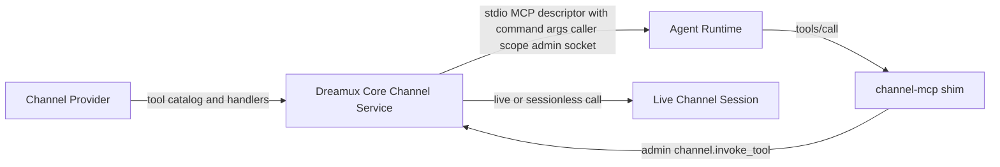

# Dispatcher Agent Entity Isomorphism

- **Status:** Accepted / implemented in PR #282
- **Date:** 2026-07-04
- **Affects:** `@excitedjs/dreamux-types`, `@excitedjs/dreamux`,
  `@excitedjs/feishu-channel`, `@excitedjs/agent-runtime-claude-code`,
  dispatcher service startup, agent identity/state storage, channel MCP
  descriptors, scheduler wakeup, channel inbound acknowledgement, dispatcher
  role prompts and skills
- **PR / Issue:** [PR #282](https://github.com/excitedjs/dreamux/pull/282)

## Context

PR #282 removed several real duplicate entities: Dispatcher runtime launch no
longer has an inline `buildDispatcherLaunch()` path, Dispatcher runtime recovery
no longer writes `status.json`, and built-in runtimes no longer need the
durable `<state>/<dispatcherId>/runtime/<name>` scratch directory.

That direction is still correct, but the implementation proved that the first
decision record defined "isomorphism" too narrowly. It treated "Dispatcher,
TeamLeader, TeamMate, and Team member all pass through `TeammateService` and
`identity.json`" as sufficient. The PR comments show that this is not enough:
some old Dispatcher special cases were deleted, while new special cases were
introduced in shared classes, provider packages, helper files, and callback
interfaces.

The revised design must make ownership and negative gates explicit. The target
is not to hide Dispatcher differences inside the shared runtime holder. The
target is to make every remaining difference either:

- data supplied by the owning aggregate before constructing a shared service;
- a neutral field on the agent identity;
- or an explicitly documented structural difference, such as the Dispatcher root
  identity being config-declared and non-enumerable.

Anything else is glue and should not be approved.

Current source facts verified in the PR worktree:

- `ChannelProvider.mcpServerDescriptor()` lets a channel provider assemble the
  Dreamux core `channel-mcp` command, caller args, and admin socket args.
- `ChannelRoutes.deliver()`, `TeamService.deliverToLeader()`,
  `TeammateService.channelInput()`, and runtime `channelInput()` forward
  `InboundDeliveryHooks`.
- `SchedulerServiceOptions.submitScheduled()` receives a `shouldSubmit`
  predicate that represents scheduler-held-fire lifetime.
- `TeammateService` contains behavior branches on concrete roles, including
  roster validation, worktree cleanup, and provider-facing runtime id
  derivation.
- `TeamMateIdentityStore` lives under `service/teammate-collection/` but now
  owns Dispatcher root identity ensure, TeamLeader identity reads, Team member
  identity reads, and ordinary teammate identity reads.
- `Dispatchers.summarize()` fabricates `status: 'stopped'` and
  `thread_id: null` for unmaterialized dispatcher services.
- `dispatcherHostPaths` is a no-op alias for `hostRuntimePaths`.
- `dispatcher-service/helpers.ts` is a mechanical split of functions used only
  by `DispatcherService`.

Those facts are the defects this revision is meant to remove or explicitly
bound.

## Decision

Keep the high-level runtime-state direction:

- Dispatcher, TeamLeader, TeamMate, and Team member are agent entities.
- Runtime recovery state belongs in each entity's `identity.json`.
- Provider launch resolves through `identity.agent_runtime -> agents[]`.
- `status.json`, inline Dispatcher launch, and durable child runtime scratch
  directories remain retired.

Tighten the architecture boundary:

- Channel providers own channel capabilities, platform I/O, static tool
  catalogs, live tools, sessionless tools, target resolution, and message
  ownership facts.
- Dreamux core owns the generic `channel-mcp` process descriptor, CLI command,
  admin socket, caller scoping, and shim arguments.
- The shared runtime holder must not decide behavior by concrete role names.
  Role differences must be supplied as construction-time profile data or stored
  as neutral identity fields.
- Agent identity storage is a neutral agent-entity concern, not a teammate
  collection concern.
- Channel acknowledgement and scheduler cancellation must not be implemented as
  single-consumer callbacks threaded through unrelated layers.

The revised design intentionally rejects a "small patch" that only fixes the
visible comments while keeping the same ownership mistakes. The implementation
is not ready until the negative gates below are true.

## Ownership Model



The diagram is an ownership diagram, not an implementation call graph. The
important point is that provider packages do not compose core command lines.

## Channel MCP Ownership

Remove `ChannelProvider.mcpServerDescriptor()` and
`ChannelMcpDescriptorContext` as provider-authoring concepts because they carry
core-owned command and admin-socket state.

Add or reuse a provider-owned static tool catalog seam. The provider can expose
tool metadata from config and provider context, for example:

```ts
tools?(config: TConfig):
  readonly ChannelToolDescriptor[];
```

The tool catalog is launch-time static metadata. If a future provider needs
dispatcher-scoped catalog filtering, add a small core-owned context then; do not
pass core command, socket, or caller-shim information to the provider catalog
method.

The exact method name can reuse the existing `tools` word, but the ownership
must be this:

- provider returns only tool descriptors and handles tool calls;
- core filters configured channels by dispatcher;
- core renders the `AgentRuntimeMcpServer` descriptor;
- core supplies `dreamuxBinPath()`, `channel-mcp`, `--provider`,
  `--channel-id`, `--dispatcher`, `--caller`, `--team-id`, `--leader-name`,
  `--channel-tools-b64`, and `--admin-socket`;
- core remains the only owner of admin-socket and shim protocol flags.

Feishu becomes a provider of:

- `buildToolCatalog()` metadata;
- live `reply` and `react` handling;
- sessionless `list_chat_bots` handling;
- channel start/close/target resolution/message ownership.

Feishu does not build `channel-mcp` descriptors and does not know the generic
shim's CLI argument layout.

There must be one catalog authority for `tools/list`: provider/config static
catalog. Session-level metadata must not be used to build runtime MCP
descriptors or serve the shim's `tools/list`. A live channel session may handle
live calls and ownership facts, but it is not the launch-time MCP metadata
source. If keeping a session-level `tools()` method only preserves this double
authority, delete it. `ChannelToolListContext` is removed with the
session-level catalog path or folded into a core-owned descriptor-building
context, not exposed as provider runtime launch context.

`ChannelSessions.channelMcpServerDescriptorsForCaller()` may remain only as a
core convenience if it returns core-rendered descriptors for dispatcher-scoped
configured channels. It must not be a provider-descriptor forwarding layer.

## Agent Entity Storage

Rename and relocate the identity and turn stores so their names match their
scope.

The current `TeamMateIdentityStore`, `TeamMateTurnsStore`, and
`TeamMateRuntimeStateStore` are already storing more than teammates:

- root Dispatcher identity;
- ordinary dispatcher-owned teammate identities;
- TeamLeader identities;
- Team member identities.

The target owner is a neutral agent-entity module, for example
`service/agent-entity/`. Names should reflect the neutral scope:

- `AgentIdentityStore`;
- `AgentTurnsStore`;
- `AgentRuntimeStateStore`;
- `AgentEntityRole`;
- `AgentEntityIdentity`.

The store may still use the same physical path layout:

- Dispatcher root identity at the dispatcher root;
- dispatcher-owned teammates under `teammate/`;
- TeamLeader and Team members under team paths.

The dispatcher root identity must stay outside the teammate collection so
teammate admin verbs cannot enumerate or address it. The fix is not to move the
Dispatcher into `teammate/`; the fix is to move the shared store out of the
teammate collection namespace.

After relocation, shared agent storage imports and public shared type names must
come from the neutral agent-entity module. `TeamMate*` store/type names may
remain only for truly teammate-specific collection APIs, not for storage
infrastructure used by Dispatcher, TeamLeader, and Team member entities.

Dispatcher identity ensure remains a Dispatcher-owned policy over a neutral
store:

- ensure the root identity exists;
- update config-owned fields from the dispatcher declaration;
- preserve compatible runtime-owned fields;
- clear `session_id`, runtime status, and provider-specific error when
  `agent_runtime`, `cwd`, `runtime_cwd`, or worktree identity becomes
  incompatible.

That compatibility policy should not live in a teammate collection store. It can
live in a Dispatcher agent identity helper or a neutral agent-entity helper that
is explicitly called only by `DispatcherService` preparation.

## Shared Runtime Holder

`TeammateService` currently acts as the shared runtime holder, but the name and
some internals still reflect the old teammate-only world. This revision does
not require a large rename before the next implementation, but it does require
removing role-aware behavior from the shared runtime holder.

The shared service should receive an entity profile from its owner. The profile
is data, not role branching inside the shared class. It contains:

- static `mcpServers`;
- `skillSources`;
- `systemPrompt`;
- `disableFeatures`;
- provider-facing runtime label;
- completion routing behavior;
- worktree cleanup policy derived from identity worktree metadata;
- optional roster validator or scope validator;
- logger identity fields.

Dispatcher, TeamLeader, TeamMate, and Team member may have different profiles.
The shared service should not switch on literal roles to discover those
differences.

Capabilities must be modeled by presence or absence, not by no-op callbacks.
The profile must not force Dispatcher, TeamLeader, or TeamMate factories to pass
empty implementations such as `() => 0`, `() => {}`, or "unsupported" stubs just
to satisfy a shared constructor. If a capability is unsupported for an entity,
the capability is absent and the shared holder never calls it. This applies to
completion capture, worktree cleanup, roster validation, and any future
entity-specific behavior. The shared constructor types should express
unsupported capabilities as optional fields or role-specific `pick`/`omit`
profiles so TypeScript prevents accidental invocation without a runtime `if`.

Role-sensitive code to remove from the shared holder:

- worktree cleanup based on `identity.role === 'teammate'`;
- Team borrowed-worktree sync based on `team_leader` / `team_member` literals;
- `assertOwnRoster()` branches over `dispatcher`, `teammate`, `team_leader`,
  and `team_member`;
- provider-facing runtime id derivation from role literals;
- logger field choices based on role literals.

Worktree cleanup must be capability based:

- the decision to clean is driven by identity worktree metadata, not role name;
- an owned worktree is cleaned when `identity.worktree.mode === 'managed'` and
  `identity.worktree.cleanup === 'delete-on-close'`;
- an entity without that cleanup state must not call the worktree manager even
  if a worktree manager dependency exists elsewhere in the process;
- borrowed Team worktree synchronization is a Team-owned operation, not a
  role-name operation.

Provider-facing runtime labels are supplied by the owner or by one neutral
identity helper outside the runtime holder. The current compatibility choice is:

- root Dispatcher keeps the bare dispatcher id for log/socket/diagnostic
  continuity;
- child entities use scoped child labels.

That label is launch metadata only. It is not path authority and not recovery
state.

## Dispatcher Aggregate Boundary

Dispatcher remains an aggregate root because it owns concerns no child agent
owns:

- channel sessions and channel bindings;
- Team collection;
- dispatcher-owned teammate collection;
- dispatcher cron;
- restart intent ordering;
- inbound routing;
- admin summary over Dispatcher-owned state.

That does not mean one large class should implement every detail. The revised
design should make `DispatcherService` a composition root plus lifecycle owner,
not a place for unrelated helper logic.

Keep inside `DispatcherService`:

- aggregate start/stop/shutdown transaction;
- sequencing of prepare, restart-notice eager start, input-source start, and
  rollback;
- binding between channel input and team/dispatcher routing;
- ownership of live channel session publication.

Move or inline away:

- core channel MCP descriptor rendering into a dedicated core descriptor module;
- identity ensure policy into an agent-entity helper called by Dispatcher
  preparation;
- admin summary reading into a reader that can read identity without
  materializing the full service;
- mechanical helpers that only make the file shorter and do not express a
  boundary.

`dispatcher-service/helpers.ts` should not exist merely to hold
`asInboundDeliveryResult`, `closeAllBuilt`, and `errInfo`. Either give helpers a
real domain owner or keep the code near the lifecycle it supports.

## Channel Inbound Acknowledgement

Remove `InboundDeliveryHooks` from the full inbound delivery path.

The previous hook was a single-consumer callback used to time Feishu reactions.
Threading it through `ChannelRoutes`, `DispatcherService`, `TeamService`,
`TeammateService`, `AgentRuntime.channelInput()`, and runtime providers made
channel acknowledgement a hidden runtime callback contract.

The channel layer should observe delivery result instead:

- channel session normalizes inbound input;
- channel session may optimistically set its platform ack/reaction before
  calling `routes.deliver()` when the platform UX needs immediate feedback;
- channel session calls `routes.deliver(input, envelope)`;
- core dedupes and submits the turn;
- core returns a delivery result that distinguishes accepted/submitted,
  duplicate, stopped, and failed;
- the channel session updates or clears its reaction or ack ledger from that
  result.

Do not invent a background "accepted promise" or early-return async flow just to
replace the hook. For Feishu-style UX, the channel session can mark the message
as received before delivery, then clear or adjust the mark if `deliver()` returns
`duplicate`, `stopped`, or `failed`, and finalize it when `deliver()` returns
`submitted`. Runtime `channelInput()` should accept turn data only.

This keeps Feishu reaction behavior in the Feishu channel session and keeps the
agent runtime seam free of channel side effects.

The cleanup is transitive:

- `ChannelRoutes.deliver()` takes only `(input, envelope)`;
- `DispatcherService.routeChannelInput()` takes no hooks parameter;
- `TeamService.deliverToLeader()` takes no hooks parameter;
- `TeammateService.channelInput()` takes no hooks parameter;
- `AgentRuntime.channelInput()` and built-in runtime implementations take no
  hooks parameter;
- the `InboundDeliveryHooks` interface and root exports are deleted.

## Scheduler Cancellation

Do not expose scheduler-held-fire lifetime as an optional `shouldSubmit`
predicate on the owner submit API.

The scheduler owns held fire tokens, timer state, and stop/delete/supersede
lifetime. Use a scheduler-owned `AbortSignal` or equivalent neutral cancellation
token. The signal is created for the held fire and is aborted when `stop()`,
delete, disable, or supersede invalidates that fire.

The cancellation signal must remain checkable at the runtime-start boundary:
the owner submit path must observe it before `ensureStarted()` can start a
dormant runtime, and again before submitting to a live runtime. A single
internal check before invoking owner submit is not sufficient because `stop()`
can race between that check and the owner's runtime start.

The important requirement remains: `stop()` racing a held scheduler fire must
not start a dormant runtime and must not submit after shutdown begins. The
implementation should satisfy that requirement without adding a bespoke
`shouldSubmit?: () => boolean` callback to scheduled input.

## Admin Dispatcher Status

Admin list/status must not fabricate runtime recovery fields as if they were
persisted facts.

When a Dispatcher service is materialized, summary can combine live runtime and
root identity. When it is not materialized, the summary reader should read the
root identity directly or report an explicit non-live state that is not
confused with a persisted runtime status.

Summary reads are read-only. They must not trigger the full Dispatcher
prepare/start transaction, must not build channel sessions, and must not create
or start the contained Dispatcher agent. The reader may receive the neutral
agent identity store directly or use a dedicated identity peek helper; it must
not call `prepareChannels()` or `start()`.

Do not return `status: 'stopped'` and `thread_id: null` merely because the
service object is absent if the root identity can be read cheaply. If the
identity is absent, the state can be "declared but not prepared" or another
neutral display status, but it must be named as process visibility rather than
runtime recovery truth.

`status.json` remains retired. The solution is not to bring back
`DispatcherStore` runtime rows; the solution is to read the new authority.

## Runtime Path Context

Keep the path-context direction from PR #282:

- `AgentRuntimePathContext` exposes `cacheDir()`, `logsDir()`, and
  `runtimeSocketDirs()`;
- the old provider-facing writable `dispatcherDir(id)` state root is gone;
- built-in runtimes do not write provider scratch under
  `<state>/<dispatcherId>/runtime/<name>` or the dispatcher root state
  directory;
- Claude Code MCP config is passed inline as JSON and is not written as a
  per-runtime scratch file;
- Claude Code skill adapters are immutable cache artifacts and are never
  refreshed in place.

Delete `dispatcherHostPaths` as a no-op alias. Existing call sites should use
`hostRuntimePaths` directly. Tests should assert the new name and shape, not
preserve the old alias.

## Dispatcher Runtime State

Keep the state-authority direction from PR #282:

- Dispatcher root `identity.json` is the runtime recovery authority;
- `status.json` is retired local state;
- `DispatcherStore` is a config projection, not a runtime callback sink;
- runtime callbacks write identity through the neutral agent runtime state
  store;
- restart notification eager-start checks root identity `session_id` and
  `RestartIntentConsumer.hasTarget()`, while injection still consumes only
  through `claim()`.

Leftover `status.json` files from versions before this change are ignored at
boot. Their presence is not a boot error, but checkpoints held only in those
files are not resumed automatically.

The compatibility gate stays:

- compatible `agent_runtime`, `cwd`, `runtime_cwd`, and worktree identity
  preserve `session_id`, status, error, and turn metadata;
- incompatible values clear checkpoint/status/error before runtime construction;
- a cleared checkpoint cannot trigger `--notify-resumed` notice injection.

This part was directionally correct; the revised work should preserve it while
fixing the ownership mistakes around it.

## Required End State

The revised implementation is acceptable only when these statements are true:

- `ChannelProvider` no longer exposes `mcpServerDescriptor()`.
- No provider package builds `dreamux channel-mcp` command lines or knows admin
  socket argument layout.
- Core renders all channel MCP descriptors from dispatcher-scoped channel config
  and provider tool catalogs.
- Provider/config static catalog is the only launch-time source for
  `tools/list`; live sessions do not supply runtime MCP metadata.
- `ChannelToolListContext` is removed or merged into a core-owned
  descriptor-building context.
- Agent identity and turns stores are named and located as neutral agent-entity
  infrastructure, not teammate-collection internals.
- Shared identity, turn, and runtime-state store imports/types are not named
  `TeamMate*` and do not live under `service/teammate-collection/` once they are
  used by Dispatcher, TeamLeader, or Team member entities.
- Dispatcher root identity remains non-enumerable through teammate collection
  APIs and teammate admin verbs.
- The shared runtime holder contains no behavior branch on literal roles.
- The shared runtime holder constructor/profile does not require no-op
  callbacks or empty implementations for capabilities an entity does not
  support.
- Worktree cleanup is capability/identity-field driven, not role-name driven.
- Provider-facing runtime label selection is outside the shared runtime holder
  or passed into it as profile data.
- `ChannelRoutes.deliver()`, runtime `channelInput()`, shared-agent
  `channelInput()`, Dispatcher routing, and TeamLeader delivery do not accept
  `InboundDeliveryHooks`.
- Channel reaction/ack behavior is owned by channel sessions and driven by
  explicit delivery results.
- Scheduler cancellation is owned by scheduler lifecycle or a neutral
  cancellation token, not a `shouldSubmit` predicate threaded into scheduled
  input.
- `Dispatchers.summarize()` reads root identity or reports process visibility;
  it does not fabricate persisted runtime status from service absence.
- `dispatcherHostPaths` alias is gone.
- `dispatcher-service/helpers.ts` is gone or replaced by helpers that represent
  a real domain boundary.
- `status.json`, inline Dispatcher launch, and durable child runtime scratch
  remain removed.

## Acceptance Gates

- Architecture review must grep the shared runtime holder for role literals and
  reject behavior branches on `dispatcher`, `teammate`, `team_leader`, or
  `team_member`.

  > **Scope-guard assertions are not behavior branches.**
  > `service/agent-entity/runtime-profile.ts` contains role-name predicates
  > (`assertDispatcherScopedTeammate`, `assertTeamScopedAgent`,
  > `assertDispatcherRootAgent`). These throw on scope mismatch — they validate
  > that a caller is reading the right scope, not *doing different things* by
  > role. The grep gate targets conditional logic that selects different code
  > paths by role name (e.g. `if (role === 'team_leader') { useLeaderPath() }`),
  > not scope validation that fails closed.
- Architecture review must grep provider packages for `channel-mcp`,
  `--admin-socket`, `--caller`, `--team-id`, `--leader-name`, and
  `dreamuxBinPath()` usage and reject provider-owned core shim construction.
  It must also reject any provider package implementation of
  `mcpServerDescriptor`.
- Architecture review must inspect Dispatcher, TeamLeader, and TeamMate
  factories and reject no-op callbacks used to satisfy shared-holder deps.
  Unsupported capabilities must be absent, not represented as empty functions.
- Type tests must prove provider authors can expose channel tools without
  receiving core command or admin socket context.
- Tests must prove `tools/list` metadata comes only from provider/config static
  catalog. Session-level metadata is removed or ignored by descriptor/list
  paths.
- Unit tests must prove Dispatcher, TeamLeader, TeamMate, and Team member
  runtime launch all use the same identity-to-agent-runtime resolver while role
  profiles supply only data.
- Unit tests must prove teammate admin list/status/send/last/close cannot
  resolve the root Dispatcher identity.
- Grep/type gates must prove shared agent storage imports and type names come
  from the neutral agent-entity module, not `service/teammate-collection/` or
  `TeamMate*` store names, once they are shared by Dispatcher, TeamLeader, or
  Team member entities.
- Unit tests must prove worktree cleanup follows worktree capability or cleanup
  metadata, specifically `identity.worktree.mode === 'managed'` and
  `identity.worktree.cleanup === 'delete-on-close'`, not role name.
- Channel tests must prove Feishu reaction/ack behavior is driven by delivery
  results and does not require runtime hooks. They must cover optimistic
  pre-delivery reaction followed by duplicate/stopped/failed/submitted
  adjustment.
- Type and grep tests must prove `InboundDeliveryHooks` is gone from
  `ChannelRoutes`, Dispatcher routing, `TeamService.deliverToLeader()`,
  shared-agent `channelInput()`, `AgentRuntime.channelInput()`, built-in runtime
  implementations, and root exports.
- Scheduler tests must prove a held fire racing `stop()` does not start a
  dormant runtime and does not submit after cancellation. The cancellation
  signal must be observable before the owner calls `ensureStarted()`.
- Admin tests must prove unmaterialized Dispatcher summaries read root identity
  when present and do not hard-code stale `stopped/null` recovery fields.
  They must also prove summary reads do not prepare/start the Dispatcher
  aggregate.
- Path tests must prove no built-in runtime writes provider scratch under the
  dispatcher root or under `<state>/<dispatcherId>/runtime/<name>`.
- Path tests must prove Claude Code MCP config is passed inline and no
  per-runtime `mcp.json` scratch file is written.
- Grep gates must prove `dispatcherHostPaths` is not imported from
  `packages/dreamux/src/` or `packages/dreamux/tests/`.
- Grep gates must prove `dispatcher-service/helpers.ts` is absent, or every
  exported helper has a named domain owner and is not a mechanical extraction
  used only to shorten `DispatcherService`.
- Rush change files must cover public channel-provider contract changes,
  subscription-channel MCP contract changes, `AgentRuntime.channelInput()`
  hook removal, `InboundDeliveryHooks` removal, `status.json` retirement,
  identity-store/type relocation, and `AgentRuntimePathContext` changes.
- `.agents/scripts/check.sh`, build, test, and `rush change --verify` pass.

## Consequences

This revision is more invasive than the current PR #282 implementation because
it removes new glue instead of only deleting old state files.

The likely public contract changes are:

- `@excitedjs/dreamux-types`: remove provider-facing channel and subscription
  MCP descriptor contexts, replace them with provider-owned static tool catalog
  seams, remove `InboundDeliveryHooks` from root exports, and remove hooks from
  `AgentRuntime.channelInput()`.
- `@excitedjs/feishu-channel`: stop exporting a core shim descriptor and expose
  only Feishu-owned channel tools and handlers.
- `@excitedjs/dreamux`: core channel MCP descriptor rendering, agent-entity
  store relocation/rename, scheduler cancellation cleanup, channel delivery
  result cleanup, and Dispatcher admin summary cleanup.
- `@excitedjs/agent-runtime-*`: remove runtime channel-input hook parameters if
  they are currently part of the public runtime contract.

The design still preserves the useful results from PR #282:

- Dispatcher lazy start;
- root identity runtime recovery;
- no `status.json` recovery;
- no inline Dispatcher launch;
- no durable child runtime scratch path;
- provider-facing runtime labels are derived launch metadata, not state.

## Alternatives Considered

### Keep Provider-Level MCP Descriptors

This keeps the code small but gives provider packages knowledge of the Dreamux
core shim, admin socket, and caller routing flags. It is rejected because the
provider owns tool capability, not core process construction.

### Keep Role Branches Inside The Shared Runtime Holder

This is the shape that made the current PR look structurally unified while
preserving special cases inside the shared class. It is rejected because real
isomorphism requires role differences to arrive as data or neutral identity
facts, not as behavior switches on literal role names.

### Keep `InboundDeliveryHooks`

The hook fixed one reaction-timing concern but expanded a Feishu channel side
effect into core and runtime APIs. It is rejected because acknowledgement is a
channel delivery concern and can be represented in the delivery result contract.

### Keep `shouldSubmit`

The predicate blocked a race but leaked scheduler-held-fire lifetime into owner
submit APIs. It is rejected because cancellation belongs to scheduler lifecycle
or a neutral cancellation token.

### Reintroduce Dispatcher Runtime Rows

This would make unmaterialized admin summaries easy, but it would restore the
second runtime-state authority. It is rejected. Admin summaries should read the
root identity or report process visibility without pretending to have runtime
truth.
