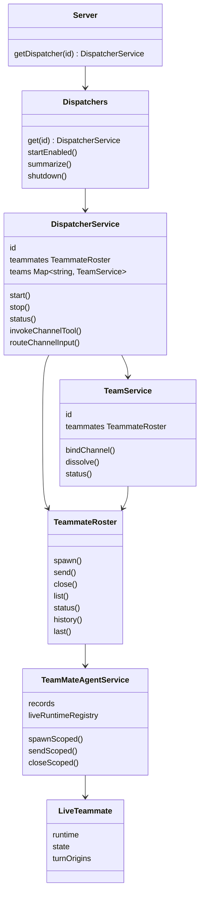

# Dispatcher-local aggregate and TeammateRoster

- **Status:** Accepted for the service-boundary cleanup following issue #209
- **Date:** 2026-06-16
- **Affects:** `server.ts`, dispatcher service ownership, dispatcher runtime
  lifecycle, team orchestration, teammate orchestration, admin/MCP service
  routing
- **PR / Issue:** PR #229 / issue #209 follow-up; refines the service shape
  described by [provider-architecture-realignment](provider-architecture-realignment.md)
  and supersedes the "one process-wide service owns every live dispatcher /
  teammate / team operation" implementation shape

## Context

The provider cleanup made Dreamux core drive agent runtimes and channels through
published provider interfaces, but the service object model still reflected an
earlier process-wide-manager implementation:

- one process-wide collection object also constructed process-wide sub-services;
- the dispatcher runtime manager owned a `Map<dispatcher_id, live dispatcher slot>`;
- `TeamMateAgentService` owns every teammate runtime for every dispatcher;
- `TeamService` owns every Team record for every dispatcher;
- the admin layer used to reach through that wide object and call sub-services
  directly.

That shape makes the service boundary too wide. It also leaks internal runtime
objects (`AgentRuntime`) to callers that only need status, routing, or tool
surfaces. As more channel providers and agent runtime providers are loaded,
opening the internals makes core harder to keep provider-agnostic.

The missing domain boundary is the dispatcher itself. A configured dispatcher is
not the same concept as the process-wide collection of dispatchers. Each
dispatcher is a local trust domain with one dispatcher agent runtime, its
configured channel sessions, its Teams, and the teammates owned by the
dispatcher or by those Teams.

## Decision

Use a dispatcher-local aggregate model.

The server owns a `Dispatchers` collection. The collection is built from the
validated config and exposes lookup by dispatcher id:

```ts
server.getDispatcher(id): DispatcherService
```

`DispatcherService` represents one configured dispatcher. It owns that
dispatcher's runtime, channel sessions, directly owned teammates, and Teams. It
does not represent the process-wide dispatcher registry.



### Naming

Use `Teammate`, not `TeamMate`, for new service classes and new files. Existing
internal/public types that already use `TeamMate` may stay until a dedicated
rename is safe, but new domain model code should use the corrected spelling.

Use `TeammateRoster` for the owner-level multi-teammate operation surface. It
is not a generic "services" bag and it is not only a registry. A roster belongs
to exactly one owner and exposes operations across that owner's named
teammates.

### Ownership Model

`DispatcherService.teammates` is the roster of ordinary teammates directly
owned by the dispatcher.

`TeamService.teammates` is the roster of teammates owned by that Team. The Team
leader is a special teammate owned by the Team service, and team members are
created through the Team's roster.

`TeammateRoster` owns collection behavior:

- name allocation and lookup within its owner boundary;
- spawn / send / close operations across named teammates;
- list / status / history / last read surfaces;
- owner-specific workspace defaults;
- owner-specific visibility rules.

The current backing manager, `TeamMateAgentService`, owns persisted teammate
records and the live-runtime registry. It is internal implementation, not the
dispatcher-facing operation surface. A live teammate entry owns one named
runtime:

- its `AgentRuntime` instance, if running;
- its runtime state callbacks;
- per-turn origin tracking.

`AgentRuntime` remains an internal provider runtime object under the teammate or
dispatcher runtime host. It is not exposed to admin, MCP, Team, or server
lifecycle callers as a management object.

### External Callers

External callers target the aggregate boundary, not the internal runtime.

Process lifecycle callers:

- `Server.start()` uses the `Dispatchers` collection to start enabled
  dispatchers.
- `Server.stop()` shuts down the collection.
- CLI/admin status calls read summaries and dispatcher status snapshots.

MCP/admin callers:

- `channel-mcp` maps to one dispatcher's channel-tool operation.
- `teammate-mcp` maps to either the dispatcher's direct roster or a Team's
  roster, depending on the caller.
- `team-mcp` maps to one dispatcher's Team operations.

Runtime callbacks:

- channel inbound delivery re-enters the owning `DispatcherService`, which
  routes the turn to a bound Team leader or to the dispatcher runtime;
- teammate settlement re-enters the owning dispatcher aggregate, which routes
  completion to a Team leader or to the dispatcher runtime.

### Encapsulation

Runtime lifecycle management is internal. External callers must not receive an
`AgentRuntime` object to start, stop, inspect, or inject into. They receive
domain operations and snapshots:

- dispatcher start / stop / status;
- channel tool invocation and target resolution;
- teammate roster operations;
- team operations;
- summary rows.

The admin layer must not call `dispatcher.dispatchers`, `dispatcher.teammates`,
or `dispatcher.teams` as process-wide sub-services. It resolves a dispatcher by
id and calls that dispatcher's operation surface.

## Consequences

- The process-wide object is only `Dispatchers`, a collection of configured
  dispatcher aggregates. It does not expose teammate/team/channel operation
  methods that merely forward into another object.
- Operations that are scoped to one dispatcher live on `DispatcherService` and
  do not accept a separate `dispatcherId` parameter.
- `DispatcherService` composes one `DispatcherRuntimeService`; the dispatcher
  runtime host no longer owns a `Map<dispatcher_id, slot>`.
- `DispatcherService.teammates` is the direct dispatcher-owned roster.
- `DispatcherService` owns a `Map<string, TeamService>` for Team aggregates.
  A separate `TeamDirectory` class is unnecessary until the collection has
  independent behavior.
- `TeamService.teammates` is the Team-owned roster. Member spawns inherit the
  Team shared workspace and run under the TeamLeader principal.
- Existing tests are useful as negative feedback, but they must not force the
  old process-wide runtime-manager boundary to remain.
