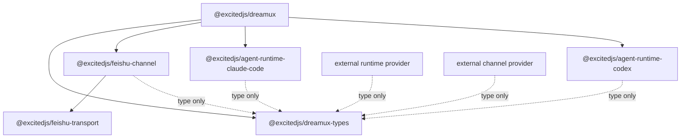

# NPM package split and channel targets

- **Status:** Accepted for issue #209 implementation
- **Date:** 2026-06-12
- **Affects:** npm package boundaries, Agent Runtime providers, Channel
  providers, Team channel bindings, bundled skills, plugin-facing types
- **PR / Issue:** [issue #209](https://github.com/excitedjs/dreamux/issues/209);
  refines [provider-architecture-realignment](provider-architecture-realignment.md),
  [channel-provider](channel-provider.md), and
  [agent-runtime-provider](agent-runtime-provider.md)

## Context

Dreamux has providerized runtime concepts and a placeholder channel seam, but
the implementation is still mostly host-local:

- `/packages/dreamux/src/agent-runtime/types.ts` defines the runtime contract,
  while `/packages/dreamux/src/agent-runtime/external-provider.ts` is hard-coded
  to the `agentRuntime` kind.
- Built-in runtimes still live under
  `/packages/dreamux/src/agent-runtime/builtin/` and are directly imported by
  the host catalog.
- `/packages/dreamux/src/channel/plugin.ts` is an interface-only subscription
  channel reservation. The live Feishu session, MCP surface, access gate,
  introduce/trusted-peer behavior, and message ownership tracking live under
  `/packages/dreamux/src/channel/feishu/`.
- `/packages/channel/feishu-channel` exists but is scaffold-level and is not
  publishable in `rush.json`.
- `/packages/dreamux/src/config/config.ts` accepts a
  `dispatchers[].channels[]` envelope, but currently requires exactly one
  `builtin:feishu` channel and carries Feishu-specific validation.
- `/packages/dreamux/src/dispatcher-service/channel-binding/store.ts` stores
  version 1 rows keyed by `(provider, chat_id)`, which cannot distinguish
  multiple channel instances or non-chat channel targets.
- Team MCP exposes Feishu-specific binding tools:
  `create.bind_group`, `bind_group`, and `transfer_channel_back`.
- Bundled skills are installed through workspace symlinks by onboarding and
  Codex runtime startup. Claude Code has no bundled-skill injection path.

Issue #209 turns the provider seams into real npm package boundaries so
external providers can develop against stable types, while Dreamux core remains
the owner of Dispatcher and Team orchestration.

## Decision

Dreamux is split around these public package boundaries:

- `@excitedjs/dreamux-types` is a published declaration-only package. External
  runtime and channel providers import Dreamux contracts from this package and
  must not import `@excitedjs/dreamux`.
- `@excitedjs/dreamux` remains the core host package. It owns Dispatcher
  lifecycle, Team lifecycle, TeamMate orchestration, provider loading, core MCP
  shims, binding state, routing decisions, authorization, bundled Dreamux
  skills, config validation, and fail-loud upgrade behavior.
- `@excitedjs/agent-runtime-codex` implements the built-in Codex
  `AgentRuntimeProvider`.
- `@excitedjs/agent-runtime-claude-code` implements the built-in Claude Code
  `AgentRuntimeProvider`.
- `@excitedjs/feishu-channel` implements the built-in Feishu
  `ChannelProvider`.
- `@excitedjs/feishu-transport` remains the Feishu platform-I/O package and the
  sole owner of Feishu SDK imports.

The built-in provider refs stay stable. Dreamux resolves them through built-in
alias mappings:

```text
builtin:codex        -> @excitedjs/agent-runtime-codex
builtin:claude-code  -> @excitedjs/agent-runtime-claude-code
builtin:feishu       -> @excitedjs/feishu-channel
```

A default `@excitedjs/dreamux` install depends on the built-in runtime and
channel packages so existing operators retain the built-in path. Built-in
packages version independently; `@excitedjs/dreamux-types` is the compatibility
anchor, and the host fails loudly when a built-in package declares an
incompatible types-contract range.



## Type Package

`@excitedjs/dreamux-types` exports provider-authoring declarations only:

- provider descriptor/ref shapes;
- Agent Runtime contracts, capabilities, role, create context, MCP descriptor,
  turn/result shapes, and completion delivery shapes;
- Channel provider/session contracts, target shapes, inbound envelope shapes,
  tool descriptor/call shapes, and config/session contexts;
- a minimal public logger type.

It must not export runtime implementations, default loggers, loader logic,
provider registry implementations, path helpers, config parsers, or Dreamux
host state models. Public create contexts must not expose host-private types
such as dispatcher rows, dispatcher stores, or TeamMate identity records. The
host adapts private objects into neutral public context shapes.

The package is publishable because providers may live in other repositories.
Its package manifest publishes declarations only:

```json
{
  "name": "@excitedjs/dreamux-types",
  "types": "./dist/index.d.ts",
  "exports": {
    ".": {
      "types": "./dist/index.d.ts"
    }
  },
  "files": ["dist", "README.md", "LICENSE"]
}
```

Core may re-export moved types from existing internal source paths to reduce
internal churn during extraction, but provider packages depend on
`@excitedjs/dreamux-types` directly.

The public logger is intentionally smaller than pino:

```ts
export interface DreamuxLogger {
  error(message: string, fields?: Record<string, unknown>): void;
  warn(message: string, fields?: Record<string, unknown>): void;
  info(message: string, fields?: Record<string, unknown>): void;
  debug(message: string, fields?: Record<string, unknown>): void;
  trace(message: string, fields?: Record<string, unknown>): void;
  child?(fields: Record<string, unknown>): DreamuxLogger;
}
```

Core adapts its logger to this shape. Provider packages own their own minimal
console fallback when core does not pass a logger. That fallback is
implementation code and does not belong in the types package.

## Provider Loading

Dreamux core owns provider loading. The current runtime-specific external
loader becomes a generic package-loader skeleton for both `agentRuntime` and
`channel` kinds:

- dynamic import;
- default or named export selection;
- provider factory invocation;
- duplicate ref handling;
- descriptor registration;
- consistent fail-loud error formatting.

Each kind keeps separate contract assertions:

- `agentRuntime` requires an `AgentRuntimeProvider` descriptor, config reader,
  capabilities, and runtime factory shape;
- `channel` requires a `ChannelProvider` descriptor, config reader, and channel
  session factory shape.

`builtin:*` refs use the same loading path as package-backed providers after
the alias is resolved. Missing built-in packages fail loudly with a named
package/ref error rather than a raw module-loader error.

## Agent Runtime Providers

Codex and Claude Code move into package folders:

```text
packages/agent-runtime/codex        @excitedjs/agent-runtime-codex
packages/agent-runtime/claude-code  @excitedjs/agent-runtime-claude-code
```

Both packages implement the public `AgentRuntimeProvider` contract and depend on
`@excitedjs/dreamux-types` for types. They must not import `@excitedjs/dreamux`.

The create context includes the agent role and skill sources:

```ts
export type AgentRuntimeRole =
  | 'dispatcher'
  | 'team_leader'
  | 'teammate'
  | 'team_member';

export interface AgentRuntimeSkillSource {
  name: string;
  path: string;
  layout: string;
  source: 'dreamux-core' | string;
}

export interface AgentRuntimeCreateContext<TConfig = unknown> {
  runtime_id: string;
  role: AgentRuntimeRole;
  config: TConfig;
  cwd: string;
  systemPromptContent?: string;
  mcpServers: readonly AgentRuntimeMcpServer[];
  skillSources: readonly AgentRuntimeSkillSource[];
  logger?: DreamuxLogger;
  paths?: AgentRuntimePathContext;
  state?: AgentRuntimeStateCallbacks;
  onTurnSettled?: (signal: TurnSettledSignal) => void;
}
```

Dreamux core populates bundled `skillSources` only for Dispatcher and
TeamLeader runtimes. TeamMate and ordinary team-member runtimes receive no
bundled Dreamux skills by default.

The old workspace symlink skill model is removed from onboarding and runtime
startup. Startup does not silently delete existing old symlinks; operators may
clean them explicitly after reading the changelog.

Runtime-specific skill handling:

- Codex calls the app-server `skills/extraRoots/set` RPC after app-server
  initialization and before `thread/start` or `thread/resume`. It reapplies the
  full replacement set after every app-server restart and gates support through
  diagnostics/version checks.
- Claude Code translates compatible skill sources into startup `--add-dir`
  arguments pointing at directories containing `.claude/skills`.

Dreamux core owns which built-in skills are injected and which roles receive
them. Runtime packages own the mechanics of applying the sources to their
underlying engine.

## Channel Providers

The channel seam becomes a real provider seam. A Channel provider owns platform
I/O, platform-specific tools, inbound normalization, target resolution, and
provider-local message ownership facts. Dreamux core owns binding state,
routing, authorization, and the model-facing Channel MCP shim.

```ts
export interface ChannelProvider<TConfig = unknown> {
  readonly ref: string;
  readonly descriptor: ProviderDescriptor & { kind: 'channel' };
  readConfig?(
    raw: unknown,
    context: ChannelConfigContext,
  ): TConfig | Promise<TConfig>;
  createSession(context: ChannelSessionCreateContext<TConfig>): ChannelSession;
}

export interface ChannelSessionCreateContext<TConfig = unknown> {
  dispatcher_id: string;
  channel_id: string;
  provider: string;
  config: TConfig;
  logger?: DreamuxLogger;
  state_root?: string;
  cache_root?: string;
}

export interface ChannelSession {
  readonly provider: string;
  readonly channel_id: string;
  start(routes: ChannelRoutes): Promise<void>;
  close(): Promise<void>;
  resolveTarget(meta: unknown): Promise<ChannelTarget>;
  reply?(input: ChannelReplyInput): Promise<unknown>;
  react?(input: ChannelReactInput): Promise<unknown>;
  listPeers?(input: ChannelListPeersInput): Promise<unknown>;
  tools?(context: ChannelToolListContext): readonly ChannelToolDescriptor[];
  handleTool?(
    call: ChannelToolCall,
    context: ChannelToolContext,
  ): Promise<unknown>;
  messageBelongsToTarget?(
    input: ChannelMessageTargetCheck,
  ): boolean | Promise<boolean>;
}

export interface ChannelTarget {
  target_type: string;
  target_key: string;
  bindable: boolean;
  display?: string;
  canonical_url?: string;
  meta?: Record<string, unknown>;
}

export interface ChannelToolDescriptor {
  name: string;
  description?: string;
  inputSchema?: unknown;
}
```

`ChannelToolDescriptor.inputSchema` is intentionally unrestricted. Dreamux
types must not constrain the tool schemas provider packages expose.

`channel_id` is the dispatcher-local channel instance id from
`dispatchers[].channels[].id`, not the provider ref. A dispatcher may configure
multiple channels, including multiple instances of the same provider, as long as
their ids are unique.

Feishu is implemented as `@excitedjs/feishu-channel`, a built-in
`ChannelProvider` package that depends on `@excitedjs/feishu-transport`. The
transport package remains the SDK/platform-I/O owner. The channel package owns
the Dreamux Channel provider implementation, including Feishu session startup,
MCP tool backing logic, access/trust behavior, inbound formatting, and
message-to-target ownership tracking.

Core must not import `@excitedjs/feishu-transport` or the Feishu SDK directly.

## Channel MCP

Dreamux core hosts the generic Channel MCP shim injected into Dispatcher and
TeamLeader runtimes.

The core-owned standard tool set is:

- `bind_channel`;
- `transfer_back`;
- `reply`;
- `react`;
- `list_peers`.

Provider-specific tools are exposed through the same Channel MCP and are scoped
by `channel_id` so two configured channels cannot collide on a tool name. Core
does not validate provider-specific tool schemas beyond routing and caller
authorization.

Team MCP no longer owns channel binding. The old Feishu-specific
`create.bind_group`, `bind_group`, and `transfer_channel_back` surfaces are
removed without forwarding aliases.

## Channel Targets and Binding

`bind_channel` is a core-owned Channel MCP capability. It writes core binding
state, but it relies on the selected channel to normalize provider-specific
selectors:

```ts
bind_channel({
  channel_id: 'feishu',
  target_type: 'group',
  meta: { chat_id: '<provider-local-chat-id>', chat_type: 'group' },
  team_name: 'dreamux'
});

bind_channel({
  channel_id: 'github',
  target_type: 'issue',
  meta: { url: 'https://github.com/excitedjs/dreamux/issues/209' },
  team_name: 'dreamux'
});
```

Core resolves the configured channel by `channel_id`, calls
`session.resolveTarget(meta)`, rejects `bindable: false`, derives
`leader_name` from the active Team record, and stores the resolved target. Core
does not trust a caller-supplied leader identity.

The selector `meta` is human/model-facing input. The durable routing key is
`target_key`, which is provider-owned and opaque to core. A GitHub-style channel
should normalize selectors such as URLs or `repo + number` into a
platform-stable key, preferably an immutable platform id. If the channel cannot
resolve a stable key, it fails loudly rather than storing an ambiguous selector.

The binding store remains flat:

```json
{
  "version": 2,
  "bindings": [
    {
      "channel_id": "feishu",
      "provider": "builtin:feishu",
      "target_type": "group",
      "target_key": "provider-owned-opaque-key",
      "display": "optional display name",
      "canonical_url": null,
      "meta": {
        "chat_id": "provider-local-chat-id",
        "chat_type": "group"
      },
      "team_name": "dreamux",
      "leader_name": "team-leader",
      "active": true,
      "created_at": 0,
      "updated_at": 0,
      "deactivated_at": null
    }
  ]
}
```

`chat_id` and `chat_type` are provider-specific data and stay inside `meta`.
They are not core top-level columns. This keeps the store aligned with the
`bind_channel` selector model and prevents core from re-coupling itself to
chat-shaped channels.

The active uniqueness key is `(channel_id, target_key)`. One Team may have
multiple active channel bindings. One channel target may be active for only one
Team at a time.

P2P chat targets are not bindable to a TeamLeader. They always route to the
Dispatcher.

## Routing and Authorization

Inbound delivery uses resolved channel targets:

```ts
export interface ChannelInboundEnvelope {
  provider: string;
  channel_id: string;
  target: ChannelTarget;
  event_id?: string;
  message_id?: string;
  sender?: ChannelSender;
  metadata?: Record<string, unknown>;
}
```

Core routing is:

- P2P target: route to the Dispatcher;
- bindable target with an active `(channel_id, target_key)` binding: route to
  the bound TeamLeader;
- unbound bindable target: route to the Dispatcher.

Authorization is also core-owned. Channel tool hints are advisory. Before
TeamLeader outbound or binding operations, core checks caller identity, the
active binding, the concrete TeamLeader identity, and provider facts such as
`messageBelongsToTarget`. Provider facts do not replace core authorization.

```mermaid
flowchart LR
  BindTool[core bind_channel tool] --> Resolve[channel.resolveTarget(meta)]
  Resolve --> Store[(core binding store)]
  Event[channel inbound event] --> Target[channel target_key]
  Target --> Router[core router]
  Store --> Router
  Router --> Dispatcher[Dispatcher runtime]
  Router --> TeamLeader[TeamLeader runtime]
```

## Config

`dispatchers[].channels[]` entries remain:

```json
{
  "id": "feishu",
  "provider": "builtin:feishu",
  "config": {}
}
```

The `id` is unique per dispatcher and becomes `channel_id` at runtime. Multiple
channels per dispatcher are allowed. Provider-specific config parsing and
validation belongs to the selected channel provider's `readConfig`.

Core removes Feishu-specific channel config checks such as app id duplicate
rules. If a provider needs such validation, it owns it.

## Compatibility and Upgrade Behavior

This change is intentionally breaking for old Feishu-specific Team binding
surfaces:

- `team.create.bind_group`, `team.bind_group`, and
  `team.transfer_channel_back` are removed without compatibility aliases.
- `channel-bindings.json` version bumps to 2. Old version 1 rows, rows without
  `channel_id`, and rows without `target_key` fail loudly with rebuild guidance.
  Dreamux 0.x does not silently migrate binding state.
- Workspace symlink skill installation is removed. Old symlinks are no longer
  the active mechanism and are not removed automatically at startup.
- `dispatchers[].channels[]` accepts multiple channels, requires unique ids,
  and delegates provider-specific config validation to channel providers.

Implementing PRs that touch these upgrade blockers must include Rush change
files. Breaking notes start with `BREAKING:` and user-action notes include
`Rebuild:` with the exact state/config path or action to recreate.

ACP adapter implementation is out of scope for issue #209. The design must not
block a future ACP Agent Runtime package, but no ACP adapter package is required
for this epic.

## Consequences

- External provider repositories can compile against
  `@excitedjs/dreamux-types` without depending on the Dreamux host package.
- Dreamux core stays the only owner of Team routing and binding authorization,
  even when platform packages provide rich MCP tools.
- Chat channels and subscription channels share the same target model. Feishu,
  Slack, and Telegram can resolve chat targets; GitHub, Jira, and similar
  providers can later resolve issue, pull request, or other durable platform
  targets.
- Runtime packages own runtime-specific skill mechanics while Dreamux core owns
  role selection and bundled skill source selection.
- The old workspace symlink skill model is removed, eliminating managed
  worktree dirtiness caused by Dreamux-owned skill links.

## Validation Guards

The implementation must add or preserve guards for these invariants:

- provider packages import `@excitedjs/dreamux-types` only and do not import
  `@excitedjs/dreamux`;
- core imports neither the Feishu SDK nor `@excitedjs/feishu-transport`;
- the Feishu SDK is imported only by `@excitedjs/feishu-transport`;
- `@excitedjs/dreamux-types` has no runtime dependencies and emits
  declarations only;
- built-in provider packages are included by default in `@excitedjs/dreamux`;
- external Agent Runtime and Channel provider fixtures compile against
  `@excitedjs/dreamux-types` only;
- binding store version 2 fails loudly for incompatible legacy rows;
- Team MCP no longer exposes binding tools;
- Channel MCP owns binding, outbound channel tools, and provider-specific tool
  forwarding;
- bundled skills are injected only for Dispatcher and TeamLeader roles;
- runtime startup no longer creates Dreamux-owned workspace skill symlinks.

## Alternatives Considered

- **Let each channel own `bind_channel`:** rejected because binding state and
  routing are core state. Channel-owned binding would either duplicate core
  routing or require privileged writes into core internals.
- **Store selector `meta` as the route key:** rejected because selectors often
  have multiple equivalent forms. Channel providers must normalize selectors
  into stable target keys.
- **Keep Feishu outside the channel provider seam:** rejected because replacing
  Feishu with Slack or Telegram, or running several channels at once, requires
  Feishu to exercise the same Channel provider contract.
- **Keep `chat_id` and `chat_type` as core store columns:** rejected because
  this re-couples core to chat-shaped channels. Provider-specific chat data
  belongs in `meta`; core routes by `channel_id`, `target_type`, and
  `target_key`.
