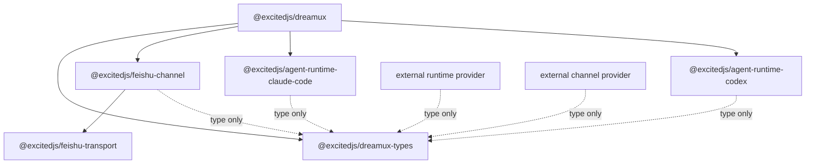

# NPM package split and channel targets

- **Status:** Accepted for issue #209 implementation
- **Date:** 2026-06-12
- **Affects:** npm package boundaries, Agent Runtime providers, Channel
  providers, Team channel bindings, bundled skills, plugin-facing types
- **PR / Issue:** [issue #209](https://github.com/excitedjs/dreamux/issues/209);
  refines [provider-architecture-realignment](provider-architecture-realignment.md),
  [channel-provider](channel-provider.md), and
  [agent-runtime-provider](agent-runtime-provider.md)

## Context

Dreamux has providerized runtime concepts and a placeholder channel seam, but
the implementation is still mostly host-local:

- `/packages/dreamux/src/agent-runtime/types.ts` defines the runtime contract,
  while `/packages/dreamux/src/agent-runtime/external-provider.ts` is hard-coded
  to the `agentRuntime` kind.
- Built-in runtimes still live under
  `/packages/dreamux/src/agent-runtime/builtin/` and are directly imported by
  the host catalog.
- The live bidirectional Feishu session, MCP surface, access gate,
  introduce/trusted-peer behavior, and message ownership tracking have been
  extracted into `@excitedjs/feishu-channel` as a `ChannelProvider`.
- `@excitedjs/feishu-channel` is the publishable built-in Feishu Channel provider
  package behind `builtin:feishu`.
- `/packages/dreamux/src/config/config.ts` accepts a
  `dispatchers[].channels[]` envelope. Since the multi-channel config slice
  (#209) it accepts multiple channels with unique dispatcher-local ids and
  delegates provider-specific validation to each channel provider's `readConfig`
  (no Feishu-specific checks in core). **SUPERSEDED by Decision #4 (PR #223):**
  config load now caps a dispatcher at **one channel per provider ref**, so two
  `builtin:feishu` channels on one dispatcher no longer load (config error: "each
  provider may appear at most once per dispatcher"). The runtime session loop
  still runs one live session per declared channel, and only a channel whose
  provider package cannot be loaded or does not implement the channel contract
  fails loud. See "Live multi-channel routing" below.
- `/packages/dreamux/src/service/channel-binding/store.ts` stores
  version 1 rows keyed by `(provider, chat_id)`, which cannot distinguish
  multiple channel instances or non-chat channel targets.
- Team MCP previously exposed Feishu-specific binding tools:
  `create.bind_group`, `bind_group`, and `transfer_channel_back`.
- Bundled skills were installed through workspace symlinks by onboarding and
  Codex runtime startup, and Claude Code had no bundled-skill injection path
  (both replaced in slice 6 by role-gated `skillSources` injection — see below).

Issue #209 turns the provider seams into real npm package boundaries so
external providers can develop against stable types, while Dreamux core remains
the owner of Dispatcher and Team orchestration.

## Decision

Dreamux is split around these public package boundaries:

- `@excitedjs/dreamux-types` is a published declaration-only package. External
  runtime and channel providers import Dreamux contracts from this package and
  must not import `@excitedjs/dreamux`.
- `@excitedjs/dreamux` remains the core host package. It owns Dispatcher
  lifecycle, Team lifecycle, TeamMate orchestration, provider loading, core MCP
  shims, binding state, routing decisions, authorization, bundled Dreamux
  skills, config validation, and fail-loud upgrade behavior.
- `@excitedjs/agent-runtime-codex` implements the built-in Codex
  `AgentRuntimeProvider`.
- `@excitedjs/agent-runtime-claude-code` implements the built-in Claude Code
  `AgentRuntimeProvider`.
- `@excitedjs/feishu-channel` implements the built-in Feishu
  `ChannelProvider`.
- `@excitedjs/feishu-transport` remains the Feishu platform-I/O package and the
  sole owner of Feishu SDK imports.

The built-in provider refs stay stable. Dreamux resolves them through built-in
alias mappings:

```text
builtin:codex        -> @excitedjs/agent-runtime-codex
builtin:claude-code  -> @excitedjs/agent-runtime-claude-code
builtin:feishu       -> @excitedjs/feishu-channel
```

A default `@excitedjs/dreamux` install depends on the built-in runtime and
channel packages so existing operators retain the built-in path. Built-in
packages version independently; `@excitedjs/dreamux-types` is the compatibility
anchor, and the host fails loudly when a built-in package declares an
incompatible types-contract range.



## Type Package

`@excitedjs/dreamux-types` exports provider-authoring declarations only:

- provider descriptor/ref shapes;
- Agent Runtime contracts, capabilities, role, create context, MCP descriptor,
  turn/result shapes, and completion delivery shapes;
- Channel provider/session contracts, target shapes, inbound envelope shapes,
  tool descriptor/call shapes, and config/session contexts;
- a minimal public logger type.

It must not export runtime implementations, default loggers, loader logic,
provider registry implementations, path helpers, config parsers, or Dreamux
host state models. Public create contexts must not expose host-private types
such as dispatcher rows, dispatcher stores, or TeamMate identity records. The
host adapts private objects into neutral public context shapes.

The package is publishable because providers may live in other repositories.
Its package manifest publishes declarations only:

```json
{
  "name": "@excitedjs/dreamux-types",
  "types": "./dist/index.d.ts",
  "exports": {
    ".": {
      "types": "./dist/index.d.ts"
    }
  },
  "files": ["dist", "README.md", "LICENSE"]
}
```

Core may re-export moved types from existing internal source paths to reduce
internal churn during extraction, but provider packages depend on
`@excitedjs/dreamux-types` directly.

The public logger is intentionally smaller than pino:

```ts
export interface DreamuxLogger {
  error(message: string, fields?: Record<string, unknown>): void;
  warn(message: string, fields?: Record<string, unknown>): void;
  info(message: string, fields?: Record<string, unknown>): void;
  debug(message: string, fields?: Record<string, unknown>): void;
  trace(message: string, fields?: Record<string, unknown>): void;
  child?(fields: Record<string, unknown>): DreamuxLogger;
}
```

Core adapts its logger to this shape. Provider packages own their own minimal
console fallback when core does not pass a logger. That fallback is
implementation code and does not belong in the types package.

### Public surface boundaries (issue #209 types-API audit)

The type package also publishes the *factory* contract, so an external
provider's default export is typed against the same shape core's loader calls:

- `ProviderFactoryContext<TDescriptor>` / `ProviderFactory<TProvider, TDescriptor>`
  mirror the loader call (`{ ref, descriptor }` → provider). Kind-specific aliases
  `AgentRuntimeProviderFactory` / `ChannelProviderFactory` carry the already-narrowed
  descriptor so a package assigns `provider.descriptor` without a cast.
- Descriptors are narrowed by kind: `AgentRuntimeProviderDescriptor`
  (`kind: 'agentRuntime'`) and `ChannelProviderDescriptor` (`kind: 'channel'`);
  `AgentRuntimeProvider.descriptor` / `ChannelProvider.descriptor` use them.
- The package owns its environment shape: `DreamuxEnvironment`
  (`Record<string, string | undefined>`). No public declaration references a
  `@types/node` global (`NodeJS.*`, `Buffer`); a guard test enforces this so the
  contract never drags host typings into an external provider package.
- `AgentRuntimeProvider.readConfig` may return `TConfig | Promise<TConfig>`
  (parity with `ChannelProvider.readConfig`); core awaits it at config load.

Root-export minimization: the `exports` map publishes only the package root, so
the names re-exported by `src/index.ts` ARE the public API. Helper shapes a
provider reaches only contextually — a property of a public interface, or a
parameter of a *required* interface method — stay `export`ed from their source
module (the emitted `.d.ts` resolves them transitively) but are NOT root
re-exported. Parameters of *optional* interface methods (e.g. `ChannelToolCall`
on `ChannelSession.handleTool?`) are NOT contextually inferred under `strict`, so
those stay root exports. A root-export allowlist test pins the surface so later
slices grow it deliberately, and the expanded external-provider fixture proves
the allowlist is sufficient to author a full provider importing from the root
only.

## Provider Loading

Dreamux core owns provider loading. The current runtime-specific external
loader becomes a generic package-loader skeleton for both `agentRuntime` and
`channel` kinds:

- dynamic import;
- default or named export selection;
- provider factory invocation;
- duplicate ref handling;
- descriptor registration;
- consistent fail-loud error formatting.

Each kind keeps separate contract assertions:

- `agentRuntime` requires an `AgentRuntimeProvider` descriptor, config reader,
  capabilities, and runtime factory shape;
- `channel` requires a `ChannelProvider` descriptor, config reader, and channel
  session factory shape.

`builtin:*` refs use the same loading path as package-backed providers after
the alias is resolved. Missing built-in packages fail loudly with a named
package/ref error rather than a raw module-loader error.

## Agent Runtime Providers

Codex and Claude Code move into package folders:

```text
packages/agent-runtime/codex        @excitedjs/agent-runtime-codex
packages/agent-runtime/claude-code  @excitedjs/agent-runtime-claude-code
```

Both packages implement the public `AgentRuntimeProvider` contract and depend on
`@excitedjs/dreamux-types` for types. They must not import `@excitedjs/dreamux`.

The create context includes the agent role and skill sources:

```ts
export type AgentRuntimeRole =
  | 'dispatcher'
  | 'team_leader'
  | 'teammate'
  | 'team_member';

export interface AgentRuntimeSkillSource {
  name: string;
  path: string;
  layout: string;
  source: 'dreamux-core' | string;
}

export interface AgentRuntimeSystemPrompt {
  replace?: string;
  append?: readonly string[];
}

export interface AgentRuntimeCreateContext<TConfig = unknown> {
  runtime_id: string;
  role: AgentRuntimeRole;
  config: TConfig;
  cwd: string;
  systemPrompt?: AgentRuntimeSystemPrompt;
  mcpServers: readonly AgentRuntimeMcpServer[];
  skillSources: readonly AgentRuntimeSkillSource[];
  logger?: DreamuxLogger;
  paths?: AgentRuntimePathContext;
  state?: AgentRuntimeStateCallbacks;
  onTurnSettled?: (signal: TurnSettledSignal) => void;
}
```

Dreamux core populates bundled `skillSources` only for Dispatcher and
TeamLeader runtimes. TeamMate and ordinary team-member runtimes receive no
bundled Dreamux skills by default.

The old workspace symlink skill model is removed from onboarding and runtime
startup. Startup does not silently delete existing old symlinks; operators may
clean them explicitly after reading the changelog.

Runtime-specific skill handling:

- Codex calls the app-server `skills/extraRoots/set` RPC after app-server
  initialization and before `thread/start` or `thread/resume`. It reapplies the
  full replacement set after every app-server restart and gates support through
  diagnostics/version checks.
- Claude Code translates compatible skill sources into startup `--add-dir`
  arguments pointing at directories containing `.claude/skills`.

Dreamux core owns which built-in skills are injected and which roles receive
them. Runtime packages own the mechanics of applying the sources to their
underlying engine.

## Channel Providers

The channel seam becomes a real provider seam. A Channel provider owns platform
I/O, platform-specific tools, inbound normalization, target resolution, and
provider-local message ownership facts. Dreamux core owns binding state,
routing, authorization, and the model-facing channel-binding tools (on the Team
MCP — binding a channel to a Team is a core Team capability).

```ts
export interface ChannelProvider<TConfig = unknown> {
  readonly ref: string;
  readonly descriptor: ProviderDescriptor & { kind: 'channel' };
  readConfig?(
    raw: unknown,
    context: ChannelConfigContext,
  ): TConfig | Promise<TConfig>;
  createSession(context: ChannelSessionCreateContext<TConfig>): ChannelSession;
}

export interface ChannelSessionCreateContext<TConfig = unknown> {
  dispatcher_id: string;
  channel_id: string;
  provider: string;
  config: TConfig;
  logger?: DreamuxLogger;
  state_root?: string;
  cache_root?: string;
}

export interface ChannelSession {
  readonly provider: string;
  readonly channel_id: string;
  start(routes: ChannelRoutes): Promise<void>;
  close(): Promise<void>;
  resolveTarget(meta: unknown): Promise<ChannelTarget>;
  reply?(input: ChannelReplyInput): Promise<unknown>;
  react?(input: ChannelReactInput): Promise<unknown>;
  tools?(context: ChannelToolListContext): readonly ChannelToolDescriptor[];
  handleTool?(
    call: ChannelToolCall,
    context: ChannelToolContext,
  ): Promise<unknown>;
  messageBelongsToTarget?(
    input: ChannelMessageTargetCheck,
  ): boolean | Promise<boolean>;
}

export interface ChannelTarget {
  target_type: string;
  target_key: string;
  bindable: boolean;
  display?: string;
  canonical_url?: string;
  meta?: Record<string, unknown>;
  binding_fallbacks?: ChannelTarget[];
}

export interface ChannelToolDescriptor {
  name: string;
  description?: string;
  inputSchema?: unknown;
}
```

`ChannelToolDescriptor.inputSchema` is intentionally unrestricted. Dreamux
types must not constrain the tool schemas provider packages expose.

`binding_fallbacks` is an ordered, provider-owned list of less-specific targets
that may reuse existing channel bindings after the exact target and accepted
collaboration route have both missed. Core never derives these targets from
provider metadata or container keys, never provisions collaboration targets
from them, and does not recursively traverse fallbacks declared by fallback
entries. An existing binding with an unavailable Team stops fallback traversal
rather than exposing its input to a less-specific owner. The same list may
authorize TeamLeader egress only after the provider has confirmed exact
message-to-target ownership for a non-empty source message id.

`channel_id` is the dispatcher-local channel instance id from
`dispatchers[].channels[].id`, not the provider ref. A dispatcher may configure
multiple channels, but each channel must use a distinct provider ref and a
distinct dispatcher-local id.

Feishu is implemented as `@excitedjs/feishu-channel`, a built-in
`ChannelProvider` package that depends on `@excitedjs/feishu-transport`. The
transport package remains the SDK/platform-I/O owner. The channel package owns
the Dreamux Channel provider implementation, including Feishu session startup,
MCP tool backing logic, access/trust behavior, inbound formatting, and
message-to-target ownership tracking.

Core must not import the Feishu SDK directly, and production Feishu platform I/O
stays behind `@excitedjs/feishu-channel` / `@excitedjs/feishu-transport`. Core may
depend on `@excitedjs/feishu-transport` only for the existing shared concern — the
`TransportLogger` type seam (a type-only import) and the workspace install model —
never to perform platform I/O itself. That narrow type/install dependency must not
grow into platform-I/O coupling.

## Channel binding tools (Team MCP)

Binding a channel target to a Team/TeamLeader is a Dreamux **core Team
capability**, so the binding verbs live on the core-owned **Team MCP** — there is
no separate generic "channel" MCP surface for this epic. The Team MCP gains two
channel-binding tools alongside its lifecycle tools (`create` / `list` /
`status` / `history` / `dissolve`):

- `bind_channel({ team_name, channel_id?, meta })` — hand a configured channel
  target to a Team so inbound from that target routes to the Team's TeamLeader;
- `transfer_back({ channel_id?, meta })` — return a bound target to the
  dispatcher, deactivating the binding.

`channel_id` identifies the configured channel (`dispatchers[].channels[].id`);
it is optional and defaults to the dispatcher's sole configured channel (an
explicit value must match it). `meta` is the provider-defined selector, opaque
to core; core hands it to the channel's `resolveTarget(meta)`, which infers and
validates the target. Binding state, target
normalization, routing, P2P denial, and TeamLeader authorization stay core-owned;
the channel provider only normalizes the selector and does platform I/O.

The old Feishu-specific Team binding surfaces (`create.bind_group`, `bind_group`,
and `transfer_channel_back`) remain removed without forwarding aliases.
Provider-specific channel tools (for Feishu, `reply` / `react` /
`list_chat_bots`) stay on the provider-owned `feishu` MCP server; this epic does
not introduce a generic standard tool set or a `list_peers` capability.

## Channel Targets and Binding

`bind_channel` is a core-owned **Team MCP** capability for conversational
(bindable) channels. It writes core binding state, but it relies on the selected
channel to normalize its selector into a target:

```ts
bind_channel({
  team_name: 'dreamux',
  channel_id: 'feishu',
  meta: { /* provider-defined target selector */ }
});
```

Core resolves the configured channel by `channel_id`, calls
`session.resolveTarget(meta)`, rejects `bindable: false`, derives
`leader_name` from the active Team record, and stores the resolved target. Core
does not trust a caller-supplied leader identity. Binding is a CAPABILITY, not a
channel class (a one-way/two-way enum was rejected): a target is bindable when
its channel's `resolveTarget` yields a stable `target_key`. (Whether one-way
subscription channels — GitHub/Jira feeds — should ALSO bind through
`bind_channel`, vs a separate publish/route path, is an OPEN design question;
either way their replies are out of band, e.g. `gh` CLI, not a channel reply
tool. See "Bidirectional vs subscription channels".)

The selector `meta` is human/model-facing input whose shape is owned by the
active channel provider. The provider's tool schema or tool result is the
authority for that shape. The durable routing key is `target_key`, which is
provider-owned and opaque to core. A conversational channel normalizes its
selector into a platform-stable `target_key`, preferably an immutable platform
id; if it cannot, it fails loudly rather than storing an ambiguous selector.

The binding store remains flat:

```json
{
  "version": 2,
  "bindings": [
    {
      "channel_id": "feishu",
      "provider": "builtin:feishu",
      "target_type": "group",
      "target_key": "provider-owned-opaque-key",
      "display": "optional display name",
      "canonical_url": null,
      "meta": {
        "chat_id": "group-chat-id",
        "chat_type": "group"
      },
      "team_name": "dreamux",
      "leader_name": "team-leader",
      "active": true,
      "created_at": 0,
      "updated_at": 0,
      "deactivated_at": null
    }
  ]
}
```

Provider target selectors, including any chat-shaped provider fields, stay inside
`meta`. They are not core top-level columns because core routes by the opaque,
target-shape-agnostic `target_key`. This keeps the store aligned with the
`bind_channel` selector model and prevents core from re-coupling itself to
chat-shaped channels.

The active uniqueness key is `(channel_id, target_key)`. One Team may have
multiple active channel bindings. One channel target may be active for only one
Team at a time.

P2P chat targets are not bindable to a TeamLeader. They always route to the
Dispatcher.

## Routing and Authorization

Inbound delivery uses resolved channel targets:

```ts
export interface ChannelInboundEnvelope {
  provider: string;
  channel_id: string;
  target: ChannelTarget;
  event_id?: string;
  message_id?: string;
  sender?: ChannelSender;
  metadata?: Record<string, unknown>;
}
```

Core routing is:

- P2P target: route to the Dispatcher;
- bindable target with an active `(channel_id, target_key)` binding: route to
  the bound TeamLeader;
- unbound bindable target: route to the Dispatcher.

Authorization is also core-owned. Channel tool hints are advisory. Before
TeamLeader outbound or binding operations, core checks caller identity, the
active binding, the concrete TeamLeader identity, and provider facts such as
`messageBelongsToTarget`. Provider facts do not replace core authorization.

```mermaid
flowchart LR
  BindTool[core bind_channel tool] --> Resolve[channel.resolveTarget(meta)]
  Resolve --> Store[(core binding store)]
  Event[channel inbound event] --> Target[channel target_key]
  Target --> Router[core router]
  Store --> Router
  Router --> Dispatcher[Dispatcher runtime]
  Router --> TeamLeader[TeamLeader runtime]
```

## Config

`dispatchers[].channels[]` entries remain:

```json
{
  "id": "feishu",
  "provider": "builtin:feishu",
  "config": {}
}
```

The `id` is unique per dispatcher and becomes `channel_id` at runtime. Multiple
channels per dispatcher are allowed. Provider-specific config parsing and
validation belongs to the selected channel provider's `readConfig`.

Core removes Feishu-specific channel config checks such as app id duplicate
rules. If a provider needs such validation, it owns it.

## Compatibility and Upgrade Behavior

This change is intentionally breaking for old Feishu-specific Team binding
surfaces:

- `team.create.bind_group`, `team.bind_group`, and
  `team.transfer_channel_back` are removed without compatibility aliases.
- `channel-bindings.json` version bumps to 2. Old version 1 rows, rows without
  `channel_id`, and rows without `target_key` fail loudly with rebuild guidance.
  Dreamux 0.x does not silently migrate binding state.
- Workspace symlink skill installation is removed. Old symlinks are no longer
  the active mechanism and are not removed automatically at startup.
- `dispatchers[].channels[]` accepts multiple channels, requires unique ids,
  and delegates provider-specific config validation to channel providers.

Implementing PRs that touch these upgrade blockers must include Rush change
files. Breaking notes start with `BREAKING:` and user-action notes include
`Rebuild:` with the exact state/config path or action to recreate.

ACP adapter implementation is out of scope for issue #209. The design must not
block a future ACP Agent Runtime package, but no ACP adapter package is required
for this epic.

## Consequences

- External provider repositories can compile against
  `@excitedjs/dreamux-types` without depending on the Dreamux host package.
- Dreamux core stays the only owner of Team routing and binding authorization,
  even when platform packages provide rich MCP tools.
- Chat channels resolve `ChannelTarget`s for routing and binding, while core
  remains the owner of Team routing, binding, and authorization.
- Runtime packages own runtime-specific skill mechanics while Dreamux core owns
  role selection and bundled skill source selection.
- The old workspace symlink skill model is removed, eliminating managed
  worktree dirtiness caused by Dreamux-owned skill links.

## Validation Guards

The implementation must add or preserve guards for these invariants:

- provider packages import `@excitedjs/dreamux-types` only and do not import
  `@excitedjs/dreamux`;
- core does not import the Feishu SDK directly, and does not import
  `@excitedjs/feishu-transport` for platform I/O — its only `feishu-transport` use
  is the type-only `TransportLogger` seam (plus the workspace install dependency);
- the Feishu SDK is imported only by `@excitedjs/feishu-transport`;
- `@excitedjs/dreamux-types` has no runtime dependencies and emits
  declarations only;
- built-in provider packages are included by default in `@excitedjs/dreamux`;
- external Agent Runtime and Channel provider fixtures compile against
  `@excitedjs/dreamux-types` only;
- binding store version 2 fails loudly for incompatible legacy rows;
- the old Feishu-specific Team binding aliases (`create.bind_group`,
  `bind_group`, `transfer_channel_back`) are gone without forwarding aliases;
- Team MCP owns channel binding via the generalized `bind_channel` /
  `transfer_back` (`channel_id` + `meta`); there is no separate generic Channel
  MCP, and provider-specific channel tools stay on the provider's own MCP server;
- bundled skills are injected only for Dispatcher and TeamLeader roles;
- runtime startup no longer creates Dreamux-owned workspace skill symlinks.

### Implementation status by slice

These guards are epic-wide; they land across the issue #209 slices. Status:

- **Slice 1 (`@excitedjs/dreamux-types` extraction) — satisfied now:**
  `@excitedjs/dreamux-types` has no runtime dependencies and emits declarations
  only; the type package and its provider fixtures import
  `@excitedjs/dreamux-types` only (an import-boundary test rejects any
  `@excitedjs/dreamux` import); the fixture compiles a complete
  `AgentRuntimeProvider` (`readConfig` + `getCapabilities` + `createRuntime`) and
  a `ChannelProvider` against the type package alone.
- **Deferred to later slices:** core's own launcher still threads a host-coupled
  `AgentRuntimeCreateContext` internally — converging it onto the neutral public
  context (and deleting the host-coupled variant) is slice 3's job. The
  remaining guards (core not importing the Feishu SDK directly; built-in
  packages bundled by default; binding store v2; Team MCP channel-binding
  ownership; role-gated skill injection; symlink removal) land in their
  respective slices.
- **Slice 2 (generic provider loader + channel kind) — satisfied now:** the
  runtime-specific external loader is split into a kind-agnostic skeleton
  (`registry/provider-loader.ts`: dynamic import, default/named export
  selection, factory invocation, descriptor registration, fail-loud formatting)
  plus per-kind contract assertions
  (`agent-runtime/external-provider.ts` for `agentRuntime`,
  `channel/external-channel-provider.ts` for `channel`). `builtin:*` refs resolve
  through the `BUILTIN_PROVIDER_PACKAGES` alias map and use the same loading path
  as `npm:*` refs; a missing/unmapped built-in package fails loud with the named
  ref. The loader's already-loaded skip is implementation-aware: a built-in
  descriptor that is pre-registered without an implementation still flows through
  import + factory + implementation registration (reusing the existing
  descriptor), so the slice-3 Codex/Claude extraction can switch built-ins onto
  this loader without no-op'ing. The public `loadExternalAgentRuntimeProviders`
  surface and its error class identities are unchanged, so runtime loading stays
  behavior-stable. Wiring the channel loader into config validation and promoting
  `@excitedjs/feishu-channel` to a real provider implementation remain later
  channel slices.
- **Slice 3 (`@excitedjs/agent-runtime-codex` extraction) — satisfied now:** the
  built-in Codex engine lives in the publishable `@excitedjs/agent-runtime-codex`
  package (`packages/agent-runtime/codex`, `shouldPublish: true`, independent
  version), implementing the neutral `@excitedjs/dreamux-types`
  `AgentRuntimeProvider` and depending on `@excitedjs/dreamux-types` ONLY — an
  import-boundary test rejects any `@excitedjs/dreamux` import or relative escape.
  `@excitedjs/dreamux` depends on the package by default (bundled built-in) and
  resolves `builtin:codex` to it.

  The package satisfies the slice-2 generic provider-loader path for real: it
  **default-exports** the loader factory, so
  `loadExternalAgentRuntimeProviders({ refs: ['builtin:codex'] })` imports the
  ACTUAL package (resolved through `BUILTIN_PROVIDER_PACKAGES`), selects the
  default export, and registers a contract-valid provider whose `createRuntime`
  constructs a runtime from the neutral create context alone, **without throwing
  on absent host hooks**: every injected dep is optional, so the bare path falls
  back to the package's own standalone volatile-socket allocator, the default
  `CodexProcess`/`CodexWsClient` factories, `process.env` base env, and a no-op
  skill prep — none of these re-create the "structurally valid but fails at
  `start()`" gap (a live `start()` still needs a `codex` binary, exactly as on the
  adapter path). A core test (`builtin-codex-package-loader.test.ts`) exercises
  this against the real package (no fake module) — provider contract, real config
  parse, and throw-free construction — replacing the slice-2 fake-module
  placeholder as the proof.

  An intermediate implementation kept a non-neutral adapter path for production
  launcher context. That path is no longer current: the final #209
  closeout below loads and drives the package provider directly through the
  neutral `AgentRuntimeProvider.createRuntime` context, with no builtin runtime
  implementation under core.
- **Slice 4 (`@excitedjs/agent-runtime-claude-code` extraction) — satisfied now:**
  the built-in Claude Code engine lives in the publishable
  `@excitedjs/agent-runtime-claude-code` package (`packages/agent-runtime/claude-code`,
  `shouldPublish: true`, independent version), implementing the neutral
  `@excitedjs/dreamux-types` `AgentRuntimeProvider` and depending on
  `@excitedjs/dreamux-types` ONLY — an import-boundary test rejects any
  `@excitedjs/dreamux` import or relative escape. `@excitedjs/dreamux` depends on
  the package by default (bundled built-in) and resolves `builtin:claude-code` to
  it. As with Codex, the package **default-exports** the loader factory, so
  `loadExternalAgentRuntimeProviders({ refs: ['builtin:claude-code'] })` imports
  the ACTUAL package and registers a contract-valid provider whose `createRuntime`
  constructs from the neutral create context alone (no host hooks needed —
  Claude Code is stdio-based with no socket, no app-server home, and no bundled
  skills in the runtime path); a core test
  (`builtin-claude-code-package-loader.test.ts`) exercises this against the real
  package. An intermediate implementation kept a non-neutral adapter path for
  production launcher context. That path is no longer current: the final
  #209 closeout below loads and drives the package provider directly through the
  neutral `AgentRuntimeProvider.createRuntime` context, with no builtin runtime
  implementation under core.
- **Slice 5 (`@excitedjs/feishu-channel` promotion) — satisfied now:** the live
  Feishu channel session — platform I/O, access/trust behavior, inbound
  normalization, attachment handling, and MCP tool backing — moved out of core
  (`packages/dreamux/src/channel/feishu/*`) into the now-publishable
  `@excitedjs/feishu-channel` package (`shouldPublish: true`, independent
  version), which depends on `@excitedjs/dreamux-types` +
  `@excitedjs/feishu-transport` ONLY — an import-boundary test rejects any
  `@excitedjs/dreamux` import or relative escape, and `@excitedjs/feishu-transport`
  stays the sole owner of the Lark SDK. `@excitedjs/dreamux` depends on the package
  by default and resolves `builtin:feishu` to it. The package **default-exports**
  the neutral `ChannelProvider` loader factory, so
  `loadChannelProviders({ refs: ['builtin:feishu'] })` imports the ACTUAL package
  and registers a contract-valid provider whose `createSession` builds a
  genuinely functional neutral `ChannelSession` (`reply`/`react`/`resolveTarget`/
  `tools`/`handleTool`/`messageBelongsToTarget` wired to the real session); a core
  test (`builtin-feishu-package-loader.test.ts`) exercises this against the real
  package.

  The published package root and `/packages/channel/feishu-channel/src/` contain
  production provider APIs only. Feishu bot test doubles live under
  `/packages/channel/feishu-channel/tests/` and `/packages/dreamux/tests/` and
  enter sessions through the production `botFactory` seam; they are neither
  compiled into `dist/` nor exported by the package.

  An intermediate implementation kept a non-neutral Feishu adapter and a
  host-specific session API. That design is no longer current. The final #209
  closeout below drives the package through the neutral `ChannelProvider` /
  `ChannelSession` path in production: the Feishu package owns
  `mcpServerDescriptor`, `reply`/`react`/`list_chat_bots`, target resolution,
  message ownership, and platform I/O; core owns only routing, binding state,
  authorization, and the generic `channel-mcp` admin conduit. Binding store v2,
  target-key routing, and the generalized Team MCP `bind_channel` /
  `transfer_back` model have all since landed.
- **Slice 6 (role-gated skill injection) — satisfied now:** the workspace-symlink
  bundled-skill model is removed from onboarding and runtime startup, replaced by
  role-gated `AgentRuntimeCreateContext.skillSources` injection. Core owns the
  bundled skills and the role gate directly at the launch sites: the Dispatcher
  service passes the Dispatcher skill root, the Teammate service passes the
  TeamLeader skill root only for `team_leader` identities, and ordinary
  `teammate` / `team_member` launches receive no bundled skill root. The
  launcher sets `role` and `skillSources` explicitly, retiring the old
  `onTurnSettled`-presence role heuristic in the Codex adapter — which had
  mislabeled a TeamLeader as `teammate`.

  Runtime packages own the engine mapping. **Codex** applies the sources via the
  app-server `skills/extraRoots/set` RPC AFTER `initialize` and BEFORE
  `thread/start` / `thread/resume`, and re-applies the full replacement set after
  every app-server restart (the same start path runs again). Each `skillSources`
  entry is already a role-specific skill root whose immediate children are skill
  dirs; Codex passes those roots directly without deriving a parent directory.
  The bundled Dreamux roots therefore stay separate for Dispatcher and TeamLeader
  runtimes. Empty `skillSources` skips the RPC. An RPC error fails the start loud (a
  dispatcher/leader must not run skill-blind). Support is gated by the existing
  codex `>= 0.137` version floor (`MIN_CODEX_VERSION`) — `skills/extraRoots/set`
  is present from 0.137, so no second gate is added. **Claude Code** translates
  add-dir-compatible sources into startup `--add-dir <dir>` flags (pointing at
  directories that contain `.claude/skills`), present on both start and re-spawn.
  (Claude Code's end-to-end bundled-skill injection was completed later — see the
  "Claude Code bundled-skill injection" status below — so a Dispatcher/TeamLeader
  Claude launch DOES receive the bundled skills via a real `--add-dir`.)

  Startup does **not** delete pre-existing old `<dispatcher cwd>/.codex/skills`
  symlinks. They are no longer the active skill delivery mechanism, are not
  tracked or reported by Dreamux, and may be deleted manually by the operator
  when no longer needed.
  The `@excitedjs/agent-runtime-codex` `prepareWorkspaceSkills` host hook (and its
  `CodexWorkspaceSkillPrepResult` type) is removed.
- **Multi-channel config support — satisfied now:** `dispatchers[].channels[]`
  accepts more than one channel per dispatcher, requires unique dispatcher-local
  channel ids, and delegates provider-specific config validation to the selected
  channel provider's `readConfig` — resolved through the provider registry the
  same way agent runtimes are (`registerBuiltinChannelProviders` registers the
  `@excitedjs/feishu-channel` provider; `builtin:feishu` is now a `channel`
  registry descriptor). Core moved its Feishu-specific channel *field* checks —
  the app id/secret non-empty checks and the unknown-key check — into the Feishu
  provider's `readConfig` (and, since the bot secret is config-sourced, that keeps
  the non-empty `app_secret` fail-loud at config load). **SUPERSEDED by Decision
  #4 (PR #223): the cross-dispatcher `app_id` uniqueness check was REMOVED** —
  from config load (`assertUniqueFeishuAppIds`) and from `onboard` — so two
  dispatchers MAY now declare the same Feishu `app_id` (sharing one bot identity
  is an operator choice, not a config error). The new core-owned config concern is
  instead per-dispatcher provider-ref uniqueness (one channel per provider ref,
  above). Field validation remains provider-owned. Config stores the
  provider-parsed channel config for runtime/session creation and keeps the raw
  on-disk block only for `stringifyConfig` round-tripping. `readConfig` may be
  sync or async for both runtime and channel providers. `readConfigFile` loads
  builtin and external `npm:` providers for both `agentRuntime` and `channel`
  refs before validation; an unloaded or contract-invalid provider fails loud.
  This is the config-layer half of the channel work; **live multi-channel routing
  has since landed** (see "Live multi-channel routing" below). The dispatcher
  runtime boundary (`assertRunnableChannelShape`) now only rejects an unloaded or
  non-runnable channel provider; state seeding stays fail-soft so this is the one
  intended place that rejects an unrunnable shape.
  Binding store v2 and target-key routing remain later slices; the Channel MCP
  *surface* move landed in the next slice (below).
- **Channel MCP surface move — SUPERSEDED by the owner scope correction below.**
  An interim slice moved the binding verbs off Team MCP onto a separate
  core-hosted generic `channel` MCP server (the `channel-mcp` shim,
  `mcp.channel.*`). The owner's final design keeps channel binding on the **Team
  MCP** — binding a channel to a Team/TeamLeader is a core Team capability — so
  that generic surface (the `channel-mcp` shim, `channelMcpServerDescriptor`, and
  the `mcp.channel.*` methods) was removed. See "Channel MCP reversal" below. The
  removal of the old Feishu-specific `create.bind_group` / `bind_group` /
  `transfer_channel_back` aliases (without forwarding) still stands.
- **Binding store v2 + channel target routing — satisfied now:** the persisted
  channel-binding store moved to `version: 2`. Flat rows now key on
  `(channel_id, target_key)` and carry `channel_id`, the provider-owned opaque
  `target_key`, `target_type`, `display`, `canonical_url`, and a `meta` object;
  the conversational `chat_id` / `chat_type` selectors moved OUT of core top-level
  columns INTO `meta`, so the store routes by the opaque `target_key` and is
  channel-neutral. Active uniqueness is
  `(channel_id, target_key)` — one channel target is active for at most one Team,
  and re-binding reassigns it (one row per key, `created_at` preserved). Target
  resolution is provider-owned: the Feishu `ChannelSession.resolveTarget(meta)`
  maps `{ chat_id, chat_type }` to a stable key (group chats are bindable; P2P is
  not). Core runs `resolveTarget` at the bind/route *edge* (the dispatcher service
  facade, via the live channel session) and passes primitives
  `(channel_id, target_key)` down to the Team service and store, so the store and
  team service stay session-free. Inbound routing
  (`DispatcherService.routeChannelInput`) and TeamLeader authorization
  (`teamLeaderCanUseChannel`) key on `(channel_id, target_key)`: a bound bindable
  target routes to its TeamLeader; an unbound bindable target and any non-bindable
  (P2P) target route to the dispatcher; a P2P target short-circuits to the
  dispatcher BEFORE any binding lookup and can never be bound to a TeamLeader.
  `channel_id` is the dispatcher-local `dispatchers[].channels[].id`. For inbound
  it is the channel the message arrived through (the originating live session tags
  it — see "Live multi-channel routing" below); for the bind path it is the
  `channel_id` arg (a single-channel dispatcher defaults to its sole channel). The
  `bind_channel` / `transfer_back` tools (on the **Team MCP** — see the reversal
  below) take a provider-defined selector `meta` and an optional `channel_id`
  (defaults to the sole configured channel; required when more than one is
  configured; an explicit id must name a configured channel). A pre-v2
  store fails loud at `dreamux serve` / `dreamux doctor` (and on access) with
  rebuild guidance — Dreamux 0.x does not migrate it.
- **Final hardening (package-boundary guards) — satisfied now:** the
  remaining §Validation Guards that were only "currently true" by inspection now
  have repo-wide regression tests (`packages/dreamux/tests/package-boundary-guards.test.ts`):
  the Feishu/Lark SDK is imported by exactly one package
  (`@excitedjs/feishu-transport`); a default `@excitedjs/dreamux` install bundles
  the built-in provider packages (`@excitedjs/agent-runtime-codex` /
  `-claude-code` / `@excitedjs/feishu-channel`); and no provider/type package
  lists `@excitedjs/dreamux` in its manifest. (A "core must not import
  `@excitedjs/feishu-transport`" guard was deliberately NOT added: core legitimately
  depends on the transport package and carries an `import type { TransportLogger }`
  type-only import, so the actual coupling concern — the SDK — is what the
  sole-owner guard captures.) The per-package `import-boundary.test.ts` files
  already guard each provider's own `src/`; these add the reciprocal repo-wide and
  manifest-level assertions.
- **Channel-binding MCP reversal + Claude Code bundled skills + `list_peers`
  removal (owner scope correction) — satisfied now:** three owner decisions land
  here. (1) **No generic Channel MCP for binding.** Binding a channel to a
  Team/TeamLeader is a core Team capability, so the interim binding-specific
  `mcp.channel.*` admin surface was removed, and the binding verbs live on the
  **Team MCP** as
  `bind_channel({ team_name, channel_id?, meta })` /
  `transfer_back({ channel_id?, meta })`. `channel_id` selects the configured
  channel (optional, defaults to the sole channel); `meta` is the opaque
  provider-defined selector core hands to `resolveTarget(meta)`, which infers
  and validates the target. Binding state,
  normalization, routing, P2P denial, and TeamLeader authorization remain
  core-owned; the binding-store-v2 schema and `(channel_id, target_key)` routing
  are unchanged. The generic `channel-mcp` CLI still exists as the provider-tool
  shim for `ChannelSession.tools` / `handleTool` surfaces such as Feishu
  `reply`, `react`, and `list_chat_bots`; it does not own binding. (2)
  **`list_peers` removed** from `@excitedjs/dreamux-types`
  (`ChannelSession.listPeers?` + `ChannelListPeersInput`) and from all docs/tests
  — it was never an owner-designed capability, acceptance item, or follow-up.
  (3) **Claude Code bundled-skill injection now works end-to-end** — see below.
- **Claude Code bundled-skill injection — satisfied now:** the bundled Dreamux
  skills are stored under role-specific package roots, for example
  `packages/dreamux/skills/dispatcher/<name>/` and
  `packages/dreamux/skills/team-leader/<name>/` (shipped via the package `files`
  allowlist). Dispatcher and TeamLeader launch sites pass only their
  role-specific roots as neutral `skillSources`; no source object encodes a
  Claude-specific layout marker or per-skill selector path. **Codex** passes
  those roots directly via `skills/extraRoots/set`, so the roots must stay
  role-specific to prevent root scanning from exposing TeamLeader skills to
  Dispatchers or Dispatcher skills to TeamLeaders. **Claude Code** materializes a
  runtime-owned add-dir root containing `.claude/skills/<name>` symlinks for each
  skill under the selected root, then passes that add-dir root through
  `--add-dir`.
  Both engines read the same physical skills; ordinary teammate/team_member
  roles still receive none; no workspace mutation and no source-tree runtime
  layout. Runtime packages still depend on `@excitedjs/dreamux-types` only.
- **Live multi-channel routing — PARTIALLY SUPERSEDED by Decision #4 (PR #223):**
  the config-layer capability "a dispatcher may declare more than one
  `builtin:feishu` channel" is REVERSED — config now caps a dispatcher at one
  channel per provider ref, so with only `builtin:feishu` wired a dispatcher holds
  a single session. The runtime session loop and routing/egress mechanics
  described below are intact and stay accurate for the multi-**provider** case
  (e.g. feishu + a future second channel kind) and for directly-constructed test
  configs: the dispatcher service runs one live
  session per channel, each connecting as its OWN bot from that channel's config
  `{ app_id, app_secret }` (the state row keeps the PRIMARY/first channel's bot
  identity; per-channel state/access dirs stay shared per-dispatcher). The slot
  holds `channels: Map<channel_id, session>`. Each session tags its own
  `channel_id` onto every inbound turn it delivers, so `routeChannelInput` keys the
  `(channel_id, target_key)` binding lookup on the channel the message ACTUALLY
  arrived through — not a single config-derived channel. Egress (the Feishu
  `reply` / `react` MCP tools) dispatches to a session by `channel_id`: a
  TeamLeader's reply egresses the bot of the channel its OWN active binding names
  (resolved by `TeamService.resolveLeaderChannel` by `target_key` across the
  dispatcher's channels), and a dispatcher reply omits it to use the primary
  channel. `assertRunnableChannelShape` now rejects only an unloaded/non-runnable
  channel provider; `bind_channel` requires an explicit `channel_id` when more
  than one channel is configured. Legacy single-channel dispatchers are unchanged
  (the sole channel resolves exactly as before). **Deferred edges (documented,
  not shipped):** a dispatcher-initiated reply to a NON-primary channel needs an
  explicit `channel_id` (the dispatcher prompt teaching it is a follow-up); and
  Dreamux ships no second built-in conversational channel beyond
  `builtin:feishu` yet (an ACP/Slack/Telegram adapter remains provider-package
  work, loaded through the same generic channel loader when it exists).
- **Final cleanup — core provider neutrality (PR #223) — satisfied now.** This
  is the convergence the slice 3/4/5 statuses repeatedly deferred ("converging
  core's launcher onto the neutral context … and retire the adapter is
  later-slice work"). It **SUPERSEDES** every description above of a "core-owned
  adapter", a `builtin/<name>/provider.ts`, a `channel/feishu/*` adapter, "re-export
  shims kept so existing import paths stay stable", the "host-shaped create
  context", and the "package-bin `PATH` seed". The north star: pluginization is
  polymorphism — core calls **only** the two neutral `@excitedjs/dreamux-types`
  interfaces (`AgentRuntimeProvider`, `ChannelProvider`) and is unaware of which
  class implements them; `builtin:*` providers are indistinguishable from `npm:*`
  providers (only ref→package resolution differs). Concretely:
  - **No builtin implementations in core.** `packages/dreamux/src/agent-runtime/builtin/`
    is **deleted entirely**; `channel/feishu/` is **dissolved**. The two runtimes
    and the Feishu channel live only in their packages
    (`@excitedjs/agent-runtime-codex` / `-claude-code` / `@excitedjs/feishu-channel`),
    which depend on `@excitedjs/dreamux-types` only and never import core.
  - **Core imports the contracts directly.** `agent-runtime/types.ts` and
    `turn.ts` are **deleted** (no in-core contract, no re-export shim); core
    imports the neutral types from `@excitedjs/dreamux-types`. The dispatcher
    launcher builds the neutral `AgentRuntimeCreateContext` with **zero**
    per-builtin glue: the dispatcher store and logger already satisfy the neutral
    contracts, `agent-runtime/host-context.ts` contains only the empty host env
    injection seam, and `agent-runtime/host-paths.ts` supplies the neutral path
    context. The channel start loop resolves
    `provider.createSession(neutral ctx)` polymorphically; the dispatcher slot
    holds a neutral `Map<channel_id, ChannelSession>` (not a concrete Feishu
    session) and calls `session.start({ deliver })` with the real
    result-returning neutral route. The Feishu package owns
    `mcpServerDescriptor`, `reply`/`react`/`list_chat_bots`, and the
    `createFeishuChannelProvider({ botFactory })` test seam; core owns only the
    generic `channel-mcp` shim and `channel.invoke_tool` admin conduit.
  - **Core names no provider config field (de-leak).** The Feishu-specific config
    helpers (`dispatcherFeishuConfig` / `dispatcherFeishuChannels` /
    `dispatcherChannelId`), the `DispatcherFeishuConfig` type, and the dead
    `resolveBotSecret` / `DispatcherRow.bot_secret_ref` bot-secret-resolution path
    (orphaned by the session convergence — config now carries `{ app_id, app_secret }`
    straight to the package's `readConfig`/`createSession`) are **removed**. A
    dispatcher's identity is the channel provider's self-reported `getIdentity`
    (neutral, opaque): `DispatcherChannelConfig.identity` is derived at config-load
    and seeds `DispatcherRow.channel_identity` (renamed from `bot_app_id`); the
    admin `dispatcher.status` response field is renamed to `channel_identity`
    accordingly. `identity` is in-memory only — `stringifyConfig` emits just
    `{ id, provider, config }` so it never round-trips into the config file, and
    `status.json` never carried it (no state-file migration).
  - **Env boundary (decision #6).** The spawn env is the clean merge
    `{ ...process.env, ...injectEnv, ...extra_env }`: `injectEnv` is core's
    neutral, currently-empty host seam on `AgentRuntimeCreateContext`; `extra_env`
    is the provider's OWN config (core never sees it). The Codex child no longer
    has `CODEX_HOME` stripped (it inherits ambient like vanilla codex), and core's
    package-bin `PATH` seed (`dispatcherProcessEnv`) is removed as dead tm-era
    cruft (bare `tm` relies on the ambient PATH of a global install; the MCP shims
    use the absolute `dreamuxBinPath`).
  - **Diagnostics + codex-home into packages.** `cli/doctor.ts` iterates providers
    and calls each provider's own neutral `diagnostic` (zero codex/claude
    branching); `codex-home` and the per-engine diagnostics live in their packages.
  - **Provider-owned onboard + doctor closeout (PR #229 follow-up).** Core now
    owns only the host envelope for onboarding: config dir, dispatcher id/cwd,
    selected agent runtime ref, selected channel refs, service choices, file
    ledger, and service unit installation. Provider-specific prompts and raw
    config shaping live behind optional `ProviderOnboard.collect`; builtins use
    that capability for Codex/Claude binary prompts and Feishu app credentials.
    The public type package exposes shared provider diagnostic aliases
    (`ProviderBinCheck`, `ProviderDiagnosticRunner`,
    `ProviderDiagnosticResult`) plus
    `ChannelProvider.diagnostic`; runtime-specific diagnostic names remain type
    aliases for compatibility. `dreamux doctor`, `dreamux onboard`, and
    `dreamux daemon install` all derive provider binary checks from the same
    provider diagnostics helper, covering both agent runtime and channel
    providers. The old core-owned `--codex-bin`, `--bot-app-id`, and
    `--bot-app-secret` onboard path is retired; non-interactive callers pass
    provider raw config through `--agent-config-json` and
    `--channel-config-json`.
  - **`tm` packaging later removed.** decision #6's default was to retire the
    `@excitedjs/tm` dependency + `bin/tm`, but removal was deferred while the
    dispatcher prompt and skills still taught bare-`tm`. The later
    role-specific workflow-skill rewrite removed that prompt/skill dependency
    and retired the `tm` package surface. See
    [dispatcher-tm-packaging](dispatcher-tm-packaging.md).

## Alternatives Considered

- **Let each channel own `bind_channel`:** rejected because binding state and
  routing are core state. Channel-owned binding would either duplicate core
  routing or require privileged writes into core internals.
- **Store selector `meta` as the route key:** rejected because selectors often
  have multiple equivalent forms. Channel providers must normalize selectors
  into stable target keys.
- **Keep Feishu outside the channel provider seam:** rejected because replacing
  Feishu with Slack or Telegram, or running several channels at once, requires
  Feishu to exercise the same Channel provider contract.
- **Keep provider target selectors as core store columns:** rejected because
  this re-couples core to provider-specific target shapes. Provider-defined
  target selectors belong in `meta`; core routes by `channel_id`, `target_type`,
  and the opaque `target_key`.
