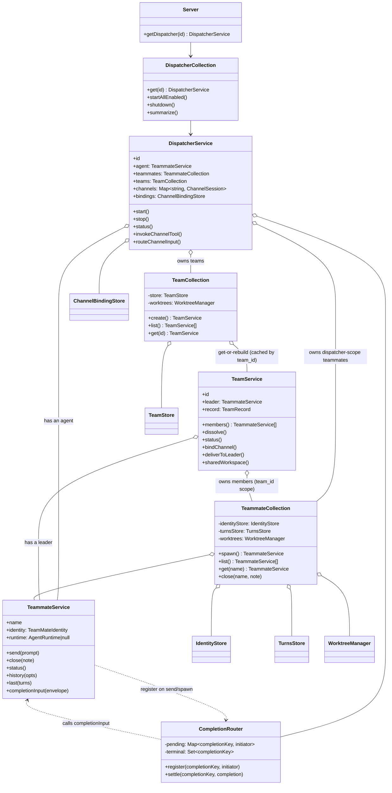

# Service Architecture Refactor (Collection + Service Model)

- **Status:** Accepted (working design) — Epic #233 discussion (2026-06-17); the intended shape, with exact file/store/name details tracking the implementation rather than frozen here
- **Date:** 2026-06-16 (delivery + reliability model finalized 2026-06-17)
- **Affects:** `dispatcher-service/` entire module (renamed to `service/`), `platform/paths.ts`, `admin/methods.ts`, state directory layout
- **PR / Issue:** #233
- **Related:** issue #209 follow-up; refines `dispatcher-local-aggregate.md`

## Context

The `dispatcher-service/` object model evolved across multiple iterations and carries several structural problems:

1. **Blurred responsibility boundaries.** `TeamMateAgentService` and `TeamManager` are process-wide god objects mixing collection operations, entity operations, storage access, and runtime management.
2. **Inconsistent naming.** Some are called Service, some Manager, some Store — names don't reflect actual responsibilities.
3. **No entity objects.** Teammates and teams have no corresponding entity objects; all operations live on manager/service classes, separating data from behavior.
4. **Asymmetric layering.** The Team side has a collection + single-entity split (`TeamManager` / `TeamService`), while the Teammate side has one monolithic Service.
5. **Redundant `LiveTeammateRegistry`.** A global registry of live runtimes is unnecessary when each teammate can manage its own runtime.
6. **No unified agent model.** Dispatcher runtime and team leader are conceptually the same thing — an entity with an agent runtime — but implemented as two completely separate code paths.
7. **Delivery logic is duplicated.** Completion delivery to dispatcher runtime and to team leader follow the same pattern but are coded separately.

## Decision

Restructure the service layer around a **Collection + Service pattern**, and unify agent runtime lifecycle management through a shared `TeammateService` entity. The dispatcher *has* an agent (not *is* an agent); the team *has* a leader agent. Delivery flows through a per-dispatcher, per-turn in-memory `CompletionRouter`, not direct references between entities.

### Symmetric Collection + Service Pattern

Both Team and Teammate follow the same two-level pattern:

| Level | Team side | Teammate side | Responsibility |
|---|---|---|---|
| Collection | `TeamCollection` | `TeammateCollection` | Holds store, create/list/get, factory methods, event emission |
| Entity | `TeamService` | `TeammateService` | Holds its own record/identity, domain operations, runtime lifecycle |

No inheritance between collections or entities. Differences (dispatcher-owned vs team-owned) are expressed through constructor injection of configuration, not subclassing.

### Shared Agent Runtime Entity (has-a, not is-a)

`TeammateService` is a named agent entity with:

- an identity record
- an optional runtime (lazily started)
- a turns archive
- a `completionInput(envelope)` inbox (so it can be a delivery target) and
  per-turn registration with the router on `send`/`spawn` (so it can be a
  delivery source)

Dispatcher and team leader *contain* a `TeammateService` for their agent runtime needs, rather than *being* one. This avoids forcing dispatcher-specific concepts (channels, bindings, restart intent) into the teammate abstraction.

### Completion Delivery (per-turn, in-memory registration)

Delivery is mediated by one per-dispatcher **`CompletionRouter`**. No entity
holds a reference to its delivery target — that is what breaks the
construction-time dependency cycle the review flagged. The router is constructed
first and injected; it holds no topology.

The model is **per-turn registration, entirely in-memory (never persisted):**

- A delivery-initiating action — `send` / `spawn` (and team-create-with-prompt)
  — registers an association `completionKey → initiator` with the router, where
  `completionKey` is `producerName:turnId`. The `initiator` is the caller (the
  dispatcher agent, or a team leader), known synchronously at call time from the
  caller principal.
- When that turn settles, the router takes the turn result, calls
  `initiator.completionInput(envelope)`, then clears the association.
- The key must include the **producer name**, not bare `turnId`: `turnId` is
  assigned per runtime and is **not** unique across a dispatcher's teammates,
  while the router is a single per-dispatcher instance — bare `turnId` would
  cross-wire two teammates' in-flight turns. This relies on teammate names
  staying **dispatcher-global**: `allocateName` (`teammate/service.ts`) checks
  the candidate against *all* of the dispatcher's identities regardless of team,
  so `producerName:turnId` is collision-free; the refactor must preserve this
  even as records move under `team/<team>/`. Keying by the per-turn id still
  makes steer correct with no extra logic:
  - multiple `send`s merged by the Agent Runtime into one turn (one `turnId`) →
    one registration → delivered **once**;
  - turns the model opens separately (no steer merge) → distinct `turnId`s →
    delivered per turn.
- Gating is intrinsic: only `send`/`spawn` register, so only send-initiated
  turns deliver. Channel inbound and remote-control turns never register →
  recorded but not pushed. Delivery therefore does **not** consult `turn_origin`.

`turn_origin` (`channel | dispatcher | team_leader`) stays a **persisted** field
serving `last` / `history` provenance only; it is fully decoupled from delivery.

**Settle-time concurrency.** When a turn settles, recording the settled turn and
routing the delivery are two independent lines run with `Promise.allSettled` —
the durable record is never gated by, or lost to, delivery. The submit row is
written at `send`; the settled row (with the result) at settle.

**At-most-once delivery.** A duplicate delivery is worse than a missed one (it
re-triggers the target's turn), so delivery is at-most-once. The idempotency +
retry policy lives in the `CompletionRouter` (the delivery service), **not** in
`TeammateService.completionInput` or the runtime — the router is the single
delivery chokepoint and applies one policy to every target (dispatcher and
leader alike); `completionInput` stays a thin forward into the runtime. The
router keeps a **terminal cache** of completion keys (`name:turnId`) that have
reached *any* terminal outcome — not only delivered ones — so a duplicate settle
never re-attempts. Policy:

- key already terminal, or an in-flight attempt for the same key → skip / coalesce;
- delivered (`accepted`) → record terminal;
- target not running / `unsupported` → drop **and record terminal** (no replay
  queue — a queued replay would surface later as a duplicate); the consumer falls
  back to `last` / pull;
- explicit `failed` (definitely not delivered) → bounded retry, then on
  exhaustion drop **and record terminal**;
- thrown error (ambiguous — may already have delivered) → drop **and record
  terminal**, do **not** retry.

Recording *every* terminal outcome (not only `accepted`) is the fix for the
current `DispatcherCompletionDelivery`, which remembers only on `accepted` and
would re-attempt on a duplicate settle after a drop.

Losing the in-memory registration on restart is therefore acceptable and even
preferred: we would rather miss than risk a post-restart duplicate; `last` is
the durable line. This is **not a new regression** — the current path has the
same property: a one-time `onTurnSettled` callback bound at runtime start does
not re-fire for turns that settled across a restart.

**Ordering invariant (trust principle).** The model relies on the runtime
returning a turn's `turnId` *before* that turn's settle callback fires
(`channelInput` returns on steer acceptance, well before the model produces
output). This is made an explicit `AgentRuntime` contract invariant with a
provider test; no pending-registration machinery is built. A genuinely null
`turnId` means there is nothing to deliver.

**Naming:** the registered target is the `deliverTarget` / `initiator` (a
dispatcher or leader). Do not conflate it with `CompletionEnvelope.source`,
which names the *producer* of the completion (the teammate).

### Store Co-location

Stores are co-located with their owning collection, not floating as global singletons:

- `IdentityStore` + `TurnsStore` → inside `TeammateCollection`
- `TeamStore` → inside `TeamCollection`
- `ChannelBindingStore` → inside `DispatcherService` (dispatcher-level resource)
- `WorktreeManager` → per-dispatcher instance, constrained to the dispatcher's cwd

### Target Class Diagram



### State Directory Layout

Reorganize per-dispatcher state to reflect the new hierarchy:

```
state/<dispatcher-id>/
  identity.json            # the dispatcher agent's own identity (+ rolling summary) — debug only
  turn.jsonl               # the dispatcher agent's own turns — debug only
  status.json              # dispatcher status — AUTHORITATIVE for rebuild/creation
  access.json              # access control
  chat-bots.json           # peer bot awareness
  channel-bindings.json    # channel bindings
  teammate/                # dispatcher-owned teammates
    <name>/
      identity.json        # identity + rolling summary (the record)
      turn.jsonl           # turn events (folded by `last`)
  team/
    <team-name>/           # one directory per team
      identity.json        # the team leader's identity (+ rolling summary)
      turn.jsonl           # the team leader's turns
      record.json          # team record (members, bound channel, …)
      teammate/            # team-owned members
        <name>/
          identity.json
          turn.jsonl
```

The layout is **fully symmetric**: every agent entity is a directory holding
`{identity.json, turn.jsonl}`, and every agent that owns sub-teammates has a
`teammate/<name>/` subdir beside it. Writing is a blind `mkdir -p <dir>` + write;
reading any agent, or listing any collection, uses one shared routine over
`<scope>/teammate/<name>/`. The directory tree mirrors the object model exactly —
the dispatcher agent's pair sits at the dispatcher root with a `teammate/`
collection beside it, and the team leader's pair sits at the team root with its
own `teammate/` collection. This is the intended shape, not a frozen spec —
exact filenames and store wiring track the implementation.

`status.json` stays the **authoritative** dispatcher state for rebuild/creation.
The dispatcher agent's `identity.json` + `turn.jsonl` are **write-only debug data
with no consumer**. Because they live at the dispatcher *root* (not under
`teammate/`), the teammate read chokepoints (`scopedList` / `mustIdentity`, which
scan `teammate/<name>/`) never enumerate them — and likewise the team leader
lives at the team *root*, so listing a team's members scans only
`team/<team>/teammate/<name>/` and never includes the leader. The structure
itself enforces visibility; no `dispatcher_agent` role exclusion is needed.

### Overall Hierarchy

```
Server (process-level · composition root)
  └── DispatcherCollection (process-level · thin collection + factory)
        └── DispatcherService (per-dispatcher)
              ├── dispatcher: TeammateService     # the dispatcher's own agent
              ├── teammates: TeammateCollection   # dispatcher-owned teammates
              ├── teams: TeamCollection           # team collection
              └── channelBindings: ChannelBindingStore
```

```
TeamCollection (per-dispatcher · get-or-rebuild factory, cached by team_id)
  └── TeamService (per-team · cached when live, rebuilt from disk otherwise)
        ├── teammates: TeammateCollection   # the team OWNS its members' collection (team_id scope)
        │     └── leader + members: TeammateService (live runtime cache)
        └── record: TeamRecord              # authoritative in-memory; all mutations route through here
```

**One `TeammateCollection` per scope — per team, plus one for the dispatcher.**
Each `TeammateCollection` is constructed with a fixed `teamScope: string | null`
(`null` = the dispatcher's own teammates; a `team_id` = that team's leader +
members). The scope is baked in, not threaded per call: `spawn` / `send` / `list`
/ `status` / `history` / `last` / `close` drop their `teamId` parameter and the
collection supplies its own scope to the (unchanged) stores and read model. This
is the intended encapsulation — a team *owns* its members, dissolve drops the
whole collection — and it is what the original design specified; a single shared
collection discriminated only by a `team_id` argument was an implementation
deviation and is rejected.

**Ownership / caching — the factory pattern (load-bearing).** `TeamService`
**owns** its per-team `TeammateCollection`; the collection is constructed by, and
held on, the `TeamService`. `TeamService` itself is obtained through a
*get-or-rebuild factory*: `TeamCollection.get(team_id)` returns the cached live
`TeamService` if one exists, else rebuilds it from the persisted `TeamRecord`
(its `TeammateCollection` then rebuilds member/leader entities from disk on access,
each runtime lazily resumed from `session_id` on the next `send` / channel inbound).
This is the **same factory every other level already uses** — `Dispatchers.get`
caches `DispatcherService`, `TeammateCollection.entityFor` caches `TeammateService`;
the former fresh-per-`get` `TeamService` was the odd one out and is conformed to
the pattern. It is safe because **the live in-memory cache and the host process
share one lifetime**: every Agent Runtime is a child of the dreamux process tree,
so a live runtime can never exist without its cache (host down ⇒ children dead),
and after a restart the whole tree rebuilds lazily from disk — the existing
revive-on-channel-inbound path for a team leader. This is the **universal
entity-materialization rule**, with no special-cased level: a `DispatcherService`
is rebuilt from its `status.json`, a `TeamService` from its team record, a
`TeammateService` from its `identity.json` — every level is the same
get-the-live-instance-or-rebuild-from-persisted-state factory, and the live cache
at each level is purely a within-process performance/identity cache, never the
source of truth.

What fresh-per-`get` used to buy (a held record never goes stale after dissolve)
is preserved by two invariants instead: (1) **every `TeamRecord` mutation routes
through the cached `TeamService`**, so its in-memory record stays authoritative;
(2) **`dissolve` evicts the team's cache entry** (after stopping its runtimes), so
a later `get` rebuilds from disk and reads `status: closed`. The dispatcher's own
(`teamScope: null`) collection is owned by `DispatcherService` the same way.

**Shared per-dispatcher singletons stay shared.** Every `TeammateCollection`
(dispatcher + per-team) is wired with the *same* per-dispatcher `CompletionRouter`,
`WorktreeManager`, and `initiatorFor` resolver. `TeamCollection` forwards these
into each `TeamService` it builds, which hands them to the team's collection. The
stores
(`IdentityStore` / `TurnsStore` / `TeammateReadModel`) are stateless path-derivers
(no in-memory cross-team index), so each collection holds its own instances; the
physical directory layout already partitions them by scope.

**Names stay dispatcher-global; the router key is unchanged.** `allocateName`
checks the candidate against `IdentityStore.listAllNames(dispatcherId)` — a blind
on-disk scan across *all* scopes (dispatcher teammates, every team's leader +
members) — regardless of which scope's collection allocates it. So
`producerName` is unique across the whole dispatcher and the `CompletionRouter`
key stays `producerName:turnId` with **no** `team_id` component. Team-local names
(which would require a `team_id:producerName:turnId` key) are deliberately **not**
introduced: no requirement asks for them, and adding scope to the router key is
complexity the per-team split does not need. This is an explicit decision, not an
oversight — see the delivery section's dispatcher-global-name invariant.

**Delivery topology stays in one place.** `initiatorFor(producer)` is resolved by
`DispatcherService` (a `team_member` → its team's leader `TeammateService`; a
dispatcher teammate or a leader → the dispatcher agent) and injected into every
collection. The per-team collections do not re-derive topology; they call the
single injected resolver, so the `CompletionRouter` remains the only topology-free
delivery chokepoint.

### Module / Directory Layout (`src/service/`)

The top-level `src/dispatcher-service/` directory is **deleted**; the whole module
moves under `src/service/`. Rule: **one service class per file or directory; a
file holds at most one service class.** A class with helper functions gets a
directory whose `index.ts` is the class and whose siblings are its helpers
(`src/service/team-service/index.ts` = `TeamService`, helpers beside it). Shared
helpers used by more than one service get their own neutral directory. The
existing `team/service.ts` (which holds *two* classes, `TeamCollection` +
`TeamService`) is split.

```
src/service/
  index.ts                       # package-internal barrel (Dispatchers, DispatcherService, TeamService, ChannelToolAuthorizationError)
  dispatcher-workspace.ts        # issue #182 dispatcher-cwd policy (shared: server preflight, dispatcher service, doctor, worktree layer)
  dispatchers/
    index.ts                     # Dispatchers (process-level collection + factory)
  dispatcher-service/            # the per-dispatcher aggregate + its agent-side parts
    index.ts                     # DispatcherService
    agent.ts                     # createDispatcherAgent factory
    base-prompt.ts
    channel-sessions.ts          # ChannelSessions
    channel-tool-auth.ts
    mcp-descriptors.ts
    runnable-channel.ts
    errors.ts                    # ChannelToolAuthorizationError
  team-collection/
    index.ts                     # TeamCollection
    store.ts                     # TeamStore
    types.ts
    mcp-config.ts
  team-service/
    index.ts                     # TeamService (+ TeamChannelContext seam + view helpers)
  teammate-collection/
    index.ts                     # TeammateCollection
    identity-store.ts            # IdentityStore   (stores the collection owns)
    turns-store.ts               # TurnsStore
    read-model.ts                # TeammateReadModel
    name-allocator.ts
    runtime-state.ts
    agent-config.ts
    mcp-config.ts
    types.ts                     # teammate domain types (shared by service + read-model)
  teammate-service/
    index.ts                     # TeammateService
    turn-recording.ts            # settle/turn capture helper
  completion-router/
    index.ts                     # CompletionRouter
  worktree/                      # shared by team-collection + teammate-collection
    manager.ts                   # WorktreeManager
    paths.ts
    workspaces.ts
  channel-binding/
    store.ts                     # ChannelBindingStore
  legacy-state.ts                # shared legacy-state detection (fail-loud)
```

The names above (`dispatcher-service/`, `team-collection/`, …) follow the user's
`team-service/index.ts` convention and can be renamed without affecting the
design; only the one-class-per-file rule and the deletion of the top-level
`dispatcher-service/` are load-bearing. Cross-cutting helpers (`worktree/`,
`channel-binding/`, `legacy-state.ts`, `dispatcher-workspace.ts`) live at the
`service/` root because no single service owns them — e.g. the dispatcher-cwd
policy is consumed by `server.ts` startup, the dispatcher service, `dreamux
doctor`, and the `worktree/` layer, so the `worktree/` helper must not reach up
into `dispatcher-service/` for it. The restructure is a **pure mechanical move** (`git mv`
+ import-path fixups + a `tsc` green gate), done as a separate commit *after* the
per-team semantic change so the two diffs stay reviewable.

### Lifecycle Management

No IOC container. Constructor injection + factory functions:

- **Process-level** (created at startup, destroyed at exit): config, logger, provider catalogs, `DispatcherCollection`
- **Per-dispatcher** (lazy-created on first `get()`, cached): `DispatcherService`, `TeammateCollection` (dispatcher scope), `TeamCollection`, `ChannelBindingStore`, `WorktreeManager`
- **Per-team** (lazy-created on first `get()`, cached): `TeamService`, `TeammateCollection` (team scope)
- **Per-teammate** (created by `get()`, cached): `TeammateService`; runtime starts lazily on send/spawn

### Admin / MCP Protocol

Admin socket methods and parameters can change freely — all consumers are within the dreamux codebase (MCP shims, CLI commands, doctor). Optimize for clean architecture, not backward compatibility.

### Global Operations & Shutdown

`LiveTeamMateRegistry` is removed; there is no process-wide flat index of live
runtimes. Global operations — `stopAll` (server shutdown) and `doctor` — are
CLI- / server-lifecycle-level capabilities, **not** exposed on the MCP surface,
so they are infrequent and need no O(1) index. They traverse the **live cache**
on demand: `DispatcherService` stops its own (`teamScope: null`)
`TeammateCollection`, then asks `TeamCollection` to stop each *currently
materialized* `TeamService` — each stops its own `TeammateCollection` (members)
and leader. Only cached `TeamService`s are swept: a team never accessed this
process run holds no live runtime (live cache ≡ process lifetime), so `stopAll`
must **not** read the durable store to rebuild-and-stop, and must not lazily start
a not-yet-running runtime. Stop order is preserved: all teammate runtimes (direct
+ team members + leaders) before the dispatcher agent. A per-dispatcher flat live
index was rejected — it would force threading the index down through every
collection's create/close path, which the cache traversal
(`TeammateCollection.stopAll()` + `TeamCollection.stopAll()` over cached teams)
avoids.

Shutdown is best-effort and assumes no new `spawn`/`send` during teardown; a
`shuttingDown` flag on `DispatcherService` that rejects new lifecycle calls
closes the traversal-window race.

## Consequences

- `TeamManager` is removed; its responsibilities split between `TeamCollection` and `TeamService`.
- `TeamMateAgentService` is split into `TeammateCollection` + `TeammateService` entities.
- `LiveTeamMateRegistry` is removed (in Phase 1); each `TeammateService` manages its own runtime and global ops traverse the trees.
- Runtime lifecycle logic is shared via `TeammateService` entity (used by dispatcher, team leader, and regular teammates).
- `DispatcherService` has-a `TeammateService` for its agent runtime (not is-a).
- Completion delivery uses a per-dispatcher, per-turn in-memory `CompletionRouter` (register on `send`/`spawn`, deliver to the initiator on settle, then clear), decoupled from the persisted `turn_origin`. No entity references its delivery target, which breaks the construction cycle.
- State directory layout changes; old layouts fail-loud with a rebuild hint (0.x policy, no migration).
- Admin method signatures change to match the new service shape.
- Collections and stores are per-dispatcher, not process-wide singletons.

## Rollout Plan

Five phases, ordered for implementation. Phases 1-3 restructure the code without
changing behavior; phases 4-5 introduce the shared agent model. This is **not** a
production rollback plan: the refactor does not merge to a stable branch until
tests pass, so there is no upgrade/back-compat or lossless-rollback constraint —
old state layouts fail loud and the accepted recovery is delete-config-and-reinstall
(0.x policy). A Rush change ships at merge time for the changelog only.

### Phase 1: Collection + Service layering & naming alignment

Establish the Collection + Service pattern; eliminate `TeamManager`.

- Introduce `TeamCollection` (split out of `TeamManager`)
- Introduce `TeammateCollection` (split out of `TeamMateAgentService`)
- `TeamService` entity-ify (holds its own record)
- `TeammateService` entity-ify (holds its own identity)
- Remove `TeamManager` (responsibilities migrate to TeamCollection + TeamService)
- Rename `TeamMateAgentService` → `TeammateCollection`
- Update admin method call paths
- Extract `CompletionRouter` as a standalone, tested module
- Remove `LiveTeamMateRegistry` — each `TeammateService` owns its runtime; its name-lookup use is obviated by the per-turn router, and global ops traverse the trees instead

### Phase 2: Store co-location & directory restructure

Move stores into their collections; reorganize state directories.

- `TeamStore` → inside `TeamCollection`
- `TeamMateIdentityStore` / `TeamMateTurnsStore` → inside `TeammateCollection`
- `ChannelBindingStore` → inside `DispatcherService`
- Restructure state directories (per new layout)
- Add legacy state detection (fail-loud, no migration)
- Update `paths.ts`

### Phase 3: Ownership sinking

Collections go from process-level to per-dispatcher.

- `TeammateCollection` becomes per-dispatcher (no longer a process-wide singleton)
- `TeamCollection` becomes per-dispatcher
- `WorktreeManager` becomes per-dispatcher (cwd-constrained)
- `ChannelBindingStore` becomes per-dispatcher
- Add concurrency guards (startingPromise pattern) on all lazy creation points

### Phase 4: Team leader → TeammateService

Team leader explicitly uses `TeammateService` entity (medium risk — leader is already a special teammate).

- Team leader creation flows through the same `TeammateService` entity as regular members
- Unify leader turn recording with teammate turn recording
- Team leader delivery flows through the same `CompletionRouter`: a dispatcher→leader `send`/create registers `leaderName:turnId → dispatcher`, and a leader→member `send` registers `memberName:turnId → leader`

### Phase 5: Dispatcher agent → TeammateService

Dispatcher's agent runtime uses `TeammateService` entity (highest risk, last).

- `DispatcherService.agent` becomes a `TeammateService` instance
- Shared runtime lifecycle logic lives in `TeammateService`
- Unified completion delivery path
- (`LiveTeamMateRegistry` already removed in Phase 1)
- `DispatcherRuntimeService` → removed; responsibilities split as below

| `DispatcherRuntimeService` responsibility | Lands in |
|---|---|
| agent runtime lifecycle (start/resume/stop) | `TeammateService` |
| channel sessions (`Map<channel_id, ChannelSession>`) | `DispatcherService` |
| restart-intent injection | `DispatcherService` (post `agent.start()` hook) |
| dispatcher role MCP descriptor assembly | `DispatcherService` (injected mcpServers factory) |
| completion delivery | `CompletionRouter` |

The channel-session-after-runtime-start ordering (slot registered before session
start) must be preserved across the split.
