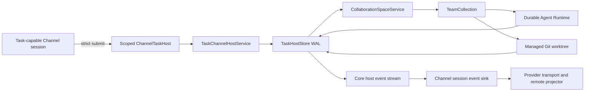
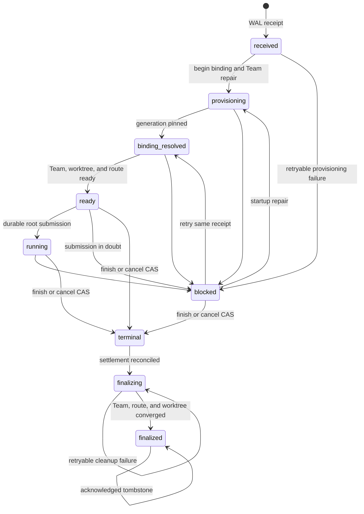

# Provider-neutral Task Channel Host

- **Status:** Accepted
- **Date:** 2026-07-15
- **Affects:** `@excitedjs/dreamux-types`, Channel providers, dispatcher lifecycle,
  collaboration spaces, Teams, managed worktrees, durable runtime submission,
  and dispatcher state
- **PR / Issue:** This change

## Context

The conversational Channel contract accepts normalized messages through
`ChannelRoutes.deliver`, resolves provider targets, and optionally exposes
provider tools such as reply or reaction. A remote task system has a different
contract: it delivers a durable task attempt, expects one isolated execution
aggregate, and consumes deterministic execution state. Treating that delivery
as a conversation would make the Dispatcher agent and an LLM part of admission,
routing, and telemetry reliability.

External Channel providers also need a public contract they can compile against
without importing Dreamux Core services or stores. Providers are trusted local
plugins, so this boundary is not a sandbox. It is a typed compatibility and
ownership boundary that keeps provider packages independently publishable and
keeps Core state transitions authoritative.

## Decision

Dreamux exposes an optional `task_channel_host_v1` capability alongside, not
inside, conversational delivery. A task-capable session receives a scoped
`ChannelTaskHost` through `ChannelRoutes.taskHost`. Strict task submission never
falls back to `ChannelRoutes.deliver` or the Dispatcher agent.

The public ABI lives entirely in `@excitedjs/dreamux-types`:

- a provider declares supported task schemas and capabilities;
- the Core-created handle exposes required and optional capabilities, host
  status, stable `host_stream_id`, monotonic `stream_generation`, and an opaque
  `session_fence` before negotiation;
- negotiation selects the schema and requires either event replay or a complete
  snapshot;
- strict submit, lookup, and cancel use bounded task-attempt and container
  identities;
- logical repository input carries a key and optional expected policy revision,
  never a host path;
- Core emits bounded host, task, Team, worktree, turn, and cleanup events;
- providers acknowledge only a consecutive processed event prefix;
- snapshot pages have one immutable snapshot id, watermark, total item count,
  ordered offset, session fence, and completeness proof, so an adapter can stage
  all pages and atomically replace its remote projection only after the final
  page;
- superseding or detaching a Channel session revokes its handle and fences late
  calls and late sink acknowledgements.

The provider's event transport and remote command sequencing remain
provider-owned. Core does not expose services, stores, admin DTOs, the admin
socket, runtime operation ids, repository paths, prompts, or provider-private
payloads through the host contract. These omissions protect ownership and ABI
stability; they do not attempt to contain trusted plugin code.

Key public source:

- `/packages/dreamux-types/src/channel-task.ts`
- `/packages/dreamux-types/src/channel.ts`
- `/packages/dreamux-types/tests/fixtures/external-provider.ts`

## Execution Ownership

`DispatcherService` remains the admission, lifecycle, recovery, and shutdown
owner. It constructs one `TaskChannelHostCollection` per dispatcher. Each
task-capable configured channel owns one `TaskChannelHostService` and one durable
host stream. A strict task receipt identifies one Core-derived target, one Team,
and one managed worktree.



The collaboration-space route remains the authoritative generic Channel route.
`TaskHostStore` persists only route claim and reconciliation checkpoints needed
to repair task provisioning. It does not become another route owner.

LLMs and TeamLeaders do not report Team, turn, worktree, progress, terminal, or
cleanup telemetry. Every event is derived from a committed Core transition.
A scoped TeamLeader `attempt.finish` invocation may request the business
terminal transition, but the terminal CAS, WAL commit, event creation, runtime
settlement reconciliation, finalizer, and synchronization are Core work. Turn
settlement, Team closure, target closure, and cleanup completion are never
interpreted as business success.

Key Core source:

- `/packages/dreamux/src/service/channel-task-host/`
- `/packages/dreamux/src/service/dispatcher-service/channel-session-start.ts`
- `/packages/dreamux/src/service/dispatcher-service/index.ts`
- `/packages/dreamux/src/service/team-collection/task-provisioning.ts`

## Repository Binding

Task-capable channels reuse the generic
`channels[].collaborationSpace.defaultBinding` hook. The first task attempt for
an unbound container creates generation 1 only when default binding is enabled.
Static binding remains compatible. A channel-sourced binding adds only one
generic mode:

```json
{
  "collaborationSpace": {
    "defaultBinding": {
      "enabled": true,
      "repositorySource": "channel"
    }
  }
}
```

In channel mode the provider resolves a logical repository key against its
trusted local configuration. Core then requires an allowlisted, real managed
Git repository, resolves the configured base ref to a commit, and persists:

- source mode, logical key, binding revision, canonical repository path, and
  base ref as the immutable collaboration-space binding fingerprint;
- the resolved commit as the task-local execution pin used to create that
  task's worktree.

The commit is deliberately not part of the collaboration-space fingerprint.
Two attempts in one container may pin different commits after the same symbolic
base ref advances, while the generation still rejects logical key, binding
revision, canonical path, base-ref, or fingerprint mismatch. The optional
remote expected revision is checked before receipt. Missing binding,
disabled auto-binding, resolver failure, allowlist miss, and generation mismatch
are typed strict rejections; none falls back to conversational routing.

Key source:

- `/packages/dreamux/src/config/collaboration-space-config.ts`
- `/packages/dreamux/src/service/channel-service/channel-sessions.ts`
- `/packages/dreamux/src/service/channel-task-host/repository-policy.ts`
- `/packages/dreamux/src/service/collaboration-space/default-binding.ts`
- `/packages/dreamux/src/service/collaboration-space/store.ts`

## Durable Aggregate And Runtime Protocol

`TaskHostStore` is the sole durable owner for task-kind target claim, phase,
binding generation, provisioning checkpoints, runtime submissions, terminal
state, finalizer progress, host events, stream ACK, and tombstones.
`CollaborationSpaceStore` continues to own spaces, binding generations, and
conversational targets only.

Version 1 uses a checksummed per-channel transaction WAL rather than SQLite. A
committed frame contains target deltas, host events, sequence allocation,
consecutive-prefix ACK movement, previous checksum, checksum, and commit marker.
The frame is appended and fsynced before a receipt or state transition is
reported durable. Rebuildable target and stream projections are written after
the WAL commit and never become authoritative.

The selected Agent Runtime must advertise `durable_task_submission_v1` before
receipt, again before provisioning, and during recovery. Root, completion,
spawn, and send submissions use `submitOnce`, `lookupSubmission`, a durable
settlement revision/result, and idempotent settlement acknowledgement.
`RuntimeSubmissionIndex` is the sole submission-settlement writer; active-turn,
last-leader, and quiescence fields are derived in the same WAL transaction.

Each operation id is derived from the task target, parent operation, durable
tool-call identity and ordinal, and operation kind. Core commits intent before
the runtime side effect. A bounded runtime call that cannot prove whether the
side effect happened becomes `in_doubt`; Core never retries it as a fresh
operation. Capability or durability-namespace drift also fails closed.

The WAL reserves worst-case JSON-escaped settlement and transitive member
completion capacity before accepting an operation. This preserves the ability
to persist every legal settlement, terminal transition, and lifecycle event
after durable admission.

Key source:

- `/packages/dreamux/src/service/channel-task-host/store.ts`
- `/packages/dreamux/src/service/channel-task-host/wal.ts`
- `/packages/dreamux/src/service/channel-task-host/capacity.ts`
- `/packages/dreamux/src/service/channel-task-host/runtime-execution.ts`
- `/packages/dreamux/src/service/channel-task-host/runtime-submission-index.ts`
- `/packages/dreamux-types/src/agent-runtime.ts`

## State Machine And Recovery



Only explicit finish or cancel wins the business-terminal CAS. After receipt,
provisioning failures are lifecycle state and duplicate deliveries return the
same receipt. Startup repair handles provisional worktrees without Team rows,
orphan `starting` Team rows, missing route claims, accepted runtime submissions,
settlement ACKs, finalizer checkpoints, and ACKed finalized targets that were
not yet tombstoned.

Terminal state is durable before background finalization. The finalizer waits
for required runtime settlement and ACK, closes the Team and route, cleans or
retains the managed worktree according to observable repository state, and
checkpoints every step. Dirty, unmerged, uniquely committed, or cleanup-failed
worktrees are retained with a bounded reason. Retryable finalizer failure marks
the host degraded and is retried without repeating the business terminal.

At dispatcher shutdown, admission closes first, the host emits `stopping`,
accepted work drains, sessions and sinks are fenced, terminal cleanup continues
under Core ownership, the WAL maintenance queue drains, and the host emits
`stopped`. On restart, durable manifests are discovered before provider session
start. Active nonterminal targets require the same configured task capability
and provider ownership; drift fails startup. Already-terminal cleanup can
converge without opening a provider session.

## Event Stream And Projection Rules

Core owns one host event stream per dispatcher channel. `host_stream_id` is
stable in the channel manifest. `stream_generation` is monotonic and fences a
logically replaced stream. Event sequence is monotonic within that generation.

The taxonomy is deliberately bounded:

- `host.lifecycle`: recovering, ready, degraded, stopping, stopped;
- `task.lifecycle`: task phase, explicit terminal outcome, retryable blocked
  code, and acknowledged tombstone;
- `team.lifecycle`: provisioning, ready, closing, closed;
- `worktree.lifecycle`: provisional, ready, cleaning, deleted, retained;
- `turn.lifecycle`: submitted, running, completed, failed, stopped, in doubt;
- `cleanup.lifecycle`: started, completed.

An event ACK is valid only for a prefix that the current session was offered by
snapshot, replay, or the attached sink. A fresh or incompatible cursor requires
a complete snapshot before the sink can attach. Snapshot cursors are opaque,
session-fenced, expiring, and bound to one immutable capture. A provider stages
all pages, verifies offsets and totals, atomically installs the complete
projection, durably persists the watermark, then acknowledges that prefix.

Compaction rewrites physical WAL history without changing stream identity,
generation, watermark, unacknowledged event ids, or logical target state. Once a
finalized target's last event is acknowledged, Core replaces sensitive task,
repository, binding, and submission data with a durable identity tombstone and
emits the tombstone event. Startup repairs the narrow crash window where the ACK
frame committed before tombstoning.

## Consequences

- Conversational-only providers remain source and behavior compatible because
  every task surface is optional.
- Task-capable external providers can compile and pack against
  `@excitedjs/dreamux-types` without local shadow DTOs or a dependency on
  `@excitedjs/dreamux` internals.
- Task providers must implement durable snapshot/replay application and must
  use a runtime with the durable submission protocol. There is no conversational
  or best-effort fallback.
- Persisted task host manifests bind a channel id to its provider ref. Removing
  or replacing a provider while nonterminal targets exist fails startup. The
  operator must restore the provider and let the targets finish or cancel them
  through the scoped task contract.
- The admin socket, status polling, provider tools, replies, reactions, and
  prompt discipline are not telemetry mechanisms and must not be added as
  parallel synchronization paths.

## Alternatives Considered

- **Route tasks through the Dispatcher agent.** Rejected because receipt,
  identity, provisioning, and telemetry would depend on model behavior.
- **Model telemetry as Channel replies or provider tools.** Rejected because
  execution synchronization is deterministic Core state, not conversation.
- **Let providers import Core services and stores.** Rejected as an unstable
  package/ownership dependency. The typed host is the smaller compatibility
  boundary; it is not a security facade.
- **Give providers the admin socket or require status polling.** Rejected
  because it duplicates ownership, leaks unrelated DTOs, and loses event-order
  and crash-replay guarantees.
- **Store tasks in `CollaborationSpaceStore`.** Rejected because conversational
  target lifecycle and task execution have different terminal, settlement,
  finalizer, and retention invariants.
- **Use SQLite for version 1.** Rejected because one checksummed transaction WAL
  can atomically carry the aggregate delta and event outbox while matching the
  repository's current file-backed state model.
