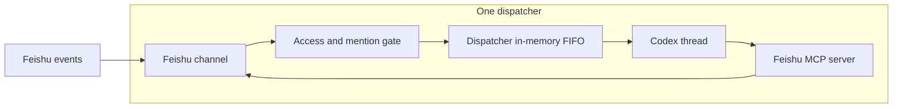

# Top-level design

- **Status:** Accepted target architecture
- **Date:** 2026-06-03
- **Affects:** server runtime, dispatcher lifecycle, Feishu channel, Codex MCP, global config, state files, CLI admin surface
- **PR / Issue:** Local architecture clarification on 2026-06-03; supersedes the persistence and automatic-outbound parts of issue #2 and the runtime-dir parts of `global-config-dir`

## Context

The current source tree still contains a SQLite-backed dispatcher registry,
a durable inbound buffer, and an automatic "assistant text -> Feishu outbound"
path. That shape did not reach a working MVP and makes the Feishu channel
ambiguous when one dispatcher receives messages from multiple chats.

The target architecture is smaller:

- no SQLite for MVP runtime state
- no configurable runtime directory
- no automatic Feishu send from raw Codex assistant text
- one dispatcher owns one Feishu channel instance and one Codex thread
- outbound Feishu messages are sent only when Codex calls the Feishu MCP tool

This record is the architecture source of truth for implementation work after
2026-06-03. Older records remain useful history, but this record wins when they
describe conflicting runtime state, outbound, or config behavior.

## Decision

dreamux is a foreground Node server that hosts multiple independent
dispatchers. Each dispatcher owns:

- one Feishu channel instance
- one Codex app-server child process
- one Codex thread
- one HTTP MCP endpoint for that Feishu channel
- one in-memory FIFO for accepted inbound Feishu messages

Two dispatchers must never share a Feishu channel, MCP endpoint, Codex thread,
or dispatcher state file.



## Config

`~/.dreamux/config.json` is the only dreamux operator-editable config source.
If it is missing, `dreamux serve` must fail loudly and tell the operator to run
`dreamux onboard`; it must not create a silent empty config.

Dispatcher declarations live directly in the config file:

```json
{
  "dispatchers": {
    "dispatcher-a": {
      "enabled": true,
      "env": {},
      "codex": {
        "cwd": "/path/to/workspace",
        "extra_args": []
      },
      "feishu": {
        "app_id": "<Feishu app id>",
        "app_secret": "<stored locally>"
      }
    }
  }
}
```

Rules:

- Feishu credentials belong only in `~/.dreamux/config.json` for MVP.
- The config file is owner-only (`0600`) because it may contain local Feishu
  secrets.
- `dispatchers.<id>.env` is merged over the server process environment before
  starting that dispatcher's Codex app-server.
- `dispatchers.<id>.codex.extra_args` is passed to `codex app-server`.
- dreamux-generated MCP config overrides are appended last, so the dispatcher
  always receives the Feishu MCP server bound to its own channel.
- dreamux follows Codex's own `~/.codex/` home for Codex auth, config, and
  memory. dreamux must not create dispatcher-private `CODEX_HOME` directories
  for the MVP.
- The dispatcher skill is installed per dispatcher under
  `<dispatcher cwd>/.codex/skills/dispatcher/`; see
  [dispatcher-tm-packaging](dispatcher-tm-packaging.md).

## State and logs

Server-owned state is under `~/.dreamux/state/`:

```text
~/.dreamux/state/
  server.json
  admin.sock
  dispatcher-a/
    status.json
    access.json
    codex.sock
```

`server.json` is process-level status only: pid, status, version, started time,
admin socket path, and last error. It does not contain dispatcher thread ids.

`~/.dreamux/state/<dispatcher-id>/status.json` contains dispatcher runtime
status, including:

- `thread_id`
- `status`
- `last_error`
- `last_started_at`
- `last_ready_at`

`~/.dreamux/state/<dispatcher-id>/access.json` contains Feishu access-control
state for that dispatcher only.

Logs live under `~/.dreamux/logs/`, split by component. Codex app-server logs
use the shape:

```text
~/.dreamux/logs/codex-app-server/dispatcher-a.log
```

SQLite is not part of the MVP target. Old runtime state, including previous
SQLite files and obsolete `~/.codex-host/` state, does not need migration.

## Dispatcher lifecycle

On server start:

- load `~/.dreamux/config.json`
- write/update `server.json`
- open the admin socket
- start every enabled dispatcher
- for each dispatcher, start its Feishu channel, HTTP MCP route, Codex
  app-server child, and Codex thread

If a dispatcher has a saved `thread_id`, it first attempts `thread/resume`. If
resume fails, it starts a fresh thread, writes the new `thread_id`, and logs the
loss. It must not send an unsolicited Feishu message about the recovery.

Inbound Feishu messages are not persisted. Accepted messages enter an
in-memory FIFO. If the server restarts while messages are queued or running,
those messages are lost. The server does not replay them and does not post an
"unknown previous execution" message.

## Feishu inbound

Only `im.message.receive_v1` is in scope for MVP, while keeping the channel
shape extensible.

Accepted Feishu inbound is delivered to Codex as an explicit XML-like message
block:

```xml
<feishu_message chat_id="CHAT_ID" message_id="MESSAGE_ID" chat_type="group" sender_id="SENDER_ID" sender_name="Sender Name">
Message text
</feishu_message>
```

Keep attributes minimal. `dispatcher_id` is intentionally omitted because one
Codex app-server only sees the Feishu MCP endpoint for its own dispatcher.

When parsing fails, Codex still receives the routable identifiers:

```xml
<feishu_message chat_id="CHAT_ID" message_id="MESSAGE_ID" chat_type="group" sender_id="SENDER_ID" sender_name="" parse_status="failed">
Message text could not be parsed. Use the Feishu skill with message_id="MESSAGE_ID" to retrieve the original content.
</feishu_message>
```

The inbound prompt should explicitly remind Codex:

> To answer this Feishu message, call the `reply` tool with this message's
> `chat_id` and `message_id`.

If Codex finishes a turn without calling `reply`, dreamux does not send
anything to Feishu.

## Feishu access gate

Access state follows the claudemux Feishu channel policy shape:

- `dmPolicy`: `pairing | allowlist | disabled`
- `groupPolicy`: `block | allowlist | follow-user`
- `allowFrom`: top-level sender allowlist
- `groups`: per-chat group policy
- `pending`: pairing requests

Group messages must mention the bot. Direct messages do not need a mention.

`groupPolicy: "allowlist"` authorizes groups as units. The group entry may
require a bot mention and may restrict allowed senders.

`groupPolicy: "follow-user"` does not authorize the group itself. A group
message is delivered only when the bot is mentioned and the sender is in the
top-level `allowFrom` list.

If the bot open id cannot be resolved, group messages are dropped and logged
because mention matching cannot be trusted. Direct messages may still enter.

Only messages that pass the access gate receive the channel-owned "received"
reaction.

## Feishu MCP

dreamux hosts a local HTTP MCP server bound to `127.0.0.1`. A single listener
may serve multiple dispatcher paths, but each path is bound to exactly one
dispatcher. Codex receives only the path for its dispatcher.

The MCP server name injected into Codex is `feishu`. Tool names are short
because Codex already scopes calls by MCP server name.

MVP tools:

- `reply`
- `react`

`reply` parameters:

```json
{
  "chat_id": "CHAT_ID",
  "message_id": "MESSAGE_ID",
  "text": "Markdown reply"
}
```

`message_id` is required so Feishu topic replies stay in the topic when the
source message belongs to one. `chat_id` remains required as an explicit
conversation boundary and for clearing channel-owned received reactions.

`reply.text` supports one mention syntax:

```xml
<at id="USER_OPEN_ID"/>
```

`react` parameters:

```json
{
  "message_id": "MESSAGE_ID",
  "emoji": "DONE"
}
```

The `react` result returns the Feishu reaction id when Feishu supplies one.
`remove_reaction` and `edit_message` are out of scope for MVP. The channel
still removes its own received reaction after a successful `reply`.

Outbound Feishu failures are logged and discarded for MVP. They are not
persisted or retried.

An optional per-boot bearer token may protect the local MCP path, but it is not
a persisted credential and must not complicate the MVP if the implementation
cost is high.

## Feishu skill and `lark-cli`

The Feishu skill and `lark-cli` are external operator-provided dependencies for
MVP. dreamux does not install them during `onboard`, and it does not provide a
`get_message` MCP tool.

The only MVP dependency on that stack is the parse-failure instruction telling
Codex to use the Feishu skill with the `message_id`.

## Admin and CLI

The public CLI remains `dreamux`.

`dreamux onboard` remains the first-run setup path. It writes
`~/.dreamux/config.json`, prepares state/log directories, installs the user
service, and prints touched paths.

Dispatcher declaration commands operate on `~/.dreamux/config.json`:

- `dreamux dispatcher add`
- `dreamux dispatcher remove`
- `dreamux dispatcher list`

Runtime commands communicate with the live server over the admin socket:

- `dreamux dispatcher start`
- `dreamux dispatcher stop`
- `dreamux dispatcher status`
- `dreamux status`

The admin socket protocol may remain lightweight JSON-RPC or move to another
small RPC protocol such as gRPC. The architectural invariant is that runtime
commands talk to the server socket instead of editing live process state
directly.

When the server is not running, `dreamux status` may read `server.json` and
dispatcher `status.json` to report the last known state. It must not start the
server or any dispatcher as a side effect.

## Out of scope

- chat id to Codex thread id routing
- server-hosted tm runtime management
- SQLite and inbound persistence
- migration from old MVP state
- automatic model-output-to-Feishu delivery
- `edit_message`
- model-exposed `remove_reaction`
- built-in Feishu skill installation
- onboarding-managed `lark-cli`

## Validation targets

Future implementation work should keep at least these tests:

- fake Feishu inbound reaches Codex as the `feishu_message` block
- Codex MCP `reply` sends through the dispatcher-bound Feishu channel
- a Codex turn without `reply` produces no Feishu outbound
- unauthorized group messages are dropped by the access gate
- received reaction is added after gate pass and cleared after successful reply
- dispatcher `thread_id` is restored from `status.json` and replaced after a
  failed resume
