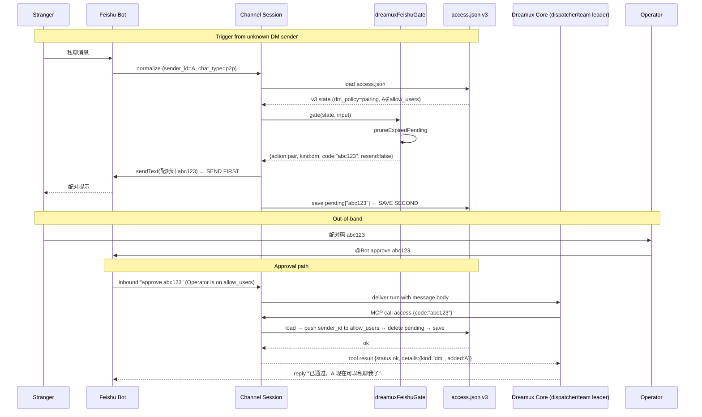

# Feishu pairing-code access flow

- **Status:** Production ready. Decision record:
  [/.agents/decisions/feishu-pairing-access-v3.md](../decisions/feishu-pairing-access-v3.md).
  Supersedes the "Invite-code pairing" deferral in
  [Feishu introduce](feishu-introduce.md).
- **Affects:** `/packages/channel/feishu-channel/src/feishu-gate.ts`
  (v3 schema, gate result, pending bookkeeping, prune, mutations,
  pairing-code generator),
  `/packages/channel/feishu-channel/src/feishu-gate-io.ts`
  (load/save, pairing-prompt rendering, default state factory),
  `/packages/channel/feishu-channel/src/feishu-session-inbound.ts`
  (pair/drop/deliver branch in the extracted `onMessage` helper;
  class-side thin wrapper lives in
  `/packages/channel/feishu-channel/src/feishu-channel.ts`),
  `/packages/channel/feishu-channel/src/tools/registry.ts`
  (new `access` tool definition + handler;
  `src/feishu-mcp-tools.ts` is a backward-compatible re-export shim),
  `/packages/channel/feishu-channel/src/provider.ts`
  (provider session builder, unchanged),
  `/packages/channel/feishu-transport/src/policy/gate.ts` +
  `pairing.ts` (**DELETED**; transport's `package.json` now runs
  `prepublishOnly = clean && build` so stale `.d.ts` from deleted
  sources are never shipped),
  `/packages/channel/feishu-transport/src/contract/access-store.ts`
  (**DELETED** from the active source surface),
  `~/.dreamux/state/<dispatcher-id>/access.json` format (v3), Rush
  changelog (access state shape bump — change files pending, see
  §Rush Change).

## Locked Scope

This document is the single source of truth for pairing behavior. Any
branch not listed here either drops or delivers — there is no "default
implied" behavior in the gate, and no handler fallback outside the
switch below.

### Transport layer is side-effect free

`@excitedjs/feishu-transport` is a **stateless, side-effect-bound SDK adapter**.

The enforceable three-rule boundary (this is the audit criterion;
words like "network I/O only" are deliberately avoided because the
transport package legitimately contains parse/render pure functions
under `src/parse/` and `src/render/`):

1. **No file reads or writes.** Zero `fs` imports, zero path
   resolution for on-disk state, zero durable persistence.
   Purely-opaque SDK return-value wrappers that don't touch the
   filesystem.
2. **No access-control knowledge.** It must not define or reference
   `DmPolicy`, `GroupPolicy`, `GateResult`, `PendingEntry`,
   `Access`, `Pairing`, `allowlist`, or `mention-gating` concepts.
3. **No business rules.** It never decides whether a message is
   delivered or dropped; it never mutates pending bookkeeping; it
   never renders user-facing trust/pairing prompts. It calls
   endpoints when told; the caller decides *when* and *whether*.

Parse/render pure functions (`src/parse/content.ts`, `src/render/`)
are allowed because they contain no access-control knowledge, do no
I/O, and decide no business rules; they are SDK helpers shaped like
SDK helpers. Whether they move to the channel layer in the future is
a separate package-split decision with the same cross-repo consumer
constraint as B2 above — **not in scope for this PR**.

Concretely, the following code is **deleted** from
`@excitedjs/feishu-transport` as part of the pairing feature PR:

- `/packages/channel/feishu-transport/src/policy/gate.ts` (entire file)
- `/packages/channel/feishu-transport/src/policy/pairing.ts` (entire file)
- `/packages/channel/feishu-transport/src/contract/access-store.ts` (entire file)
- Re-exports of the above from `/packages/channel/feishu-transport/src/index.ts`
- Access-control types from
  `/packages/channel/feishu-transport/src/contract/types.ts`:
  `DmPolicy`, `GroupPolicy`, `GroupEntry`, `PendingEntry`, `Access`,
  `GateResult`, `DropReason`, `AccessStore`, `isGroupAuthorized`.
  If no other symbols remain, the whole `types.ts` is deleted.
  Primitive types still used for inbound parsing (`Mention` etc.) are
  retained on a per-usage basis.
- `/packages/channel/feishu-transport/tests/gate.test.ts`
  (orphan — directly imports deleted subjects).
- `/packages/channel/feishu-transport/tests/pairing.test.ts`
  (orphan — directly imports deleted subjects).
- `README.md` sections that describe a `policy` / access-control
  scope. Transport README lists only WebSocket lifecycle + raw SDK
  wrappers + parse/render helpers.
- `package.json` `description` / `keywords` references to "gate",
  "access control", "pairing", "allowlist". Package metadata matches
  the boundary above.

Because `@excitedjs/feishu-transport` is a published package with
external consumers (notably `claudemux`), the PR ships **two Rush
change files**: one for `@excitedjs/feishu-channel` (BREAKING v3
schema bump), and a **separate** one for `@excitedjs/feishu-transport`
that explicitly lists every deleted public export / deleted type
symbol. See §Rush Change / Changelog below for the transport change
body template.

Only `@excitedjs/feishu-channel` reads and writes
`access.json` / `chat-bots.json`. The pairing feature is therefore
implemented entirely within the channel package; the channel package
also owns the `generatePairingCode` primitive (§ Pairing code below).

Out of scope for the first increment:

- Per-group `require_mention` override; per-group `allow_users`
  granularity. Stay on the flat `group.allow_chats` list. Upgrade path
  is a future v4 schema bump, tracked separately.
- Auto-migration from v2. Operator reads CHANGELOG, edits `access.json`
  to v3 shape, reruns `dreamux doctor`, restarts. Any runtime attempt
  to load v2 fails loud and blocks dispatcher boot for that channel.
- Deny (block) verb and revoke verb. Not shipped in the first
  increment. An operator who needs to remove an id edits `access.json`
  by hand. A future increment may extend `access` with a `revoke`
  selector; until then, a removed id that re-enters the flow rolls a
  fresh pending entry as if it had never been seen.
- `list_pending` / `list` selector on the `access` tool. Operator
  inspection reads `access.json` directly.
- Transport-layer gate use. The transport gate (`policy/gate.ts`) is
  **deleted**. The transport package never exported a gate, never
  modeled access state, and will not grow one in the future.
- CLI / admin RPC / `rushx doctor` extras. The only approval surface is
  the `access` MCP tool reachable from the dispatcher or team-leader
  agent via normal Feishu input.

## Data

### Access file location

Unchanged from v2: `stateDir` is passed in by the runtime, which
derives it from the dispatcher-local state root. The file path is
`join(stateDir, 'access.json')` inside the channel package — the
canonical on-disk path is therefore owned by channel code, not by
core path builders. File mode `0600` (owner only) on write via the
tmpfile open-mode; directory mode `0700`.

**Fresh-install default:** When `access.json` does not exist on disk,
`loadDispatcherAccess` returns the in-memory object produced by
`defaultDispatcherAccessState()` in
`/packages/channel/feishu-channel/src/feishu-gate.ts`. That function
is the **only** place the "fresh installs default to
`dm_policy='pairing'`" rule lives. No `dreamux onboard` or config
factory script writes an `access.json` file — v2 never created one
and v3 preserves that shape. The first persistence event is the
first gate mutation that saves (either a pairing `pending` write, an
`access` approval write, or a diagnostic write from `deliver`/`drop`).

**Egress posture change for fresh installs:** v2 defaulted to
allowlist-only DM semantics, so unknown DM senders were silently
dropped. v3 defaulting `dm_policy='pairing'` means a fresh install
**actively replies** to any unknown human DM sender with a pairing
prompt. This is intentional, and is called out separately in the
Rush change file body so an operator upgrading a v2 deployment with a
rebuild (copy-paste into a v3 `access.json`) does **not** see the
posture flip — only truly new deployments see it.

### V3 schema

Defined in `/packages/channel/feishu-channel/src/feishu-gate.ts`.

```ts
interface DispatcherAccessStateV3 {
  version: 3;
  dm_policy: 'all' | 'allowlist' | 'pairing' | 'disabled';
  group: {
    policy: 'block' | 'allowlist' | 'follow-user';
    allow_chats: string[];
    require_mention: boolean;
  };
  allow_users: string[];
  pending: Record<string, PendingPairingEntry>;
  observed_chats: string[];
  warnings: WarnEntry[];
  last_gate: LastGate;
}

interface PendingPairingEntry {
  kind: 'dm' | 'group';
  sender_id: string;
  chat_id: string;
  created_at: number;
  expires_at: number;
  replies: number;
}
```

`snake_case` is used inside access state to match the v2 convention;
runtime variables use `camelCase`.

### Pairing code

Owned by `@excitedjs/feishu-channel`, implemented directly inside
`/packages/channel/feishu-channel/src/feishu-gate.ts` next to the
uniqueness check (no separate `pairing.ts` file). Pure function, no
file IO:

```ts
import { randomBytes } from 'node:crypto';
const ACCESS_CODE_HEX_LEN = 3 as const;
function generatePairingCode(): string {
  return randomBytes(ACCESS_CODE_HEX_LEN).toString('hex');  // 6 lowercase hex characters
}
```

The transport layer neither owns nor re-exports this primitive.
Uniqueness loop: inside `dreamuxFeishuGate` (next to the pending-store
mutation), if `state.pending[code]` exists roll a new one until the
slot is free.

### Constants

```
MAX_PENDING_PER_KIND   = 10   // simultaneous pending entries per kind (dm / group — independent quotas)
MAX_PAIRING_REPLIES    = 2    // fencepost-inclusive cap on sends per code-sender pair
PAIRING_TTL_MS         = 3_600_000  // 1 hour
```

**Dedicated per-kind quota.** DM and group pending entries are capped
**independently** (`counts.dm < MAX`, `counts.group < MAX`). A
single-kind saturation (10 spammy strangers DM or 10 new groups) does
**not** starve the other kind. Per-kind quota is enforced **after**
prune-expired and **after** a sender/chat-deduplication pass: a given
`sender_id` in DM (or a given `chat_id` in group) counts against the
quota at most once, regardless of how many pending entries its resend
path would logically create. This bounds a single spammer to 1 slot
per 1h TTL window instead of 10. The pending Record stays a flat
`code → entry`; enforcement walks the values to count by
`(kind, sender_id for dm | chat_id for group)`.

**MAX_PAIRING_REPLIES fencepost (inclusive, important).** The check
is `entry.replies >= MAX_PAIRING_REPLIES` — that is, `replies === 2`
means "stop sending". A brand-new entry is persisted at
`replies: 1` after the first prompt; the second inbound within the
same TTL window returns the same code (`is_resend = true`) and
persists `replies: 2`; the third (or later) inbound within the same
window drops silently. In short: each code-sender pair sees the
prompt **at most MAX_PAIRING_REPLIES times total** before the slot
expires or is recycled.

`pruneExpiredPending(state)` is called at the **top** of every
`dreamuxFeishuGate()` invocation (and only there — see invariant #12
for the access-tool path's different guard). It mutates
`state.pending` in place and drops every entry where
`expires_at <= Date.now()`. The `last_gate` diagnostic records the
prune count. Running prune at the gate top guarantees expired
entries do not count against pending-queue quotas or feed back into
resend decisions.

## Gate Contract

`dreamuxFeishuGate(access, input, now?)` signature — pure (caller
passes `now` for determinism in tests; defaults to `Date.now()`).
The gate returns **next state plus structured logs** alongside the
action so the caller (the session inbound handler) can replay all
observable side effects without the gate touching IO:

```ts
interface GateInbound {
  chat_type: 'p2p' | 'group';
  sender_id: string;
  chat_id: string;
  is_bot_sender: boolean;          // boolean flag, NOT sender_type = 'bot'
  trusted_bot: boolean;            // precomputed: bot sender AND per-chat trusted set membership
  bot_mentioned: boolean;          // whether the inbound @-mentions the bot
}

type DropReason =
  | 'dm_disabled'
  | 'dm_not_on_allowlist'
  | 'dm_pairing_slot_cap'          // was "dm_pending_cap" in the first draft
  | 'group_policy_block'           // was "group_blocked"
  | 'group_bot_not_mentioned'
  | 'group_not_on_allowlist_and_not_mentioned'
  | 'group_follow_user_stranger_not_mentioned'
  | 'group_pairing_slot_cap'       // was "group_pending_cap"
  | 'bot_untrusted'                // bot sender not on the per-chat trusted set, or bot DM
  | 'unsupported_chat_type'
  | 'internal';                    // default-case fallthrough, never hit if switch is exhaustive

type GateAction =
  | { action: 'deliver' }
  | { action: 'drop'; reason: DropReason; context?: Record<string, unknown> }
  | {
      action: 'pair';
      kind: 'dm' | 'group';
      code: string;              // 6 lowercase hex chars
      is_resend: boolean;
      ttl_left_ms: number;        // exposed so the session log can carry TTL without a second state read
    };

interface GateResult {
  action: GateAction;
  nextState: DispatcherAccessStateV3;
  logs: Array<{ level: 'debug' | 'info' | 'warn' | 'error'; msg: string; ctx?: Record<string, unknown> }>;
}
```

`GateResult` / `DropReason` are **channel-internal only**. Never
exported to `@excitedjs/dreamux` core and never serialised on the
admin socket.

### Branch table (the normative version)

Evaluation order: bot DM / bot-untrusted first, then the mention-gate for
groups, then per-policy branches. "DM" here means `chat_type === 'p2p'`
(the actual enum value; the UI name is DM).

| # | Sender | Chat type | Policy | Condition | Result |
|---|---|---|---|---|---|
| 1 | bot sender | `p2p` | any | — | `drop bot_untrusted` |
| 2 | any | `p2p` | `dm_policy === 'disabled'` | — | `drop dm_disabled` |
| 3 | human | `p2p` | `dm_policy === 'all'` | not self | `deliver` |
| 4 | human | `p2p` | `allowlist` \| `pairing` | `sender_id ∈ allow_users` | `deliver` |
| 5 | human | `p2p` | `allowlist` | otherwise | `drop dm_not_on_allowlist` |
| 6 | human | `p2p` | `pairing` | existing `kind:'dm'` pending for sender **AND** `replies < MAX_PAIRING_REPLIES` | `pair dm (resend=true)` |
| 7 | human | `p2p` | `pairing` | **no** existing dm pending **AND** `counts.dm < MAX_PENDING_PER_KIND` | `pair dm (resend=false)` |
| 8 | human | `p2p` | `pairing` | otherwise (slot cap OR `replies >= MAX`) | `drop dm_pairing_slot_cap` |
| 9 | any | group | `group.policy === 'block'` | — | `drop group_policy_block` |
| 10 | any | group | any (not block) | `require_mention === true` **AND** `bot_mentioned === false` | `drop group_bot_not_mentioned` |
| 11 | bot sender | group | any | `trusted_bot === false` | `drop bot_untrusted` |
| 12 | human \| trusted bot | group | `follow-user` | human sender **AND** `sender_id ∈ allow_users` | `deliver` |
| 13 | trusted bot | group | `follow-user` | — | `deliver` |
| 14 | human | group | `follow-user` | existing `kind:'group'` pending for chat **AND** `replies < MAX_PAIRING_REPLIES` | `pair group (resend=true)` |
| 15 | human | group | `follow-user` | **no** existing group pending **AND** `counts.group < MAX_PENDING_PER_KIND` | `pair group (resend=false)` |
| 16 | human | group | `follow-user` | otherwise (slot cap OR replies >= MAX) | `drop group_pairing_slot_cap` |
| 17 | human | group | `allowlist` | `chat_id ∈ allow_chats` | `deliver` |
| 18 | trusted bot | group | `allowlist` | `chat_id ∈ allow_chats` | `deliver` |
| 19 | human \| trusted bot | group | `allowlist` | `chat_id ∉ allow_chats` **AND** not mentioned (mention check already done, this line only reachable when `require_mention === false`) — unreachable in practice | `drop group_not_on_allowlist_and_not_mentioned` |
| 20 | human \| trusted bot | group | `allowlist` | `chat_id ∉ allow_chats` **AND** existing group pending **AND** `replies < MAX` | `pair group (resend=true)` |
| 21 | human \| trusted bot | group | `allowlist` | `chat_id ∉ allow_chats` **AND no** group pending **AND** `counts.group < MAX_PENDING_PER_KIND` | `pair group (resend=false)` |
| 22 | human \| trusted bot | group | `allowlist` | `chat_id ∉ allow_chats` **AND** otherwise | `drop group_pairing_slot_cap` |
| 23 | any | unsupported (meeting / calendar / topic / …) | any | `chat_type ∉ {'p2p','group'}` | `drop unsupported_chat_type` |
| — | — | — | — | default fallthrough (defense in depth) | `drop internal` |

Rows are evaluated top-to-bottom inside the gate implementation, but
the enum is not a sequence — the gate returns the **first matching
row's result**. `trusted_bot` is scoped per `chat_id` and precomputed
by the caller as `trusted_bot = is_bot_sender && chat_type==='group'
&& trusted_bot_ids.has(sender_id)`; this avoids the gate itself
reaching into the chat-bots store. "Mention check passes" means:
`require_mention === false` OR the inbound message @-mentions the bot
(already computed into `bot_mentioned` by the caller, so row 10 is a
simple boolean gate).

### Introduce parity lock

The `introduceDenyReason` function in
`/packages/channel/feishu-channel/src/introduce.ts` mirrors the gate
for `/introduce` authorization. The pairing feature must **not**
authorize `/introduce` before the sender or chat is fully on the
allowlist — a pending pairing state must never widen `/introduce`
trust. Concretely:

- `/introduce` in a DM from a pending user → not authorized (the
  sender is not on `allow_users`) → falls through to gate →
  `pair dm resend` (row 7).
- `/introduce` in a `follow-user` group with a sender not on
  `allow_users` → `introduceDenyReason = 'sender_not_followed'` →
  falls through to gate → `pair group` (rows 14/15).
- `/introduce` in an `allowlist` group whose chat is not on
  `allow_chats` → `introduceDenyReason = 'chat_not_allowlisted'` →
  falls through → `pair group` (rows 18/19).

Add one assertion to `tests/feishu-introduce.test.ts`'s gate-vs-introduce
parity table to lock this: `/introduce` + pending-only state → never
authorized.

## onMessage Branching

`FeishuChannelSession.onMessage` at
`/packages/channel/feishu-channel/src/sessions/feishu.ts` exhausts
`GateResult`:

- `deliver` → existing path: reaction emoji, format, attachment cache,
  `this.deliver(turn, envelope, hooks)`. No changes.
- `drop` → structured `logDebug('feishu inbound dropped', fields)`
  with all fields from v2 plus any `pending` context (`code`, `kind`,
  `ttl_left_ms`) when applicable. Silent to Feishu; no reply, no
  reaction.
- `pair` → **SEND FIRST, SAVE SECOND**:
  1. Build prompt (`dmPairingPrompt(code, ttlMinutes)` or
     `groupPairingPrompt(code, ttlMinutes)`). Chinese copy. No raw
     ids.
  2. `ctx.transport.sendText(chat_id, prompt)`. Logged send errors:
     `'pairing prompt send failed'` with `chat_id` / `code` / `kind`
     / err. On send failure → do **not** write a `pending` entry,
     return from handler. No phantom codes.
  3. Compute the new `pending[code]` entry (or bump `replies` on
     resend). Update `state.last_gate` with `pair: {kind, code, resend}`.
  4. `saveDispatcherAccess(stateDir, state)` — atomic via
     `writeFile(tmpPath, ..., {mode:0600})` → `rename(tmpPath, realPath)`.
     A `chmod` after `writeFile` on the final path is **not** allowed
     (TOCTOU race on a readable-then-chmodded file). Reuse the
     atomic-write helper pattern from
     `/packages/channel/feishu-channel/src/chat-bots-store.ts`.

### Prompt copy

Prompt rendering lives in `renderPairingPrompt` at
`/packages/channel/feishu-channel/src/feishu-gate-io.ts` (signature:
`(kind, code, isResend, botDisplayName?) -> string`). Default bot
display name is `赛丽亚`; a `[重发]` prefix is prepended when
`isResend === true`. The prompt text **never names a specific
operator by id or real name** — it refers to the generic
"**bot 管理员**" so the same copy works for any deployment. No raw
Feishu identifiers leak into the prompt beyond the 6-hex code.

```
DM (first send):
您请求访问 赛丽亚，请将配对码 "abc123" 发送给 bot 管理员以开通权限。(有效期 1 小时)

DM (resend):
[重发] 您请求访问 赛丽亚，请将配对码 "abc123" 发送给 bot 管理员以开通权限。(有效期 1 小时)

Group (posted publicly — approval is operator-mediated):
本群的 赛丽亚 尚未开通权限，请群管理员将配对码 "abc123" 发送给 bot 管理员以开通本群。(有效期 1 小时)
```

## The `access` MCP Tool

Added to Feishu tool catalog at
`/packages/channel/feishu-channel/src/feishu-mcp-tools.ts`; registered
alongside `reply`, `react`, `list_chat_bots` in `provider.ts`.

Tool name: `access`. Schema — one required field only:

```json
{
  "type": "object",
  "additionalProperties": false,
  "properties": {
    "code": {
      "type": "string",
      "pattern": "^[0-9a-f]{6}$",
      "minLength": 6,
      "maxLength": 6
    }
  },
  "required": ["code"]
}
```

Tool always returns the same typed envelope; the session-level
`handleMcpTool` wrapper then flattens it to the legacy wire shape so
the 3 existing callers (`reply` / `react` / `list_chat_bots`) can keep
reading `message_ids`, `reaction_id`, `{known, trusted}` off the
top-level result without a P1 refactor. `message` is in Chinese for
model display:

```json
// Handler return (typed envelope — internal to tool/handler)
{
  "status": "ok" | "not_found" | "error",
  "message": "human-readable summary",
  "details": {
    "kind": "dm" | "group",
    "added": "<open_id 或 chat_id>",
    "duplicate": false,
    "ttl_left_ms": 123456
  }
}
// What `handleMcpTool` actually returns to the caller (flattened wire)
{
  "status": "…",
  "message": "…",
  "...detailsSpread..."
}
```

### Semantics

Handler order for `access {code: C}`:

1. **Per-entry expiry guard (not a global prune).** The access-tool
   path does **not** run `pruneExpiredPending` over the full pending
   Record. It relies on the single-entry
   `expires_at <= now` check at step 3 plus the gate-top prune
   running often enough to keep the cap counters honest. Stale
   non-matching entries are NOT swept during the approve path — the
   session mutex is already held for the lookup/write work and an
   extra O(N) walk there would add latency to the operator-critical
   approve path without improving correctness of the single
   matching entry.
2. Look up `pending[C]`. If absent → `not_found` with
   `details.code = C`. No write.
3. **Explicit TTL guard on the matching entry.** If
   `pending[C].expires_at <= Date.now()` → treat as absent, return
   `not_found` with `details.code = C`. **No delete, no persist**
   inside the approve path — the approval hot path does only the
   single-entry O(1) guard; expired entries are cleaned lazily by
   the inbound gate's per-kind prune pass (which runs before every
   `pair` new-slot decision). One shared `not_found` envelope with
   a unified human-readable message (`"配对码不存在或已过期"`)
   covers both the unknown-code and expired branches so the wire
   surface stays minimal.
4. `kind='dm'` entry → de-dupe push `sender_id` → `allow_users`,
   delete `pending[C]`, persist → `ok`.
5. `kind='group'` entry → de-dupe push `chat_id` →
   `group.allow_chats`, delete `pending[C]`, persist → `ok`.
6. If the id was already on the target array (consecutive approval
   race) → still `ok` with `duplicate:true`.

| Invocation | Handler | `status` + top-level flattened fields |
|---|---|---|
| `{code: "abc123"}`, `pending["abc123"]` exists, `kind: 'dm'`, `expires_at > now` | push `entry.sender_id` to `allow_users` (deduplicated), delete `pending["abc123"]`, persist | `status: "ok"`, `kind: "dm"`, `sender_id`, `chat_id`, `duplicate: bool`, `ttl_left_ms` — message describes the approval action |
| `{code: "abc123"}`, `pending["abc123"]` exists, `kind: 'group'`, `expires_at > now` | push `entry.chat_id` to `group.allow_chats` (deduplicated), delete `pending["abc123"]`, persist | `status: "ok"`, `kind: "group"`, `sender_id`, `chat_id`, `duplicate: bool`, `ttl_left_ms` |
| `{code: "abc123"}`, entry exists but `expires_at <= now` (single-entry TTL guard) | **no write** — shared not_found envelope; entry is cleaned later by gate prune | `status: "not_found"`, `code: "abc123"` — message `"配对码不存在或已过期"` |
| `{code: "abc123"}`, not in `pending` | no mutation | `status: "not_found"`, `code: "abc123"` — same shared envelope as expired |
| JSON schema validation failure at caller | no mutation, reported by MCP framework | `status: "error"` — message from Zod schema |

### Model UX note

The system prompt teaches: to approve, write "access 配对码 XXXXXX" and
call the tool with `{code: "XXXXXX"}`. The model may call `access` by
rote; no other arguments are accepted.

## Invariants (assert in tests)

1. **Pairing does not widen `/introduce`** (§ Gate Contract above).
2. **Send-before-save**: a failing Feishu send of a pairing prompt →
   no `pending` entry exists after the handler returns. An
   intermediate crash between send and save leaves at most a
   *message-sent-with-no-code-on-file* edge case (harmless — sender
   re-sends a message to roll a new code); the symmetric
   *code-saved-but-message-never-sent* case is eliminated.
3. **MAX_PENDING_PER_KIND never exceeded per kind**. Every `pair new`
   branch counts `pending` entries **separately for `kind:'dm'` and
   `kind:'group'`** after pruning expired ones; a single DM sender or a
   single group chat counts as one slot regardless of resend count.
   Flat global `|pending|` is not the enforcement shape.
4. **Resend idempotency**. Re-invoking the same gate for the same
   sender/chat within the resend window either returns the same
   `code` or (after `MAX_PAIRING_REPLIES`) drops silently. No new
   code churn.
5. **Approval idempotency**. `access {code: same}` twice → first `ok`
   + `duplicate:false`, second `ok` + `duplicate:true`. No double
   push onto arrays; arrays stay unique. Implementation note: look
   up in `pending` first and capture the entry, THEN mutate.
   Consecutive calls that both race into the lookup path must both
   detect that the id is already on `allow_users` / `allow_chats`
   and return `duplicate:true`.
6. **`dm_policy='allowlist'` behaves exactly like v2**. This is the
   post-migration backward-compat anchor. Add a table-driven
   regression test in `tests/feishu-gate.test.ts` that runs every v2
   input case through v3 with `dm_policy='allowlist'` and asserts
   identical outcomes.
7. **File mode.** `saveDispatcherAccess` opens the tmpfile with
   `{ mode: 0o600 }` before writing, THEN renames onto the final
   path. A `stat().mode & 0o777 === 0o600` test MUST pass. Two-step
   `writeFile + chmod` on the final path is explicitly disallowed
   (TOCTOU race — file is world-readable between the two syscalls).
8. **Atomic rename on every write.** Reuse the same atomic-write
   pattern as
   `/packages/channel/feishu-channel/src/chat-bots-store.ts`
   (tmpfile in the SAME directory as the target file so rename is
   cross-filesystem-safe; tmp filename includes pid + nanosecond
   timestamp + random suffix). Crash mid-write never truncates a
   valid existing `access.json`.
9. **Two-entrypoint serialization.** `FeishuChannelSession` owns a
    single private per-session `AsyncMutex` (`_accessMutex`) that is
    handed to helpers through the opaque `SessionHandle`. **Every**
    `read → mutate → saveDispatcherAccess` sequence — the inbound WS
    path in `onMessage` AND the admin-socket path in
    `handleMcpTool`/`access` (via `approvePairingByCode`) — acquires
    THIS mutex before `loadDispatcherAccess` and releases it after
    the rename() syscall in `saveDispatcherAccess`. The mutex does
    NOT live in a module-scope singleton or in IO helpers.
    `saveDispatcherAccess`. Regression test: fire `Promise.all([N ×
    inbound pair, M × access approvals with distinct codes])` and
    assert that, in the final file, ALL pending writes and ALL
    allowlist pushes are present — no last-rename-wins clobbering.
    Locking rationale is explicitly documented: the
    `@larksuiteoapi/node-sdk` `EventDispatcher` makes no in-repo
    verifiable promise to serialize WS frames to a single handler
    at a time, so we cannot inherit serial ordering from the
    transport SDK.
10. **Save failure is fail-loud, no silent drop.** If `saveDispatcherAccess`
    throws (disk full, permission denied, EIO), the `onMessage`
    handler for the `pair` branch has already sent the user a
    pairing prompt — it MUST log a level=error structured entry with
    `chat_id`, `code`, `err`, return a `logError` to runtime hooks,
    and MUST NOT subsequently try to approve or reuse that code on
    later messages (the `pending` entry was never committed;
    re-inbound rolls a fresh code). For the `access` branch, a
    failing save returns `{status:'error'}` to the caller with the
    raw err message so the model can retry.
11. **Diagnostic writes do not dominate IO.** `observed_chats` /
    `warnings` / `last_gate` (v2 carry-over diagnostics) are updated
    and persisted **only on `deliver` and `drop` branches**, not on
    `pair`. The `pair` branch writes `access.json` only when it
    actually records a new or bumped `pending` entry. This avoids
    doubling the write rate for the stranger-spam load path that
    pairing was designed to handle.
12. **Approval respects TTL.** `access {code}` never promotes an
    expired entry. The access handler runs a **single-entry explicit
    `expires_at > now` check** on the looked-up pending entry — it
    does NOT re-run `pruneExpiredPending` globally (pending-map
    iteration under lock dominates IO cost for the approval hot
    path; the entry-specific check is O(1) and equally correct).
    Entries are cleaned lazily by the inbound gate path on its
    per-kind pruning passes. The `not_found` envelope for an
    expired-or-unknown code shares one wire format (no top-level
    `expired` boolean); callers diagnose from message text + logs.
13. **Per-kind pending quotas, plus sender/chat dedup.**
    `MAX_PENDING_PER_KIND` applies separately to `kind:'dm'` and
    `kind:'group'`. Within each kind, a single `sender_id` (DM) or a
    single `chat_id` (group) counts as **one slot** regardless of
    resend count — a spammer with N identities still needs N
    distinct ids to fill the quota, and a single chat cannot
    starve the group pool on its own. The flat pending Record is
    traversed for enforcement; no new top-level schema grouping is
    introduced.
14. **`defaultDispatcherAccessState()` is the sole default.** There
    is no code path that writes an `access.json` from `onboard` or
    a config factory. First persistence is driven by the first
    mutation. Changing the "fresh install" default from v2's
    effective allowlist-drop to v3's pairing-reply is done
    **exclusively** in `defaultDispatcherAccessState()`.

## Package Import Boundary Baseline

Captured from the Lens2 boundary audit. The following external imports
**are explicitly permitted** in `packages/channel/feishu-channel/src/`
(issue #209 boundary contract + channel-package responsibilities,
verifiable by `grep`):

1. `@excitedjs/dreamux-types` — the neutral provider seam.
2. `@excitedjs/feishu-transport` — the platform I/O boundary.
3. `@excitedjs/dreamux-utils` — host-agnostic platform utilities
   (owner-only directory helpers, no dispatcher state).
4. `node:*` built-ins. In practice: `node:crypto` (pairing-code
   CSPRNG), `node:fs/promises` and `node:path` (access.json +
   chat-bots store + attachment cache persistence and atomic
   renames), `node:stream` (attachment download streams).

The following import sources are **explicitly forbidden** (#209
red lines):

- `@excitedjs/dreamux` (core) anywhere under
  `packages/channel/feishu-*/src/` — channel packages never import
  core directly.
- `@excitedjs/feishu-transport` anywhere under
  `packages/dreamux/src/` — core never reaches past the provider
  seam. Transport is not an npm dependency of the dreamux package.

**Audit 2026-06-26 result:** both red lines have 0 hits across the
full import graph. The only real boundary bug found was stale emit
in `feishu-transport/dist/` (deletion of `src/policy/` and
`src/contract/access-store.ts` was not reflected in `dist/` because
TypeScript never deletes old emit); fixed by forcing
`prepublishOnly = clean && build` on the transport package.

## Rush Change / Changelog

> **Status: change files NOT YET CREATED.** The two files below are the
> target plan; they are written only after the claudemux MUST-VERIFY
> sweep confirms no sibling-repo consumer still references the deleted
> `feishu-transport` public exports (see §Cross-repo MUST-VERIFY
> below). `@excitedjs/feishu-transport/package.json` is still at
> `0.3.0` (no version bump); the `dist/` directory still carries old
> `.d.ts` artifacts from the deleted `src/` modules. The `Mention`
> type family under `src/contract/types.ts` in the transport package
> is **retained** (not part of the deletion scope) because the
> inbound path still consumes `isBotMentioned` / `isBotSenderType`
> from `@excitedjs/feishu-transport/parse/mentions`. Deletion scope
> is: the pairing/ code module, the top-level `FeishuSession` class,
> the `ChannelAccessGate` type, and v2 access helpers.

Two Rush change files are required, **one per affected published
package**.

### Change file 1 — `@excitedjs/feishu-channel`

Body must start with `BREAKING:` because `access.json` v2 is no
longer loadable. Body must include:

```
BREAKING: ~/.dreamux/state/<dispatcher-id>/access.json now requires v3
shape (dm_policy, pending fields; version:3). Existing v2 files fail
loud on load. To rebuild:
  1. Copy allow_users / group.allow_chats / group.require_mention
     verbatim from your current file.
  2. Add "version": 3, "dm_policy": "allowlist", "pending": {}.
  3. Save and restart `dreamux serve`.
     NOTE: `dreamux doctor` does not pre-validate access.json (it is
     validated at dispatcher boot by the Feishu provider). If you
     want a preflight check, run:
       node -e "JSON.parse(require('fs').readFileSync(process.argv[1],'utf8')); console.log('JSON OK')" \
         ~/.dreamux/state/<dispatcher-id>/access.json
     before restarting.
Backward compat: keeping dm_policy === "allowlist" reproduces v2's
allowlist-only DM behavior exactly (no egress behavior change for
existing deployments after rebuild).
NEW BEHAVIOR (fresh installs only): fresh installs default
dm_policy to "pairing" so unknown human DM senders receive a
pairing-code reply instead of being silently dropped. This is an
egress posture change — the bot now actively replies to strangers
on a fresh install. Existing deployments rebuilt with
dm_policy="allowlist" are unaffected.
New `access` MCP tool approves pending pairing entries via a
6-hex-digit code (schema {code: string}). Prune of expired entries
runs at both gate top AND approval top so stale codes cannot be
approved. DM/group pending slots are capped independently at 10
each, with per-sender (DM) / per-chat (group) dedup so a single
spammer cannot fill the pool. Inspect pending entries / revoke ids
by editing access.json directly.
Rebuild: ~/.dreamux/state/<id>/access.json.
```

### Change file 2 — `@excitedjs/feishu-transport` (published API deletion)

Minor version bump (0.3.x → 0.4.x). Body must enumerate every deleted
public export / deleted type symbol, list the orphan test files deleted in the
same commit, give a consumer migration note, and carry a must-verify item for
the external claudemux cross-repo dependency. Template:

```
Removes all access-control / gate / pairing / persistence code from
the package. Enforced three-rule package boundary going forward:
  1. No file reads or writes (zero fs imports, zero persistence.
  2. No access-control concepts (no DmPolicy, GateResult, pairing,
     allowlist, mention-gating).
  3. No business-rule decisions (never decides deliver/drop; caller decides
     when/what.
Stateless parse/render pure functions under src/parse/ and src/render/ are
unaffected and remain exported.

Deleted public exports from src/index.ts:
  - Access, DmPolicy, GroupPolicy, GroupEntry, PendingEntry (type
    symbols previously exported via src/contract/types.ts, or the whole types.ts
    file if empty after removal).
  - AccessStore, readDispatcherAccess, writeDispatcherAccess,
    saveDispatcherAccess (from src/contract/access-store.ts, whole
    file deleted).
  - dreamuxGate, GateResult, DropReason, pruneExpiredPending,
    isGroupAuthorized (from src/policy/gate.ts, whole file deleted).
  - generatePairingCode (from src/policy/pairing.ts, whole file deleted).

Deleted test files (orphaned by above:
  - tests/gate.test.ts (imports src/policy/gate).
  - tests/pairing.test.ts (imports src/policy/pairing).

Deleted documentation / metadata changes:
  - README.md sections describing a "policy" / "access-control" scope"
    scope are removed; README now lists only: WebSocket lifecycle, raw SDK
    endpoint wrappers, parse/render helpers.
  - package.json description/keywords drop references to gate/access/pairing/allowlist.

CONSUMER ACTION REQUIRED if you import deleted exports from this package:
  - Claudemux consumers of the transport gate / access-store /
    generatePairingCode exports:
    • Gate / pairing / allowlist logic moves into your own
      channel-layer equivalent. Inline the generatePairingCode
      one-liner if you only need the random-hex primitive.
    • Access JSON persistence belongs next to your own dispatcher
      state directory; use an atomic tmpfile+rename write helper
      (dreamux's feishu-channel has a reference implementation
      patterned after chat-bots-store.ts).
    • Feishu WebSocket lifecycle and raw endpoint wrappers
      (sendText/react/editMessage/downloadImage) are UNCHANGED.
  - Claudemux maintainer verification item [MUST-VERIFY before
    publishing]: confirm whether claudemux imports deleted exports
    from the published @excitedjs/feishu-transport package or carries
    its own parallel copy. If the former: pin claudemux's dependency
    at <0.4.0 and schedule a follow-up PR to migrate before unpublishing
    0.3.x. If the latter: document in the transport README that dreamux's
    transport is the dreamux channel architecture's copy; claudemux's runtime
    carries its own parallel set.
```

## End-to-End Sequence


