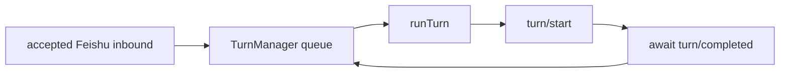
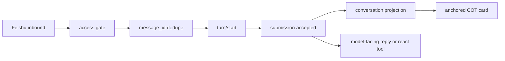

# Non-blocking dispatcher inbound

- **Status:** Implemented runtime contract for issue #63. Its non-blocking
  inbound gate remains binding; its automatic reaction progress surface is
  superseded by
  [Feishu COT conversation display](../decisions/feishu-cot-conversation-display.md).
- **Source:** https://github.com/excitedjs/dreamux/issues/63
- **Affects:** `/packages/agent-runtime/codex/src/turn-manager.ts`,
  `/packages/agent-runtime/codex/src/events.ts`,
  `/packages/channel/feishu-channel/src/feishu-channel.ts`,
  `/packages/channel/feishu-channel/src/feishu-message.ts`,
  `/packages/channel/feishu-channel/src/feishu-cot-adapter.ts`,
  `/packages/dreamux/src/service/dispatcher-service/index.ts`,
  `/packages/dreamux/src/channel/conversation-projection.ts`,
  `/packages/dreamux/tests/fake-codex.ts`,
  `/packages/dreamux/tests/codex-live.test.ts`,
  `/packages/agent-runtime/codex/tests/turn-manager.test.ts`

## Regression Trap (read before touching codex busy/idle or `turn-manager.ts`)

This contract has been regressed once (2026-06-24) and the regression nearly
shipped, so it is called out here at the source:

- **Do NOT "fix" codex busy/idle accuracy by serializing `turn/start` or adding
  any submission mutex** (e.g. a `submissionQueue` / `waitNoActiveTurn()` gate
  that holds the next submit until the active turn completes). That reintroduces
  the head-of-line blocking this issue removed: a long-lived dispatcher turn
  (waiting on `send`/`wait`/`spawn`) would block *all* later Feishu inbound, so a
  user gets no response until the long turn ends. dreamux must keep submitting
  `turn/start` immediately and let Codex fold natively. Fix accuracy in the
  activity **accounting only** (e.g. keep `busy` true while a submission is
  in-flight; do not clear the active slot while `pendingSubmissions > 0`), never
  by changing the submission model.
- **The live gate is the proof, and "tests pass" is circular if the diff also
  edits the gate.** The regression came with the live-gate test
  (`codex-live.test.ts`) rewritten from asserting folding (one `turn/completed`,
  marker folded) to asserting serialization (two `turn/completed`, queued). A
  diff that inverts this test's folding assertions is the smell — review the
  test diff against this contract, do not trust a green run produced by a
  rewritten test.

## Locked Scope

The dispatcher teammate mechanism stays synchronous. There is no trigger-turn,
mailbox wakeup, teammate-completion callback, idle polling redesign, or early
turn completion in this issue. A dispatcher turn may stay open while the model
waits on `send`, `wait`, or `spawn --prompt`.

Issue #63 removes dreamux's application-level head-of-line queue. It does not
eliminate long turns and does not make folded input visible to the model until
the current synchronous operation returns and the ReAct loop advances.

Do not add a dreamux submission mutex. Do not add a production turn observer.
Do not call `turn/steer` for normal Feishu inbound. Do not maintain a local
`activeTurnId` as the delivery routing authority. Do not aggregate messages
until turn completion.

## Codex Contract

Codex `turn/start` is the authoritative aggregate user-input RPC:

- when a regular turn is active, `turn/start` folds the new input into that
  active turn's pending input;
- when the thread is idle, `turn/start` starts a new regular turn;
- dreamux does not need to decide active versus idle itself.

The source path is:

- app-server `turn/start` creates `Op::UserInput` and submits it to the core
  session;
- core `user_input_or_turn_inner` first calls `steer_input` with no
  `expectedTurnId`;
- if `steer_input` succeeds, the input is pending input for the active turn;
- only `NoActiveTurn` falls through to spawning a new regular turn.

This dissolves the v2 stale-state gap. Since dreamux never calls `turn/steer`
for normal inbound and never decides delivery from a locally cached active turn
id, there is no stale-id path that can produce `NoActiveTurn` and drop an
accepted message. The Codex runtime may still keep internal turn ids for
completion collection, interrupts, and teardown bookkeeping; those ids are not
the inbound routing authority.

## Pre-Issue #63 Artifact

Before issue #63, the dispatcher inbound path was a process-local serialized
turn worker:

`TurnManager.drainLoop()` awaits `processBatch()`, and `processBatch()` awaits
`runTurn()`. `runTurn()` submits `turn/start` and resolves only after
`turn/completed`. A long Codex turn therefore blocks later accepted Feishu
messages from reaching Codex.

The channel added one received reaction after the old Codex runtime
`enqueueInbound()` path returned true. Issue #63 first replaced this historical
path with a three-state channel-owned reaction flow. That progress surface is
also historical: COT cards now present automatic conversation progress.

## Runtime Model

Every accepted, deduped inbound message submits exactly one `turn/start`.
dreamux never waits for `turn/completed` before accepting or submitting the next
inbound.

## Code Changes

`/packages/agent-runtime/codex/src/turn-manager.ts`

- Remove same-chat coalescing and the completion-gated `drainLoop()` /
  `processBatch()` queue as the inbound submission gate.
- Keep process-local `message_id` dedupe.
- Replace `enqueue(input): boolean` with an async per-message submission path:
  accepted, deduped input is formatted as one prompt/envelope and submitted via
  `turn/start` immediately.
- Return a delivery result to the runtime/server so the channel can switch the
  reaction to in-progress at the `turn/start` acceptance point.
- Do not use active turn ids as inbound routing state. Do not call `turn/steer`
  for normal inbound.

`/packages/dreamux/src/service/dispatcher-service/index.ts`

- Keep the Dispatcher Service as the neutral runtime/channel bridge.
- Forward each Channel provider delivery request to the selected Agent Runtime
  and return the real `InboundDeliveryResult`, including duplicate, submitted,
  and failed information.
- Do not introduce a dispatcher-level mutex, production observer, or
  active/idle branch.
- Inject the neutral conversation projection into the dispatcher agent. This
  observation path does not delay or alter delivery.

`/packages/agent-runtime/codex/src/events.ts`

- Split the current `runTurn()` shape so production inbound can call a
  `submitTurnStart()`-style helper that sends `turn/start` and resolves on the
  RPC acceptance ack.
- The old `runTurn()` shape (`turn/start` plus await `turn/completed`) must not
  remain on the Feishu inbound path. It can remain only as a test/diagnostic
  helper if still useful.
- Do not add a `turn/steer` helper for normal Feishu inbound.

`/packages/channel/feishu-channel/src/feishu-channel.ts`

- Do not add, replace, or clean up automatic reactions during inbound delivery.
- Subscribe the session COT adapter to the neutral conversation event source.
  Dispatcher events render only when their frozen `channel_origin` belongs to
  this session; foreign and origin-less dispatcher streams are strict no-ops.
- Keep `reply` and the deliberate model-facing `react` tool independent of the
  automatic progress surface.

`/packages/channel/feishu-channel/src/feishu-message.ts`

- Keep the existing discrete `<feishu_message>` envelope and routing metadata
  (`chat_id`, `message_id`, `sender_id`, `sender_name`, `create_time`) so the
  model can reply to the correct source message after interleaving.

## Conversation Display Contract

The automatic received/in-progress reaction tri-state and its add-then-cancel
ordering are superseded. Accepted inbound creates no automatic reaction. The
channel instead consumes display-only turn facts and pins a COT card to the
turn's inbound Feishu message. Settlement wraps that card in place; display
failures are diagnostics and never affect admission, delivery, or settlement.

This presentation change does not weaken issue #63. Delivery still crosses the
runtime `turn/start` boundary before waiting for completion, and another inbound
must be accepted while the current turn is active. The model-facing `react`
tool remains available for deliberate reactions.

## Tests

Fake-Codex tests must cover:

- every accepted, deduped inbound calls `turn/start`;
- while a fake turn is active, a later `turn/start` is accepted and folds into
  that active fake turn rather than producing a second completed turn;
- no mutex/backlog waits for `turn/completed`;
- no automatic reaction is added on inbound, submission, or settlement;
- the model-facing `react` tool still invokes the explicit provider operation;
- no stale-`activeTurnId` / `NoActiveTurn` fallback test remains, because
  dreamux no longer calls `turn/steer`.

The live Codex integration gate must start a real Codex app-server, put the
dispatcher into a turn blocked on a short synchronous operation, inject a
Feishu inbound during that mid-turn window, and prove:

- dreamux submits the second inbound with `turn/start`;
- Codex folds that input into the current active turn rather than rejecting,
  queuing behind completion, or starting a parallel turn;
- the folded marker is processed after the synchronous operation returns and
  the ReAct loop advances;
- no automatic inbound progress reaction is emitted.

This live gate remains the load-bearing proof. COT rendering tests complement it
but do not replace it; static review and fake tests alone are not enough for
issue #63.
