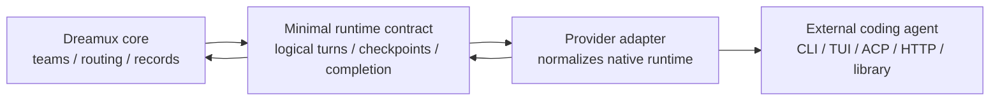

# AgentRuntime lifecycle contracts

- **Status:** Draft for review
- **Date:** 2026-06-30
- **Affects:** `@excitedjs/dreamux-types`, Agent Runtime providers, `TeammateService`, `CompletionRouter`, runtime contract tests
- **Source snapshot:** Verified against `origin/next` commit `50e3bd5268a07fcf0ba99214c81ac1701bfce740`
- **External runtime snapshots:** Kimi Code `main@210cedb3bf22282fb16e0e7dabe2956f80f13976`, MiMo Code `main@1c5217ef342518d6cfcd2d1c1d96d`, OpenCode `dev@8e10ab0aa78fda983040d29ee73c16c66b8c418b`

> Input-surface note: the "Inputs" and completion-delivery method shape below
> are superseded by
> [AgentRuntime input surface cleanup](agent-runtime-input-surface-cleanup.md).
> The lifecycle principles here still stand; non-channel turns now converge on
> plain text `completionInput`, and `systemInput` is no longer the intended
> provider-facing seam.

## Intent

Keep Dreamux core small and stable while making external Agent Runtime providers
safe to plug in.

Dreamux is the subject: it owns dispatchers, teams, teammate records, channel
routing, completion routing, and durable host state. External coding agents are
objects: Kimi Code, MiMo Code, OpenCode, Codex, Claude Code, and future CLIs may
be TUI tools, subprocess protocols, HTTP services, resident daemons, or library
handles. The core contract must therefore express only the lifecycle facts
Dreamux needs, and leave native launch, auth, permission, subagent, and config
details inside the provider adapter.

The goal is not to model every runtime. The goal is to prevent a provider from
making Dreamux guess.

## Current contract pressure

Current source facts:

- `TurnSettledSignal` carries `turnId: string | null`, terminal status, and
  optional error only; it does not carry the terminal turn result
  (`/packages/dreamux-types/src/turn.ts`).
- `TeammateService.deliverSettledTurn()` receives a settled turn id, then reads
  `runtime.getLast()` to populate both the durable settled row and
  `CompletionEnvelope.result`
  (`/packages/dreamux/src/service/teammate-service/index.ts`).
- Both production runtimes keep `lastResult` as runtime-instance state:
  Codex updates it from collected successful turns
  (`/packages/agent-runtime/codex/src/runtime.ts`), while Claude Code updates it
  only for non-error outcomes
  (`/packages/agent-runtime/claude-code/src/runtime.ts`).
- `CompletionRouter` retries only explicit `{ status: "failed" }` delivery
  results; `{ status: "accepted" }`, `{ status: "unsupported" }`, thrown
  delivery, and exhausted failures are terminal
  (`/packages/dreamux/src/service/completion-router/index.ts`).
- `AgentRuntimeStateCallbacks` exposes host-id-based state mutation methods to
  providers (`/packages/dreamux-types/src/agent-runtime.ts`), even though
  teammate state binds the runtime instance by closure and ignores the incoming
  id (`/packages/dreamux/src/service/teammate-collection/runtime-state.ts`).
- Earlier drafts exposed `getThreadId()` and `wasThreadResumed()` as runtime
  projections, while the neutral create identity already talked about
  `checkpoint_id`. The final contract should expose only checkpoint semantics.
- `AgentRuntimeSystemInput.reason` currently mixes restart notices, scheduled
  model turns, and teammate completion
  (`/packages/dreamux-types/src/agent-runtime.ts`).
- Dispatcher launch currently asks the resolved provider for
  `systemPrompt.mode`, then chooses either the full replacement prompt or the
  focused append prompt inside Dreamux core
  (`/packages/dreamux/src/service/dispatcher-service/agent.ts`).
- External provider loading validates provider shape and capability shape, but
  not the runtime object returned by `createRuntime()`
  (`/packages/dreamux/src/agent-runtime/external-provider.ts`).

External runtime examples explain the boundary, but should not expand it:

- Kimi Code has TUI and ACP shapes, sessions, replay/fork/export, media input,
  hooks, plugins, MCP config, and native subagents.
- OpenCode has TUI, ACP, HTTP server, async prompt submission, SSE-style event
  surfaces, primary agents, subagents, and structured permissions.
- MiMo Code has persistent memory, session checkpoints, goal loops, primary
  agents, background subagents, cancellation, and permission config.

Those details are real, but they are provider concerns. Dreamux core only needs
the adapter to report: this logical turn was accepted, this logical turn
settled with this result, this runtime checkpoint is now resumable, and this
completion delivery was accepted or not accepted.

## Boundary Principle

Dreamux core must depend on these minimum facts only:

- **Instance lifecycle:** a runtime instance can start, resume, stop, and report
  a coarse host status.
- **Logical turn lifecycle:** each accepted Dreamux input has a Dreamux logical
  turn id and exactly one terminal settlement.
- **Checkpoint lifecycle:** the provider exposes an opaque checkpoint id that
  core stores and later passes back.
- **Completion delivery lifecycle:** a reverse completion delivery is either
  accepted by the target runtime, unsupported, or failed before acceptance.
- **State projection:** providers emit instance-scoped facts; core projects them
  into dispatcher rows, teammate records, and public API names.

Dreamux core must not model these provider-owned details:

- process topology, PTY/stdin/stdout/ACP/HTTP transport, daemon sharing, or
  server ownership;
- native auth and onboarding flows;
- native agent, subagent, planning, background task, or fork/replay semantics;
- native permission schemas, approval UX, or tool policy details;
- provider-native config file formats and internal state layout.



The provider adapter is the membrane. If OpenCode is a shared HTTP server, the
adapter decides whether `stop()` closes a binding, a remote session, or a child
process. If Kimi forks a native session, the adapter decides how to encode the
new checkpoint id. If MiMo has background subagents, the adapter decides what
belongs in the primary logical turn result. Dreamux core should not learn those
native distinctions unless a future feature truly requires them.

## Required contract shape

### Logical turns

Every accepted input gets a Dreamux logical turn id. The id is allocated by the
provider adapter, not by the native runtime necessarily. It may wrap a native
turn id, message id, HTTP request id, queued job id, or a provider-generated
logical id.

```ts
type InboundDeliveryResult =
  | { status: 'duplicate' }
  | { status: 'stopped' }
  | { status: 'submitted'; turnId: string }
  | { status: 'failed'; error: Error };

interface TurnSettledSignal {
  turnId: string;
  status: 'completed' | 'failed' | 'stopped';
  result?: {
    text: string | null;
    truncated?: boolean;
  };
  error?: Error;
}
```

Rules:

- `turnId` is non-null for every submitted Dreamux logical turn.
- A submitted `turnId` must settle exactly once, even if the provider internally
  folds, steers, queues, or fans out native work.
- If a native runtime cannot produce an id before submission returns, the
  provider allocates a Dreamux logical id and maps native events back to it.
- `result.text` belongs to that logical turn only. It is `null` when the turn
  produced no assistant-visible text or the provider cannot report one.
- Core records and routes `settled.result?.text ?? null`.
- Core must not call `runtime.getLast()` to complete a settled turn. `getLast()`
  remains an operator recovery/read surface only.
- Native subagent output, streaming deltas, approvals, and background tasks are
  provider-owned unless they are summarized into the logical turn result.

### Completion delivery

Completion delivery is deliberately coarse. The router only needs to know
whether the target runtime accepted responsibility for the completion.

```ts
interface CompletionEnvelope {
  source: string;
  id: string;
  status: 'completed' | 'failed' | 'stopped';
  result: string | null;
}

type CompletionDeliveryResult =
  | { status: 'accepted' }
  | { status: 'unsupported'; reason: string }
  | { status: 'failed'; error: Error };
```

Rules:

- `accepted` means the provider has accepted responsibility for delivery. It is
  terminal for Dreamux routing. The provider may have delivered synchronously,
  enqueued native work, written to a native session, or chosen another
  provider-owned mechanism.
- `failed` means the provider did not accept delivery. The router may retry
  within its bounded retry policy.
- `unsupported` is terminal. The user/operator can recover through pull/read
  surfaces such as TeamMate `last`.
- Later native delivery failure after `accepted` is provider-owned
  observability. It must not be smuggled into Dreamux core as a second routing
  lifecycle unless a future replay/delivery-ledger feature is explicitly added.
- `CompletionEnvelope.result` is nullable. Legacy public surfaces that require a
  string may coerce `null` to `""` at the boundary, but that fallback must be
  explicit and tested.

### Checkpoints

Core stores an opaque checkpoint id and supplies it in the next runtime create
context. `resume()` reopens from that create-context checkpoint. The id is a
provider boundary value, not a Dreamux thread/session concept.

```ts
interface AgentRuntimeResumeCheckpoint {
  id: string;
}

interface AgentRuntime {
  getCheckpoint(): AgentRuntimeResumeCheckpoint | null;
  wasCheckpointResumed(): boolean;
}
```

Rules:

- Runtime-native thread ids, session ids, ACP session ids, remote server session
  ids, memory handles, or compound handles must be encoded into `id` by the
  provider.
- Core does not interpret checkpoint id structure.
- `wasCheckpointResumed()` means this live runtime actually continued an
  existing checkpoint, not merely that core supplied one.
- Dispatcher `thread_id` and TeamMate `session_id` may remain persisted/public
  projection names for compatibility. Provider-facing contracts should use
  checkpoint language only.
- If a provider changes native session identity internally, it must emit a new
  checkpoint through the state sink before core needs to resume it later.

### State sink

State callbacks should be instance-scoped. Providers emit facts about the
runtime instance they were created for; core maps those facts to host records.

```ts
interface AgentRuntimeStateSink {
  setStatus(status: AgentRuntimeStatus, extras?: RuntimeStatusExtras): Promise<void>;
  setCheckpoint(checkpoint: AgentRuntimeResumeCheckpoint): Promise<void>;
  recordLostCheckpoint?(
    lost: AgentRuntimeResumeCheckpoint,
    replacement: AgentRuntimeResumeCheckpoint,
    error: string,
  ): Promise<void>;
}
```

Rules:

- Providers must not receive a host id to write back.
- Core binds the sink to the dispatcher, teammate, team leader, or future host
  record before calling `createRuntime()`.
- Host-specific field names such as `thread_id` and `session_id` stay inside
  host adapters.

### Inputs

Superseded by
[AgentRuntime input surface cleanup](agent-runtime-input-surface-cleanup.md).
Keep this section as historical context for the earlier draft.

Core should expose only the runtime inboxes Dreamux actually needs: channel/user
turns, Dreamux-owned system messages, and optional completion delivery. It does
not need to model provider-native tool policy, permissions, approvals, or
subagent protocols.

```ts
interface AgentRuntimeSystemInput {
  text: string;
  reason: "restart-notice" | "scheduled" | (string & {});
}

interface AgentRuntime {
  channelInput(input: InboundTurnInput): Promise<AgentRuntimeTurnResult>;
  systemInput(input: AgentRuntimeSystemInput): Promise<AgentRuntimeTurnResult>;
  completionInput?(completion: CompletionEnvelope): Promise<CompletionDeliveryResult>;
}
```

Rules:

- `channelInput` is the user/channel-turn inbox. Channel messages and explicit
  Dreamux sends enter here, and the runtime owns rendering the neutral channel
  shape into its native input format.
- `systemInput` is the Dreamux system-message inbox. Restart notices and
  scheduled prompts enter here, and the runtime decides whether
  to submit a plain turn, use a native system-message path, skip, or fail.
- Completion delivery stays a separate surface because retry/terminal semantics
  are different from both channel/user turns and system messages.
- Teammate completion must use `completionInput`; it is not a `systemInput`
  reason.
- `submitTurn` and `injectControlNotice` are not provider-facing AgentRuntime
  methods. They may exist as lower-level runtime implementation details, but
  core and external providers should not depend on them.
- Provider-native approval or question flows are not part of this contract. A
  provider that cannot run non-interactively should expose that through
  diagnostic/onboard/config, not block an in-flight Dreamux turn waiting for an
  out-of-band answer.

### Prompt injection

Dreamux owns role intent; providers own native prompt mechanics. Core should
offer both canonical prompt forms and let the runtime adapter decide how to use
them.

```ts
interface AgentRuntimeSystemPrompt {
  /** Full role instructions for runtimes that replace their base prompt. */
  replace?: string;
  /** Focused role delta for runtimes that append to an existing native prompt. */
  append?: string;
}

interface AgentRuntimeCreateContext<TConfig = unknown> {
  systemPrompt?: AgentRuntimeSystemPrompt;
}
```

Rules:

- Dreamux core builds the role prompt bundle from role-owned content. It does
  not branch on provider ref or provider capability to choose one string.
- Provider adapters decide whether to pass `replace`, `append`, a combination,
  nothing, or fail loudly when prompt injection is required but impossible.
- Built-in Codex maps `replace` to Codex `baseInstructions`; built-in Claude
  Code maps `append` to `--append-system-prompt`; future runtimes choose their
  own mapping without Dreamux core changes.
- `systemPrompt.mode` should no longer be a core-routing capability. If kept for
  diagnostics/docs, it is provider-authored metadata only.

### Capabilities

Capabilities should be the minimum set core uses to change behavior. They should
not enumerate native transports or policy schemas.

Minimum behavior capabilities:

- `resume`: whether the runtime can reopen the checkpoint id supplied in its
  create context. The checkpoint id itself is runtime-owned state, not a
  capability, and the checkpoint kind is not a shared fact.

Do not add capability fields for facts core does not branch on. The current
contract intentionally omits:

- `steer`: mid-turn absorption is runtime behavior behind `channelInput`, not a
  core routing decision today.
- `events`: pushed versus synthesized settlement is an adapter implementation
  detail once both paths emit the same neutral settlement signal.
- `last` and `context`: callers probe `getLast()` / `getContext()` and treat
  `null` as unavailable; no capability flag is needed.
- `teammateCompletion`: completion delivery is feature-detected by presence of
  `completionInput`, and the router handles `unsupported` as terminal.

Provider-owned capabilities, such as supported native launch modes,
permissions, auth requirements, subagents, media support, and project config
behavior, belong in provider config, provider diagnostics, or provider docs.
Core should not use them for generic routing unless a future core feature needs
one of those facts.

### Provider-owned paths and config

Core supplies neutral path roots. Providers own their layout under those roots.

Rules:

- Provider-generated native config, MCP adapter config, session state, memory
  databases, and cache files should live under host-owned runtime paths, not in
  the project `cwd`.
- Providers must not write native project config such as `.opencode/`,
  `.mimocode/`, or Kimi config under `cwd` unless the user/provider config
  explicitly requests that behavior.
- Core must not name provider-internal files or directories.

### Runtime validation

External provider loading should validate the runtime handle returned by
`createRuntime()` before `start()`, `resume()`, or the first live turn:

- required methods exist and are functions;
- optional methods, when present, have function shape;
- provider capabilities have the minimal supported shape;
- optional `completionInput`, when present, has function shape;
- unsupported optional surfaces fail loudly or are omitted, rather than hiding
  throwing/no-op stubs behind a capability.

## Compatibility posture

The public `AgentRuntime` contract should not carry compatibility projections
for tests or older internal names. Provider authors implement the required
contract directly:

- checkpoint state is reported through `getCheckpoint()` and
  `wasCheckpointResumed()`, not `getThreadId()` or `wasThreadResumed()`;
- channel/user delivery is `channelInput()`, not a public `submitTurn()`;
- Dreamux system messages are `systemInput()`, not a public
  `injectControlNotice()`;
- completion delivery is `completionInput()` when the runtime supports it; there
  is no separate teammate-completion capability array.

Built-in runtime classes may keep provider-specific lower-level helpers only as
implementation details or concrete-class test probes. Those helpers must not be
validated by the external-provider loader or named in the public
`@excitedjs/dreamux-types` interface.

Persisted field names do not need to change in this slice. The important
boundary is provider-facing language and core behavior: core should not treat
thread/session names and checkpoint names as independent authoritative facts.

## Acceptance criteria

- A failed or stopped send-initiated turn never routes a previous successful
  turn's assistant text.
- Every submitted Dreamux logical turn has a non-null turn id and exactly one
  terminal settlement.
- A settled turn records and routes only its own settlement result.
- `CompletionRouter` retries only explicit pre-acceptance `failed` delivery
  results; `accepted`, `unsupported`, thrown delivery, and exhausted retry are
  terminal.
- `CompletionEnvelope.result` can represent "no reported result" without
  smuggling an empty string as a semantic value.
- Runtime state callbacks no longer accept host ids.
- Checkpoint terminology is provider-facing; thread/session names are only host
  compatibility projections.
- AgentRuntime capabilities contain only behavior facts core actually consumes:
  today, resume support.
- Dreamux supplies both replacement and append role prompts to providers; core
  does not choose one by provider ref or provider capability.
- External runtime loading rejects malformed runtime handles before live use.
- Provider-native launch, auth, permission, subagent, and transport details do
  not appear in the neutral core contract.
- Architecture boundary tests still enforce that runtime packages depend only on
  `@excitedjs/dreamux-types` for provider contracts.

## Out of scope

- Changing Feishu channel routing, channel binding, or channel provider
  contracts.
- Changing the public TeamMate MCP verb names.
- Designing generic approval/question UX for native tool permissions.
- Modeling native subagent/background task lifecycles in Dreamux core.
- Modeling ACP, HTTP, PTY, TUI, daemon ownership, or auth flows in the neutral
  runtime contract.
- Renaming persisted `thread_id` or `session_id` fields.
- Adding turn-level user cancellation as a new product feature.

## Reviewer focus

- Whether the minimal logical-turn contract is enough to remove `getLast()` from
  the completion path without leaking native runtime details into core.
- Whether completion delivery should stay terminal-at-accepted, or whether a
  future durable delivery ledger is needed before any async failure reporting is
  modeled.
- Whether opaque checkpoint ids are enough for Kimi/MiMo/OpenCode-style
  sessions when provider-owned state lives under runtime paths.
- Whether any remaining capability is provider-native rather than core-needed.
- Whether the compatibility adapters leave any ambiguous source of truth in core
  call sites.
