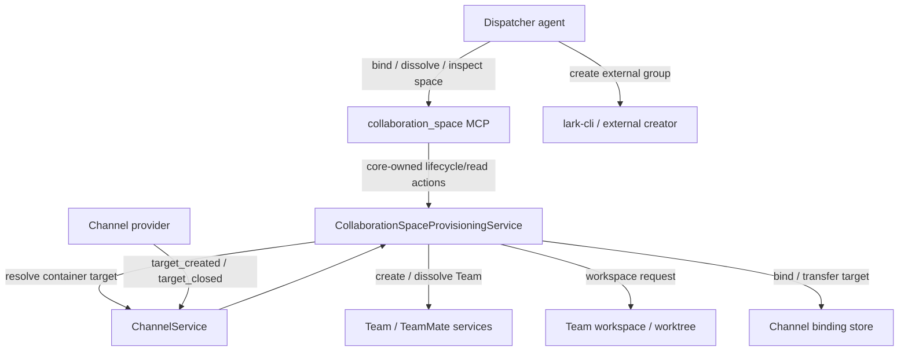

# Collaboration space provisioning

- **Status:** Implementation draft in PR #287
- **Source baseline:** `origin/next` at `6417434`
- **Affects:** core MCP surfaces, collaboration-space lifecycle state,
  `@excitedjs/dreamux-types` Channel lifecycle contracts, core Channel/Team
  orchestration, channel binding state, Team worktree provisioning, Feishu
  topic-group integration
- **Provider precondition:** Feishu may implement the lifecycle portion only
  after its provider can reliably observe topic-created and topic-closed
  semantics. Without that, Feishu may still use externally created topic groups
  as collaboration spaces and normalize topic targets, but must not claim
  automatic target lifecycle support.

## Intent

Dreamux needs a provider-neutral way to model collaborative spaces that contain
independently routable work items. A product may want one worktree policy bound
to one collaboration space, then one automatically managed Team per target
created inside that space.

The motivating Feishu shape is:

- one worktree policy maps to one Feishu topic group;
- each Feishu topic maps to one Dreamux Team;
- creating a topic automatically creates a Team workspace, creates a Team, and
  binds the topic target to that Team;
- closing the topic automatically dissolves the Team and lets
  `TeamService.dissolve` apply the configured worktree cleanup policy.

The architecture must not make Dreamux core understand Feishu topic groups,
topic ids, `chat_id`, `thread_id`, or Feishu lifecycle semantics. Feishu is the
first provider that can implement this shape, not the shape baked into core.

## Current Source Facts

- Channel providers normalize provider endpoints into opaque `ChannelTarget`
  values; core routes by `target_key` and treats `meta` as provider-owned:
  `/packages/dreamux-types/src/channel.ts`.
- Dreamux core owns Team routing, binding, and authorization. Channel providers
  are Team-agnostic and own only platform I/O, target resolution, message
  ownership facts, and provider-specific tools:
  `/.agents/reference/channel-runtime.md`.
- `ChannelService` is the dispatcher-local core service that owns live channel
  sessions and binding operations:
  `/packages/dreamux/src/service/channel-service/index.ts`.
- Channel binding rows are keyed by `(channel_id, target_key)` and store the
  provider ref for audit/read surfaces:
  `/packages/dreamux/src/service/channel-binding/store.ts`.
- Team lifecycle and worktree cleanup already live in core:
  `/packages/dreamux/src/service/dispatcher-service/index.ts`,
  `/packages/dreamux/src/service/team-collection/types.ts`, and
  `/packages/dreamux/src/service/team-service/index.ts`.
- `team.create`, `team.bind_channel`, and `team.dissolve` exist today, but they
  are model/admin driven. There is no deterministic service that reacts to
  channel target lifecycle events and provisions Teams without invoking the
  dispatcher agent.
- Feishu currently routes only inbound messages, bot-added events, and card
  actions through the channel event seam. The current source does not expose a
  topic-created or topic-closed lifecycle event:
  `/packages/channel/feishu-channel/src/bot.ts`.

## Terminology

**Collaboration space** is a core-owned concept for a provider-owned
collaboration container bound to a worktree policy. In Feishu this is a topic
group. In a future provider it may be a project, repository discussion space, or
another container shape.

**Channel container** is the provider contract object that represents the
provider-owned side of a collaboration space. It carries opaque provider keys
and display metadata.

**Channel target** is an existing Dreamux `ChannelTarget`: the smallest inbound
unit core can bind to a Team. In Feishu topic-group mode this is one topic.

**Provisioning policy** is core-owned state that binds one collaboration space
to one worktree policy and decides what happens when targets appear or close.

**Provisioned target** is the durable core mapping from one channel target to
the Team that was automatically created for it.

## Target Architecture



Core owns the deterministic orchestration. The dispatcher agent creates or finds
the external Feishu topic group with `lark-cli`, then binds that existing
external space to a worktree policy through a core-owned MCP namespace. The
dispatcher agent is not in the hot path for target lifecycle:

- external group creation is an intentful dispatcher-agent action outside
  Dreamux core;
- collaboration-space binding/unbinding is a core MCP action;
- target creation and target closure are provider lifecycle events;
- provisioning reacts to those lifecycle events without submitting a turn to the
  dispatcher agent runtime.

Bypassing the dispatcher agent runtime does not mean bypassing the dispatcher
control plane. Provisioning still goes through `DispatcherService` and core
stores. Creating a Team still starts a TeamLeader runtime.

The collaboration-space implementation is a dispatcher-local control-plane
service. It has no agent runtime and does not wrap a `TeammateService`. It
should reuse the dispatcher's single Team ownership path rather than allocate an
independent `TeamCollection` per space; Team live caching, Team creation
dedupe, TeamLeader scheduler ownership, and Team worktree cleanup remain in the
dispatcher-level Team collection and each `TeamService`.

## Model-Facing Surface

Add a core-owned dispatcher-only MCP namespace named `collaboration_space`.
This namespace is not a Channel provider MCP surface and does not create Feishu
groups by calling the Feishu Channel provider.

The namespace should mirror Team-style lifecycle/read surfaces:

- `bind`: register an existing external collaboration space if needed, then bind
  it to a worktree policy;
- `dissolve`: remove the current provisioning binding and release
  provisioned target routing so future deliveries use the dispatcher default
  path;
- `status`: inspect one collaboration space and its target provisioning summary;
- `list`: list known collaboration spaces and their current binding state.

The first required write shape is `collaboration_space.bind`:

```ts
interface CollaborationSpaceBindInput {
  channel_id?: string;
  space_name: string;
  container?: {
    container_type: string;
    container_key: string;
    display?: string;
    canonical_url?: string;
    meta?: Record<string, unknown>;
  };
  display?: string;
  repo?: {
    cwd: string;
    base_ref?: string;
  };
  leader_agent_runtime: string;
  identity?: string;
}
```

`bind` behavior:

- validate the caller is the dispatcher;
- validate `space_name` with the same visible-name safety constraints used by
  Team identifiers;
- resolve `channel_id`, defaulting only when the dispatcher has one live channel;
- derive the provider ref from the resolved `channel_id`;
- create the collaboration-space record if it does not exist, using the supplied
  `container`; existing spaces may omit `container` and bind by `space_name`;
- reject if an existing `space_name` is supplied with a `container` that differs
  from the stored `(channel_id, container_type, container_key)`;
- reject if a different collaboration space already uses the same
  `(channel_id, container_key)`;
- reject rebinding while the collaboration space is currently `bound`; callers
  must `dissolve` first to release routing before binding the same external
  space to a worktree policy again;
- validate `leader_agent_runtime` as a configured `agents[]` id, matching the
  existing Team/TeamMate runtime selection contract;
- validate optional `identity` with the same Team identity constraints used by
  `team.create`;
- generate a new binding generation by incrementing the space record's
  `last_binding_generation`;
- persist the collaboration-space binding with the selected worktree policy,
  default TeamLeader runtime, and optional default TeamLeader identity;
- transition the collaboration space status to `bound`;
- return the neutral collaboration-space record;
- do not create a Team during collaboration-space binding.

`repo` is optional. When supplied, `repo.cwd` is an explicit repository source
path for managed worktrees. It may equal the dispatcher workspace when that is
what the caller selected, but it is not inferred from provider metadata and is
not passed to Channel providers. When omitted, provisioned Teams follow the
same default-workspace policy as `team.create` without an explicit repo:
`workspace.enabled: true` uses `<dispatcher cwd>/.workspace/work/<team>/`, and
`workspace.enabled: false` uses `<dispatcher cwd>/<team>/`.

The first implementation does not support `reuse-cwd` collaboration spaces.
Targets under an explicit repo get managed worktrees with `cleanup:
'delete-on-close'`; targets without repo use the default Team workspace policy.

`identity`, when present on `bind`, becomes the default identity for every
TeamLeader automatically created from future targets in that bound collaboration
space. Rebinding the same external space may replace the default identity for
new targets created under the new binding generation; it does not rewrite
already-created Teams.

`collaboration_space.dissolve` requires `space_name` and `note`. It removes the
current Dreamux collaboration-space binding generation, stops new automatic
provisioning, releases active provisioned target bindings, marks active target
records `detached`, aborts or detaches in-flight `creating` records under the
current binding generation through the same target lock, and leaves the external
container known but unbound. It does not delete or archive the external provider
container, and it does not dissolve the provisioned Teams. Detached Teams and
their workspaces remain operator-visible Teams; reclaiming them is an explicit
`team.dissolve` action. After dissolve, messages from the external topic group
follow the normal dispatcher fallback path unless the space is bound again.

`collaboration_space.status` and `list` are read-only inspection surfaces. They
should return public collaboration-space views and compact target provisioning
summaries, not raw local repo paths, worktree paths, or provider secret/config
data. A collaboration space has no special recovery flow; it is either bound or
unbound, and an unbound space may be bound again to the same or a different
worktree policy. A separate `history` tool is out of scope for the first
implementation.

## Channel Lifecycle Contract

Extend the public Channel provider contract with optional container membership
and target lifecycle capability. A provider that does not implement the
capability keeps the current behavior.

The provider-facing contract should stay neutral:

```ts
interface ChannelContainer {
  container_type: string;
  container_key: string;
  display?: string;
  canonical_url?: string;
  meta?: Record<string, unknown>;
}

type ChannelTargetLifecycleKind =
  | 'target_created'
  | 'target_closed';

interface ChannelTargetLifecycleEvent {
  kind: ChannelTargetLifecycleKind;
  event_id?: string;
  container: ChannelContainer;
  target: ChannelTarget;
  title?: string;
  timestamp?: number;
  meta?: Record<string, unknown>;
}

interface ChannelInboundEnvelope {
  // existing fields stay unchanged
  container?: ChannelContainer;
}
```

`ChannelRoutes` should be extended with a lifecycle intake callback such as:

- `targetLifecycle(event): Promise<void>`

**Implementation note (post-#282):** The existing `deliver(input, envelope):
Promise<InboundDeliveryResult>` route carries the inbound turn plus the
routing envelope (including optional `container`). The channel provider owns
any platform ACK or reaction lifecycle around this call; core returns the
neutral `InboundDeliveryResult` and never directly acknowledges the platform.
`targetLifecycle` is a separate optional callback for target-created and
target-closed events. The implementation does **not** use any legacy
`InboundDeliveryHooks` / `onAccepted` interface — those were removed in the
#282 dispatcher entity refactor.

Provider obligations:

- `container_key` and `target_key` are provider-owned opaque strings.
- `meta` may carry provider facts, but core must not branch on provider-specific
  fields.
- an inbound message for a target inside a collaboration space must include the
  neutral `container` field; core must not infer container membership from
  provider-specific `target.meta`.
- lifecycle events must be stable enough for core to identify provider target
  membership by `(dispatcher_id, channel_id, container_key, target_key)`; core
  scopes durable provisioning records with the current binding generation.
- the provider must expose the lifecycle capability only when it can reliably
  observe the target-created and target-closed semantics it claims.

This is a public `@excitedjs/dreamux-types` contract change. It requires Rush
change coverage and compatibility documentation.

## Channel Default Binding Policy

Core may enable a dispatcher-channel default binding policy:

```ts
interface DispatcherChannelCollaborationSpaceConfig {
  defaultBinding: {
    enabled: boolean;
    repo?: {
      cwd: string;
      baseRef?: string;
    };
    identity?: string;
  };
}
```

This policy is Dreamux core config, not provider config. When enabled and a
neutral `container` arrives for an unknown collaboration space, core may create
a derived safe `space_name`, bind the space with the dispatcher's default
Agent Runtime, and apply the configured optional `repo` and `identity`.
Providers still only report container/target membership; they do not receive
repo paths or Team policy.

The policy is not a resurrection mechanism. If a space is already known but
currently `unbound` because `collaboration_space.dissolve` was called, inbound
and lifecycle traffic should follow the normal unbound behavior until an
explicit `collaboration_space.bind` reattaches that space.

## Durable Records

Add core-owned provisioning state under a path owned by
`/packages/dreamux/src/platform/paths.ts` and documented in
`.agents/reference/state-and-paths.md`.

The collaboration-space record is keyed by `(dispatcher_id, space_name)`. It
also maintains a lookup by `(dispatcher_id, channel_id, container_key)` so
lifecycle events can find the space without parsing provider metadata:

```ts
interface CollaborationSpaceRecord {
  version: 1;
  dispatcher_id: string;
  space_name: string;
  channel_id: string;
  provider: string;
  container_type: string;
  container_key: string;
  display: string | null;
  canonical_url: string | null;
  current_binding: null | CollaborationSpaceBinding;
  last_binding_generation: number;
  status: 'bound' | 'unbound';
  created_at: number;
  updated_at: number;
  unbound_at: number | null;
  unbound_note: string | null;
}

interface CollaborationSpaceBinding {
  generation: number;
  repo_cwd: string | null;
  worktree:
    | { mode: 'default' }
    | {
        mode: 'managed';
        base_ref: string | null;
        cleanup: 'delete-on-close';
      };
  leader_agent_runtime: string;
  identity: string | null;
  bound_at: number;
}
```

The target record is keyed by
`(dispatcher_id, channel_id, container_key, binding_generation, target_key)`.
The binding generation is required because the same external collaboration
space can be unbound, rebound to a different worktree policy, and then receive a
new target with the same provider `target_key`:

```ts
type ProvisionedTargetStatus =
  | 'creating'
  | 'active'
  | 'detached'
  | 'closing'
  | 'closed'
  | 'failed';

type ProvisionedTargetPhase =
  | 'claimed'
  | 'team_created'
  | 'bound'
  | 'closed';

interface ProvisionedTargetRecord {
  version: 1;
  dispatcher_id: string;
  space_name: string;
  channel_id: string;
  provider: string;
  container_key: string;
  binding_generation: number;
  target_key: string;
  target_type: string;
  target_display: string | null;
  team_name: string;
  leader_name: string | null;
  worktree_slug: string;
  lifecycle_status: ProvisionedTargetStatus;
  phase: ProvisionedTargetPhase;
  claim_event_id: string | null;
  close_event_id: string | null;
  last_error: string | null;
  created_at: number;
  updated_at: number;
  closed_at: number | null;
  detached_at: number | null;
}
```

The authoritative idempotency key is the generation-scoped target record key,
not `event_id`. `event_id` is retained for audit and event replay diagnostics.

## Stable Naming

Provisioning must never expose raw provider ids in Team names, worktree slugs,
or branch names.

For each target, derive:

- `target_hash = sha256(dispatcher_id + "\\0" + channel_id + "\\0" +
  container_key + "\\0" + binding_generation + "\\0" +
  target_key).slice(0, 12)`
- `title_slug`: a sanitized ASCII slug from lifecycle title or target display,
  using only letters, digits, dots, underscores, and dashes, capped at 32
  characters; if absent after sanitization, use `target`.
- `team_name = "space-" + title_slug + "-" + target_hash`
- `worktree_slug = team_name`
- managed worktree branch = `team_name` when the binding uses an explicit repo

The generated names must pass `TEAM_ID_PATTERN`,
`assertNotReservedAgentName`, and the worktree slug validator. If a collision is
detected with a different target record, provisioning must fail loud instead of
falling back to raw provider ids.

`space_name` and generated `team_name` live in different stores, but generated
Team names must still be checked against existing Teams before creation. If a
manual Team already owns the generated name, provisioning fails loud instead of
choosing a new provider-derived name.

Team intent is:

- `Collaboration target: <title>` when a non-empty lifecycle title or target
  display exists;
- otherwise `Collaboration target <target_hash>`.

## Target Created Behavior

When a provider emits `target_created` for a container with a bound
collaboration-space record, core deterministically provisions a Team under the
space's current binding generation.

Required behavior:

- reject lifecycle targets whose `target.bindable` is false;
- fail loud if the collaboration space is currently unbound;
- acquire an in-process lock keyed by `(dispatcher_id, channel_id,
  container_key, binding_generation, target_key)`;
- check the target provisioning record:
  - `creating` resumes the recorded phase;
  - `active` returns the existing Team;
  - `closed` is not reopened in the first implementation and fails loud with an
    audit log;
  - `failed` retries from the recorded phase when the existing durable record is
    safe to resume;
- before creating a Team, check for an existing active channel binding for
  `(channel_id, target_key)`;
- if an active binding already points to a different Team, fail loud and do not
  overwrite it;
- write a durable `creating` claim record before worktree, Team, or binding
  side effects;
- create or resume the Team workspace and Team using the recorded `team_name`,
  `worktree_slug`, intent, bound worktree policy, bound
  `leader_agent_runtime`, and bound default identity;
- if a retry finds an existing non-closed Team with the recorded `team_name`
  before `phase` reached `team_created`, reconcile to that Team instead of
  calling create again;
- update phase to `team_created` after the Team exists;
- bind the channel target to the Team only if no conflicting active binding
  exists;
- update phase to `bound` and status to `active` after binding succeeds.

The dispatcher agent runtime is not invoked for this path. The service uses the
same core operations that the Team MCP/admin path uses today, so worktree
ownership, Team state, and binding semantics remain centralized.

If provisioning fails after the claim is written, the target record remains
`failed` with `phase` and `last_error`. A retry must resume from the recorded
phase and must not create duplicate Teams for the same target.

## Target Closed Behavior

When a provider emits `target_closed` for a provisioned target:

- acquire the same target lock;
- find the target provisioning record;
- if already `closed`, return idempotently;
- if `detached`, ignore the event because the collaboration space no longer owns
  that target's Team lifecycle;
- if `creating`, mark the record `closing` and finish or unwind through the
  recorded phase;
- for target lifecycle closure, transfer or deactivate the channel binding only
  when it still belongs to the
  provisioned Team;
- dissolve the Team with a lifecycle note that records the channel target was
  closed;
- let `TeamService.dissolve` remain the single authoritative cleanup site for
  the shared worktree;
- mark the target provisioning record `closed`.

A missing target provisioning record should be logged and ignored, not routed to
the dispatcher agent.

Closed-target reopen under the same `target_key` is out of scope for the first
implementation. A later proposal must define whether this creates a new Team,
revives the old Team, or fails loud.

## Lifecycle Intake And ACK Semantics

This section applies to `targetLifecycle` events only. For the `deliver()`
route, the ACK model is simpler: the provider calls `deliver(input, envelope)`,
core returns the neutral `InboundDeliveryResult` synchronously, and the
provider owns any platform ACK or reaction lifecycle around that call. Core
never directly acknowledges the platform for `deliver()`.

Provider lifecycle callbacks must durably accept before acknowledging platform
delivery.

Core lifecycle intake should:

- validate the event belongs to a known collaboration space, or to an unknown
  container on a channel whose default binding policy is enabled;
- accept creation/provisioning events only for the current bound generation;
- ignore or audit detached/unbound close events without treating them as
  provisioning failures;
- write or update the durable target claim/event audit;
- return to the provider after the durable accept point;
- process heavy worktree, Team, and binding side effects asynchronously.

The provider should not hold a platform ACK open while git worktree creation or
TeamLeader runtime startup runs. If the provider platform requires synchronous
event handling, the implementation must add an explicit timeout and retry story
before enabling the capability.

## Inbound Routing Behavior

Inbound messages from a provisioned target should route through the existing
binding path:

- provider normalizes the message to `ChannelTarget` and, when the target belongs
  to a collaboration space, supplies `ChannelInboundEnvelope.container`;
- `DispatcherService.routeChannelInput` checks the active binding by
  `(channel_id, target_key)`;
- the TeamLeader receives the turn.

For bound collaboration spaces, an unbound bindable target must never fall back
to the dispatcher agent runtime. The first implementation chooses deterministic
provision-before-delivery:

- if a target provisioning record is `creating`, inbound waits for or resumes the
  in-flight provisioning operation;
- if a target provisioning record is `detached`, inbound follows the current
  non-collaboration-space routing behavior because `dissolve` released Dreamux
  ownership for that binding generation;
- if no target provisioning record exists and the inbound envelope carries a
  `container` matching a bound collaboration space, or an unknown container on a
  channel whose default binding policy is enabled, inbound creates the durable
  claim for the current binding generation and provisions before delivery;
- if the container is already known but currently unbound, inbound follows the
  current non-collaboration-space routing behavior until explicit `bind`
  reattaches that space;
- if no target provisioning record exists and the inbound envelope does not carry
  a neutral `container`, core must not parse provider metadata to infer one; it
  follows the current non-collaboration-space routing behavior;
- if provisioning fails, inbound returns a failed delivery result rather than
  routing to the dispatcher agent.

This preserves the product rule that targets inside a configured collaboration
space belong to Teams, not to the dispatcher agent context.

This change touches the load-bearing `DispatcherService.routeChannelInput`
inbound path. Implementation must preserve the existing non-blocking inbound
contract and route tests; tests should cover bound-space provisioning without
weakening existing channel-inbound behavior.

## Feishu Provider Shape

The Feishu provider should implement the neutral capability only if Feishu's API
surface can support the claimed behavior:

- Feishu topic-group creation is performed by the dispatcher agent through
  `lark-cli`, outside the Feishu Channel provider;
- `collaboration_space.bind` registers the already-created topic group as a
  Dreamux collaboration space when it is not known yet;
- core channel config may enable default collaboration-space binding so Feishu
  topic groups can enter collaboration-space mode without an explicit MCP bind;
- `ChannelContainer.container_key` is the Feishu chat identifier, but core treats
  it as opaque;
- each topic is normalized as a `ChannelTarget` whose `target_key` includes the
  stable topic identifier, but core does not parse it;
- topic close/archive maps to `target_closed` only if the provider can reliably
  observe that lifecycle event.

Feishu-specific allow lists, deny lists, chat modes, and API fallbacks belong in
`@excitedjs/feishu-channel` config and tests. Core provisioning policy must not
grow Feishu-specific knobs.

## Hard Constraints

- Core must not parse or branch on Feishu field names such as `chat_id`,
  `thread_id`, `root_id`, or chat mode.
- Channel providers must not create Teams, allocate worktrees, mutate Team
  binding state, or call Dreamux host internals.
- Collaboration-space binding is model-facing through core-owned
  `collaboration_space` MCP, not provider-owned Channel MCP.
- Feishu topic-group creation is a dispatcher-agent `lark-cli` action, not a
  Feishu Channel provider action.
- Channel providers must not receive repository paths or Team policy.
- Channel default collaboration-space binding is core config, not provider
  config.
- Core must use neutral `ChannelInboundEnvelope.container` or lifecycle events to
  identify collaboration-space membership; it must not infer membership by
  parsing provider-specific `target.meta`.
- Automatic target provisioning must bypass the dispatcher agent runtime, but
  must still go through `DispatcherService` and core stores.
- Targets under a currently bound collaboration-space generation must not fall
  back to the dispatcher agent when unbound.
- Automatic provisioning must not overwrite an active binding owned by a
  different Team.
- Team channel binding stays keyed by `(channel_id, target_key)`.
- Team and worktree names must be stable, collision-safe, and free of raw
  provider ids.
- Team worktree cleanup remains owned by `TeamService.dissolve`.
- All new durable state needs explicit path ownership in
  `/packages/dreamux/src/platform/paths.ts` and `.agents/reference/state-and-paths.md`.
- Provider packages continue to compile against `@excitedjs/dreamux-types` only.

## Explicitly Out Of Scope

- A Feishu-only core path or core logic that names Feishu topic groups.
- Per-topic fallback dispatcher runtimes as the primary implementation.
- A generic issue/subscription channel model that bypasses Team binding.
- Model-driven Team creation for every target-created event.
- Migrating existing Feishu groups or existing topic history into provisioned
  Teams.
- User/permission synchronization between the provider container and repository
  access control.
- `reuse-cwd` provisioning for collaboration-space targets.
- `collaboration_space.history`.
- Dissolving Teams as part of `collaboration_space.dissolve`; Team dissolution
  remains tied to target close or explicit Team lifecycle operations.
- Reopening a closed target under the same `target_key`.
- Multiple repositories per collaboration space or multiple collaboration
  spaces for one target.
- Automatic resurrection of a known unbound collaboration space after
  `collaboration_space.dissolve`.

## Acceptance Criteria

- A provider that does not implement collaboration-space behavior keeps current
  Channel behavior unchanged.
- The dispatcher sees a core-owned `collaboration_space` MCP namespace, and
  does not get a provider Channel MCP tool for collaboration-space creation.
- `collaboration_space.bind` registers an already-created external container
  when needed, persists a worktree provisioning policy, and does not call
  provider Channel MCP.
- `collaboration_space.bind` accepts omitted `repo`; provisioned Teams then use
  the same global workspace policy as Team creation without an explicit repo.
- `collaboration_space.bind` accepts optional `identity` and applies it as the
  default identity for future automatically created TeamLeaders in that bound
  collaboration space.
- `workspace.enabled: false` places default no-repo TeamMate/Team work
  directories directly under the dispatcher cwd; the default `true` keeps the
  current `.workspace/work/` layout.
- Channel default binding config can auto-register and bind an unknown neutral
  container without an explicit `collaboration_space.bind` call, while a known
  unbound space is not auto-rebound.
- `collaboration_space.dissolve` releases collaboration-space and target routing
  bindings without deleting the external container or dissolving provisioned
  Teams; later deliveries use the dispatcher fallback path unless rebound.
- Rebinding a previously dissolved collaboration space increments the binding
  generation, may point at a different worktree policy, and may choose a different
  default identity without mutating already-created Teams.
- A target-created lifecycle event for a bound collaboration space creates
  exactly one Team workspace, exactly one Team, and exactly one active channel
  binding for the target.
- Concurrent `target_created` handling for the same target still creates exactly
  one Team.
- Concurrent durable accepts for different targets preserve all target records.
- A repeated target-created event for the same active provisioned target is
  idempotent.
- Partial failure after a durable claim can be retried without creating a
  duplicate Team, worktree, or active binding.
- A target whose record is `closed` is not silently reopened.
- A conflicting existing active binding prevents automatic provisioning from
  overwriting the target owner.
- Team names and worktree slugs never contain raw provider ids and pass the
  existing Team/worktree validators.
- A target-closed lifecycle event dissolves the provisioned Team and does not
  route the closure to the dispatcher agent runtime.
- Inbound messages for provisioned targets route to TeamLeader through the
  existing Team binding path.
- Inbound messages for unbound targets inside a bound collaboration space do
  deterministic provisioning-before-delivery and never route to the dispatcher
  agent fallback.
- Core tests cover first-inbound provisioning from
  `ChannelInboundEnvelope.container` and prove provider-specific `target.meta`
  is not parsed for collaboration-space membership.
- Core tests prove that no Feishu-specific field is required to provision a
  target.
- Feishu tests, if Feishu implements the capability, prove that topic-group
  container keys and topic target keys are normalized in the provider package.
- KB updates describe the new provider-neutral lifecycle, MCP namespace, and
  state paths.
- Rush change files cover any public type contract, config, state path, or
  bundled tool surface change.

## Open Questions For Review

- Should Feishu initially expose only externally created collaboration-space
  registration and topic target resolution if reliable topic-created/topic-closed
  events are not available?
