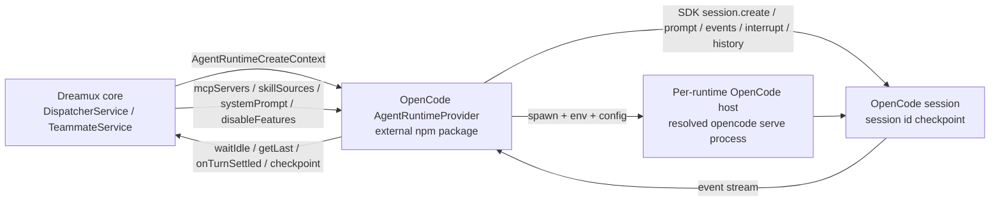

# Proposal: OpenCode Agent Runtime provider

- **Status:** Active proposal (draft for review)
- **Date:** 2026-06-30
- **Affects:** Agent Runtime provider seam, external runtime package loading,
  runtime lifecycle, MCP injection, bundled skill injection, provider-owned
  config parsing, runtime diagnostics
- **PR / Issue:** TBD
- **External source snapshot:**
  [`anomalyco/opencode@3ca89ac`](https://github.com/anomalyco/opencode/tree/3ca89ac79678427f3d9c6ca850e07e915c288e4d)

## Context

Dreamux already has one neutral Agent Runtime seam. The shared contract lives in
`/packages/dreamux-types/src/agent-runtime.ts`; built-in runtime packages
(`@excitedjs/agent-runtime-codex` and
`@excitedjs/agent-runtime-claude-code`) implement it behind provider-owned
adapters. Dreamux core consumes those runtimes through provider refs and must
not learn runtime-specific session, protocol, event, or prompt mechanics.

OpenCode currently exposes several different shapes in the reviewed workspace
snapshot, and the provider must not blur them:

- The `packages/opencode` workspace package carries the current `opencode`
  command source and a `bin/opencode` launcher, but the launcher resolves and
  executes a platform-specific OpenCode binary. The reviewed package metadata is
  private, so this proposal treats the resolved `opencode` command as an
  external process contract, not as a stable TypeScript package export.
- `opencode serve` and `opencode run` exist in that command source. `serve`
  starts a headless server; `run` submits a single non-interactive prompt,
  handles permission requests, streams events, and exits after the session goes
  idle.
- `packages/cli` has a different binary name in this snapshot. It is useful
  signal for the v2 direction, but it is not the first Dreamux target.
- `@opencode-ai/sdk-next`, `@opencode-ai/server`, and `@opencode-ai/core` are
  private workspace packages in the reviewed snapshot. They are valuable source
  evidence, but an external Dreamux provider cannot depend on them as normal npm
  packages unless OpenCode later publishes them or the provider vendors an
  explicit OpenCode build.

The opencode source also exposes SDK/server APIs around sessions, prompts,
events, interrupts, model/agent switching, context/history reads, and MCP/config
data. That is enough to design a Dreamux runtime provider, but not enough to
claim every runtime capability is stable today. The provider must be honest
about unsupported or unproven capabilities.

## Requirement

Dreamux should be able to run an OpenCode-backed agent as a normal
`AgentRuntime` instance for dispatcher, TeamLeader, TeamMate, and future member
roles.

The integration must preserve the Dreamux architecture:

- Dreamux core talks only to `AgentRuntimeProvider` and `AgentRuntime`.
- OpenCode session ids are provider-owned checkpoints, not core state models.
- OpenCode config, server startup, auth, event decoding, and prompt delivery are
  owned by the OpenCode provider package.
- Dreamux-supplied MCP servers, bundled skill sources, disabled features, and
  role/system prompt content enter through the neutral create context.

The first credible integration target is an external package provider, for
example `npm:@excitedjs/agent-runtime-opencode`. It can become a built-in only
after the provider has proven lifecycle, event, MCP, skills, and diagnostics
compatibility through the same registry path used by other runtimes.

## Non-goals

- Do not drive OpenCode through the TUI or a PTY.
- Do not parse human-formatted `opencode run` output as the durable provider
  protocol.
- Do not add OpenCode branches to Dreamux core services, config loading, or
  TeamMate/Team orchestration.
- Do not declare context-window support, native completion injection, or native
  wait support until the provider proves those behaviors against OpenCode APIs.
- Do not depend on the preview `packages/cli` command surface as the first
  production contract.

## Architecture shape



The initial provider target is one provider-owned `opencode serve` process per
Dreamux runtime instance, launched through the resolved OpenCode binary with an
isolated environment. Dreamux must not share one OpenCode server across
dispatcher, TeamLeader, TeamMate, or member runtimes until OpenCode has a proven
per-session MCP, skill, permission, and database namespace that prevents runtime
cross-contamination.

An embedded SDK host is a later research path, not the first provider contract,
because the reviewed embedded packages are private workspace packages. If that
path becomes viable, it must still return the same `AgentRuntime` handle to
Dreamux core.

## OpenCode API target

The initial provider should follow the current `opencode run` transport shape
available through OpenCode's generated SDK client, not the private `sdk-next`
embedded host and not unsupported v2 operations. OpenCode serves more than one
API generation in this snapshot, so the provider must name and test the route it
uses for each runtime operation instead of mixing generations opportunistically.

The first target is:

- prompt admission through the SDK session prompt route that accepts a supplied
  message id, prompt payload, `delivery`, and `resume`;
- idle observation through the live instance event stream's `session.status`
  idle event, backed by session-status polling when the stream or event ordering
  is ambiguous;
- no dependency on `session.wait`, `compact`, `shell`, or `skill`, which are
  unavailable in the reviewed implementation;
- `getLast()` through a single proven message/history read path selected before
  implementation starts, not a best-effort mix of projections.

If an implementation later needs the older session route group or the private
embedded v2 host for any one of these operations, this proposal must be revised
first so the provider contract stays honest.

## Provider boundary

The provider package imports only `@excitedjs/dreamux-types` from Dreamux
packages. It may depend on OpenCode packages, but it must keep those types out
of shared Dreamux contracts.

The provider descriptor is a normal Agent Runtime descriptor. The current
Dreamux capability contract is intentionally small: `getCapabilities()` reports
only resumability. Everything else is expressed through the create context or
the live runtime handle.

```ts
{
  resume: { supported: true }
}
```

`getContext()` should return `null` until the provider can translate OpenCode
context APIs into Dreamux token-window fields reliably. `getLast()` is required
by the runtime handle and must be deterministic for the owned OpenCode session.
Turn lifecycle events are not declared as a capability; the provider reports
settlement through `context.onTurnSettled` with provider-interpreted lifecycle
signals. Dreamux no longer has a public `steer` capability flag. Even though
OpenCode exposes a `delivery: "steer" | "queue"` field, the initial provider
must use queued delivery, or a provider-local queue, until an end-to-end proof
shows that mid-turn folded input preserves Dreamux turn ownership and
exactly-once settlement.

`context.systemPrompt?.append` is a provider obligation, not a proven native
inline seam: the provider must implement it through a synthesized OpenCode
agent `system` string, a provider-owned instruction file, or another tested
OpenCode mechanism. If it cannot append Dreamux role content without losing
OpenCode-required behavior, it must fail startup instead of silently dropping
the system prompt. `completionInput()` delivers teammate completion as ordinary
OpenCode prompt content unless a future OpenCode-native history injection path
is proven.

## Config model

The provider owns its raw config parser. A minimal config should cover:

- `bin`: OpenCode CLI binary, defaulting to `opencode`.
- `model`: optional OpenCode provider/model selector.
- `agent`: optional OpenCode agent id.
- `permission`: provider-owned OpenCode permission rules or a strict
  non-interactive preset.
- `opencode_config`: optional OpenCode config object merged into
  `OPENCODE_CONFIG_CONTENT`.
- `extra_env`: provider-owned environment overrides, applied after host
  injection and before spawning OpenCode.
- `startup_timeout_ms`: headless host startup timeout.
- `request_timeout_ms`: SDK/API request timeout.
- `wait_idle_timeout_ms`: maximum time a Dreamux turn may wait for OpenCode
  permission handling, terminal events, and idle observation before the provider
  reports a failed turn.

The provider must not silently enable broad auto-approval. If OpenCode needs a
tool permission policy, the default must be deny/fail-loud for interactive user
questions and other flows that would wedge a channel-only Dreamux turn.

The provider must also neutralize ambient OpenCode configuration before claiming
dispatcher or TeamLeader compatibility. OpenCode can load global config, project
config, config directories, active-account config, managed config, MCP servers,
plugins, and skills outside `OPENCODE_CONFIG_CONTENT`. A Dreamux-managed runtime
must therefore launch OpenCode with a provider-owned isolated environment:

- set `OPENCODE_CONFIG_CONTENT` from the provider-synthesized config;
- set `OPENCODE_CONFIG_DIR` to an empty provider-owned runtime directory, unless
  the operator explicitly opts into an external config directory;
- set `OPENCODE_DISABLE_PROJECT_CONFIG=true` unless project config inclusion is
  an explicit provider option;
- set `OPENCODE_PURE=1` or an equivalent OpenCode mechanism when external
  plugins/skills must be suppressed;
- set `OPENCODE_DB` to a runtime-owned database path, or prove that OpenCode's
  default database cannot cross-contaminate Dreamux runtime instances.

The synthesized OpenCode config must include only the MCP servers, skills, and
instructions derived from the Dreamux create context plus explicit provider
config. Ambient OpenCode MCP servers or skills must not appear in dispatcher or
TeamLeader runtimes by accident.

The initial provider must not use OpenCode dynamic MCP registration as a shared
server escape hatch. In the reviewed surface, dynamic MCP add is server-scoped,
not proven session-scoped; with a shared server it could leak tools across
Dreamux runtime instances. Dynamic MCP may be used only inside a provider-owned
per-runtime host, or after a later proof shows session-level namespacing.

The provider must handle `context.disableFeatures` explicitly:

- `userInterrupt` should map to OpenCode denial of model-facing user questions
  or equivalent permission/question rules when available.
- `cron` can be ignored by the OpenCode provider because Dreamux controls cron
  through MCP injection; a runtime that receives no cron MCP server has no cron
  tool to disable.
- Unknown feature names are ignored, matching the neutral runtime contract.

## Lifecycle and checkpoints

`start()` starts or attaches to the provider-owned OpenCode host and resolves a
session. Fresh startup creates a session and records its id via
`state.setCheckpoint({ id: sessionId })`. Resumed startup receives the saved
`context.identity.checkpoint_id` and reuses that exact OpenCode session.

`getCheckpoint()` returns `{ id: sessionId }` for the current OpenCode session.
Dreamux persists only that runtime-native id. It does not persist an OpenCode
checkpoint object or inspect OpenCode storage.

`stop()` shuts down the provider-owned host for the runtime instance. If the
provider chooses a shared host, shared-host ownership and reference counting are
still provider-local and must not leak into core.

## Prompt delivery

`channelInput()` sends an OpenCode session prompt. The initial provider should
use OpenCode queued delivery, or a provider-local queue, for follow-up input
while a turn is active. It must not use steered delivery for Dreamux channel
turns until it can prove turn ownership and exactly-once settlement for every
folded Dreamux turn id.

Submission must stay non-blocking with respect to turn completion. The provider
must not wait for idle before accepting and submitting a channel turn; this keeps
the issue #63 non-blocking inbound contract intact (see
[Non-blocking dispatcher inbound](../domains/non-blocking-dispatcher-inbound.md)).
`waitIdle()` is a separate observation primitive for consumers that explicitly
need it.

Every Dreamux turn must map to a provider-known OpenCode message id. The
provider should supply a generated message id when OpenCode allows it, record
the Dreamux turn id to OpenCode message id mapping locally, and settle only the
matching Dreamux turn. If the provider cannot anchor settlement to an admitted
message id, it must not claim at-most-once settlement for that delivery path.

Every SDK call must be pinned to `context.cwd` through the SDK's directory
header/query support or an equivalent provider-owned mechanism. The provider
must not rely on the OpenCode server process cwd after startup.

The provider must choose OpenCode `steer` versus `queue` deliberately. Steered
delivery is valid only when a mid-turn `channelInput()` is known to fold into
the active OpenCode turn with the intended semantics. If Dreamux needs
non-interrupting delivery for a given input class, the provider must use
OpenCode's queued delivery or report that the delivery shape is unsupported.

Dreamux's current public runtime contract has no generic `systemInput()` method.
The initial provider implements only `channelInput()` for channel/user turns and
`completionInput()` for Dreamux-owned plain-text completion delivery. Any future
system-origin notice shape needs a separate contract change before the OpenCode
provider can rely on hidden caller metadata.

`completionInput()` is a plain prompt turn in the initial design. OpenCode does
not currently expose a Codex-like `thread/inject_items` equivalent in the
reviewed surface, so this provider must not claim native history injection.
Because the completion is user-visible ordinary prompt content, the provider
must make that limitation explicit in provider documentation and operator-facing
diagnostics, and must not pretend the completion was inserted as hidden
authoritative history. OpenCode history/revert APIs may be evaluated as a
future upgrade, but they are not part of the initial delivery shape.

## Idle and turn settlement

OpenCode v2 exposes a `session.wait` route in protocol, but the current
implementation returns an operation-unavailable error. The provider therefore
must implement `waitIdle()` by observing OpenCode events and active-session
state, not by depending on `session.wait`.

The event subscription must be established before submitting the prompt when the
provider relies on live events. If a stream disconnects or starts after a
message is admitted, the provider must recover from durable history, projected
message reads, or another OpenCode source before firing `onTurnSettled`. A live
event stream without replay or recovery is not enough for Dreamux completion
routing.

The provider must actively handle OpenCode permission requests in
non-interactive Dreamux runs. A `permission.asked` event must be replied to with
a default reject/fail-loud policy unless the provider config explicitly allows a
safer non-interactive approval rule. The runtime must not leave the session
waiting for a user action that cannot arrive through the Dreamux channel turn.

`waitIdle()` must have a provider-owned timeout separate from ordinary SDK
request timeouts. Timeout handling must settle the Dreamux turn exactly once
with failure, preserve enough diagnostic text for `getLast()` or logs, and leave
the runtime in a known state before accepting another turn.

The provider should treat a turn as settled only after it has observed a
terminal or idle state that is specific to the prompted session. It should then:

- update the provider-local last-result snapshot;
- call `onTurnSettled` with the Dreamux turn id and terminal status;
- resolve pending `waitIdle()` waiters;
- keep `channelInput()` acceptance separate from turn completion, matching the
  existing Dreamux runtime contract.

## Last result

`getLast()` returns the last assistant-visible result after a settled turn. The
provider may derive this from OpenCode events, message reads, or history reads,
but it must be deterministic for the session id that Dreamux owns.

If OpenCode emits multiple text parts, the provider should concatenate only
assistant-visible text in event order. Tool JSON, hidden reasoning, diagnostics,
and permission prompts must not become the Dreamux last result unless OpenCode
exposes them as final assistant text.

## MCP and skills

Dreamux supplies MCP servers through `context.mcpServers`; the OpenCode provider
must translate that list into OpenCode's provider-owned MCP config. It must
launch exactly those servers and must not infer additional Dreamux MCP servers.

Dreamux supplies bundled skill sources through `context.skillSources`. The
provider may map those to OpenCode `skills`, `instructions`, agent system text,
or an OpenCode plugin, but the mapping is runtime-owned. If a skill source
layout is unknown, the provider should ignore that source rather than fail, in
line with the shared runtime contract.

OpenCode's current code has both MCP config support and in-progress v2 tool
registry/plugin surfaces. The provider must test the exact OpenCode path it
uses for Dreamux MCP injection before declaring the runtime usable for
dispatcher or TeamLeader roles.

## Paths, auth, and state isolation

Dreamux owns only provider metadata, runtime logs, and the checkpoint id. The
provider owns OpenCode process state and OpenCode storage choices.

The provider may derive runtime-local files under `context.paths.dispatcherDir`
and logs under `context.paths.logsDir`, but OpenCode XDG paths, `OPENCODE_DB`,
`OPENCODE_CONFIG_DIR`, and `OPENCODE_CONFIG_CONTENT` remain provider-owned
mechanics. If the provider uses a local HTTP server, it must bind to loopback and
set an in-memory password via `OPENCODE_SERVER_PASSWORD`; an unsecured server is
not acceptable for Dreamux-managed runtimes. The provider must pass explicit
network options, such as `--hostname=127.0.0.1`, `--mdns=false`, and no CORS
allowlist, rather than depending on ambient OpenCode config or defaults.

Provider diagnostics must report:

- whether the OpenCode binary resolves;
- whether the OpenCode version/source supports the selected integration mode;
- whether the server can start securely on loopback with a generated non-empty
  password, no mDNS publication, and no CORS allowlist;
- whether configured model/agent values are accepted;
- whether MCP injection is available for roles that need it.

## Acceptance

- A dispatcher configured with the OpenCode provider starts through the generic
  Agent Runtime provider registry, with no OpenCode-specific branch in Dreamux
  core.
- The provider launches OpenCode with isolated config, database, plugin, MCP,
  and skill discovery semantics, so dispatcher and TeamLeader role tools come
  only from the Dreamux create context and explicit provider config.
- The initial provider runs one isolated OpenCode host per Dreamux runtime
  instance. A shared OpenCode host is out of scope until per-session MCP, skill,
  permission, and database isolation is proven.
- Every SDK call is pinned to the runtime `context.cwd`, and resume correctness
  depends on the runtime-owned OpenCode database surviving provider host
  restarts.
- The provider uses queued delivery until an end-to-end test proves OpenCode
  steered delivery can preserve Dreamux turn ownership and exactly-once
  settlement for each folded turn id.
- The runtime records an OpenCode session id as
  `AgentRuntimeResumeCheckpoint.id` and can resume that session from
  `context.identity.checkpoint_id`.
- `channelInput()` accepts a turn with a provider-known OpenCode message id, the
  provider observes or recovers OpenCode events until that message's session is
  idle, `waitIdle()` resolves after the same session is idle, and
  `onTurnSettled` fires exactly once for the matching Dreamux turn id.
- `getLast()` returns the final assistant-visible text for the settled OpenCode
  turn or `null` when no settled text exists.
- `completionInput()` delivers teammate completion as a plain OpenCode prompt
  turn, advertises that no native history injection occurs, and reports
  unsupported or failed delivery explicitly.
- Dispatcher and TeamLeader roles receive only the Dreamux MCP servers and
  bundled skill sources selected by core; the provider does not invent or omit
  Dreamux role tools.
- The provider fails loud when OpenCode MCP injection, secure loopback server
  auth, session resume, permission auto-reject, event recovery, or event-based
  idle observation is unavailable.
- No public artifact contains private hostnames, tokens, internal ids, or local
  machine paths from the investigation environment.

## Open questions

- Which OpenCode event is the most stable source for terminal assistant output:
  durable session events, projected message reads, or a higher-level SDK helper?
- Can OpenCode's v2 MCP/tool registry execute Dreamux-injected MCP servers
  completely today, or should dispatcher/TeamLeader support wait until that path
  is proven?
- What exact provider-owned directory layout should hold `OPENCODE_CONFIG_DIR`
  and `OPENCODE_DB` under Dreamux's neutral path context?
- What evidence is sufficient to enable OpenCode steered delivery: generated
  SDK schema, live mid-turn smoke tests, or a stable OpenCode contract that
  documents folded input and terminal event attribution?
