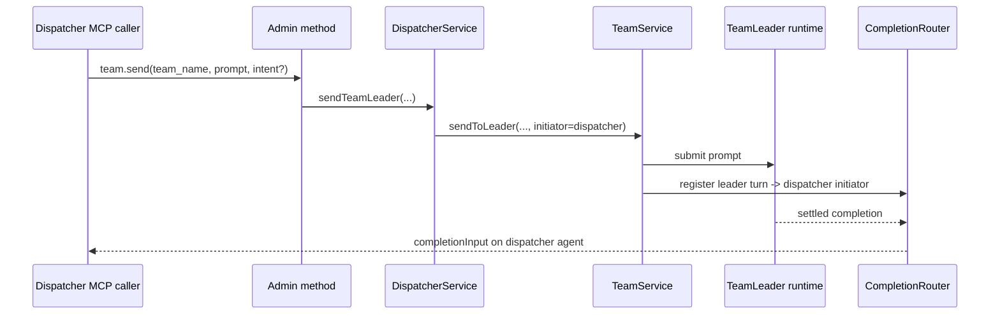

# Proposal: Dispatcher Team MCP send to TeamLeader

- **Status:** Draft proposal for review
- **Date:** 2026-06-30
- **Affects:** `@excitedjs/dreamux` Team MCP surface, admin IPC routing,
  TeamLeader turn submission, completion reverse delivery, bundled dispatcher
  prompt and skill text
- **Companion design:** [Dispatcher Team MCP send to TeamLeader technical design](team-mcp-dispatcher-send-technical-design.md)

## Context

The previous Team MCP slice made the Team MCP caller-scoped and exposed
`transfer_back` to TeamLeaders. That work also recorded a future `team.send`
requirement, but it intentionally did not implement it.

Current Team MCP behavior on `next` is:

- the dispatcher Team MCP exposes lifecycle tools, channel binding, and
  `transfer_back`;
- the TeamLeader Team MCP exposes only `transfer_back`;
- there is no `team.send` tool or `mcp.team.send` admin method;
- the Team `create` tool already documents that an idle TeamLeader can later be
  driven by a send, but that send surface does not exist yet.

This proposal implements the smallest useful `team.send` slice: the dispatcher
can send a turn to a Team's TeamLeader.

## Requirement

The dispatcher must be able to submit a follow-up turn to an existing Team's
TeamLeader through the Team MCP.

The user-visible intent is:

- create a Team, optionally without an initial prompt;
- later call Team MCP `send` from the dispatcher by `team_name`;
- Dreamux submits the prompt to that Team's TeamLeader runtime, lazily starting
  or reopening it through the existing agent runtime path;
- when the TeamLeader turn settles, the completion is delivered back to the
  dispatcher through the same reverse-delivery mechanism used by
  `teammate.send`.

The behavior should align with `teammate.send` wherever the target is also an
agent turn: runtime-native continuation semantics, one submitted turn per call,
and completion routed only after the target turn settles.

## Scope

This slice only adds dispatcher-to-TeamLeader send.

The dispatcher Team MCP gains:

- `send({ team_name, prompt, intent? })`

The TeamLeader Team MCP remains:

- `transfer_back({ channel_id?, meta })`

TeamLeaders do not receive Team MCP `send` in this slice. TeamLeader-to-member
communication remains on the existing TeamLeader-scoped TeamMate MCP
`teammate.send`.

## Tool contract

`team_name` is the concrete Team key, matching the existing Team MCP lifecycle
tools.

`prompt` is the submitted turn text, matching `teammate.send`.

`intent` is optional. When supplied, it updates the TeamLeader's durable recovery
subject in the same spirit as `teammate.send`.

The tool does not take `channel_id`, `meta`, or provider target selectors. Team
send is an agent-to-agent control action, not a channel binding action.

## Completion semantics

Completion routing must be registered from the send action's initiator, not
derived only from the producer role.

For this slice, the initiator is always the dispatcher agent because the only
caller is the dispatcher Team MCP. The code should still introduce the
send-time initiator seam now so a later peer-send slice can reuse it without
threading special cases through the completion router.

The completion producer remains the TeamLeader. The completion target is the
dispatcher agent. Channel inbound turns and remote-control turns remain outside
reverse-delivery registration unless an existing pathway already registers them.

## Layering constraints

The stdio MCP shim parses tool arguments and forwards a single admin request.
It should not compose cross-service state.

The admin method validates MCP-facing parameters, calls the dispatcher
orchestrator, and assembles the model-facing response.

`DispatcherService` remains the orchestration owner for the per-dispatcher graph.
It should locate the Team, provide the dispatcher completion initiator, and call
the Team runtime aggregate.

`TeamService` owns the TeamLeader `TeammateService`. It may expose a narrow
operation for submitting a prompt to its leader and registering that turn with
the supplied initiator. It must not import dispatcher lifecycle or channel
binding responsibilities.

`CompletionRouter` remains the delivery chokepoint. It should not learn Team MCP
or dispatcher-specific branching.

## Acceptance

- Dispatcher `tools/list` for Team MCP includes `send`.
- TeamLeader `tools/list` for Team MCP still contains only `transfer_back`.
- A manually submitted hidden `send` call from a TeamLeader-scoped Team MCP is
  rejected before reaching dispatcher-only behavior.
- Dispatcher `send({ team_name, prompt, intent? })` submits a turn to the
  addressed Team's TeamLeader.
- The TeamLeader can be lazily started or reopened through the existing
  `TeammateService.send` path when the Team itself is open.
- Closed or missing Teams fail loudly with an actionable error.
- The submitted TeamLeader turn registers completion delivery back to the
  dispatcher at send time.
- Existing TeamLeader `transfer_back`, dispatcher channel binding, and
  TeamLeader-to-member `teammate.send` behavior continue to pass.
- Bundled dispatcher prompt, skill, and architecture reference text no longer
  describe `team.send` as entirely future work; they describe the dispatcher
  `send` slice and keep peer Team send as future work.

## Out of scope

- TeamLeader-visible Team MCP `send`.
- TeamLeader-to-TeamLeader or Team-to-Team peer messaging.
- Sending to Team members through the Team MCP.
- Channel target selection, `channel_id`, `meta`, or Feishu-specific target
  selectors.
- New admin IPC identity restrictions.
- Changing channel binding persisted formats.
- Redesigning the completion router beyond the narrow send-time initiator seam.
