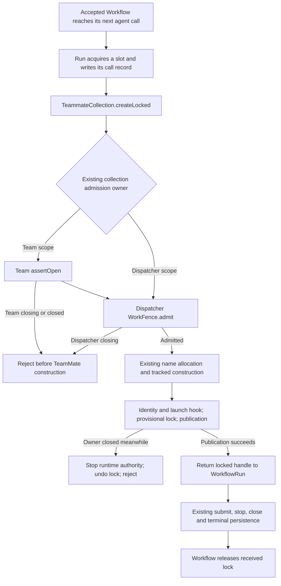

# R73: collection-owned Workflow construction admission

## Proposal and authority

Make `TeammateCollection.createLocked` enter the collection's existing
`WorkAdmission` before its current construction body. Pass the actual dispatcher
member collection to `WorkflowService`, deleting the dispatcher's construction
wrapper. Both Workflow scopes then obtain the same guarantee from the owner that
allocates and publishes their TeamMates.

This is an independent first-round proposal for
[the decision artifact, revision 1](../../../artifacts/product-decisions-20261002.md).
No other current proposal was read. Source baseline is
[merged PR #460](https://github.com/excitedjs/dreamux/pull/460); the task's current
uncommitted requirement and rulings are the active authority. This document is
the only file written by this seat. No implementation, prototype, test, or
runtime experiment was performed.

R73's answer is **"停止新建"**. Its recorded subject is the next TeamMate
construction requested by an already accepted Workflow after its Team or
Dispatcher starts closing. It is not permission to retract construction already
admitted, alter completion delivery, or change dissolve ordering. R10, R43,
R57/R58, R61, R67, and R71 in the
[rulings ledger](../../../rulings.md) remain binding. The
[engineering whitepaper](../../../../../../skills/engineering-whitepaper/SKILL.md),
especially Section 0, supplies the architecture acceptance criterion.

## User story, ownership, and source evidence

An accepted Workflow can reach a later `agent()` after its owner has begun
closing. That request must fail before allocating the new member's workspace,
writing its identity, or invoking `teammateLaunch`. Existing children still stop
and finalize through their current owners.

The authoritative closing facts belong to the Team and Dispatcher, not the
Workflow. The collection owns the construction boundary: it allocates the name,
resolves the workspace, creates the identity, builds and publishes the Agent,
and hands out its lock. The Workflow owns its run, concurrency slots, runner,
and successfully received locked handles. These are distinct responsibilities.

All source paths below are relative to the repository root; line numbers name
the baseline above.

| Source | Verified fact and design consequence |
| --- | --- |
| `packages/dreamux/src/service/agent/index.ts:187,212` | `spawn` admits through `opts.fence`; `createLocked` directly calls `createFreshEntity`. The shared construction owner already has the necessary admission capability. |
| `packages/dreamux/src/service/dispatcher-service/index.ts:242,281` | Dispatcher members receive `this.fence`, but Workflow receives a one-method object that wraps `createLocked` in the same fence. Delete that object when the collection admits itself. |
| `packages/dreamux/src/service/team/service.ts:208,225,552` | Team members receive `fence: this`; Workflow already receives the actual collection. `TeamService.admit` checks the Team, then enters the Dispatcher fence. No Team adapter or additional dependency is needed. |
| `packages/dreamux/src/platform/work-fence.ts:22,30` | Admission checks synchronously, tracks the promised operation, and schedules its body in a promise continuation. This existing boundary determines whether construction was admitted before close. |
| `packages/dreamux/src/service/team/service.ts:562,591,624` | Team refusal reads `dissolveTask`, then committed `closed`. Dissolve publishes the task after its precheck, writes `closed`, and only then destroys children. Checking only the durable record would be too late. |
| `packages/dreamux/src/service/dispatcher-service/lifecycle.ts:89,232` | Dispatcher close publishes its permanent fence before stop requests; shutdown sweeps runtimes, joins admitted work, sweeps again, then closes channels. Preserve this sequence. |
| `packages/dreamux/src/service/workflow-service/run.ts:464,481,691` | Each actual construction occurs after semaphore acquisition and run-record writes. The run tracks its materialization promise and later closes handles before waiting for agent tasks. Admission of the original Workflow request is insufficient. |
| `packages/dreamux/src/service/agent/index.ts:647,736,772,911` | Construction already owns late-publication refusal and rollback of the provisional lock before tracked materialization settles. R73 adds an earlier boundary, not a replacement cleanup path. |

Ownership history supports this placement. [PR #459](https://github.com/excitedjs/dreamux/pull/459) moved
admission facts into `WorkFence` and gave Team children the real Team as their
admission owner. Section 1 of the
[selected R71 solution](../../data-flow/final.md#1-closing-fences-and-construction-order)
explicitly preserved two exceptions: outer Dispatcher admission and raw Team
Workflow construction. That preservation was pending a product ruling; R73 now
supersedes those two rows. It does not supersede the underlying owner model.
[PR #460](https://github.com/excitedjs/dreamux/pull/460) already fixed lock release on publication refusal.
The lock leak is historical evidence for preserving that ordering, not an open
finding or a second fix in this continuation.

## Selected change and deletion boundary

There are two behavioral source edits and one adjacent documentation edit:

1. In `service/agent/index.ts`, retain the async signature and default options of
   `createLocked`. Return `this.opts.fence.admit(async () => { ... })`, with its
   current construction-and-lock body inside that operation. Admission precedes
   `createFreshEntity`, including validation and name allocation. Keep the lock
   variable, pre-publication lock acquisition, undo callback, and returned handle
   exactly within the existing construction lifetime. No new public or private
   bypass verb is needed.
2. In `service/dispatcher-service/index.ts`, replace the one-method `teammates`
   object with `teammates: this._teammates`. Removing the wrapper is part of the
   change, not optional follow-up: keeping it would admit a second time after the
   first admission's microtask, potentially rejecting work already accepted by
   the outer fence.
3. In `service/workflow-service/types.ts:9`, update the
   `WorkflowTeammateFactory` comment to describe the collection-owned admission
   guarantee and successful lock handoff. Keep the existing narrow structural
   interface and signature; Workflow still only needs `createLocked`.

No behavioral edits are needed in `TeamService`, `WorkflowService`,
`WorkflowRun`, `WorkFence`, Agent locking, the factory, or provider/channel
packages. The call-scoped admission callback is the existing work-fence API;
it neither stores access to a parent's private state nor introduces another
construction object. The existing pre-publication undo callback expresses local
lock ownership and must remain at its failure boundary.

Entropy accounting: remove the dispatcher-only factory object, its forwarding
closure, and the two-scope exception a maintainer currently needs to remember.
Reuse one existing admission operation at the actual creation verb. Add no
owner, phase, persisted fact, flag, queue, policy table, configuration switch,
fallback, or cancellation protocol. A future Workflow caller receives an
already-admitted construction capability rather than learning owner-specific
wiring. Do not split files or relocate helpers to offset the small line change.

## End-to-end admission and close behavior

**Early refusal.** The Team scope calls `TeamService.admit`; the Dispatcher
scope calls `WorkFence.admit`. In Team scope there is no await between the Team
check and entry into Dispatcher admission. Preserve these exact error sources:

| State when construction requests admission | Result |
| --- | --- |
| Team has a dissolve task, regardless of Dispatcher state | `TeamClosedError`, `TEAM_CLOSED`, `Team "<id>" is closing` |
| Team has no dissolve task but its record is closed | `TeamClosedError`, `TEAM_CLOSED`, `Team "<id>" is closed` |
| Team is open and Dispatcher is closing, or Dispatcher-scoped construction sees closing | `ServerShuttingDownError`, `SERVER_SHUTTING_DOWN`, `dispatcher '<id>' is shutting down` |
| Applicable owners are open | Admit the existing construction operation |

Retain `async createLocked` so a refusal remains a rejected promise at this
method boundary. Do not duplicate the error constructors or normalize Team
refusals into Dispatcher errors. The already-admitted late-publication path
continues using the existing `selfCloseIfClosing` error, including its current
Dispatcher wording in Team scope. Error precedence is not a mandate to rewrite
that different failure boundary.

The Workflow may already have persisted a queued/running call with `name: null`
before construction is refused. R73 forbids the new TeamMate's construction
side effects, not the run's ordinary accounting writes. `executeAgent` retains
its current catch/finally behavior: mark the call stopped if a terminal intent
already exists, otherwise failed with the refusal message; release its slot.
An ordinary call failure can still contribute `null` to the script. Do not turn
every refused construction into a new run-level cancellation or force a
particular Workflow terminal outcome.

**Team dissolve.** The start of Team closing is publication of `dissolveTask`
after the existing worktree precheck, not entry into `dissolve()` and not the
later closed-record write. A dirty-worktree precheck refusal leaves admission
open. A failed closed write keeps the existing task-reset behavior; do not add
a sticky flag. After a successful write, R67 remains: Workflow `stopAll`,
scheduler `destroy`, member `destroy`, leader `close`, then worktree cleanup,
attempting every child serially. R73 closes the interval before those child
stop requests reach Workflow; it does not move teardown before the closed
write or transfer worktree ownership.

**Dispatcher close.** The existing permanent `WorkFence.close` rejects later
construction in both scopes, even when a Team itself remains open for recovery
on the next daemon start. Stop requests still reach root and Team Workflows
through `DispatcherLifecycle`; runtime sweeps and admitted-work drain retain
their ordering. Internal teardown verbs remain unfenced so they can complete
after public work admission closes.

**Completion.** Keep `CompletionDeliveryPolicy` and Team-only completion
preparation unchanged. The Dispatcher acceptance check before queueing stays
where it is (`completion-router/index.ts:117`); R73 adds no check to queued
delivery. Workflow stop still clears its owed recipient only when stopped
intent wins; an earlier completed/failed intent and already-started delivery
retain their existing treatment. A run admitted before close is not itself a
permanent permit to construct further Agents.

## Concurrency, tracking, and lock handoff

The admission linearization point is the synchronous check in the existing
owner's `admit`, not the later callback invocation, identity write, or runtime
start. A check that succeeds immediately before close admits the operation
even if its body runs afterward. Do not add a second check between that
admission and name/workspace allocation: already-admitted work follows its
current materialization and late-publication cleanup semantics.

The change keeps three different lifetimes intact:

| Lifetime | Owner and convergence |
| --- | --- |
| Admitted construction | Dispatcher `WorkFence` tracks the complete construction promise; Team supplies the preceding Team check. This span ends with a handle or rejection, not with the Agent turn. |
| Collection discovery of a child being built | `inFlight` covers name allocation; `materializations` covers the registered build. `heldMembers` joins those before reading held entities. Keep allocation-to-registration ordering and exact-promise removal. |
| Workflow's use of a received child | `executeAgent` stores/tracks the returned materialization promise before awaiting it, then assigns the successful handle. `finalize` waits for those materializations before collecting and closing handles. |

The new deferred operation in Team scope does not justify a second registry.
`WorkflowRun` records the returned promise immediately, before its first await;
Team dissolve schedules its work after publishing its task. The already
existing Workflow materialization join covers an admitted request whose
collection body has not run yet. Once allocation begins, the collection's
existing narrow tracker and build map apply. Dispatcher scope already used
the same deferred `WorkFence.admit` body through its outer wrapper.

Lock ownership changes only on successful construction:

1. Before publication, the collection takes `entity.lock()` and owns the
   obligation to undo it if publication fails.
2. If closing wins at publication, `selfCloseIfClosing` requests runtime stop
   and throws. The build invokes its undo **before** its tracked promise
   rejects and leaves `materializations`. A concurrent member sweep therefore
   cannot inherit an unreturned locked entity. Do not move this undo into an
   outer catch/finally around `createLocked` or into Workflow.
3. If construction succeeds, the returned handle belongs to `WorkflowRun`.
   A stop racing after success is handled by the run's materialization join
   and existing post-write terminal check. Finalization stops the runner,
   joins construction, closes the locked Agents, joins its accounting work,
   persists terminal journal/record, then unlocks its handles. Its existing
   retry behavior retains locks until terminal persistence succeeds.

Early rejection acquires no lock. Late failure releases the provisional lock.
Successful handoff must not acquire an unconditional `finally { unlock() }` in
the collection. Agent close remains responsible for stopping its runtime before
settling its in-flight work; no step waits for a natural turn completion before
the mechanism that stops that turn. The Dispatcher second sweep remains
necessary for existing materialized-entity admission races outside this fix.

## Compatibility and documentation

The deliberate behavior change is earlier refusal of Team Workflow construction
when either owner is closing, now before any construction effects. Dispatcher
Workflow retains its existing construction refusal with the check moved into
the collection. Both scopes retain the same arguments, return type, lock API,
run receipts, script failure mapping, completion routing, schema and launch
options, and persistence formats. Ordinary spawn/send/reopen and leader-tool
access retain their present admission boundaries.

No config or durable-file shape, validation, ownership, or meaning changes; no
migration or rebuild is needed. This does not need a maintenance-state schema
update. The eventual delivery should record an ordinary `@excitedjs/dreamux`
behavior change through the repository's Rush change workflow, without
`BREAKING:`, `Rebuild:`, `Review:`, or a major version change.

The TeamLeader's implementation closeout should update the affected current
service/Workflow knowledge and product behavior record, plus the source comment
above; record that R73 supersedes the two deferred admission rows in the prior
solution without erasing their historical rationale. Run
`.agents/scripts/check.sh` after those authorized documentation edits. This
proposal does not write any of them. R72 and the parent's other deferred
product/coverage items stay outside this continuation.

## Verification mapped to R43

This seat verified source and history only. No gates or acceptance runs were
executed, and no new behavior is claimed proven. The surviving
`tests/workflow-runner.test.ts` exercises runner IPC/script/abort behavior; it
does not establish real collection admission or Team close ordering. A search
of current tests found no `createLocked` coverage. The deletion ledger already
records Workflow lock/finalization/completion restoration obligations
(`artifacts/deleted-tests.md:3872-3889`) and creation-versus-close coverage
(`:3114-3134`). Preserve those obligations.

| ID | Scenario and observation | Verification responsibility |
| --- | --- | --- |
| V1 | Open Team and Dispatcher Workflow each create, run, and close a member; schema, launch scope and successful lock lifetime remain unchanged. | Existing runner tests provide partial coverage only. Use ordinary Workflow acceptance in the implementation phase; restore real-owner integration coverage on #453. |
| V2 | An accepted Team Workflow reaches construction after `dissolveTask` is published but before the closed write or Workflow stop request. It gets `TEAM_CLOSED`; no name allocation, workspace, identity, launch tap, or runtime start occurs for that request. | Review `admit` before `createFreshEntity`; final #453 coverage must control the real pre-write interval and observe owner state and outputs. A Workflow-start refusal alone does not cover this case. |
| V3 | Dispatcher closes while an accepted root or Team Workflow has a later member waiting. Both refuse construction; an otherwise-open Team reaches the Dispatcher error. | Review both composition roots and call sites; acceptance traces cover both scopes. Final #453 coverage exercises actual collections and owner fences. |
| V4 | Both owners close; Team refusal wins. A closed Team without an active dissolve task reports closed. A dirty precheck refusal leaves the Team usable. | Assert the existing error classes/messages and unchanged precheck boundary with real owner facts in restored coverage. Do not only assert an error occurred. |
| V5 | Admission succeeds, close occurs before the admitted callback executes, and construction proceeds into the existing late-publication path. | Verify a single admission crossing and promise tracking. Final #453 deterministic coverage distinguishes pre-admitted construction from a new post-close request. |
| V6 | Close races name allocation, then a delayed launch hook/build. The sweeps observe the materialization; late refusal stops authority and releases the provisional lock before materialization settles. | Inspect unchanged allocation/build/undo ordering and #460 diff. Restore a controlled asynchronous-boundary race using real construction and close; observe no locked-member teardown failure. Do not fabricate a rejecting launch hook, whose taps are isolated. |
| V7 | Handle handoff succeeds immediately before stop, including a running turn. Finalization closes it before waiting on agent tasks, persists the terminal state, and releases the lock; no runtime survives successful close. | Whole-path source review and implementation acceptance trace; final #453 behavioral coverage must include both sides of handoff and terminal-persistence retry. |
| V8 | A queued slot or run still initializing sees stop, and a construction refusal occurs before stop intent is reserved. Existing stopped/failed call accounting and slot release converge without new cancellation semantics. | Preserve run/semaphore logic; final #453 restoration covers queued, initializing, and active calls rather than source-text assertions. |
| V9 | A completion queued before Dispatcher close, and a completed/failed Workflow intent preceding stop, retain existing delivery semantics; owner-requested stopped intent suppresses its own owed completion. | Review unchanged completion owners and restore the relevant deleted behavior cases. Do not add Dispatcher checks to prepared delivery to make V2 pass. |
| V10 | Team closed commit precedes serial child destruction and cleanup; post-commit failure does not reopen it. Dispatcher host stop retains its two sweeps around admitted work. | Whole-diff review against R67/product catalog and ordinary dissolve/shutdown acceptance; retain final parent lifecycle coverage. |

Under R43 this child delivery adds or repairs **no unit tests**. Run the four
Rush gates through `node common/scripts/install-run-rush.js` (`build`, `lint`,
`test`, `typecheck:tests`) and record exact results. Do not treat a green
surviving runner suite as proof of V2-V7. If an existing test fails, first
adjudicate the failure against the unchanged contracts and R73; fix a source
regression rather than conceal it. If R43 requires deletion, delete the case
without rewriting it and record its contract in the deletion ledger for #453.
No test deletion is predicted by this proposal.

The table is the coverage handoff, not authorization to create probes or tests
in this solution round. During implementation, ordinary acceptance and available
existing harnesses may provide runtime evidence. A deterministic race that
requires new test infrastructure remains explicitly pending for the final
#453 coverage pass; do not disguise a new unit suite as a probe. Before #453
merges to `next`, restore coverage with actual owners and observed side effects,
including the parent's separate high-risk #63 non-blocking-inbound obligation.
Report local controlled-provider evidence separately from live-provider E2E.

## Rejected alternatives and unresolved requirements

| Alternative | Reason for rejection |
| --- | --- |
| Add a Team-side wrapper to match Dispatcher | Duplicates policy at composition roots and preserves a raw construction bypass. It adds a mechanism where the authoritative collection already has the capability. |
| Check only `WorkflowRun` terminal state, `WorkflowService.accepting`, or `isClosing()` | Those facts do not perform owner admission/tracking or preserve Team-then-Dispatcher errors. Team closing precedes Workflow stop, which is the concrete missing interval. |
| Gate only `WorkflowService.run`, or cover the entire run with one admission | The run was already accepted; future construction still needs fresh admission. A run-long admission also couples shutdown's drain to work it must stop. |
| Gate `createFreshEntity` while retaining public spawn admission | Adds a nested gate to an already-admitted spawn and can reject its continuation when close intervenes. The public construction verb is the correct boundary. |
| Keep the Dispatcher wrapper after adding collection admission | Creates a second, later admission and can retract the outer acceptance; deleting it is required for both entropy and behavior. |
| Add cancellation tokens, closing flags, retry loops, a generic gate composer, or durable admission state | No new state is needed to answer R73. Existing Team/Dispatcher facts and construction cleanup already handle the named race. |
| Rework lock APIs or move #460 undo to a caller | The caller has no handle on failure; moving undo after materialization settlement recreates the fixed race. |
| Reorder dissolve to stop first, remove the second Dispatcher sweep, or refactor surrounding Workflow machinery | These change independent settled behavior or ownership and are not necessary for R73. |

There is **no unsettled R73 product requirement** in revision 1. Whether a
construction was admitted is resolved by the existing synchronous owner checks;
error precedence, already-admitted cleanup, completion delivery, and R67 order
are specified. The remaining work is proposal adjudication, implementation
authorization, and verification, not another product choice. Any newly observed
source contradiction should be reported concretely before expanding this scope.

## Single cross-review round — 2026-10-02

Reviewed the first-round [MiMo](mimo.md) and [DeepSeek](deepseek.md) proposals,
this proposal, the active requirement and rulings linked from the task README,
and the [source audit](../source-audit.md), then checked the disputed paths
against current source. The first-round reasoning above is preserved; only
commit citations were replaced with their PR links as the repository checker
requires. This appendix records my conclusions, not the other authors' assent.

**Selected ownership remains unchanged.** Both alternatives correctly put fresh
construction admission on `TeammateCollection.createLocked`, remove the
Dispatcher wrapper, and reuse the Team's existing Team-then-Dispatcher admission.
I accept their rejection of a Team-side wrapper, Workflow-owned owner checks,
and a new cancellation mechanism. Agreement is supported by the actual owner
and call graph, not by counting proposals.

Their private `createLockedAdmitted` helper is a reasonable same-class spelling
of the existing sibling convention. I retain the inline admitted body as the
smaller choice for this one change; the helper is not an architecture defect or
a material disagreement. Either spelling must keep the public method async.

The following corrections are required before either alternative is used as
implementation guidance. Source paths below are under `packages/dreamux/src/`.

| Argument reviewed | Decision and source-backed correction |
| --- | --- |
| MiMo §4.1 and DeepSeek §4.1 remove `async` from public `createLocked` | **Reject that signature change.** Current `service/agent/index.ts:212` is async; `platform/work-fence.ts:29-32` can throw synchronously at `assertOpen`. Without public `async`, direct Dispatcher-collection refusal escapes synchronously, while Team refusal is still a promise rejection because `TeamService.admit` is async. Keep `async createLocked` and invoke `fence.admit` directly inside it. Do not defer the admission call itself with another promise continuation: that would move the admission point. The current Workflow try/catch handles either form, but that does not justify changing the collection's public rejection boundary. |
| DeepSeek §4.1 calls nested admission harmless; MiMo §6 identifies the race | **Accept MiMo's objection; reject harmlessness.** Outer Dispatcher admission succeeds, schedules the collection call, then close raises the fence before the callback runs. A retained wrapper plus the new collection check rejects at the second admission despite the first success. Remove the wrapper in the same change. One admission means the collection's existing owner operation; the Team check followed synchronously by Dispatcher admission remains the required composition. |
| DeepSeek §9 treats early Team error wording as an unsettled product choice | **Reject reopening this question.** Revision 1 requires the existing owner order and errors; the source audit correctly distinguishes new early `TeamClosedError` from unchanged late-publication `ServerShuttingDownError`. `service/team/service.ts:562-569` supplies the early errors, while `service/agent/index.ts:772-780` retains the late Dispatcher-worded error for an already-admitted build. The earlier refusal is an explicit observable change under R73, not identical old behavior or a reason to add a translating catch. |
| MiMo §4.2 expects the message to become closed when the record write lands | **Narrow the claim.** `assertOpen` checks `dissolveTask` first. A successfully dissolving instance retains that task, so it still reports `Team "<id>" is closing` after the closed write; the closed wording applies when that task is absent and the record is closed. Dispatcher wording uses single quotes around its id. Copy the owner errors, not prose approximations. |
| MiMo §6/§11 and DeepSeek §5 describe construction as bounded; DeepSeek calls it a disk-I/O span strictly shorter than spawn | **Reject the duration guarantee.** `service/agent/index.ts:729-731,825-831` awaits launch composition, and `plugin/hooks.ts:457-493,509-528` awaits plugin taps and their composition work. Tap errors are isolated, but no duration bound follows. Construction excludes the native turn; it is not limited to disk I/O and is not guaranteed to finish quickly. The pre-existing Workflow materialization join already waits for it. R73 adds no timeout, cancellation, or guarantee about a tap that never settles. |
| MiMo §11 says the Workflow terminal status is stopped in both scopes | **Reject the unconditional terminal claim.** `service/workflow-service/run.ts:539-558` classifies this individual call, while `reserveStop` and `requestTerminal` at `:266-295` preserve the first run terminal intent. Refusing one construction neither reserves stopped nor overwrites an earlier completed/failed intent. Keep the existing catch and terminal machinery. |

A concrete counterexample to the last claim needs no new failure mechanism:
Team dissolve publishes its task and awaits the closed write
(`service/team/service.ts:597-626`). Before `destroyChildren` reaches Workflow
stop at `:752-757`, a later construction is refused. With no run terminal intent
yet, its call records failed and sends the ordinary `null` result to the runner
(`workflow-service/run.ts:539-558,650-682`). The script can return, and its
`run_result` can reserve completed before Team teardown requests stopped
(`:380-388`). A subsequent stop leaves that completed intent intact. A script
that fails can similarly reserve failed first. This is a possible ordering,
not a claim that it always wins, and it does not promise that completion will
be delivered through a closing Team. R73 changes construction admission, not
terminal-intent precedence or recipient availability.

Two smaller corrections keep the explanation within authority. Both authors'
description of the old bypass as simply an oversight is too strong: the prior
R71 design deliberately preserved it pending a product ruling. R73, rather
than a broad collection comment, now authorizes the change. DeepSeek §8's
blanket "no deleted tests" also overstates R43: no deletion is predicted, but
an actually incompatible failing test is deleted and logged under that ruling;
source regressions must still be fixed rather than hidden by deletion.

**Revised position and verification handoff.** Keep the original two behavioral
edits and one seam-comment edit, preserve the public async method, and make no
change to late cleanup, lock handoff, Workflow terminal classification, queued
delivery, or R67 ordering. The construction-lifetime discussion above describes
what is joined, not a wall-clock bound; V6 must use a deliberately released
launch tap rather than assert a shutdown deadline. Extend V8/V9's final-parent
coverage to distinguish a failed child row from the run's winning terminal
intent. Retain V5 for the single-admission race and include direct method
promise-rejection behavior in the error-contract coverage. These are coverage
requirements for the existing R43 handoff, not tests or probes added this round.

No new product ruling or architectural expansion is needed. The async boundary,
nested-admission hazard, and terminal-status correction are material differences
from the first-round alternative text that the final solution must resolve as
above; they are settled by source, not by a new operator preference. There is
no remaining material implementation choice beyond the non-blocking inline
versus private-helper spelling. No implementation or runtime validation was
performed in this cross-review.
