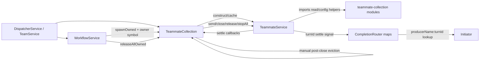
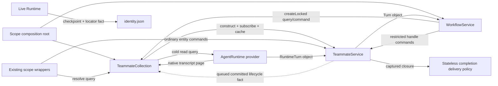

# Unified Workflow and TeamMate Lifecycle

## Status

- **Solution status:** Final proposal for operator review
- **Implementation authorization:** Not granted
- **Requirement:** [`requirement.md`](../requirement.md)
- **Frozen requirement SHA-256:** `e44f6411914cd1ff5ea49c55f09bbae17ad162f62335123f43d89ea0405208d0`
- **Original source baseline inspected:** `6b8ec14b080389bf6c6ae36fa336ec0451e401ec`
- **Reopened implementation baseline inspected:** `3badc3a5b7547ff1455843436dbfea88f15a0d86`
- **Original focused review inputs:**
  - [`lock-native-id-entity.md`](reviews/lock-native-id-entity.md), SHA-256
    `6e78d2e05eea6f2ec8092ee630d9cfde6e1fc02bb5651cda507f46ef5b4da294`
  - [`lock-native-id-membership.md`](reviews/lock-native-id-membership.md),
    SHA-256
    `0a001c5fa21d43125388e2c3346d5238a5b1a8bd1fdf5bd50bdb63777702b33e`
  - [`lock-native-id-events.md`](reviews/lock-native-id-events.md), SHA-256
    `be034804559796a2de649ebb5cdf6503de91d25794fa1ee0ee10326106d54954`
This file is the single authoritative solution. The earlier proposals and the
superseded revisions of this file are consultation history only. The
entity-owned lifecycle implementation already present on the reopened baseline
is retained unless this revision explicitly deletes or changes it.

## Executive Decision

The solution uses three deliberately small foundational capabilities:

1. `TeammateService.lock()` owns the active-Workflow write fence and returns a
   restricted handle. No separate claims registry, public command adapter, or
   Workflow-specific TeamMate port is introduced.
2. One accepted logical model turn is represented by one in-process object.
   `RuntimeTurn` and `Turn` objects, promises, and captured closures replace
   every Dreamux service-level turn identifier and reverse-lookup map.
3. Each `AgentRuntimeProvider` owns a cold `readTranscript()` query over its
   Runtime-native transcript. Dreamux stores no Turn archive and no rolling
   conversation projection. `TeammateCollection.last()` delegates directly to
   the selected provider without materializing or starting a TeamMate.

Ownership is therefore:

- `WorkflowService` owns Workflow membership, call ordering, terminal intent,
  and the decision to close its member TeamMates.
- `TeammateService` owns mutation admission, the process-local lock, runtime
  start/stop, in-process Turn objects, close, and lifecycle publication.
- `TeammateCollection` owns construction, directory/read queries, caching, and
  subscription to entity lifecycle facts. It owns the cold `last` entry point
  but not native transcript parsing. It never performs an entity close merely
  to update its own cache.
- runtime providers own any provider-native protocol identifiers. Those values
  never cross into Dreamux service, Workflow, MCP, Channel, or transcript
  result contracts.

The selected Runtime session association is the one durable bridge between a
TeamMate and its native history:

```ts
interface AgentRuntimeResumeCheckpoint {
  id: string;
  transcript_locator?: string | null;
}
```

Core persists that association atomically as `session_id` plus
`transcript_locator`. The locator is provider-produced, provider-validated, and
never interpreted by core. Direct TeamMate `spawn` and `send` receipts expose
the validated canonical absolute path as `transcript_path`; all other public
surfaces keep it private.

`workflow_stop` is a truthful terminal barrier. It returns success only after
the runner is stopped, every created member has executed the TeamMate-owned
close contract, unresolved Turns have converged, the Workflow journal and record
agree on terminal state, and every member lock has been released.

## Adjudication

### Accepted

- The lock is entity-owned and process-local.
- The same entity method fences ordinary send, Channel input, scheduled input,
  completion input, start/reopen, public close, and worktree mutation.
- A fresh Workflow member is constructed and locked before any runtime start.
- Locked close does not unlock or publish the cache-retirement fact.
- Workflow unlocks only after durable terminal commit.
- A closed locked entity becomes irreversibly retired at unlock, then publishes
  a queued lifecycle fact.
- Collection eviction uses the exact entity object captured by the subscription;
  no instance ID or generation ID is required.
- AgentRuntime submission returns a `RuntimeTurn` object with a one-shot
  terminal promise. Fold/steer returns the same object.
- `TeammateService` owns one canonical `Turn` object for the active
  `RuntimeTurn`. Workflow retains that object directly.
- Completion delivery is a captured closure using a stateless bounded policy,
  not a router registry.
- Dreamux persists no Turn row and no Turn-derived rolling snapshot.
- Existing Dreamux `turn.jsonl` files are inert residue. They are never read,
  validated, repaired, preflighted, migrated, or automatically deleted.
- `identity.json` contains no `turn_count`, `last_seen_at`,
  `last_prompt_preview`, or `last_assistant_preview`.
- `last` is a turn-only, backward-pageable, tool-aware cold query over the
  selected provider's native transcript.
- Codex uses JSON-RPC `thread.path` as its primary native locator. Claude Code
  pins a provider-generated UUID through native `--session-id` and derives the
  canonical native path before accepting a fresh turn.
- Direct TeamMate `spawn` and `send` receipts always carry
  `transcript_path: string | null`; it is non-null whenever the TeamMate has an
  established, validated native session association, independent of the
  current turn-admission status.
- External providers may implement the required neutral transcript contract
  outside this repository. This task adds no new built-in provider, and the
  operator-prohibited provider family is absent from repository and publication
  surfaces.
- MCP receipts, Workflow projections, history/last, Channel delivery results,
  and Channel event contracts expose no Turn ID.
- The unused `turn.submitted` and `turn.settled` Channel event pair is deleted.
- Provider teardown is bounded and must prove post-`SIGKILL` process-group
  absence before close can succeed.
- Team dissolve stops Workflows before waiting for remaining ordinary writers.
- Server shutdown invokes the same TeamMate close capability and has no
  runtime-only success path.

### Rejected

- `TeammateMutationClaims`
- `PublicTeammateCommandAdapter`
- `WorkflowTeammatePort`
- host `submission_id`
- Dreamux `turn_id` / `turnId`
- Claude `claude-turn-<runtime>-<counter>`
- `Map<nativeId, Turn>`, `WeakMap<RuntimeTurn, Turn>`, or any equivalent
  service registry
- Collection-owned close/release/bulk teardown
- eviction when locked close commits
- Workflow-local grace periods or provider kill logic
- detached immediate-success `workflow_stop`
- runtime-only shutdown sweeps
- speculative observational Turn labels
- keeping Channel Turn events without a production consumer
- strict v2 Dreamux Turn archives or a compatibility reader for old archives
- startup failure or a rebuild requirement caused by Dreamux `turn.jsonl`
- rolling conversation summaries inside `identity.json`
- a live-runtime `getLast()` cache as a second history source
- built-in grep, time filtering, regex search, semantic search, or a Dreamux
  transcript index/cache
- a caller-configurable transcript output-byte budget
- a Claude SessionStart Hook or auxiliary IPC bridge used only to recover a
  transcript path
- any implementation, registration, package, documentation, fixture, test, or
  compatibility branch for the operator-prohibited provider family
- a new shared app-server kernel package in this slice
- replay, request fingerprints, durable provider leases, or a general JSONL
  repair engine in this task

## Dependency Graphs

### Current



The wrong dependency is not construction or lookup. It is making an observer
execute the entity lifecycle so that the observer can maintain derived state.

### Target



Rules:

1. `TeammateService` imports no `teammate-collection` capability.
2. `WorkflowService` may call the Collection's narrow construction method but
   depends on the returned entity-owned handle for mutation and close.
3. Existing public scope wrappers remain wrappers; the entity itself enforces
   the lock and lifecycle phase.
4. Collection updates only its own cache in response to an already-committed
   fact. No listener is awaited by the entity.
5. Turn settlement, Workflow correlation, and completion delivery use direct
   object references and closures.
6. `last` resolves identity and provider configuration without resolving an
   entity, creating a Runtime, or acquiring a lifecycle lock.
7. A provider owns locator validation, native discovery, history projection,
   cursor parsing, tool pairing, bounds, and native errors.

## Ownership and Interaction Matrix

| Surface | Owner | Interaction | Why the direction is valid |
| --- | --- | --- | --- |
| TeamMate construction | `TeammateCollection` | command returning an entity-owned handle | Construction is a container capability, not lifecycle ownership. |
| Durable TeamMate identity | `TeammateService` through identity store | entity command/query | The entity writes its own lifecycle and Runtime-session association. |
| Active Workflow write exclusion | `TeammateService` | `lock()` command | Only the entity can atomically fence all of its mutation methods. |
| Workflow membership | `WorkflowService` record | Workflow state | The lock is not durable membership and stores no Workflow identity. |
| Public `send` / `close` | `TeammateService` | Collection resolve query, then entity command | Collection performs no post-command bookkeeping. |
| Workflow submit / close | `TeammateService` through `LockedTeammate` | direct handle command | Workflow chooses timing; the entity owns mechanics. |
| Runtime start/resume/stop | `TeammateService` behind `AgentRuntime` | private entity operation | No outer module interprets provider behavior. |
| Runtime terminal outcome | provider-owned `RuntimeTurn` | object promise | Provider-native IDs remain private. |
| Service Turn outcome | entity-owned `Turn` | object promise/latch | No callback fan-out or ID lookup exists. |
| Workflow Agent correlation | `WorkflowRun.AgentCall` | direct `Turn` reference | Runner IPC continues to correlate by Workflow Agent `index`. |
| Completion delivery | source `Turn` plus stateless policy | captured closure | No register-after-submit race or registry exists. |
| Detailed conversation history | selected `AgentRuntimeProvider` | cold read query | The provider reads the Runtime-native transcript; Dreamux owns no duplicate archive. |
| Transcript locator | selected `AgentRuntimeProvider` | checkpoint fact | Core persists one opaque canonical path with the provider-owned session ID. |
| Direct `spawn` / `send` receipt path | `TeammateService` projects the persisted association | read projection after command | The path is exposed only to the direct caller; turn status does not redefine session identity. |
| Live entity cache | `TeammateCollection` | query plus fact subscription | Cache is derived state; lifecycle remains entity-owned. |
| Lifecycle fact | `TeammateService` | queued post-transition event | Subscribers cannot affect the transition. |
| Roster/status/history | Collection and identity store | read query | Identity/lifecycle reads never open native transcripts. |
| `last` | Collection entry point, provider content owner | cold read query | Works while locked or evicted and starts no Runtime. |
| Spawn failure cleanup | factory before publication; Workflow after return | direct entity close | No Collection bulk-release path is needed. |
| Worktree cleanup | entity or Team that owns that worktree | owner command | Collection forwarding is not a lifecycle requirement. |
| Team dissolve ordering | Team dissolve controller | stop Workflows, then wait ordinary writers | Locked members are controlled only through Workflow. |
| Server shutdown ordering | containment roots | stop Workflows, close ordinary entities | It reuses the normal entity contract. |

## Core Contracts

### Entity State and `lock()`

`TeammateService` keeps the minimum concurrency state on the entity:

```ts
type EntityPhase = 'active' | 'closing' | 'closedHeld' | 'retired';

interface EntityConcurrencyState {
  phase: EntityPhase;
  ordinaryMutations: number;
  lockToken: object | null;
  closeTask: Promise<TeammateCloseResult> | null;
  pendingAdmissions: number;
  currentTurn: Turn | null;
}
```

The token is private, process-local, and never serialized. The durable Workflow
record remains the membership source of truth.

Conceptual API:

```ts
interface LockedTeammate {
  readonly name: string;
  submit(input: WorkflowTeammateSubmitInput): Promise<TurnAdmission>;
  close(input: TeammateCloseInput): Promise<TeammateCloseResult>;
  unlock(): void;
}

class TeammateService {
  lock(): LockedTeammate;
}
```

`lock()`:

- checks and installs the private token synchronously;
- rejects if another lock exists, an ordinary mutation is admitted, or an
  unresolved ordinary Turn is active;
- may lock an entity materialized from a durable closed identity, allowing a
  future attach-existing caller to reopen it through the restricted submit;
- returns a frozen or otherwise non-forgeable handle whose every method checks
  the exact token synchronously;
- does not store a Workflow ID or creation provenance.

Every ordinary side-effecting entry point enters one entity-local mutation gate
before its first await. The gate checks `phase === 'active'`, no lock, and
canonical instance status, then increments `ordinaryMutations` until the
operation settles. The required fenced set is:

- `send`
- `channelInput`
- `scheduledInput`
- `completionInput`
- start/reopen paths
- public `close`
- `applyWorktreeCleanup`
- any future method that can mutate identity, runtime, Turn, or worktree state

Read-only status, list, history, and last remain available. Runtime start and
stop become private entity implementation details.

The handle lifecycle is:

```text
active/unlocked
  -> active/locked
  -> closing/locked
  -> closedHeld/locked
  -> retired/unlocked + queued teammate.closed fact
```

Unlock on an entity that was not closed simply revokes the token and restores
ordinary mutation. Unlock on `closedHeld` first revokes the token and
synchronously makes the exact instance `retired`; only then does it queue the
lifecycle fact. A stale handle fails after unlock and also fails after a later
Workflow locks the same TeamMate identity.

### Construction Before Runtime Start

The Collection exposes one narrow construction method on its existing object:

```ts
createLocked(input: WorkflowTeammateCreateInput): Promise<LockedTeammate>;
```

This is not a Workflow lifecycle port. It is the Collection's existing factory
returning the entity's own restricted handle.

The sequence is:

1. Allocate the name/worktree and persist a complete non-running identity.
2. Construct the canonical `TeammateService`.
3. Subscribe to that exact entity's lifecycle source.
4. Call `entity.lock()` before cache publication or runtime start.
5. Publish the canonical entity in the cache.
6. Return the locked handle. No model input has been submitted.
7. Workflow persists Agent `index + name`.
8. Only then may `handle.submit()` start/reopen the runtime.

`WorkflowRun` records each materialization promise before awaiting it. Stop
closes Agent creation admission, joins all such promises, and closes every
successfully returned handle. A pre-publication failure has no live runtime and
the factory cleans only its unpublished object. A post-return failure belongs
to Workflow and is closed through the retained handle.

A future attach-existing operation is only:

```text
Collection resolve existing canonical entity -> entity.lock() -> same handle
```

No persisted role or alternate lifecycle is required.

### Lifecycle Fact and Cache Retirement

`TeammateService` exposes a narrow revocable subscription, not raw emitter
control. The fact is:

```ts
interface TeammateClosedFact {
  readonly schema_version: 1;
  readonly kind: 'teammate.closed';
  readonly dispatcher_id: string;
  readonly team_id: string | null;
  readonly name: string;
  readonly closed_at: number;
}
```

No source-instance identifier is serialized. The Collection's subscription
closure already captures the exact source object.

Publication contract:

- ordinary unlocked close: durable identity closes, the instance retires, then
  the fact is queued;
- locked close: durable identity closes and phase becomes `closedHeld`; no fact
  is published;
- locked unlock after Workflow terminal commit: the instance retires, then the
  fact is queued;
- durable identity close failure: no terminal fact;
- publication is microtask/queue based, non-replayed, and never awaited;
- each listener is isolated and its failure is logged.

The Collection listener deletes only when:

```ts
entities.get(fact.name) === source && source.isRetired()
```

If delivery is delayed or lost, the next resolve detects the cached retired
source, removes it, and materializes a fresh canonical instance from durable
identity. The retired source can never reopen. This exact-object check prevents
a late old event from evicting a replacement without inventing an instance ID.

### Provider `RuntimeTurn`

The neutral runtime seam becomes object-based:

```ts
interface RuntimeTurn {
  readonly settled: Promise<RuntimeTurnOutcome>;
}

type RuntimeTurnOutcome =
  | { status: 'completed'; resultText: string | null; truncated: boolean }
  | { status: 'failed'; error: Error }
  | { status: 'stopped' };

type RuntimeAdmission =
  | { status: 'submitted'; turn: RuntimeTurn }
  | { status: 'duplicate' | 'stopped' | 'skipped' }
  | { status: 'failed'; error: Error };
```

Provider rules:

- one active native logical turn owns one `RuntimeTurn`;
- a fold or steer into it returns the same object by identity;
- its terminal promise is permanently one-shot;
- stop resolves unresolved runtime turns as stopped;
- no runtime-wide `onTurnSettled(turnId)` callback crosses the seam;
- a provider may use native IDs internally to connect native notifications to
  its own object.

Codex keeps app-server `turn.id` and any native pending map entirely under
`agent-runtime/codex`. The host receives only `RuntimeTurn`.

Claude Code removes `runtimeInstanceId`, `turnCounter`, `nextTurnId()`, and
`claude-turn-*`. Initial and live-steer native messages use provider-private
UUIDs only where the Claude protocol requires them. The adapter aliases all
accepted message UUIDs to the same `RuntimeTurn` and settles it only after every
accepted alias reaches a terminal `command_lifecycle` state. If the installed
Claude protocol cannot prove the live-steer lifecycle, live steer fails loudly
instead of using the current one-event-loop-tick heuristic. No UUID escapes the
provider package.

Provider queues check their stopped/generation state before session creation,
before native submission, and after relevant awaits. A queued Claude operation
cannot create a child after close has won.

### Entity `Turn`

`TeammateService` owns one canonical `Turn` for the current runtime object:

```ts
interface Turn {
  readonly runtime: RuntimeTurn;
  readonly origin: AgentEntityTurnOrigin | null;
  readonly prompt: string | null;
  readonly intent: string | null;
  readonly submittedAt: number;
  readonly settled: Promise<TurnOutcome>;
  readonly delivery: Promise<void>;
}
```

The implementation is an entity-private class with:

- a one-shot `trySettle(outcome)` method;
- the runtime object;
- process-local prompt/origin/intent/timestamp facts required by the frozen
  requirement;
- an optional completion-delivery closure;
- one delivery task.

Runtime completion and close-induced stop call the same one-shot method. The
first outcome wins; later calls do nothing and cannot deliver again. `settled`
is a total terminal-outcome promise and resolves immediately after the first
outcome is selected. There is no Turn persistence task and no settlement
rejection caused by filesystem state.

The entity has one `currentTurn` slot, not a map. It serializes admission
continuations and retains the slot until all already-admitted joins have
returned. When a provider returns:

- a new `RuntimeTurn`, the entity creates one `Turn`;
- the exact current runtime object, the entity returns the same `Turn`;
- a stopped/failed result, no accepted Turn is fabricated.

Close tracks pending provider admissions structurally. A late accepted runtime
object is attached to the canonical slot and immediately competes with the
already-reserved stopped outcome. The slot is not cleared until terminal
processing and all possible joins drain.

The first accepted logical input establishes origin, submitted time, intent, and
prompt. Folds reuse the same object and never create a second delivery. The
first eligible initiating public action may attach the completion closure if
the Turn did not already have one. Workflow membership prevents unrelated
public input from folding into a Workflow Turn.

`EntityTurnCoordinator` retains settled Turns only until their delivery tasks
converge. `hasUnpersistedCurrent()` becomes `hasUnsettledCurrent()`;
`persistAndDeliverRetained()` becomes `settleAndDeliverRetained()`; and
`turnPersistenceTail`, archive retry state, projection retry state, and
automatic persistence-failure callbacks are deleted.

### Direct Completion Delivery

`CompletionRouter` as a registry is deleted. Retain only a stateless
`CompletionDeliveryPolicy`:

```ts
interface CompletionDeliveryPolicy {
  deliver(
    initiator: CompletionInitiator,
    fact: PreparedCompletionFact,
  ): Promise<void>;
}
```

The initiating send resolves the initiator before runtime admission and captures
it in the Turn closure. Settlement runs exactly one delivery task after the
outcome latch wins. Workflow Agent calls do not use reverse completion delivery;
they await their retained `Turn`.

Delivery rules preserve at-most-once behavior without an ID:

- `accepted` and `unsupported` are terminal;
- an explicit proven-pre-admission failure may retry up to the existing bound;
- a throw or any ambiguous/post-admission failure is terminal with no retry;
- the immutable completion text/spill is prepared once;
- every safe retry uses the same prepared value;
- spill filenames are storage-owned opaque exclusive paths, never Turn labels;
- completion input never installs another reverse-delivery closure.

### No Dreamux Turn Persistence

Dreamux does not persist Turn history. Delete the complete Turn archive stack:

- `AgentTurnsStore`;
- `turns-store.ts`;
- `dispatcherAgentTurnsPath()`;
- archive row types, validators, torn-tail logic, and preview helpers;
- boot preflight and rebuild instructions;
- every `turnsStore` dependency and composition-root instance;
- `recordTerminalTurn()` and rolling identity projection;
- archive-gated settlement, delivery, close, Workflow failure, and degraded
  status branches.

The compatibility rule is no-touch fail-open:

> No Dreamux code path creates, stats, lists, opens, parses, validates, repairs,
> migrates, warns about, or automatically deletes current-layout
> `turn.jsonl`.

Version 1, version 2, malformed, torn, invalid UTF-8, oversized, unreadable,
directory-in-place-of-file, or absent archives behave identically: they have no
effect on startup, reads, send/resume, close, Workflow, Team dissolve, or
shutdown.

The old identity keys `turn_count`, `last_seen_at`, `last_prompt_preview`, and
`last_assistant_preview` are likewise ignored on read, omitted from the
in-memory identity shape, and dropped on the next ordinary identity rewrite.
They are not added to fail-loud removed-field checks and are not migrated to
another Dreamux state file.

`teammate_history` becomes an identity/lifecycle directory query:

- sort by `updated_at` descending, then `name`;
- `since`/`until` compare `updated_at`;
- grep searches identity-owned name/runtime/repo/intent/close-note fields only;
- no transcript is opened.

Workflow record/journal readers may accept an older extra `turn_id` field only
to ignore it. They never use it for matching. New writes and all projections
omit the field.

### Runtime Session Association

The provider-produced Runtime checkpoint is the only durable history locator:

```ts
export interface AgentRuntimeResumeCheckpoint {
  readonly id: string;
  readonly transcript_locator?: string | null;
}

interface AgentEntityIdentity {
  session_id: string | null;
  transcript_locator: string | null;
}
```

`setCheckpoint()` atomically replaces both fields. A lost-checkpoint replacement
cannot inherit the old locator. Old identities without the locator read it as
`null`; a present non-string value is treated as `null`, not as a startup error.
The locator is never interpreted by core.

Providers validate locators in this order:

1. require an absolute path;
2. canonicalize the provider's native transcript roots and the candidate's
   deepest existing parent;
3. reject lexical, symlink, junction, case-fold, or alternate-drive escape,
   including for a not-yet-created final file;
4. require a provider-native transcript filename/representation;
5. once the file exists, open read-only with no-follow semantics where
   available and revalidate the opened file/root;
6. when readable, validate native session metadata against checkpoint `id`.

An in-root missing/stale locator may use provider-owned native discovery.
`last` never refreshes identity, locator, or `updated_at`; successful live
start/resume is the single writer of the association.

### Provider-Native `last`

`AgentRuntimeProvider` gains one required cold query:

```ts
export interface AgentRuntimeTranscriptQuery {
  turns: number;              // 1..50, default 1
  cursor?: string;
  includeTools?: boolean;     // default true
}

export type AgentRuntimeTranscriptBlock =
  | {
      kind: 'message';
      role: 'user' | 'assistant';
      text: string;
      truncated: boolean;
    }
  | {
      kind: 'tool';
      name: string;
      input: string | null;
      output: string | null;
      status: 'ok' | 'error';
      inputTruncated: boolean;
      outputTruncated: boolean;
    };

export interface AgentRuntimeTranscriptTurn {
  startedAt: number | null;
  endedAt: number | null;
  blocks: readonly AgentRuntimeTranscriptBlock[];
}

export interface AgentRuntimeTranscriptPage {
  turns: readonly AgentRuntimeTranscriptTurn[]; // oldest first
  nextCursor: string | null;
  truncated: boolean;
}

export interface AgentRuntimeTranscriptError extends Error {
  name: 'AgentRuntimeTranscriptError';
  reason:
    | 'checkpoint_missing'
    | 'not_found'
    | 'unreadable'
    | 'invalid'
    | 'locator_outside_root'
    | 'session_mismatch'
    | 'cursor_invalid'
    | 'cursor_query_mismatch'
    | 'cursor_stale'
    | 'scan_unsupported';
}

export interface AgentRuntimeTranscriptContext<TConfig = unknown> {
  checkpoint: AgentRuntimeResumeCheckpoint | null;
  config: TConfig;
  cwd: string;
  injectEnv?: Readonly<Record<string, string>>;
  outputBudgetBytes: 262144;
  logger?: DreamuxLogger;
}

export interface AgentRuntimeProvider<TConfig = unknown> {
  readTranscript(
    query: AgentRuntimeTranscriptQuery,
    context: AgentRuntimeTranscriptContext<TConfig>,
  ): Promise<AgentRuntimeTranscriptPage>;
}
```

The provider method is required rather than capability-optional. Both existing
public built-ins implement it. External providers must implement it to satisfy
the new contract; this task adds no new built-in adapter.

Providers throw the structural `AgentRuntimeTranscriptError` above and expose no
arbitrary public-message field. Core recognizes the exact `name + reason` shape
and maps each reason to one fixed, bounded, path-free admin/MCP message. Unknown
or malformed provider exceptions use the existing generic internal error. Raw
provider messages, locators, config, and filesystem details never cross the
public boundary.

`TeammateCollection.last()`:

1. validates `name`, `turns`, cursor length, and `include_tools`;
2. reads durable identity without materializing an entity;
3. resolves the configured provider through a neutral lower runtime-selection
   helper shared with live launch;
4. calls `readTranscript()` with the persisted association and fixed budget;
5. combines the page with a read-only TeamMate status projection.

`TeammateService.last()` and `AgentRuntime.getLast()` are deleted.

The query has no built-in grep, regex, semantic search, or time filters. Full
search is caller-owned through `transcript_path` on direct receipts.

### Transcript Page Semantics

- `turns` is a maximum result count from 1 through 50.
- Providers scan completed turns newest-to-oldest and return selected turns
  oldest-first.
- Tool calls and results are paired inside the provider using native IDs, then
  projected as one `tool` block with no native correlation ID.
- `include_tools: false` removes tool blocks. Changing it invalidates a cursor;
  changing `turns` does not.
- Reasoning/thinking, system/control records, usage, protocol envelopes,
  transcript locators, provider home/socket paths, and native IDs are omitted.
- Model-visible workspace paths and commands inside bounded tool content remain
  eligible content.
- Fixed source caps are 16,384 characters for message text, 4,096 characters
  each for rendered tool input/output, and 64 blocks per turn.
- Structured tool input/output is rendered as deterministic compact JSON with
  sorted object keys and secret-named fields recursively redacted.
- The service owns one fixed 262,144-byte UTF-8 serialized `turns` budget.
  Providers enforce it and core verifies it. Callers cannot override it.
- The first selected turn is returned even when oversized, with deterministic
  UTF-8-safe prefix clipping and `truncated: true`; later non-fitting turns are
  omitted and remain reachable by `next_cursor`.
- An open native tail is omitted. Known structural corruption fails only
  `last`; unknown forward-compatible records are ignored when they are not
  required for a selected turn.

### Stateless Cursor

Core treats cursors as opaque strings and stores no registry, cache, table, or
object lookup. A provider cursor is versioned base64url data containing:

- a fingerprint of effective `include_tools`;
- a logical-history generation digest;
- a representation-independent storage position for the next older turn;
- a one-way boundary-integrity digest over the exact native record bytes at that
  position.

It contains no path, recoverable content, secret, or native
turn/message/call ID, including hashed native IDs used as positions. The
boundary digest is SHA-256 over raw bytes and is used only to detect same-
generation in-place rewrites; it is never a storage position and cannot recover
the record. Providers may use native IDs in-memory to compute a generation
digest, but the position itself is numeric storage location such as lineage
segment ordinal plus canonical byte offset, or Claude JSONL line/byte offset.

Ordinary append-only growth preserves a cursor. Revert, lineage replacement,
Claude compact/snip, shrink/replacement, or position mismatch returns
`cursor_stale`. Archive relocation and plain/compressed representation change
alone do not.

Every provider enforces bounded decoded bytes, native records, completed turns,
and elapsed time per call. When a bound is reached before the requested count,
it returns the turns found plus `next_cursor`. Every continuation cursor must
advance to an older numeric position. If a bounded newest window contains only
an open tail and no complete turn, the provider returns `nextCursor: null`; a
later fresh query without a cursor observes the completed turn. A completed
turn larger than one scan window must not return the same empty page and cursor
forever and returns `scan_unsupported` when safe progress is impossible. No
parsed transcript or cursor state is retained across calls.

For a large indexless single-frame `.jsonl.zst`, deep backward pagination cannot
be both stateless and bounded. The provider uses a validated native read-only
index when available. If no index exists and the required decompression exceeds
the scan bound, `last` returns typed `scan_unsupported`; it does not build a
Dreamux side index, materialize/rewrite native history, or decode without bound.

### Direct Receipt `transcript_path`

Every returned direct TeamMate `spawn` and `send` receipt contains:

```ts
interface AgentEntitySubmissionResult {
  status: 'submitted' | 'duplicate' | 'stopped' | 'failed' | 'ambiguous';
  error?: string;
  transcript_path: string | null;
}
```

Nullability follows the TeamMate's validated Runtime session association, not
the current turn status:

- once a canonical native path has been established, every later receipt
  returns that path, including duplicate, failed, ambiguous, or stopped turns;
- it is `null` only when no native path has ever been established.

Codex requires successful `thread/start` / `thread/resume` to return a non-null
`thread.path`; it canonicalizes, confines, validates, and persists the path
before turn admission. A missing/invalid path prevents a `submitted` result.

Claude Code fresh start pre-generates a UUID, passes native
`--session-id <uuid>`, derives the canonical native
`<config-home>/projects/<project>/<uuid>.jsonl` path, and persists the
association before admission. Resume uses the persisted ID/path. Dreamux adds no
Hook/IPC bridge and creates no placeholder file; an immediate caller may see
`ENOENT` or an incomplete first append and retry.

The accepted Codex and Claude runtime policies allow their model tools to read
native session files. This change adds no writable root and no broader write
permission.

By explicit operator decision, the machine-local path is public only on direct
TeamMate `spawn` / `send` receipts. It is absent from list, status, history,
`last`, Workflow, Team, Channel, completion delivery, logs, metrics, and public
errors.

### External and Durable Boundaries

An in-process object cannot and should not cross every boundary. Each boundary
uses its own real domain key or a status-only result:

| Boundary | Target contract |
| --- | --- |
| Direct TeamMate spawn/send receipt | status, error if applicable, TeamMate projection, and nullable native `transcript_path`; no Turn object or ID |
| Team/Workflow indirect creation | owning aggregate projection only; no transcript path |
| Workflow status/list Agent row | Workflow Agent `index`, TeamMate `name`, phase/status/result/error/timestamps; no Turn ID |
| TeamMate `history` | identity/lifecycle rows over `updated_at`; no transcript or Turn ID |
| TeamMate `last` | provider-normalized native transcript turns plus opaque cursor; no native ID or path |
| Workflow journal/record | `run_id`, Agent `index`, TeamMate `name`, terminal facts; no Turn ID |
| Workflow runner IPC | Agent `index` continues to pair `agent_start` and `agent_result`; a Turn identity is unnecessary |
| Channel exact-delivery result | submitted/duplicate/stopped/failed status only |
| Channel inbound dedupe | existing Channel-native `sourceId` remains; it identifies the inbound message/fire, not a Turn |
| Channel core events | delete `turn.submitted` and `turn.settled` entirely |
| Provider protocol | Codex native turn ID / Claude message UUID remains provider-private |
| Logs/metrics | aggregate provider, TeamMate, status, and latency fields only; no unique service Turn label |

Keep `Workflow run_id`, Workflow Agent `index`, TeamMate `name`, Channel message
or scheduled-fire source IDs, runtime session/checkpoint IDs, and storage paths.
They identify real domain or storage objects. They are not substitutes for a
Dreamux Turn ID and are never used to look up a Turn object.

## Lifecycle Flows

### Ordinary Send

1. Existing scope wrapper resolves the canonical entity from Collection.
2. The entity synchronously enters its ordinary mutation gate.
3. It reopens a durable closed identity if needed.
4. It asks the runtime to admit input.
5. The returned runtime object creates or reuses the current entity Turn.
6. The initiating completion closure is attached at most once.
7. The gate is released after admission, while the entity retains the Turn
   until settlement and bounded delivery complete.
8. The receipt projects the current persisted `transcript_locator` as
   `transcript_path`, or `null` when no session association has ever existed.

A stale resolved object that became retired before method entry rejects. The
scope wrapper may resolve again; the old object itself never reopens.

### Workflow Agent Start

1. Runner emits `agent_start(index)`.
2. Workflow starts and records the `createLocked()` promise.
3. Collection returns the locked handle before runtime start.
4. Workflow persists `index + name`.
5. `handle.submit()` returns a `TurnAdmission`.
6. `AgentCall` stores the concrete `Turn`.
7. Agent result handling awaits `call.turn.settled`, validates structured
   output, persists the Agent result, and replies to the runner by `index`.

No settle callback is matched by TeamMate name or Turn ID.

### Entity Close

1. Authorized caller sets `phase = 'closing'` before the first await; concurrent
   closes join `closeTask`.
2. Reject new public and handle submissions.
3. Reserve stopped on every unresolved entity Turn.
4. Stop pending runtime admissions and the live runtime.
5. Runtime stop sends TERM, waits the existing bounded interval, sends KILL,
   and proves process-group absence.
6. Join pending admissions; any late accepted Turn also converges to stopped.
7. Settle every retained Turn exactly once and drain bounded delivery.
8. Perform only entity-owned worktree cleanup under existing safety rules.
9. Commit durable identity `closed`.
10. If locked, enter `closedHeld` and return without publishing.
11. If unlocked, retire the instance and queue `teammate.closed`.

Success means runtime termination is proven and identity is durably closed. If
runtime termination succeeds but worktree cleanup or identity persistence fails,
close rejects with a phase error that records `runtime_terminated: true`; the
entity stays cached, admission-closed, and retryable without restarting the
runtime.

### Workflow Stop

1. First terminal request wins and closes runner-message and Agent-creation
   admission.
2. Stop the Workflow runner with bounded termination proof.
3. Join every recorded member-materialization promise.
4. Close every returned handle immediately, before waiting for Agent tasks.
5. Await the member Turn outcomes and persist final Agent rows.
6. Drain remaining Agent and runner-message tasks.
7. Ensure one matching terminal journal entry.
8. Write the matching terminal Workflow record.
9. Unlock every member; closed members synchronously retire and queue facts.
10. Complete terminal delivery and return `{ run_id, status }`.

Concurrent stop callers join one terminal task. If member close or Workflow
terminal persistence fails, the Workflow remains non-terminal, retains its
handles and locks, and exposes the error for retry. It never returns a
successful terminal status while a member runtime remains live.

### Natural Completion or Failure

Natural terminal intent uses the same close-first pipeline. It does not leave
Workflow TeamMates running and does not create a separate Agent lifecycle.

### Reopen After Workflow

After terminal commit and unlock, Collection removes the retired live instance.
An ordinary later send resolves the durable identity, creates a new canonical
entity instance, resumes the provider session/checkpoint, and starts a new
ordinary Turn. The terminal Workflow is not reopened or modified.

### Team Dissolve

1. Preserve durable dissolve admission and current worktree safety checks.
2. Close Team and Workflow admission.
3. Stop active Workflows, which close and unlock their members.
4. Wait only for remaining ordinary writers and TeamLeader work.
5. Run the required second non-destructive worktree assessment.
6. Close remaining ordinary entities through their normal close.
7. Continue current logical-close and safe cleanup behavior.

The Team never waits for a locked member to become idle before telling its
owning Workflow to stop.

### Server Shutdown

1. Reject new aggregate/admin admission.
2. Publish shutdown fences so an accepted stop joins the same terminal task.
3. Stop every Workflow through the normal pipeline.
4. Resolve and close remaining ordinary TeamMates and TeamLeaders through the
   same entity close contract.
5. Drain accepted identity/Workflow persistence and bounded delivery tasks.
6. Aggregate and report failures.

There is no raw-runtime sweep that can claim success while entity or Workflow
state remains non-terminal.

## Failure and Recovery Semantics

### Entity Failures

- **Termination cannot be proven:** close fails; durable closed is not written;
  retry retains authority over the same runtime/process group.
- **Worktree cleanup fails:** preserve the existing safety result/error; never
  falsify runtime termination.
- **Identity close fails after termination:** close fails with
  `runtime_terminated: true`; no lifecycle fact is published.
- **Listener fails or stalls:** it is isolated from the publisher and cannot
  change close/unlock.
- **Late runtime result:** the already-won Turn latch ignores it.
- **Native transcript read fails:** only `last` fails; identity/runtime/Workflow
  state is unchanged.
- **Receipt path exists before first Claude append:** return the authoritative
  path without creating a placeholder; the caller may retry file access.

### Workflow Terminal Persistence

The journal and record are separate durable facts:

- terminal append is idempotent for one retained terminal operation;
- journal terminal entry is ensured before the record write;
- record failure retains the live run, handles, locks, and outcome;
- retry detects the matching journal fact and completes the record;
- unlock happens only after both agree.

No Workflow replay/resume is added.

### Process Restart

- lifecycle facts are not replayed;
- Collection starts with an empty cache and uses durable identity on resolve;
- closed identities remain visible but have no live runtime;
- current no-resume Workflow recovery still converges leftover running records
  without reconstructing Turns;
- no completion delivery is replayed;
- native transcript locators persist with Runtime checkpoints and remain the
  primary cold-read path;
- this task does not claim recovery of an arbitrary detached provider child
  after daemon crash without a durable resource lease.

## Concrete Change Boundary

### Neutral Runtime Types

- Replace ID-bearing `AgentRuntimeTurnResult` / `TurnSettledSignal` with
  `RuntimeAdmission`, `RuntimeTurn`, and `RuntimeTurnOutcome`.
- Remove runtime-wide `onTurnSettled`.
- Extend `AgentRuntimeResumeCheckpoint` with nullable
  `transcript_locator`.
- Add the provider transcript query/page/block/error contracts and required
  `AgentRuntimeProvider.readTranscript()`.
- Remove `AgentRuntime.getLast()` and `AgentRuntimeLastResult`.
- Keep transcript errors as typed reasons only; remove arbitrary provider-owned
  public error text and add the core reason-to-public-message projection.
- Remove Turn IDs from Channel and public delivery types.
- Delete Channel Turn event types.

### `teammate-service`

- Add the entity phase, private token, ordinary mutation counter, pending
  admission barrier, current Turn slot, and close single-flight.
- Add `lock()` and the restricted handle.
- Fence every side-effecting method inside the entity.
- Make runtime start/stop private.
- Add canonical `Turn` with one-shot terminal and delivery tasks.
- Replace Collection settle callbacks with direct runtime object observation.
- Remove archive-gated settlement, persistence tails, persistence failure
  projection, and `TeammateService.last()`.
- Project nullable `transcript_path` on direct spawn/send receipts from the
  persisted association.
- Publish queued lifecycle facts only at the retirement boundary.
- Move config/runtime resolution and read helpers out of
  `teammate-collection` imports into neutral lower modules.

### `teammate-collection`

- Retain the factory, durable roster/read access, exact-object cache, and
  lifecycle subscriptions.
- Add `createLocked()` with no runtime start.
- Detect and replace a cached retired source on resolve.
- Resolve `last` as an identity + provider cold query without entity
  materialization.
- Delete ownership maps, bulk lifecycle verbs, settle callback wiring, and
  synchronous post-close eviction.
- Public methods may remain compatibility wrappers only when they resolve and
  immediately invoke the entity; they perform no post-command bookkeeping.

### `workflow-service`

- Replace `OwnedTeammateOps` with the Collection's narrow `createLocked`
  capability and returned handles.
- Track materialization promises, handles, and concrete Turns.
- Persist Agent name before submit.
- Remove Turn ID fields, callback matching, and Collection owner tokens.
- Close members before Agent-task drain.
- Make public stop await terminal convergence.
- Unlock only after terminal journal and record agree.

### Completion Delivery

- Delete `CompletionRouter` registry state and `completionKey`.
- Retain only stateless preparation and bounded delivery policy.
- Capture initiator closures before provider admission.
- Remove ID-derived envelope and spill-file names.

### Turn, Identity, and Workflow Persistence

- Delete Dreamux Turn persistence entirely.
- Ignore current-layout `turn.jsonl` and removed rolling identity fields
  fail-open, with no migration or cleanup pass.
- Persist `session_id` and `transcript_locator` atomically.
- Change `history` to identity-only `updated_at` semantics.
- Remove Turn IDs from Workflow Agent records and journals; ignore an older
  extra field only for compatible input.
- Update all public projections and schemas.

### Runtime Providers and Supervision

- Codex returns one object per native logical turn while retaining native ID
  correlation internally.
- Codex captures and validates JSON-RPC `thread.path`, reads native lineage,
  compression, tools, and cursors, and exposes no native IDs in public pages.
- Claude returns one object per logical command set, removes synthetic IDs, and
  uses provider-private command lifecycle UUIDs.
- Claude pre-generates a UUID on fresh start, passes native `--session-id`,
  persists the deterministic transcript path, and adds no Hook IPC bridge.
- Add no new built-in provider; keep generic external providers behind the
  neutral required contract and keep the operator-prohibited family absent.
- Prevent queued work from spawning after stop.
- Make `SupervisedChild.stop()` retain retry authority and prove post-KILL
  absence; do not swallow `EPERM` as success.
- Apply the same proof to the Workflow runner.

### Team, Shutdown, Documentation, and Change Notes

- Stop Workflows before Team writer-idle wait.
- Remove Collection bulk release and runtime-only shutdown paths.
- Preserve worktree safety and non-forced removal behavior.
- Update current architecture, state/path, Dynamic Workflow, runtime, Channel,
  and bundled workflow-skill documentation.
- Update the owning `dreamux-maintenance` reference for native transcripts,
  inert archive residue, fixed `last` bounds, receipt paths, and
  `scan_unsupported`.
- Revise Rush change files to lead with `BREAKING:` and `Review:`, explicitly
  state no rebuild is needed, and contain no `Rebuild:` instruction.
- Name the `AgentRuntimeIdentity.checkpoint_id` to typed `checkpoint` contract
  change explicitly in the `dreamux-types` `Review:` note.

## Mandatory Deletion List

1. `teammate-collection/owned-teammates.ts`
2. `OwnedTeammateOps`, `OwnedTeammateOwner`, and owner symbols
3. `exclusivelyOwned`
4. `spawnOwned`, `releaseExclusive`, and `releaseAllOwned`
5. `TeammateService.release()` if it remains only a close alias
6. Collection manual close/release eviction
7. Collection `inFlightSettleCaptures`, `trackSettleCapture`,
   `registerCompletion`, and `routeSettledCompletion`
8. external direct `ensureStarted`, entity `stop`, and raw runtime shutdown
   authority
9. Workflow `teammateOwner`, drain-before-close ordering, and detached stop
10. `TeammateMutationClaims`, `PublicTeammateCommandAdapter`, and
    `WorkflowTeammatePort`
11. host `submission_id` and every proposed submission registry/fingerprint
12. `TurnSettledSignal.turnId`, ID-bearing runtime submission results, and
    runtime-wide settle callback
13. service `turnId`, persisted/public `turn_id`, and ID matching/logging
14. Claude `runtimeInstanceId`, `turnCounter`, `nextTurnId`, and
    `claude-turn-*`
15. `TurnSubmissionReadiness` ID buffer
16. `CompletionRouter.pending`, `inFlight`, `terminal`, `terminalOrder`,
    `completionKey`, register/settle/discard calls, and generic completion ID
17. ID-derived completion `sourceId` and spill filenames
18. split Turn submit/settled writers and steady-state ID join reader
19. `ChannelTurnSubmittedEvent`, `ChannelTurnSettledEvent`, their publication,
    subscriptions, fixture output, exports, and tests
20. `AgentTurnsStore`, `turns-store.ts`, all archive types/readers/writers,
    validation, repair, preview, and boot-preflight code
21. Workflow Agent `turn_id` and submit/result callback matching
22. MCP, admin, history, Workflow, and Channel projections of Turn IDs
23. `TeammateService` imports from `teammate-collection`
24. `dispatcherAgentTurnsPath()` and every `turnsStore` dependency, accessor,
    constructor argument, and composition-root instance
25. `AgentEntityTurnRecord`, `AgentTerminalTurnInput`, `turnsScopeOf`,
    `foldLastTurns`, and `recordTerminalTurn`
26. Turn `persistence`, persistence retry/tail, terminal-row/projection state,
    archive-gated delivery, and persistence-failure degraded status
27. `turn_count`, `last_seen_at`, `last_prompt_preview`, and
    `last_assistant_preview` in identity, history rows, updates, parsers,
    sorting, filters, grep, schemas, docs, and tests
28. `AgentRuntime.getLast()`, `AgentRuntimeLastResult`, Codex/Claude live
    `lastResult` caches, conformance entries, and tests
29. `TeammateService.last()` and every cold-history path that materializes an
    entity or Runtime
30. Workflow archive-settlement rejection handling that becomes unreachable
    once `Turn.settled` is total
31. strict-v2 archive tests and the legacy archive rebuild instruction
32. stale Channel Turn-event documentation that survived source deletion
33. public `grep`, `since`, `until`, or `max_bytes` parameters on `last`
34. text-only or archive-shaped `last` result DTOs
35. core cursor maps/registries, transcript caches/indexes, and cursor positions
    derived from native IDs, including hashed native IDs
36. automatic cleanup, migration, warnings, permission probes, or schema probes
    for current-layout Dreamux `turn.jsonl`
37. generic `session_meta` / `session_metadata` maps; retain one typed nullable
    `transcript_locator`
38. Claude transcript-path command Hooks, callback servers, subprocesses,
    placeholder files, or auxiliary IPC
39. any implementation, package, registry entry, dependency, config,
    documentation, fixture, test, or compatibility branch for the
    operator-prohibited provider family
40. public transcript paths anywhere except direct TeamMate `spawn` / `send`
    receipts

Keep provider-native IDs only inside their provider packages. Keep identifiers
that belong to real surrounding domains: Workflow run, Workflow Agent index,
TeamMate name, Channel source, runtime session/checkpoint, schedule fire, and
storage path.

## Verification Plan

### Architecture Gates

- no `TeammateService` import from `teammate-collection`;
- no Collection ownership map or bulk lifecycle verb;
- no Collection post-close bookkeeping;
- no Workflow-owned provider or TeamMate close algorithm;
- no service/public/persisted Turn identifier or surrogate label;
- no runtime-wide ID-bearing settle callback;
- no Turn registry in core;
- no Channel Turn event pair;
- no raw runtime shutdown success path;
- no Dreamux Turn archive, Turn-history projection, or rolling identity
  conversation field;
- no live Runtime history cache or live-runtime `last` path;
- no core transcript cursor registry/cache/index;
- no native ID or transcript path in `last` pages/cursors;
- no transcript path outside direct TeamMate spawn/send receipts;
- no operator-prohibited provider-family token in any tracked/untracked
  repository artifact, added task-diff line, current task commit message,
  current public Issue/PR text, or public PR head ref;
- no Claude Hook/IPC transcript-path bridge;
- no startup or lifecycle dependency on Dreamux `turn.jsonl`.

Provider-private ID use is allowed only inside the matching runtime package.

### Lock and Retirement Races

1. Race `lock()` against every ordinary mutator in both orders; exactly one gate
   wins and the loser performs zero provider/state writes.
2. While locked, verify send, close, Channel, scheduled, completion, reopen, and
   worktree mutation reject while reads succeed.
3. Invoke a stale handle after unlock and after a later lock; every command
   rejects before mutation.
4. Pause a stale public call after Collection resolve, then close/unlock/retire;
   resuming the old call starts no runtime.
5. Delay/drop the fact listener; next resolve replaces the retired source and a
   late old fact cannot evict the replacement.
6. Stop before name allocation, before handle return, after handle return, and
   before submit; no runtime leaks.
7. Concurrent public/locked closes join only when authorized; locked public
   close rejects.

### Turn Object and Provider Races

1. Codex and Claude folds return strict-equal `RuntimeTurn` objects.
2. Entity folds return strict-equal `Turn` objects with one settlement and one
   delivery.
3. Provider settlement before admission promise return is retained by the
   object latch.
4. Runtime-complete-first and close-stop-first each produce exactly one outcome.
5. Pending admission plus close covers definitive pre-accept stop and late
   accepted object.
6. Immediate settlement still delivers because the closure exists before
   terminal processing.
7. Two folded eligible sends install at most one delivery closure; unrelated
   Channel/completion input cannot clear it.
8. Claude initial plus delayed live steer stays pending until all private
   command lifecycle aliases terminate; cancelled/discarded aliases are covered.
9. Queued Claude work cannot create a session after stop.
10. A process group still alive after KILL makes runtime stop and entity close
    fail.

### State, Transcript, and Public Boundaries

1. Spawn/send/close never creates a Dreamux `turn.jsonl` and never writes a
   Turn-derived identity field.
2. Boot and every lifecycle/read path succeeds with v1, v2, malformed, torn,
   invalid-UTF8, oversized, unreadable, directory, and absent legacy residue;
   instrumentation proves no archive open/stat/list.
3. Existing identities with any values/types in the four removed rolling keys
   load, and their next ordinary rewrite drops the keys.
4. `history` sorts/filters by `updated_at`, greps identity fields only, and
   opens no native transcript.
5. Workflow records with an older extra `turn_id` load but the value is ignored
   and never projected.
6. Direct `spawn` and `send` receipts always include
   `transcript_path: string | null`; all statuses on an established session
   return the same canonical path, and never-established identities return null.
7. Snapshot/static gates prove `transcript_path` is absent from list, status,
   history, `last`, Workflow, Team, Channel, completion, logs, metrics, and
   errors.
8. Codex `thread.path` is captured before admission, canonicalized,
   root-confined, session-validated, persisted, and returned.
9. Claude fresh start passes a generated UUID through native `--session-id`,
   persists the deterministic path before admission, and creates no placeholder
   file; immediate ENOENT and later native creation are covered.
10. The calling model can read/grep the returned native path under each
    supported Runtime policy; no new writable root is introduced.
11. `last` on a closed, evicted TeamMate starts/materializes no Runtime and
    performs no identity write on success, fallback, cursor error, or parse
    error.
12. `last` accepts only `turns`, cursor, and `include_tools`; output has exact
    message/tool unions, fixed caps, fixed 262144-byte budget, and no raw
    reasoning/control/native IDs/locators.
13. Pagination covers append stability, `include_tools` cursor mismatch,
    boundary-digest mismatch, native rewrite staleness,
    archive/representation movement stability, malformed cursor, strictly
    advancing scan-bound continuation, null-cursor open-tail retry, a completed
    turn larger than one scan window, and `scan_unsupported`.
14. Codex fixtures cover active/archived, revert selection,
    `history_base` lineage, `.jsonl`, `.jsonl.zst`, and both task_/turn_ wire
    aliases.
15. Claude fixtures cover path resolution, parent chain, parallel tool branches,
    compact/snip, sidechain/meta exclusion, tool-result pairing, open tails,
    and cursor staleness.
16. Locator traversal/symlink/junction/session-mismatch fixtures prove no
    arbitrary file read.
17. Using an out-of-repository token set, scans over every tracked/untracked
    repository artifact, added task-diff line, current task commit message,
    current public Issue/PR title/body/comments/reviews, and public PR head ref
    prove the operator-prohibited provider family is absent. Git-internal
    worktree files, ignored dependency/build output, and immutable
    already-public history before this task are excluded explicitly.
18. Assert Channel Turn event types and all publishers/subscribers are absent.
19. Every transcript-error reason maps to one fixed path-free public message;
    arbitrary provider error text, native paths, and unknown exceptions do not
    cross admin or MCP output.

### Workflow, Dissolve, and Shutdown

1. `workflow_stop` ordering is runner stop -> materialization join -> member
   close -> Turn/Agent convergence -> terminal journal -> terminal record ->
   unlock -> return.
2. A never-settling runtime terminates through bounded KILL proof and cannot
   hold Workflow stop or Team dissolve indefinitely.
3. Concurrent stops join one task.
4. Natural completion uses the same member-close path.
5. Close failure leaves Workflow non-terminal, locked, and retryable.
6. Journal success plus record failure retries without duplicate outcome or
   early unlock.
7. Late provider results cannot change a terminal Agent or Workflow.
8. Team dissolve stops Workflows before ordinary writer idle and preserves both
   worktree safety checks.
9. Shutdown and accepted stop join without deadlock; every successful path uses
   entity close.
10. Post-Workflow ordinary send creates a fresh entity instance, resumes the
    session, and does not mutate the terminal Workflow.
11. Simulated future attach-existing resolves one entity and uses the same
    `lock()`/handle without a new identity.

### Repository Gates

- focused unit and integration suites;
- load-bearing non-blocking inbound, close/reopen, Team dissolve, worktree
  safety, shutdown, identity persistence, and Workflow persistence suites
  without weakened assertions;
- Rush build, typecheck, test typecheck, lint, and test;
- Rush change verification;
- `.agents/scripts/check.sh`;
- `git diff --check`;
- full-diff public-artifact and secret scan.

## Explicit Follow-ups

Not implemented here:

1. public Workflow attach-existing/re-orchestration API;
2. durable cross-daemon provider resource lease and crash reaper;
3. durable Workflow-runner lease/reaper;
4. provider request replay or fingerprints;
5. generalized native-transcript search/index/cache or JSONL repair;
6. replacement of unrelated legacy event publishers.

No temporary bridge in this task may implement half of these contracts.

## Delivery Sequence

One developer owns implementation. Review the single final diff in these logical
slices:

1. neutral RuntimeTurn, checkpoint, transcript page, cursor, and error contracts;
2. entity Turn persistence deletion plus preserved lock/close/delivery behavior;
3. Collection cold `last`, identity/history cleanup, and receipt-path projection;
4. Codex native locator/transcript/pagination support;
5. Claude pinned session/path plus native transcript projection;
6. Workflow/Team/shutdown regression validation;
7. fail-open residue, documentation, maintenance reference, change notes,
   repository and current GitHub publication red-line scans, and
   full verification.

These are review boundaries, not compatibility layers. The final implementation
deletes the old paths.
