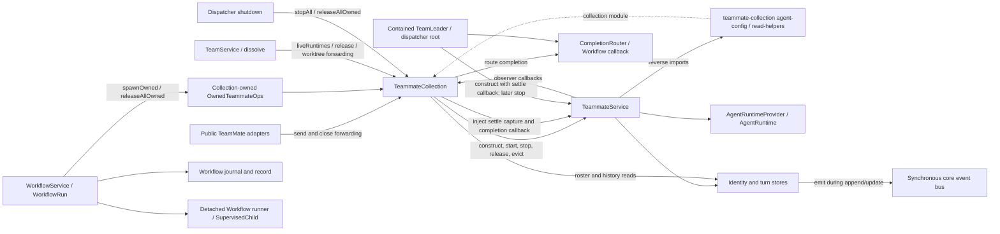
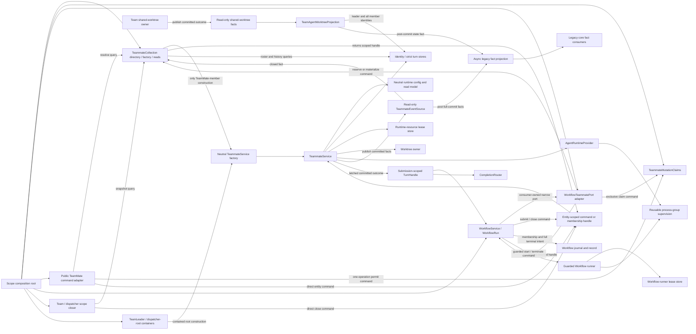
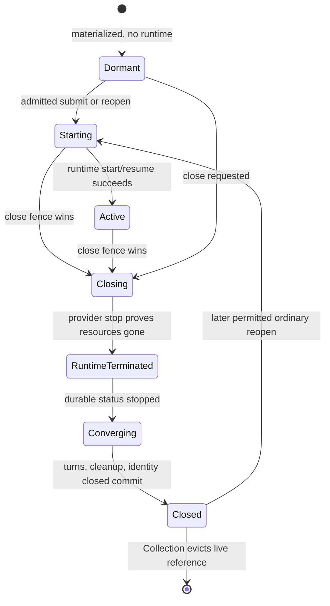
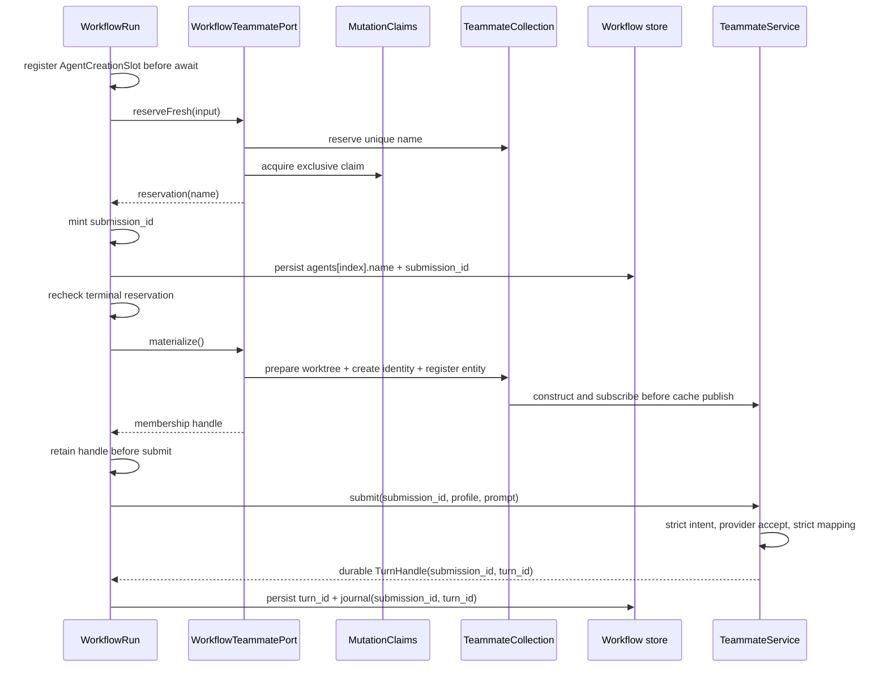
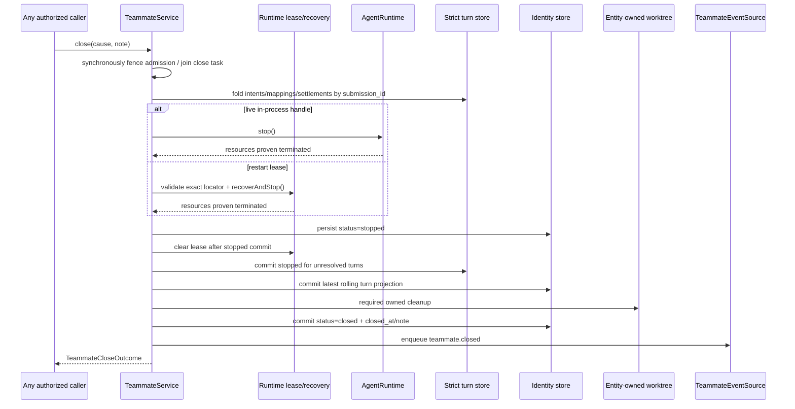
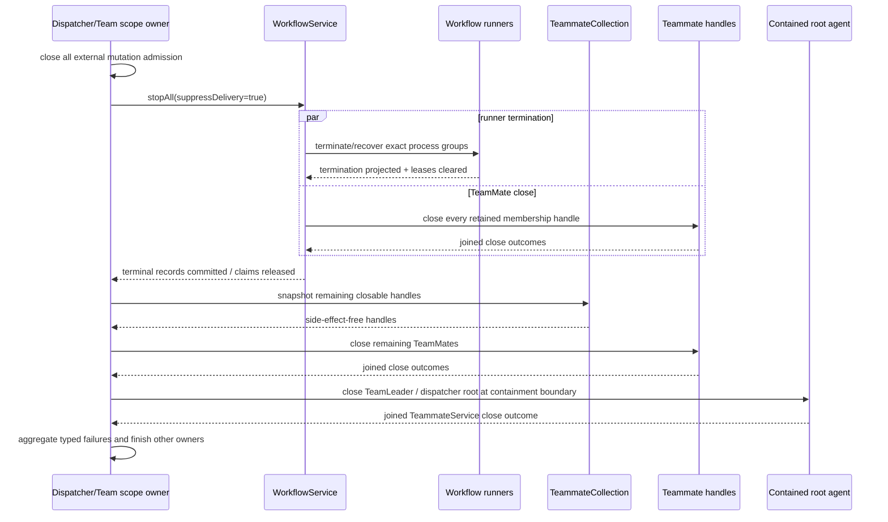
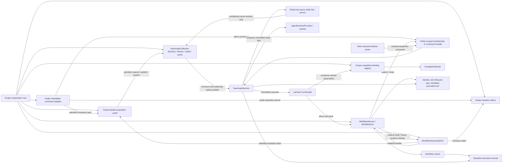

# Proposal: entity-owned TeamMate lifecycle with committed fact events

- Proposal seat: `arch-events` (first-round independent proposal)
- Source baseline: `6b8ec14b080389bf6c6ae36fa336ec0451e401ec`
- Requirement SHA-256: `863d7c8faa08f6a344654bd74a093fc5a6e1b13380641a323416a2e085ee9e08`
- Status: proposed architecture

## Executive decision

Adopt one entity-owned lifecycle and remove Collection-owned lifecycle
orchestration.

`TeammateService` becomes the only owner of start, reopen, turn admission,
settlement, runtime termination, entity-owned cleanup, durable close, and close
retry. It exposes narrow entity-scoped command handles and a read-only event
source. A successful `close()` means that the runtime is proven terminated, all
accepted unfinished turns have a durable terminal outcome, required
entity-owned cleanup has converged, and the durable identity is `closed`.

`TeammateCollection` remains the single TeamMate-member construction path,
directory, durable roster/read owner, and live cache. All contained agent roles
use the same neutral `TeammateService` factory; TeamLeader and dispatcher-root
instances remain directly contained by their scope owners rather than becoming
Collection members. Collection subscribes before publishing a live member and
evicts only its own matching cached reference after receiving a committed
`teammate.closed` fact. It does not wrap close for eviction and does not expose a
bulk close/release verb.

`WorkflowService` owns the durable Workflow-to-TeamMate relationship and close
timing, plus the admission and termination of its own detached orchestration
runner. It depends on a consumer-owned `WorkflowTeammatePort`, retains one
membership-scoped handle per materialized agent, calls `handle.close()` before
waiting for agent settlement, proves its runner process group terminated, and
releases the process-local mutation claim only after the Workflow journal and run
record are terminal. Explicit stop, natural completion, runner failure, restart
recovery, Team dissolve, and Server shutdown join this same close-first terminal
pipeline.

A two-phase fresh reservation records the concrete TeamMate name in the
Workflow record before the identity or runtime can appear. The reservation and
a neutral exclusive mutation claim are not a Workflow-specific entity kind.
The same port shape can later acquire an existing ordinary or historical
TeamMate without creating a second entity; that product operation is not exposed
in this task.

This proposal deliberately does **not** add a persisted `workflow_owned`,
`created_by_workflow`, `closing`, or `runtime_terminated` identity state. It does
add two classes of neutral durability fact required to make the lifecycle
truthful across a crash: a host-minted `submission_id` in Workflow/turn records,
and guarded resource-lease sidecars for a TeamMate runtime or detached Workflow
runner while its exact process group may still exist. The existing durable
`stopped` identity state and Workflow terminal record are written only after
their respective current or recovered resource termination is proven. These
facts neither type the entity to a Workflow nor create a second Agent lifecycle.

PR #316 and Feishu topic-close inference remain excluded. This design also does
not expose attach-existing as a product operation, replace TeamMate history/read
surfaces, change worktree deletion safety, add a configurable stop policy, or
select an arbitrary MCP timeout.

## Binding architecture red line

The operator's wording is the rejection rule for this design:

> 第 3 点，其实我觉得也不太对，就是说，关闭 TeamMate 不应该经过 TeamMate Collection。而应该是 TeamMate 对外抛出事件，由 TeamMate Collection 监听事件之后，把它从自己的引用中移除掉
> 整体的设计，为什么我总是强调必须要有架构师？让架构师把控住每个模块到底应该包含什么样的能力？它应该怎么样自闭环的管理自己的生命周期？先把我说的这些都明确到 Task 里。

> 需求主干的第三点需要扩散一下范围，既然 Stop 是这个样子控制的，那肯定有大量的代码都是类似的场景，需要把它们的依赖关系反转过来。这个地方，我感觉发布订阅模式还是挺有用的。而且之前也已经给部分模块继承了 eventemitter 了。
> 这个作为基础方案设计的要点，先把 TeamMate Service 和 TeamMateCollection 和 Workflow Service 三者之间给我捋清楚依赖关系

> 你这几个技术问题问的太白痴了，我架构不是已经告诉你了吗？不要搞那种正向依赖关系，就是为了让 TeamMate Collection 感知到 TeamMate 关闭了，需要通过 TeamMate Collection 的 Close 调用到 TeamMate 的 Close。这个设计太白痴了，太傻逼了，我不知道是怎么写出来的

Consequently, all of the following fail architecture review:

- renaming `releaseAllOwned()` while retaining Collection-owned bulk close;
- making a Collection `close()` facade call the entity and then evict it;
- making an entity await a Collection callback so the entity can settle or
  close;
- using an event as a command asking the Collection or Workflow to finish an
  entity transition;
- retaining a Collection-owned DTO whose only purpose is to route entity close
  through the observer.

A Collection-owned construction transaction may cancel resources that have not
published an identity. If the durable identity publication point has won, all
rollback callers use the same entity-scoped `close()` command and cache eviction
still occurs only from the committed close fact. This is construction rollback,
not a second close state machine.

## Current architecture and failure evidence

The current implementation already has one durable TeamMate identity and one
runtime-provider seam, but responsibility is split around it:

- `WorkflowRun` imports Collection-defined `OwnedTeammateOps`, calls
  `spawnOwned()`, and later calls `releaseAllOwned()`
  (`workflow-service/run.ts:4-10,39-44,313-340,560-586`).
- `spawnOwned()` completes worktree preparation, identity creation, runtime
  start, and initial submission before Workflow can persist the concrete name
  and turn ID (`teammate-collection/index.ts:208-309` and
  `workflow-service/run.ts:345-360`).
- Collection `close()` calls `entity.close()` and then manually evicts the
  entity (`teammate-collection/index.ts:326-331`).
- Collection owns `exclusivelyOwned`, global settlement capture, completion
  routing, raw runtime enumeration, mixed owned/unowned shutdown, and bulk
  release (`teammate-collection/index.ts:145-189,449-504,619-627`).
- `TeammateService` has no closing admission fence or close single-flight.
  `stop()` waits only the `starting` promise visible at that instant, while a new
  `ensureStarted()` can cross the boundary
  (`teammate-service/index.ts:250-288,324-379`).
- Runtime state callbacks retain old identity snapshots and can write through a
  stale runtime after close (`agent-entity/runtime-state.ts:13-88` and
  `agent-entity/identity-store.ts:335-404`).
- TeamMate settlement uses Collection callbacks, and the current turn-store
  append path swallows write failure; therefore the resulting notification does
  not prove a committed settlement (`teammate-service/index.ts:452-506` and
  `agent-entity/turns-store.ts:59-68,76-125,200-217`).
- `TeammateService` imports two leaf helpers from the Collection directory while
  the Collection constructs the service. This is a bidirectional directory and
  ownership dependency, even though the individual leaf files do not create a
  literal ESM import cycle (`teammate-service/index.ts:18-23` and
  `teammate-collection/index.ts:532-579`).
- A cache hit in `entityFor()` ignores the new constructor-time Workflow route,
  schema, and prompt (`teammate-collection/index.ts:532-557`), which blocks a
  correct attach-existing implementation.
- Workflow finalization drains tasks that wait for `call.settled` before it runs
  the only operation that terminates the producer
  (`workflow-service/run.ts:373-397,560-586`).
- `ForkedWorkflowRunner` is itself a detached `SupervisedChild`; daemon/IPC loss
  calls script-level `abortWorkflow()` but does not prove that an uncooperative
  script or its process group exited (`workflow-service/runner-process.ts:30-73`,
  `workflow-service/runner.ts:45-53`, and
  `dreamux-utils/src/supervised-child.ts:154-164`).
- Team dissolve captures these runtimes as writers and waits for idle before
  logical close asks Workflow to stop (`team-service/index.ts:384-438` and
  `team-collection/dissolve-runner.ts:78-98,219-288`).
- Server shutdown splits ordinary `stop`, owned `release`, and Workflow-specific
  shutdown behavior (`dispatcher-service/index.ts:266-280,326-333` and
  `workflow-service/index.ts:217-237`).
- TeamLeader and dispatcher root are already contained `TeammateService`
  instances, not a separate AgentService implementation
  (`team-service/index.ts:591-608`, `team-service/leader-agent.ts:58-87`, and
  `dispatcher-service/agent.ts:56-89`). Their injected settlement callbacks and
  `stop()` call sites are therefore part of this same lifecycle audit; the
  proposal does not reclassify their durable roles or make them Collection
  members.
- Both built-in runtimes already drive interrupted turns toward `stopped`, but
  `SupervisedChild.stop()` returns immediately after `SIGKILL` without a bounded
  process-group liveness verification (`dreamux-utils/src/supervised-child.ts:109-131`).
- `SupervisedChild` launches a detached process group and keeps its PID only in
  memory (`dreamux-utils/src/supervised-child.ts:38-47,154-164`). A daemon crash
  can therefore leave a resident group alive; a replacement daemon cannot infer
  termination merely because its own cache has no runtime handle.

### Current dependency graph



The graph contains a bidirectional source-directory dependency and a lifecycle
cycle. The latter is the deadlock: Workflow waits for settlement, settlement
requires termination, and termination is hidden behind a Collection bulk verb
called only after the wait.

## Target ownership and dependency direction

### Authoritative owners

`TeammateService` owns:

- process-local admission, lifecycle generation, runtime epoch, active runtime,
  accepted turns, terminal-outcome reservation, and close progress;
- provider-neutral start/resume/stop and runtime callback validation;
- strict submit/settle persistence and rolling identity projection;
- cleanup only for a worktree owned by that TeamMate;
- idempotent close result/error and committed entity events.

It does not own Workflow membership, public-access policy, cache eviction,
completion delivery, a Team shared worktree, or provider-specific process
signals.

`TeammateCollection` owns:

- the only TeamMate-member name-allocation and construction path;
- construction reservations and pre-identity rollback;
- durable roster, identity/turn read access, and scoped read projections;
- side-effect-free lookup/materialization and live registration;
- subscription lifetime for each cached entity;
- conditional eviction and durable-state reconciliation of its own cache.

It does not own active Workflow membership, public mutation authority, entity
settlement, runtime teardown, close timing, bulk release, or post-close manual
eviction.

TeamService and DispatcherService own containment of their TeamLeader and
dispatcher-root `TeammateService` instances. They construct those roles only
through the same neutral `createTeammateService` factory, bind each returned
`TurnHandle` to their CompletionRouter before reporting submit success, and call
the same entity `close()` contract at Team close or scope shutdown. They do not
retain the old public `stop()` shortcut or a second settlement callback path.

`WorkflowService` and `WorkflowRun` own:

- the durable run-agent-to-TeamMate name relation;
- runner and agent-creation admission;
- guarded launch, exact process-group termination, and the durable lease for the
  Workflow's own detached orchestration runner;
- per-agent prompt/schema/result correlation and Workflow result validation;
- retained fresh reservations and materialized membership handles;
- the decision to close all member handles;
- agent records, journal events, terminal run record, delivery, and claim-release
  timing.

They do not construct runtimes, interpret provider state, wait a model-specific
grace period, synthesize an Agent close state machine, or ask Collection to
release members.

`TeammateMutationClaims` is a neutral scope-level coordination primitive,
constructed at the composition root. It owns only process-local access
linearization:

- an exclusive claim blocks all public side-effect permits for one TeamMate;
- a public permit blocks a concurrent exclusive acquisition for the duration of
  one operation;
- an internal scope-close permit may close during shutdown/dissolve and joins
  entity close, but is never exposed through public MCP;
- claim holder keys are diagnostic correlation, not persisted membership.

The Workflow record remains the durable source used to restore claims after a
restart.

`AgentRuntimeResourceLeaseStore` owns one fully server-owned sidecar per live
entity runtime. Core understands only the envelope (scoped entity role, provider,
`entity_instance_id`, issuance time); the selected provider owns and validates
the opaque recovery locator. A runtime may not leave its guarded launch state or
commit identity `starting/running` until that lease is durable. Clean or
recovered termination retains the lease through the durable `stopped` commit and
clears it only afterward. This is resource ownership evidence, not Agent or
Workflow state.

### Target dependency graph



There is no `TeammateService -> TeammateCollection` edge. Collection is never on
the call stack because it needs to observe close. Workflow sees only its own
port and entity-scoped handles, not the concrete Collection or a Collection bulk
lifecycle API.

## Narrow capability contracts

The exact exported names may be adjusted to repository naming conventions, but
the separations and semantics below are normative.

### Entity command and turn handles

```ts
export interface TeammateLifecycleHandle {
  readonly name: string;
  readonly events: TeammateEventSource;

  submit(input: TeammateSubmitInput): Promise<TeammateTurnHandle>;
  close(input: TeammateCloseInput): Promise<TeammateCloseOutcome>;

  snapshot(): TeammateLifecycleSnapshot;
  writerActivity(): TeammateWriterActivity;
}

export interface TeammateTurnHandle {
  readonly submission_id: string;
  readonly turn_id: string;
  readonly settled: Promise<TeammateTurnOutcome>;
}

export interface TeammateTurnOutcome {
  submission_id: string;
  turn_id: string | null;
  status: 'completed' | 'failed' | 'stopped';
  result: string | null;
  settled_at: number;
}

export interface TeammateSubmitInput {
  submission_id: string;
  prompt: string;
  intent: string;
  origin: AgentEntityTurnOrigin;
  output_schema?: Record<string, unknown>;
  launch_profile?: Readonly<{
    system_prompt_append: readonly string[];
  }>;
}

// Derived by the entity after neutral provider-capability resolution.
interface EffectiveRuntimeGenerationProfile {
  system_prompt_append: readonly string[];
  create_context_output_schema?: Record<string, unknown>;
}

export interface TeammateLifecycleSnapshot {
  entity_instance_id: string;
  lifecycle_generation: string;
  phase: 'dormant' | 'starting' | 'active' | 'closing' | 'closed';
  effective_status: AgentEntityIdentityStatus;
  durable_status: AgentEntityIdentityStatus;
  runtime_termination: 'absent' | 'live' | 'terminating' | 'terminated' | 'unproven';
  close_failure: TeammateCloseFailure | null;
}
```

The handle is bound to an unforgeable mutation permit when it is created. The
permit is not passed around as a public DTO. A public handle is valid for one
operation; a membership handle captures an exclusive permit for the membership;
a scope-close handle exposes `close()` only. Every side-effecting entity entry
point, including `send`, `close`, reopen/start, channel input, scheduled input,
and reverse completion input, validates authority before touching a runtime.
Runtime callbacks are continuations of already-admitted work and instead
validate the runtime epoch.

`TeammateMembershipHandle.releaseClaim()` synchronously revokes that handle as
well as releasing the claim; every later `submit()` or `close()` through the
stale handle rejects. Already-completed close/query results remain readable. A
future Workflow attachment receives a new handle/permit, so releasing one run
cannot leave a latent writer into a later ordinary or Workflow generation.

The caller mints `submission_id` with the neutral host UUID helper. Workflow
persists it before calling the entity; ordinary/leader/dispatcher adapters create
it before their call. Entity first commits a strict submit-intent row containing
that ID plus an entity-derived `request_fingerprint` and installs the settlement
slot, then invokes the provider. The caller cannot supply or override the
fingerprint. Its exact form is `v1:sha256:<64 lowercase hex>`, whose digest is
SHA-256 over a canonical JSON envelope that itself includes canonicalization
version `1`, the full prompt, intent, normalized origin, normalized output
schema, and normalized effective launch profile. Object keys are recursively
sorted, arrays retain order, and absent optional values have a distinct canonical
encoding; timestamps, previews, provider IDs, process-local instance/generation
tokens, and `submission_id` itself are excluded. Unsupported/non-JSON values and
cycles fail before provider I/O. This stores no second full prompt while still
distinguishing long prompts with an
identical preview. Entity commits the provider `turn_id` mapping before
`submit()` returns. A provider that settles synchronously cannot outrun
`TeammateTurnHandle.settled`, and neither crash recovery nor idempotency depends
on provider turn-ID uniqueness.

TeamMate completion delivery likewise keys router registration by
`completionSubmissionKey(entity.name, submission_id)`, not provider `turn_id`.
For a TeamMate envelope, that same key is the stable `id`; the envelope also
carries `submission_id` and nullable `turn_id` as separate fields. Consequently
the receiving entity's `sourceId = completion:${completion.id}` dedupes one host
submission, not one provider turn. Two submitted/steered calls sharing a provider
turn therefore produce two distinct delivery attempts, while retrying either one
retains a stable ID. Workflow terminal delivery keeps its separate run-ID key.

Workflow result/schema correlation remains call-scoped, but runtime application
is capability-aware. Entity resolves `AgentRuntimeCapabilities.structuredOutput`
before provider I/O:

- `scope: 'per-turn'`: pass `output_schema` on that submit; schemas are
  independent within one runtime generation (Codex);
- `scope: 'create-context'`: the first admitted submit's exact optional schema
  becomes `create_context_output_schema` in the effective runtime-generation
  profile (Claude Code). Every later submit to that live generation must have a
  canonically equal schema, including absent-versus-present equality, or fail
  before provider input. Entity supplies the schema at guarded runtime creation
  and omits it from per-turn input, so the provider cannot compare a differently
  ordered caller object against its spawn object. A different schema is legal
  only on an authorized new generation, such as initial dormant start or later
  close/reopen/future attach; the entity never silently cancels a live generation
  merely to change schema;
- unsupported/omitted capability plus a schema fails before runtime launch or
  submit.

`system_prompt_append` is likewise bound to the runtime generation opened for
the membership, not to the TeamMate constructor or durable identity. A later
ordinary send after close opens a new generation with the ordinary profile. This
removes the current cache-hit behavior that silently ignores a new Workflow
profile while preserving providers whose schema is spawn-time state. The entity
derives the effective profile; a caller cannot mislabel a create-context schema
as per-turn. A fresh reservation can reject a known unsupported profile before
identity publication. On an already materialized entity, mismatch is checked
after the strict intent is durable but before runtime/provider I/O and converges
that `submission_id` to a null-turn failed outcome, so retry cannot later turn the
same request ID into provider work.

### Fresh reservation and membership port

```ts
export interface WorkflowTeammatePort {
  reserveFresh(input: FreshTeammateInput): Promise<FreshTeammateReservation>;

  // Recovery-only in this task; the same shape is the future product seam.
  recoverExisting(input: ExistingTeammateMembershipInput):
    Promise<TeammateMembershipHandle | null>;
}

export interface FreshTeammateReservation {
  readonly name: string;
  readonly settled: Promise<
    | Readonly<{ kind: 'cancelled' }>
    | Readonly<{ kind: 'materialized'; handle: TeammateMembershipHandle }>
  >;

  materialize(): Promise<TeammateMembershipHandle>;
  cancel(): Promise<void>;
  releaseCancelled(): void;
}

export interface TeammateMembershipHandle extends TeammateLifecycleHandle {
  releaseClaim(): void;
  querySubmission(submission_id: string): Promise<TeammateTurnOutcome | null>;
}
```

`reserveFresh()` reserves a validated unique name and an exclusive mutation
claim but creates neither identity nor runtime. `WorkflowRun` registers the
reservation before awaiting it, mints a host `submission_id`, and persists both
`agents[index].name` and `agents[index].submission_id` before calling
`materialize()`.

`materialize()` and `cancel()` share one state machine. Before publication the
factory resolves configuration/provider capabilities, prepares the worktree,
builds the unpublished identity record, constructs the entity around that
record, and installs the Collection subscription. The linearization point is
the subsequent durable identity create performed under the Collection
construction reservation:

- cancellation wins before identity create: prepared construction resources are
  cleaned, no identity or runtime exists, and `settled` is `cancelled`; the name
  reservation and exclusive claim remain held pending durable compensation;
- identity create wins: `settled` must eventually return a handle, even if stop
  is now requested; Workflow retains that handle and immediately closes it;
- after publication, neither Collection nor the claim registry can silently
  erase the entity or convert the result to a cancellation.

`settled: cancelled` means construction cleanup has converged; it does not mean
the protective reservation was released. Only `releaseCancelled()` has that
meaning, and it is illegal before the Workflow compensation write.

The exclusive claim exists before identity publication, so an identity visible
through durable roster reads is already protected from public mutation. The
Workflow record contains the name before publication, so restart recovery can
close a published entity or clean a named, unmaterialized reservation without an
orphaned business relationship.

If cancellation wins, successful construction cleanup is followed by a
Workflow record write that restores both `name` and `submission_id` to `null`
before terminal commit. Only after that write succeeds does Workflow call
`releaseCancelled()`, which atomically releases the Collection name reservation
and neutral claim and is idempotent. Until cleanup and compensation succeed, the
reservation name and claim remain as recovery evidence and the Workflow cannot
claim a successful terminal. Thus a terminal Workflow record never points at a
TeamMate identity that was never published.

Expected validation, provider capability lookup, worktree-policy resolution,
entity construction, and subscription occur before the identity linearization
point. After the identity create, synchronously publishing the already-built
entity in the cache and resolving the handle contains no expected fallible I/O.
If an unexpected process-local failure nevertheless occurs after publication,
the result must carry the already-built recoverable entity handle; it must never
reject while losing the only handle. The caller closes that handle through the
normal entity contract. The close event, not the construction caller, evicts any
live Collection reference. A process crash in this narrow interval is recovered
from the Workflow record's already-persisted name plus the durable identity.

The port is consumer-owned and implemented at the composition root by combining
the Collection construction/directory capabilities with the neutral claim
registry. Neither Collection nor `TeammateService` imports Workflow types.

### Future attach-existing compatibility

The MVP exposes fresh reservation only. Internally, `recoverExisting()` proves
the future shape:

1. resolve one durable identity in the same scope without starting it;
2. atomically acquire the same exclusive mutation claim used by fresh creation;
3. bind the same `TeammateMembershipHandle` to that identity;
4. persist the Workflow record's `agents[index].name` plus a new host
   `submission_id` as the relationship and exact call correlation;
5. open a membership runtime generation with the membership launch profile and
   persist that same ID in the TeamMate turn ledger;
6. close the same entity at terminal and release the claim only after Workflow
   terminal commit.

The future public operation can use this exact path for either an ordinary
TeamMate or one created by an earlier Workflow. No identity role, creator field,
event route, close rule, or claim key records creation provenance. At most one
Workflow has the exclusive mutation claim at a time; the same TeamMate may join
different Workflows sequentially across its lifetime.

Attaching an already-live ordinary TeamMate requires a future product policy:
reject until dormant, or explicitly close the current runtime generation before
opening the membership profile. That policy is intentionally not implemented
here. The architecture does not require a second identity in either case.

## Owner / command / query / event matrix

| Audited surface | Current direction | Authoritative target owner | Target interaction and reason |
| --- | --- | --- | --- |
| Scope composition | Team/Dispatcher construct Collection, then inject its bulk API into Workflow | Scope composition root | **Command/wiring:** construct Collection, claims, Workflow port, public adapter, and subscriptions. No service locates another observer globally. |
| Workflow run publication | Async run creation can cross `stopAll()` before active-map publication | `WorkflowService` admission tickets | **Command/state:** register a creation ticket before I/O; admission-close either cancels pre-publication or hands one published run to the normal terminal pipeline. |
| Workflow runner process | Detached `ForkedWorkflowRunner`; IPC disconnect requests script abort but no crash-recoverable process proof exists | `WorkflowService` via guarded runner handle and runner-lease store | **Command/state:** Workflow durably leases and arms its own runner, and terminal/restart paths prove the exact group gone before a terminal record. This is Workflow-owned orchestration infrastructure, not a TeamMate/provider lifecycle. |
| Name allocation and identity/worktree construction | Collection `spawn`/`spawnOwned` | `TeammateCollection` construction reservation | **Command:** port/public creation adapter asks the one factory to reserve/materialize. Collection rollback is limited to pre-identity resources. |
| Workflow membership | Collection owner `symbol` map plus Workflow agent name | `WorkflowService` durable run record | **Command/query:** Workflow writes/reads `agents[].name` and the pre-submit `submission_id`; the process claim is reconstructed from every non-null name in a running record and is never business truth. |
| Active mutation exclusion | Collection `exclusivelyOwned` map checked in selected wrappers | Neutral `TeammateMutationClaims` | **Command:** acquire/release exclusive or one-operation public permits at one gate. Entity-scoped handles enforce the permit at every side-effect entry. |
| Public `send` | Public adapter -> Collection `send()` -> entity | `TeammateService` | **Query + command:** resolve through Collection, acquire public permit, invoke entity handle directly. Collection has no completion or lifecycle step. |
| Public individual `close` | Collection calls entity, then manually evicts | `TeammateService` | **Query + command:** resolve and acquire public permit, then direct handle `close()`. **Event:** Collection later observes `teammate.closed` and evicts its own reference. |
| Channel/scheduled/reverse input | Callers can reach entity start paths without a common membership fence | `TeammateService` command admission plus neutral claims | **Command:** every external side effect obtains a permit before entity admission. Active membership makes the public surface read-only. |
| Fresh Workflow create | `WorkflowRun -> spawnOwned()` combines create/start/submit | Collection factory for construction; Workflow for membership; entity for start/submit | **Commands:** reserve name/claim, persist name plus host submission ID, materialize, retain handle, then submit. Each owner controls only its transition. |
| Future/recovery attach | No capability; constructor route assumes fresh creation | Workflow port plus Collection lookup and claims | **Query + command:** resolve the existing identity, acquire claim, return the same membership handle. It creates no entity kind. |
| Runtime start/resume/reopen | Entity owns most mechanics but constructor-fixed options come from Collection | `TeammateService` | **Command:** handle submit opens a runtime generation with a generation/turn profile. The entity alone serializes start, reopen, and close. |
| Workflow close timing | Workflow calls Collection bulk release after drain | `WorkflowRun` | **Command:** terminal pipeline calls each retained `handle.close()` immediately. It does not define close mechanics. |
| Single-entity close mechanics | Entity method plus Collection release/eviction orchestration | `TeammateService` | **Command:** one admission-fenced, single-flight, retryable close state machine. No observer is a required step. |
| Runtime termination | Collection/Workflow choose `stop` versus `release`; provider owns process | Provider-neutral runtime plus resource-lease contract, invoked by entity | **Command/state:** guarded launch persists a recoverable lease; current or recovered `stop()` proves bounded termination before clearing it. Workflow never names signals/providers. |
| Turn submit persistence | Entity appends, while routing is injected from Collection | `TeammateService` and strict turn store | **Command/state:** entity commits a host `submission_id` intent before provider submit and its provider-turn mapping before returning a latched handle. |
| Turn settlement and drain | Runtime -> entity -> Collection capture/callback -> Workflow/router | `TeammateService` | **Command/state:** entity rehydrates submissions, reserves outcome by submission ID, commits turn and rolling identity, resolves `TurnHandle`, and publishes a fact. Entity close drains its own queue. |
| Workflow agent result | Constructor callback routes directly into a particular Workflow call | `WorkflowRun` | **Fact/query:** latched `TurnHandle.settled` or ledger recovery updates only the matching run/index/name/submission. A submitted agent outcome is never independently invented by Workflow. |
| Ordinary completion delivery | Collection registers and routes completion by producer/provider turn ID; receiving input dedupes `CompletionEnvelope.id` | `CompletionRouter` | **Fact reaction:** after `submit()` returns, the initiating adapter registers by producer/host submission ID and binds the already-latched handle before returning public success; an already-resolved promise cannot be missed. Its TeamMate envelope ID is the same producer/submission key, with provider turn ID only as data. Router owns delivery retry. |
| TeamLeader / dispatcher-root settlement | Their contained `TeammateService` receives injected settle callbacks and exposes public `stop()` | Containing Team/Dispatcher adapter plus entity | **Command/fact:** the container binds the returned `TurnHandle` to its router and uses entity `close()` for containment shutdown. It neither owns settlement nor bypasses durable close. |
| Workflow terminal outcome | In-memory terminal latch plus an `end` journal row that omits result/error | `WorkflowRunTerminal` plus Workflow journal | **Command/state:** first-winner terminal intent includes `status`, `result`, `error`, and `ended_at`; `ensureEnd()` commits/compares the complete payload before the run record. Recovery uses that exact payload. |
| Entity lifecycle event | No explicit committed close source | `TeammateService` | **Post-transition fact:** private publisher enqueues immutable `turn_settled` and `closed` facts; subscribers cannot mutate publisher state. |
| Legacy core-event projection | Identity/turn stores synchronously emit `agent.state` / `turn.*` while writes are still on the transition stack | Composition-owned asynchronous projection bridge | **Fact reaction:** strict stores never publish; after the full entity commit the bridge maps TeamMate facts to legacy core facts. Listener failure cannot roll back the entity. |
| Live cache and eviction | Collection manually evicts after close/release | `TeammateCollection` | **Fact reaction/query:** subscribe before cache publication; evict matching source/generation on closed; reconcile from durable identity after missed delivery. |
| Roster/list/status/history/last | Collection and some entity methods share projections | Collection/read-store boundary | **Query:** Collection overlays cached lifecycle truth on durable rows, including termination proof/failure, and otherwise reads stores. Pure projections move downward; reads ignore claims. |
| Raw live runtime enumeration | Collection exposes `AgentRuntime`; Team turns it into a writer | Entity owns runtime; Team owns dissolve coordination | **Query:** Collection returns entity handles; `writerActivity()` exposes no raw runtime and never starts an absent runtime. |
| Raw runtime capability/input access | Collection validates schema on `getRuntime()`; root services pull runtime for status/restart/scheduled input | `TeammateService` capability-specific surface | **Query/command:** `runtimeCapabilities()` is side-effect-free; restart notice, scheduled, channel, and reverse input are admitted entity commands bound to the current epoch. No caller receives `AgentRuntime`. |
| Spawn failure rollback | Only owned spawn has Collection release cleanup | Construction reservation before publication; entity after publication | **Command:** cancel pre-identity reservation; once identity exists, caller invokes the same entity close. Closed event owns cache reaction. |
| Entity-owned worktree cleanup | Entity performs it during release/close | `TeammateService` | **Command/state:** close performs only its own managed cleanup and reports a typed stage/outcome. Existing safety rules remain unchanged. |
| Team shared-worktree synchronization | Team -> Collection forwarding -> member identity update, plus direct leader update | Team/worktree owner for fact; agent-entity projection subscriber | **Fact:** after each Team-record pending/final worktree commit, Team publishes that revision; an instance-independent subscriber updates/reconciles leader and all member identities. Collection is not a forwarder. |
| Runtime/config resolution | Entity imports `teammate-collection/agent-config` | Neutral runtime-config module | **Query:** Collection and entity depend downward on shared resolution; no entity-to-Collection import. |
| Read projection helpers | Entity imports `teammate-collection/read-helpers` | Neutral `agent-entity` read model for pure projections; Collection for filters/cursors | **Query:** split helpers by ownership and remove the bidirectional directory dependency. |
| Team dissolve | Idle wait precedes the Workflow close that would make it idle | Team dissolve runner for ordering; entity for close | **Command/query:** fence, stop Workflows/close their handles, then wait remaining ordinary writers and continue existing worktree safety. |
| Server shutdown | Workflow freeze, Collection release, and mixed Collection stop sweep | Scope shutdown coordinator for scope; entity for each close | **Command:** close admissions, join Workflow terminal pipelines, then direct-close remaining handles. Duplicate callers join entity single-flight. |
| TeamLeader and dispatcher-root shutdown | Team/Dispatcher call `stop()` and leave identity non-closed in some paths | Their containing scope owner for ordering; `TeammateService` for mechanics | **Command:** close through the same entity contract; dispatcher root closes last after children/input sources, and TeamLeader closes before Team logical close. |
| Restart recovery | Workflow records are marked stopped without closing named TeamMates; detached process location is lost | Provider resource recovery, entity ledger rehydration, then Workflow recovery | **Query + command:** prove/perform orphan termination from a verifiable lease, rebuild every running-record claim, close/reconcile by submission ID, restore the exact journaled terminal intent, then release claims. Unproven resources block close. |
| Later ordinary reopen | Closed event/owner release evicts, later Collection materializes and entity reopens | `TeammateService` | **Query + command:** after claim release, public adapter resolves the retained identity and ordinary submit opens a new runtime generation. No terminal Workflow is touched. |

## Lifecycle contracts

### TeamMate process-local state machine



`Closing`, `RuntimeTerminated`, and `Converging` are process-local phases, not new
persisted identity statuses. Their durable mapping is:

| Process phase | Durable identity requirement | Runtime pointer |
| --- | --- | --- |
| `Dormant` | existing `stopped` or `closed` snapshot | `null` |
| `Starting` / `Active` | existing `starting` / `running` / `degraded` projection | published epoch handle |
| `Closing` before termination proof | last committed status; live read reports closing and the close error is authoritative | terminating handle retained |
| `RuntimeTerminated` / `Converging` | commit existing `stopped` before later work | `null` |
| `Closed` | existing `closed`, stable `closed_at` and note | `null` |

On daemon startup, absence of an in-memory handle is **not** termination proof.
For every runtime-resource lease, the selected provider validates the opaque
locator against PID/process-group reuse and either proves the original resources
already absent or obtains a recovery handle and terminates them. Only then may
the entity persist `stopped`, followed by clearing the lease. A `starting`,
`running`, or `degraded` identity with neither a verifiable lease nor another
provider proof is
an explicit `runtime_termination` recovery failure: mutation remains fenced,
reads expose `runtime_termination: 'unproven'`, and recovery must not write
`stopped` or `closed`. Materialization never starts a runtime merely to inspect
or close it.

### Close input, result, and error

```ts
export type TeammateCloseCause =
  | 'public'
  | 'workflow-terminal'
  | 'team-dissolve'
  | 'server-shutdown'
  | 'construction-rollback'
  | 'start-compensation'
  | 'submit-compensation'
  | 'restart-recovery';

export interface TeammateCloseInput {
  cause: TeammateCloseCause;
  note: string;
}

export interface TeammateCloseOutcome {
  name: string;
  runtime_terminated: true;
  turns_converged: true;
  entity_owned_cleanup_converged: true | null;
  identity_status: 'closed';
  closed_at: number;
  close_note: string | null;
}

export type TeammateCloseFailureStage =
  | 'runtime_termination'
  | 'runtime_lease_persistence'
  | 'runtime_state_persistence'
  | 'turn_persistence'
  | 'worktree_cleanup'
  | 'identity_close';

export interface TeammateCloseFailure {
  stage: TeammateCloseFailureStage;
  runtime_terminated: boolean;
  durable_status: AgentEntityIdentityStatus;
  retryable: true;
  cause: unknown;
}
```

Rules:

1. The first close call synchronously fences all new start, reopen, submit, and
   external-input admission before its first `await`, records the first
   cause/note, and installs one close task.
2. Concurrent public, Workflow, Team, and shutdown callers join that task. They
   do not run another stop, cleanup, identity write, or event publication.
3. The runtime handle is published into the entity immediately after provider
   creation and before awaiting `start()` or `resume()`. A guarded child cannot
   begin resident work until its provider-opaque recovery lease is atomically
   durable; if the parent dies before arming, the guard terminates the group.
   Identity `starting/running` is not committed before that lease. `stop()` is
   allowed to race every launch phase. If close wins before provider creation,
   no runtime starts; if launch wins handle publication, close immediately stops
   that handle or its recovered resources.
4. The provider handle is detached from command admission into a terminating
   slot. Admission-stop and termination-proof are separate provider states. A
   rejected termination clears only the failed termination-attempt promise,
   retains the child/session/recovery handle and lease, and produces
   `runtime_termination` with `runtime_terminated: false`. Retry invokes the
   reaper again. Only proven termination removes the process handle from the live
   runtime slot and sets the entity runtime pointer to `null`; the durable lease
   remains until rule 5 commits `stopped`.
5. After termination, the entity strictly persists existing status `stopped`
   before clearing the durable resource lease, turn convergence, cleanup, or
   `closed`. Any later failure therefore does not expose a live runtime. If this
   write itself fails, the still-present lease lets restart revalidate absence,
   while Collection overlays
   the cached lifecycle snapshot on list/status/history/last: public status is
   effectively `stopped`, runtime is null, and the response exposes the lagging
   durable status plus close failure. On restart, the still-present lease allows
   the write to be retried before admission. A lease-removal failure after the
   stopped commit reports `runtime_lease_persistence` and is retried before turn
   convergence; the stale lease is harmless because its locator must revalidate
   the already-absent resource.
6. Before closing, the entity repairs/folds its durable turn ledger by host
   `submission_id`, rebuilding every submit intent or accepted submit without a
   settlement. It commits `stopped` for each rehydrated/current submission that
   has no earlier terminal reservation, drains strict turn/identity writes, and
   ignores late provider outcomes for that submission or an old epoch.
7. The entity performs only cleanup it owns. A Team-shared worktree remains
   owned by Team dissolve. Safe preservation is a successful cleanup outcome;
   an actual required-cleanup error stops close at `worktree_cleanup`.
8. Identity `closed` is the close linearization point. The same atomic update
   writes immutable `entity_owned_cleanup_converged_at_close: true` for every new
   successful close. `closed_at`, note, cleanup proof, and result are stable;
   repeated close after success returns the cached outcome.
9. The entity enqueues `teammate.closed` exactly once after the identity commit.
   Listener execution is outside the close call stack and cannot alter the
   result.
10. If a close phase fails, all concurrent callers receive the same typed
    failure. The failed executor task is cleared for retry, but admission remains
    fenced and the first cause/note remains fixed. Retry resumes from the first
    incomplete phase and never restarts a terminated runtime.

Every materialized `TeammateService` immediately mints an
`entity_instance_id` and an initial process-local `lifecycle_generation`; both
therefore exist on the legal close-before-start path. Runtime start separately
mints `runtime_epoch`. A permitted reopen from durable `closed` runs under the
same entity transition gate: it verifies that no close retry or claim conflict
is active, reprepares any entity-owned worktree, atomically rotates the lifecycle
generation/runtime epoch, clears only the prior generation's in-memory close
result, and persists the reopened start transition before accepting a turn. A
delayed event then fails the source-instance/generation check.

Repeated close on the same instance/generation returns its cached result and
does not republish. A new instance materialized from an already-closed identity
reconstructs the durable close outcome from identity fields and also does not
republish an old event; process tokens are never claimed to survive eviction or
restart. Reopen preserves the durable identity and turn archive but, as today,
may clear the identity's active `closed_at`/`close_note` fields. This proposal
does not claim a separate historical close ledger. Reconstruction reports
`entity_owned_cleanup_converged: true` only when the immutable close-time marker
is present. A historical closed identity without it reports `null`
(`legacy-unproven`), including a legal legacy `cleanup_state: 'retained-error'`;
it never treats the identity's current, possibly later Team-projected worktree
state as close-time proof.

New close commands always provide a validated non-empty note and a converged
cleanup proof, so newly emitted `teammate.closed.close_note` and
`entity_owned_cleanup_converged` remain non-null. Outcome fields are nullable
solely to reconstruct valid historical closed identities whose legacy owner
release may have written `close_note: null` and no immutable cleanup proof;
reconstruction does not rewrite them.

### Runtime contract

The provider-neutral `AgentRuntime.stop()` contract is strengthened, not
special-cased in Workflow:

- it is idempotent and safe before, during, or after `start()`/`resume()`;
- it stops accepting input immediately;
- it returns only when owned runtime resources are proven terminated;
- before return, it signals `stopped` for every accepted provider turn that has
  no provider terminal outcome;
- an inability to prove termination rejects rather than pretending success.

A failed stop attempt is retryable: provider `admissionStopped` remains true,
`terminationProven` remains false, the resource/recovery handle is retained, and
the failed single-flight is cleared. A later call either proves absence or
retries termination. Provider implementations may not set a success-like
`stopped` boolean, clear their process/session pointer, or return early merely
because the first termination attempt began.

`TeammateService` remains the durable authority and fills any missing `stopped`
turn signal after `stop()`; provider signals are inputs, not persisted truth.

Codex `TurnManager.stop()` and Claude Code's stopped-path settlement are retained
and covered by contract tests. `SupervisedChild` keeps its current bounded
`SIGTERM` window and group `SIGKILL`, then performs a second bounded
process-group liveness check. A still-live group rejects termination. No MCP
timeout is used as a lifecycle substitute.

### Runtime-resource lease and crash reaping

```ts
export interface AgentRuntimeResourceLease {
  version: 1;
  dispatcher_id: string;
  team_id: string | null;
  role: AgentEntityRole;
  entity_name: string;
  entity_instance_id: string;
  lifecycle_generation: string;
  runtime_epoch: string;
  provider_id: string;
  issued_at: number;
  opaque_recovery_locator: JsonSerializableValue;
}

// Provider-neutral; contains no dispatcher, Team, role, or entity identity.
export type AgentRuntimeRecoveryLocator = JsonSerializableValue;

export interface AgentRuntimeGuardedLaunch {
  readonly recovery_locator: AgentRuntimeRecoveryLocator;
  armAndWaitReady(): Promise<void>;
  abortAndProveTerminated(): Promise<{ termination_proven: true }>;
}

export interface AgentRuntimeGuardedStart {
  prepareGuardedLaunch(input: {
    mode: 'start' | 'resume';
    signal: AbortSignal;
  }): Promise<AgentRuntimeGuardedLaunch>;
}

export interface AgentRuntimeProviderResourceRecovery {
  recoverAndStop(locator: AgentRuntimeRecoveryLocator): Promise<{
    termination_proven: true;
  }>;
}
```

The core-owned envelope is stored atomically with mode `0600` at a host-owned
per-entity path. Core validates scope/provider/envelope version, selects the
provider, and passes only `opaque_recovery_locator` across the neutral seam; the
provider never receives dispatcher/team/role/name fields. Each provider must
bind that locator to the exact launched
resource using facts resistant to PID/process-group reuse, such as OS boot ID,
process start fingerprint, group ID, and a random launch token visible to the
guarded supervisor. A mismatch must never signal an unrelated process. If the
provider cannot prove the old resource absent or recover it safely, recovery
fails at `runtime_termination` and the identity stays non-closed.

Recovery is a catalog capability invoked directly from the persisted lease; it
must not call normal runtime construction/start merely to obtain a stop handle.
Providers whose resources cannot outlive the daemon return an explicit
parent-bound proof and still participate in guarded startup ordering; absence of
that capability is a provider validation error before identity publication.

There is otherwise an unavoidable crash window between detached spawn and lease
write. `prepareGuardedLaunch()` therefore returns only after the child exists
behind an unarmed parent-control guard; `armAndWaitReady()` is the sole operation
that lets resident work begin:

1. provider creation returns a process-free runtime object; entity publishes it
   into its launch slot before the first launch await;
2. entity calls `prepareGuardedLaunch({mode, signal})`; the provider spawns the
   blocked child, retains its process/group handle, and returns the opaque
   locator plus abort/arm handshake;
3. the guard terminates the group if the parent control channel closes before
   arming; entity atomically persists the core lease envelope;
4. entity commits its starting projection and calls `armAndWaitReady()`;
5. only readiness moves the entity to active; close before arm calls
   `abortAndProveTerminated()`, while close after arm calls normal runtime stop;
6. on clean/recovered stop, prove the whole group absent, commit identity
   `stopped`, then atomically remove the lease.

Lease-write failure invokes `abortAndProveTerminated()` while the unarmed guard
is still live; starting-projection failure does the same and then removes the
already-written lease. Arm/readiness failure enters the entity's same fenced
close path (`start-compensation`) using the retained runtime/lease. No failure
returns while an armed or unproven child is ownerless. Crash before step 3 is
covered by the guard; crash after step 3 is covered by lease recovery. A stale
lease whose exact resource is proven absent is safely cleared after repairing
identity `stopped` and converging every rehydrated unfinished submission to a
durable stopped outcome. An active-looking legacy identity with no lease is
ambiguous, not proof of absence, and fails loudly until provider-specific
recovery proves it safe.

### Workflow-runner process contract

The detached Workflow orchestration runner is not a TeamMate runtime, but it is
still a Workflow-owned resource that must terminate before the Workflow can
become terminal. It reuses the guarded process-group primitive beneath
`SupervisedChild` and has a separate host envelope:

```ts
export interface WorkflowRunnerResourceLease {
  version: 1;
  dispatcher_id: string;
  team_id: string | null;
  run_id: string;
  runner_instance_id: string;
  issued_at: number;
  opaque_supervised_child_locator: JsonSerializableValue;
}
```

Every new `WorkflowRunRecord` mints and persists `runner_instance_id` before any
runner process can spawn, and carries nullable `runner_started_at` and
`runner_terminated_at`. Launch ordering is:

1. persist the runner instance with both timestamps null;
2. prepare the child behind the same parent-death/unarmed guard;
3. atomically persist the mode-`0600` runner lease with its exact process-group
   locator;
4. arm the child and attach IPC, persist `runner_started_at`, and only then send
   `run_start`; pre-start readiness messages are buffered and the script cannot
   request an agent before that commit.

Failure before lease commit aborts the unarmed child. Failure after lease commit
retains the exact handle/lease and enters Workflow terminal compensation; a
runner whose started projection failed is never allowed to drive agents.
Script-level `abortWorkflow()` and IPC disconnect remain cooperative hints, not
termination proof.

Explicit stop, runner failure, natural completion, Team dissolve, and shutdown
all fence runner messages/agent creation and call one runner
`terminateAndProveGroupAbsent()` single-flight. Natural child exit still goes
through the same group-absence check. After proof, Workflow first persists
`runner_terminated_at`, then clears the lease; only afterward may it commit the
terminal journal/run record. A persistence or lease-clear failure keeps the run
nonterminal and retryable even though the effective runner is known dead. The
first proof timestamp is idempotent and stable; retries compare/reuse it rather
than inventing a later termination fact.

Recovery applies these rules before terminalizing a run:

- a runner lease is revalidated and its exact group is reaped; Workflow then
  persists `runner_terminated_at` and clears the lease;
- no lease plus null `runner_started_at` is safe only for the new guarded cohort:
  the child was never armed, so parent-death is termination proof; recovery
  persists `runner_terminated_at` before terminalization;
- no lease plus non-null `runner_terminated_at` is the durable proof produced by
  the normal termination ordering;
- no lease plus non-null `runner_started_at` and null `runner_terminated_at` is
  unproven and blocks terminalization;
- a terminal record with a stale lease is reconciled/reaped before external
  admission, then the fully server-owned sidecar is cleared; and
- an active legacy running record without the guarded-runner fields is fenced
  for explicit operator resolution rather than assumed dead.

This lease is owned by Workflow infrastructure and never enters
`TeammateService`, `TeammateCollection`, or `AgentRuntimeProvider`. Conversely,
Workflow never uses it to infer or terminate a TeamMate runtime.

## Event and settlement contracts

### Read-only event source

```ts
export interface TeammateEventSource {
  subscribe(input: Readonly<{
    label: string;
    listener: (event: TeammateFact) => void | Promise<void>;
  }>): () => void;
}

export type TeammateEntityRef = Readonly<{
  dispatcher_id: string;
  team_id: string | null;
  role: AgentEntityRole;
  name: string;
}>;

export type TeammateFact =
  | Readonly<{
      schema_version: 1;
      kind: 'teammate.state_committed';
      entity: TeammateEntityRef;
      entity_instance_id: string;
      lifecycle_generation: string;
      sequence: number;
      identity_revision: number;
      identity_status: AgentEntityIdentityStatus;
      identity_updated_at: number;
      session_id: string | null;
      last_error: string | null;
    }>
  | Readonly<{
      schema_version: 1;
      kind: 'teammate.turn_submitted';
      entity: TeammateEntityRef;
      entity_instance_id: string;
      lifecycle_generation: string;
      runtime_epoch: string;
      sequence: number;
      identity_revision: number;
      submission_id: string;
      turn_id: string;
      submitted_at: number;
    }>
  | Readonly<{
      schema_version: 1;
      kind: 'teammate.turn_settled';
      entity: TeammateEntityRef;
      entity_instance_id: string;
      lifecycle_generation: string;
      runtime_epoch: string | null;
      sequence: number;
      identity_revision: number;
      submission_id: string;
      turn_id: string | null;
      status: 'completed' | 'failed' | 'stopped';
      result: string | null;
      settled_at: number;
    }>
  | Readonly<{
      schema_version: 1;
      kind: 'teammate.closed';
      entity: TeammateEntityRef;
      entity_instance_id: string;
      lifecycle_generation: string;
      sequence: number;
      identity_revision: number;
      runtime_terminated: true;
      identity_status: 'closed';
      identity_updated_at: number;
      closed_at: number;
      close_note: string;
      close_cause: TeammateCloseCause;
      entity_owned_cleanup_converged: true;
    }>;
```

The stable close outcome/fact deliberately contains only the immutable proof of
the entity-owned cleanup obligation, not the mutable
`AgentEntityWorktreeCleanupState` projection. Every newly emitted fact carries
`true`; a reconstructed legacy outcome may carry `null` because no fact is
replayed and no proof is invented. Current worktree state is a query owned by the
entity worktree manager or Team shared-worktree owner. In particular, a later
Team pending/final projection may update a closed member's identity but must
preserve the close-time marker, so it cannot change or contradict the earlier
close outcome.

The publisher is private. Consumers receive only `subscribe()` and a revoker;
they cannot emit, remove other subscribers, or access a raw cross-module
`EventEmitter`.

Each entity source assigns a monotonically increasing `sequence` and uses an
independent promise chain per listener. Publication freezes the payload, appends
it to each active listener queue, and returns without invoking or awaiting a
listener synchronously. A listener throw or rejection is logged with entity,
event kind, and listener label, then that listener's queue continues. One slow
listener cannot block another listener or the entity transition.

Facts are process-local and non-replayed. They are not a command bus, durable
journal, or source of truth. Collection reconciles against identity state;
Workflow reconciles against its record plus the TeamMate turn ledger;
CompletionRouter owns its delivery retry.

An intent that never committed provider acceptance still converges to a queryable
stopped/failed `TeammateTurnOutcome`; its provider `turn_id` and `runtime_epoch`
may be null. It has no `turn_submitted` fact or public success registration. A
returned `TeammateTurnHandle`, by contrast, always has both non-null IDs.

Workflow deliberately consumes the submission-scoped latched handle rather than
an entity-wide event: the handle is the narrow committed-fact channel whose
correlation exists even if settlement wins before `submit()` returns. Collection
needs an entity-wide closed observation and therefore subscribes to the source.
Restart consumers query durable owner state; neither consumer asks an event to
perform a transition.

### Publication points and ordering

For one accepted turn:

1. The initiating owner mints `submission_id`; Workflow durably stores it before
   calling the entity. Entity creates the local submission slot, then strictly
   appends a submit-intent row keyed by `(entity, submission_id)` with
   `turn_id: null` and the entity-computed `request_fingerprint` before invoking
   the provider.
2. Provider acceptance supplies its non-authoritative `turn_id`. The entity
   strictly appends or completes the accepted mapping for the same
   `submission_id`, installs the provider callback mapping, and applies the
   rolling identity projection from the latest identity value.
3. Only after those commits does entity enqueue `teammate.turn_submitted` and
   return the latched `TeammateTurnHandle`. The initiating public/root adapter
   registers `completionSubmissionKey(name, submission_id)` and binds
   `handle.settled` to CompletionRouter before returning submit success;
   Workflow retains the same promise and persists the returned provider ID.
4. A provider terminal callback validates entity instance, lifecycle generation,
   and runtime epoch, resolves
   `(runtime_epoch, turn_id) -> Set<submission_id>`, then atomically reserves the
   same normalized terminal outcome for every still-unreserved submission in
   that set. Built-in steering may legitimately return one active provider turn
   ID for multiple host submissions; no handle is lost or spuriously stopped.
5. Before close reserves outcomes, entity folds the durable ledger and rebuilds
   slots for every intent or accepted mapping without a settlement. Close then
   reserves `stopped` only for still-unreserved submissions. The first entity
   reservation wins; later provider callbacks are duplicates.
6. The entity mutation queue strictly appends the settled row keyed by
   `submission_id`, then applies the rolling identity projection from the latest
   store value.
7. Only after both commits does it resolve `TurnHandle.settled` and enqueue
   `teammate.turn_settled`.
8. Close waits for every current and rehydrated slot to reach this committed
   state before it can commit identity `closed` and enqueue `teammate.closed`.

The existing best-effort `AgentTurnsStore.append()` cannot prove these steps.
The strict lifecycle path is serialized per ledger and is crash-repairable:

1. acquire the per-file mutation lock and open the ledger;
2. if the file does not end in a newline, validate complete lines and truncate
   the torn tail to the byte after the last complete newline; any malformed
   newline-terminated/middle row is corruption and is never skipped;
3. scan/deduplicate the requested stage by `(entity, submission_id)` and reject
   a conflicting payload as corruption;
4. append one complete JSON line, `fsync` the file (and its parent when first
   created), then close before reporting success.

A retry after any crash repeats that fold, so a partial tail cannot poison later
rows. Concretely, extend `AgentEntityTurnRecordType` to
`'submit' | 'accepted' | 'settled'`: a new `submit` row is the intent with
`submission_id`, the canonicalization-version-prefixed `request_fingerprint`,
and null `turn_id`; an `accepted` row maps that ID to the provider turn;
`settled` records the entity outcome. Historical combined
`submit` rows remain history-readable but are not used to correlate new active
work. Every stage appends and never overwrites a prior JSONL fact. Provider
`turn_id` remains data, not the idempotency key. The read model folds intent plus
accepted mapping into one logical submit, so the mapping row neither increments
`turn_count` twice nor appears as a second user turn.

The intent is also the provider-submit at-most-once boundary. A retry with the
same ID recomputes the fingerprint: an exact match returns/rebuilds the existing
mapping/outcome, while a mismatch is corruption. Comparison never uses
`prompt_preview`. The canonicalization version is part of the persisted value;
an unknown version fails loudly rather than silently treating a request as equal.
The ID namespace spans the durable history of one entity: after close/reopen or
restart, an exact retry reads the prior mapping/outcome and can never create a
new provider turn. A semantically new turn must mint a new ID. Process-local
generation tokens are deliberately absent from the fingerprint so recovery can
compare the same durable request across rematerialization. If a crash makes
provider acceptance ambiguous while no mapping was committed, recovery never
calls provider submit again. It terminates any leased runtime resources and
converges that intent to `stopped`. In-process knowledge of an accepted ID may
retry only the strict mapping write, never the provider call. This prevents
recovery from creating a
second provider turn for one Workflow call.

Provider acceptance followed by a strict accepted-mapping or rolling-identity
failure is an entity lifecycle failure, not a naked submit error. Before
rejecting, entity synchronously fences all admission, retains the runtime and
submission slot, and starts/joins its normal close single-flight with cause
`submit-compensation`. `submit()` rejects only after that close has either
converged or reached a typed retryable failure. In the latter case it returns the
close failure together with the original commit error and leaves the fenced
entity/lease in its container-owned recovery slot. The initiating caller never
receives success or owns ghost-turn cleanup. A Workflow already retained its
membership handle and may join the same close; ordinary/root adapters simply
report the failed submission after entity compensation.

The neutral provider submit result must distinguish
`accepted(turn_id)`, `definitively_not_accepted(error)`, and
`acceptance_ambiguous(error)`. Any exception after provider I/O is ambiguous
unless the provider proves the request was not accepted. Ambiguous submission
follows the same fenced `submit-compensation` close because an unmapped live turn
may exist; it is never directly labeled failed while the runtime remains active.
Only a definitive non-acceptance may append a null-turn `failed` outcome and
leave the existing runtime generation open.

Strict identity/turn-store methods do **not** publish events themselves. Today
`AgentTurnsStore.appendSubmit/appendSettled`, `AgentIdentityStore.update`, and
`DispatcherCoreEventBus.publish` can synchronously execute legacy listeners
(`agent-entity/turns-store.ts:76-125`, `identity-store.ts:335-393`, and
`dispatcher-core-events/index.ts:65-88`). The target disables those publishers
for strict entity commits. After the complete transition, the asynchronous
composition-owned projection bridge may map `teammate.state_committed`,
`teammate.turn_submitted`, and `teammate.turn_settled` to legacy `agent.state`
and `turn.*` facts. There is one post-commit timing, not a pre-commit legacy fact
plus a second TeamMate fact.

The bridge serializes commit receipts by full entity reference and ignores an
older identity-store commit revision after a newer one (the keyed updater makes
the revision monotonic; wall-clock equality alone is not an order). This also
orders Team-worktree projection receipts against entity runtime/turn commits
without making either publisher await the bridge.

If a settled row succeeds but rolling identity update fails, no handle or fact
is released. A same-process retry by the original entity instance may finish the
projection and enqueue its not-yet-published fact once. After restart, recovery
repairs projections and resolves queries from durable rows but never republishes
an old process fact; without a durable publication marker, claiming cross-process
exactly-once would be false. Optional telemetry may retain an explicitly named
best-effort path, but TeamMate submit/settle/close cannot use it.

All runtime status and checkpoint patches flow through the same keyed entity
mutation queue and read the latest identity inside that queue. An epoch-scoped
runtime state facade no longer owns a stale identity snapshot. Old-runtime
callbacks are discarded before store mutation, so they cannot overwrite a
closed or reopened identity.

### Read truth while durable projection lags

Collection owns one read chokepoint used by `list`, `status`, `history`, and
`last`. For a cached entity it combines the durable row with
`TeammateLifecycleSnapshot`; it never infers execution merely from the old
identity status or from a null runtime pointer:

- after termination is proven but the `stopped` write fails, `effective_status`
  is `stopped`, runtime is absent, `durable_status` reports the lagging value,
  and `close_failure.stage` is `runtime_state_persistence`;
- while an in-process close is still terminating, effective status is
  `degraded`, phase is `closing`, and `runtime_termination` is `terminating`;
- while recovered resource termination is unproven, effective status is
  `degraded`, `runtime_termination` is `unproven`, and every mutation stays
  fenced; it must not be rendered as a safely stopped entity;
- after eviction/restart, bootstrap first materializes the entity to reconcile
  its lease and repair the durable projection before opening reads. An ambiguous
  legacy active identity fails
  that bootstrap entry rather than being silently normalized.

The external status DTO gains these lifecycle-detail fields additively. History
and last retain their durable data but use the same effective runtime/status
projection, avoiding a `running` row paired with a null runtime after a failed
write. It exposes the typed stage and a sanitized error string, never the raw
internal `cause`. For collection queries, the order is normative: load durable
candidates, join any cached lifecycle snapshot, compute the effective read row,
then apply status predicates, stable sort keys, cursor boundary, and page limit.
A durable `running` / effective `stopped` row therefore appears only in a stopped filter.
Cursors remain based on the existing immutable/stable sort tuple (for example
`updated_at` plus name), never the transient effective status; normal concurrent
snapshot changes may move membership between pages but cannot return a row that
contradicts its own filter.

### Shared-worktree fact

The current Team-to-Collection-to-entity worktree forwarding is also an
observer dependency and is removed. The authoritative Team/worktree owner first
commits each logical-pending or physical-terminal worktree revision to the Team
record, then publishes this narrow fact:

```ts
export type TeamSharedWorktreeCommittedFact = Readonly<{
  schema_version: 1;
  kind: 'team.shared_worktree_committed';
  dispatcher_id: string;
  team_id: string;
  dissolve_operation_id: string;
  worktree: AgentEntityWorktreeIdentity;
  team_updated_at: number;
}>;
```

Composition installs an instance-independent `TeamAgentWorktreeProjection`
subscriber for the Team identity scope. It enumerates and serializes projection
updates for the TeamLeader and every member identity that borrows the shared
worktree, whether or not a live `TeammateService` is cached. It does not delete
the Team-owned path and is not a prerequisite for the Team cleanup transition.
Listener failure is logged; bootstrap and later materialization reconcile every
leader/member projection from the durable Team/worktree record. Collection
neither publishes nor forwards this fact. The event is a wake-up plus diagnostic
receipt: before writing, the projector reloads the authoritative current Team
record, so a delayed older operation cannot overwrite a newer pending/final
revision. It idempotently projects that current value.

After each projection write, the projector may enqueue the same asynchronous
legacy `agent.state` projection used by entity facts. It never asks a live entity
to publish on its behalf and never runs a legacy listener on the Team cleanup
transition stack.

### Collection subscription and eviction

Collection subscribes to the entity source before adding the entity to its live
cache. Its listener closure captures the exact source entity and revoker. On a
`teammate.closed` fact it evicts only if all conditions hold:

- `cache.get(name)` is the captured source entity;
- the source's instance ID and current lifecycle generation equal the event
  instance/generation;
- the source snapshot is still `closed` with the event `closed_at`.

This prevents a delayed event from evicting an entity that reopened before
listener delivery or a replacement instance materialized after an old source.
Successful eviction revokes that source subscription. A skipped stale event
does not revoke a still-live replacement subscription.

If delivery is missed or the Collection listener fails, every lookup/read-cache
chokepoint reconciles the live reference with the durable identity and the
source snapshot. Restart starts with an empty cache. Therefore event delivery is
an optimization for prompt reference removal, never correctness authority.

The exclusive membership claim is deliberately separate from live cache state.
A closed event evicts the source but does not release the claim. Otherwise a
public `send` could rematerialize and reopen the identity before Workflow's
terminal record is committed.

## End-to-end flows

### Workflow run creation admission

The run-level create race is closed before addressing agent creation:

1. `WorkflowService.run()` obtains a run-admission ticket before any asynchronous
   script resolution or file write and registers the ticket in `runCreations`.
2. `stopAll()`/shutdown closes run admission and invalidates all unpublished
   tickets, then waits for every creation ticket to settle.
3. Immediately before publishing the `WorkflowRun` in the active map and
   starting its runner, creation performs one ticket CAS.
4. If cancellation wins, the runner never starts and any already-created run
   record is terminalized `stopped` through the recovery writer.
5. If publication wins, the run is visible in the active map and the same stop
   pipeline owns it. Closing admission cannot produce an untracked runner.
6. The published run uses the guarded runner sequence above: runner instance is
   durable before prepare, the exact lease is durable before arm, and the script
   receives `run_start` only after `runner_started_at` commits. A stop crossing
   any step either prevents arm or owns the same termination handle/lease.

### Fresh create and create-vs-stop



Stop closes the creation-slot admission synchronously. It calls `cancel()` for
every reservation that has not published an identity and starts `close()` for
every materialized handle as soon as that handle is available. It waits for the
reservation resolution, but it never waits for the model turn to settle
naturally. For each cancelled reservation it persists the null compensation and
only then calls `releaseCancelled()`.

If persisting `agents[index].name` fails, Workflow cancels the still-unmaterialized
reservation and retains the persistence failure; it must not proceed to identity
publication. If the name write succeeds but the process exits before
materialization, restart recovery uses that durable name to clean the
construction reservation or close the identity, depending on which publication
fact exists.

The construction resolution has exactly two externally visible outcomes:

- **cancel won:** no identity/runtime; construction-owned worktree preparation
  is rolled back, Workflow clears the provisional `name` and `submission_id`,
  then releases the retained name/claim before the agent becomes `stopped`;
- **publication won:** the previously persisted name identifies one ordinary
  TeamMate, the handle is retained, and stop closes it through the entity.

An initial submit failure after publication also converges through the same
entity close. The entity itself fences and starts/joins close for an accepted or
acceptance-ambiguous submit; after a provider-proven non-acceptance, the caller
invokes that handle's close because the published entity still must be cleaned
up. Ordinary public spawn is refactored over the same reservation and factory,
so it no longer lacks rollback merely because it is not Workflow-owned.

### Attach-existing and ordinary reopen

Recovery attachment is side-effect-free until the exclusive claim is acquired.
It resolves the durable name through Collection, obtains a membership handle,
and does not start a runtime. Missing identity with a persisted Workflow name is
an explicit recovery condition: clean any named construction reservation, mark
the agent stopped, clear its provisional `name` and `submission_id` after that
cleanup commits, and terminalize the run; do not create a replacement entity.

After Workflow terminal commit, `releaseClaim()` restores ordinary mutation.
The next public `send`:

1. resolves the retained closed identity through Collection;
2. acquires a one-operation public permit;
3. opens a new entity lifecycle/runtime generation using the ordinary profile
   and existing runtime-native checkpoint/session;
4. submits one ordinary turn;
5. routes only that turn's outcome to the ordinary CompletionRouter.

It does not read, reopen, append to, or modify the terminal Workflow. Old
runtime-epoch callbacks cannot affect either the reopened TeamMate generation or
the Workflow record.

### Entity close



If termination cannot be proven, this sequence stops before the lease clear and
before `status=stopped`; the same handle/lease remains retryable. No Collection
method appears in this sequence. A subscriber failure occurs only after the
identity transition and cannot change the outcome.

### Turn settle

Runtime callbacks are normalized into an entity-owned signal containing the
captured runtime epoch. The entity, not the provider or Collection, decides
whether it is current and whether a terminal outcome has already won. The
submission-readiness barrier is epoch/turn scoped: when a terminal callback is
admitted it closes steering admission for that provider turn, snapshots every
pre-cutoff provider-submit attempt that may alias the same active turn, and waits
until each has either committed its accepted mapping plus rolling projection or
entered definitive-reject/submit-compensation. It then folds the complete
`Set<submission_id>` and reserves outcomes in one entity mutation. A very fast
callback therefore cannot observe only the first alias or outrun the durable
mapping. Strict persistence precedes both the `TurnHandle` resolution and the
event. Workflow applies a submitted result only when
run/index/name/`submission_id` all match; `turn_id` is repaired data, not the
cross-store key.

Entering `submit-compensation` resolves that attempt's readiness barrier before
the submit caller awaits close. This ordering lets provider stop callbacks drain
and prevents a callback-waits-submit / submit-waits-close / close-waits-callback
cycle; the unmapped intent itself is converged by close.

There is exactly one terminal latch for a submitted call: the entity submission
slot. Workflow does not independently reserve `stopped` merely because the
handle promise has not resolved. Explicit stop invokes entity close; close
reserves every entity-owned unfinished submission, and Workflow then copies the
latched/durable outcome. Thus a provider completion reserved before the cutoff
may still produce `completed`/`failed`, while close wins as `stopped` for the
rest, without ledger/Workflow disagreement. Workflow may synthesize `stopped`
or `failed` only for queued, cancelled, validation, or creation-reservation calls
that never acquired a durable TeamMate submission. A late completion can neither
replace an entity reservation nor rewrite a terminal Workflow agent.

### Workflow explicit stop and natural terminal

`workflow_stop` changes from an early acknowledgement to a terminal barrier:

1. Reserve the first complete Workflow terminal intent
   `{status, result, error, ended_at}`; synchronously close runner-message,
   new-agent, reservation, and submit admission.
2. Send the cooperative abort hint and start/join the Workflow-owned guarded
   runner termination task. It proves the exact process group absent, persists
   `runner_terminated_at`, and clears the runner lease; it is independent from
   all TeamMate/provider teardown.
3. Wait only for runner-message and creation operations to reach the publication
   cutoff. Cancel unpublished reservations. As materialized handles appear,
   issue all entity `close()` commands concurrently.
4. Await both runner termination and all entity close results. The latter's
   stopped settlements release the agent tasks that previously formed the
   circular wait. A runner proof/persistence failure is terminal-pipeline failure,
   not permission to write a terminal run.
5. Reconcile every submitted agent solely from its latched handle/turn ledger by
   `submission_id`; repair a missing provider `turn_id` from that ledger. Commit
   result journal entries and agent records through the Workflow mutation queue.
   Only no-submission calls use a Workflow-owned cancelled/pre-submit-failed
   outcome.
6. If runner termination/projection, any entity close, or Workflow persistence
   failed, reject before terminal run commit. Keep the active run object,
   handles, and claims; admission stays closed. Clear only the failed terminal
   executor so another stop/recovery can retry the same first-winner outcome.
7. Ensure one matching terminal journal `end` event containing the complete
   terminal intent, including nullable `result` and `error`. The journal helper
   treats an existing semantically exact normalized event as success and a conflicting
   event as corruption.
8. Write the authoritative terminal `WorkflowRunRecord`. This write is the
   Workflow terminal linearization point.
9. Release each process-local membership claim. Then enqueue terminal
   completion/delivery and evict the active run. Delivery failure cannot undo a
   committed run or retain a claim.
10. Return `workflow_stop` only now. At return, all Workflow-created runtimes are
    gone and status/list, journal, record, agent records, and TeamMate identities
    have converged.

The terminal journal and record are separate files. `WorkflowJournalEvent.end`
is extended from `{status, ended_at}` to
`{status, result, error, ended_at}`. Journal-first plus an idempotent
`ensureEnd()` makes the failure modes recoverable: if journal fails, the record
remains running; if record write fails after journal succeeds, recovery reads
that exact full intent, re-runs idempotent closes/persistence, and writes the
same completed/failed/stopped record without inventing `stopped` or losing the
runner result/error. Claims remain held until both converge.

Natural completion, runner failure, and explicit stop call this same pipeline.
They differ only in the first terminal outcome and runner result. A natural
result message is not process-exit proof; the pipeline joins the runner's exact
group-absence check before terminal persistence. Natural completion still closes
every membership handle; it does not call a differently named release path.
Shutdown sets only `suppressDelivery`; it does not skip runner/TeamMate close or
hand resources to a later Collection sweep.

Membership is the set of every non-null `agents[].name` in a still-running run,
not only agents whose per-call status is nonterminal. An agent may have already
completed while sibling calls or terminal persistence remain active; its claim
and handle are retained and its entity is still closed by this terminal pipeline
until the whole run-record commit releases membership.

### Team dissolve

Preserve the existing durable dissolve admission and worktree safety, but move
Workflow termination before the writer-idle wait:

1. Durably accept dissolve and raise Team/channel/new-work fences.
2. Close Workflow admission and await `WorkflowService.stopAll()`. The new stop
   pipeline immediately closes Workflow TeamMate handles.
3. Capture only remaining live non-Workflow writer-activity handles, including
   TeamLeader and ordinary members; do not expose raw runtimes and do not start
   absent runtimes. Wait for those existing writers according to the current
   dissolve contract.
4. Perform the existing second worktree assessment and safety decision without
   weakening dirty, unmerged, unique-commit, or non-forced cleanup guards.
5. Directly close remaining ordinary TeamMate handles through the same entity
   close contract, then close the contained TeamLeader through that same
   `TeammateService.close()` contract. TeamLeader remains a distinct role and is
   not a Collection member; it does not retain a weaker `stop()` lifecycle.
6. Commit Team logical close with its current pending/final worktree revision,
   then publish that committed revision.
7. Run any Team-owned physical cleanup, commit its terminal worktree revision,
   and publish again. The instance-independent projection updates/reconciles both
   leader and member identities without Collection forwarding.

Stopping Workflows before the second worktree assessment is intentionally
irreversible. If that later assessment rejects or suspends dissolve, already
closed Workflow runs are not restarted. This is the smallest safe trade-off that
removes the never-settling idle deadlock while preserving worktree safety.

### Server shutdown



The snapshot query may materialize a durable non-closed identity, but
materialization is side-effect-free and never starts its runtime. A concurrent
Workflow, Team dissolve, public close already admitted before the fence, or
shutdown caller joins the same entity close task. There is no owned/unowned
branch, no `releaseAllOwned()`, and no ordinary `stop()` that leaves a durable
identity non-closed.

For Team shutdown, the TeamLeader closes before Team logical close as described
above. For dispatcher shutdown, external inputs, Teams, Workflows, and member
TeamMates close first; the dispatcher-root `TeammateService` closes last so it
can receive prior completion/control delivery. Both root roles use the same
termination, settlement, strict persistence, and closed-event contract even
though Collection does not cache them.

Shutdown aggregates typed failures. A failed Workflow terminal retains its
durable running record and claim relationship for next-start recovery; the scope
closer may still join/retry entity close to ensure resources are gone. It must
not forge a successful Workflow terminal merely because daemon exit is expected
to kill either the runner or a provider child.

### Restart recovery and bootstrap ordering

Recovery must run before public TeamMate, Workflow, channel, or scheduled
mutation admission:

1. Restore durable Team-dissolve and scope fences without starting their
   writer-idle runners.
2. Scan every `running` Workflow record and, before any public permit, restore an
   exclusive claim and Collection recovery name reservation for **every**
   non-null `agents[].name`, including agents whose per-call result is already
   completed/failed/stopped. Per-agent status does not end membership while the
   run itself is running. Duplicate names across running records are corruption
   and keep admission closed.
3. Inventory every Workflow-runner lease and reconcile it with its run record.
   For a running record, recover/reap the exact group, persist
   `runner_terminated_at`, and clear the lease before selecting the crash terminal
   intent. A new-cohort record with null `runner_started_at` and no lease uses the
   guarded pre-arm death proof; started-without-terminated and no lease is
   unproven and remains nonterminal. Revalidate and clear a stale lease attached
   to a terminal record before admission. An orphan/mismatched lease or active
   legacy record without guarded-runner fields fails loudly. That failure blocks
   Workflow terminal commit but does not skip the following independent
   TeamMate-runtime recovery/close attempts; all external admission stays fenced.
4. Bootstrap inventories Agent runtime leases and active-looking identities, but does
   not call a provider or write Agent identity state. It asks the correct
   container/factory to materialize each existing entity without start:
   Collection for TeamMate members, TeamService for TeamLeader, and
   DispatcherService for the root. Before publishing its handle, that
   `TeammateService` runs its private entity-owned recovery initialization: fold
   strict rows, validate the core lease envelope, pass only the opaque locator to
   its provider, prove/reap resources, persist identity `stopped`, clear the
   lease, then commit `stopped` for every rehydrated unfinished submission and
   repair the rolling turn projection. Ordinary/root entities remain
   dormant-stopped with no unfinished durable turn; bootstrap has not created a
   second runtime lifecycle owner.
   The container registers the fenced entity/source in an internal recovery slot
   before awaiting initialization. A failure retains that same retryable entity
   for reads/recovery rather than rejecting and losing the only resource owner;
   no public mutation handle is issued.
5. For each running Workflow name whose identity exists, acquire the recovered
   membership handle. Entity materialization has repaired submit
   intent/accepted mappings and rolling projections by `submission_id` and
   rehydrated unfinished slots; now call its normal close with cause
   `restart-recovery`. If entity recovery/termination proof is unavailable, keep
   the run and claims nonterminal and report the typed failure. An active-looking
   identity with no valid lease/proof remains entity-fenced as
   `runtime_termination: unproven`; absence of an in-process handle is never
   normalized.
6. For a persisted provisional name with no identity, clean the matching
   construction reservation/worktree if present. Only after cleanup succeeds,
   clear `agents[index].name` and `submission_id`, set that no-submission call to
   `stopped`, release the restored name reservation/claim, and never create a
   substitute identity.
7. For each submitted call, query by durable `submission_id`, repair a missing
   Workflow `turn_id`, and copy the entity-owned terminal outcome. Never infer a
   turn by name, chronology, or a provider ID.
8. If an exact full `end` event already exists, restore its original
   `{status,result,error,ended_at}`. Otherwise reserve the daemon-crash
   `stopped` intent. Only after runner termination proof, ensure agent rows,
   complete terminal journal, and run record; then release every membership
   claim.
9. Resume accepted Team-dissolve idle/cleanup runners now that their Workflow
   writers have been closed.
10. Open normal external admission last.

This replaces the current recovery that marks the Workflow stopped without
proving its runner dead or closing its named TeamMates. It also prevents dissolve
recovery from starting or waiting on a runtime that Workflow recovery should
first close.

## Concrete code touchpoints

### Neutral contracts and lower-layer moves

- `packages/dreamux/src/service/teammate-service/capabilities.ts` (new): entity,
  public, membership, and scope-close handle contracts; close result/error;
  capability-derived generation-scoped execution profile, including
  create-context structured output.
- `packages/dreamux/src/service/teammate-service/events.ts` (new): private
  publisher, read-only revocable event source, immutable fact types, listener
  isolation and labels.
- `packages/dreamux/src/service/teammate-access/claims.ts` (new): neutral
  scope-local public/exclusive/system permit linearization. It imports neither
  Workflow nor Collection implementation types.
- `packages/dreamux/src/service/agent-entity/runtime-config.ts` (new or equivalent
  neutral home): move `resolveAgent()` and runtime capability projection out of
  `teammate-collection/agent-config.ts`; leave creation-only default selection at
  the factory if appropriate.
- `packages/dreamux/src/service/agent-entity/read-model.ts` (new): move pure
  `toStatus`, `toRecordRow`, and entity turn folding from Collection helpers.
  Collection-only filters, cursor encoding, and request limits stay in
  Collection.
- `packages/dreamux/src/service/agent-entity/types.ts`: add the submission/stage
  turn fields, nullable immutable close-time cleanup proof, and additive
  lifecycle-detail read projection used consistently by
  status/list/history/last.
- `packages/dreamux/src/service/worktree/types.ts`: move shared workspace and
  prepare-request DTOs currently imported upward from
  `teammate-collection/types.ts` by `worktree/manager.ts` and
  `worktree/workspaces.ts`.

### Entity lifecycle and persistence

- `packages/dreamux/src/service/teammate-service/index.ts`: add the admission
  fence, entity-instance/lifecycle generation, runtime epoch,
  published/terminating runtime slots, entity mutation queue, durable-ledger
  rehydration, close single-flight, retry phases, strict settlement, event
  publication, entity-owned bootstrap recovery initialization, and
  generation-scoped launch profile. Resolve structured-output scope before
  provider I/O: per-turn schemas remain turn inputs, while create-context schema
  is fixed in the runtime-generation profile and later mismatches reject. Make
  runtime stop an internal close phase and remove observer callbacks plus
  constructor-fixed Workflow routing/profile.
- `packages/dreamux/src/service/teammate-service/types.ts`: keep implementation
  dependencies only; move public contracts to `capabilities.ts`; remove
  `trackSettleCapture`, `routeSettledCompletion`, and `SettledCompletionRoute`.
- `packages/dreamux/src/service/teammate-service/submission-readiness.ts`: retain
  the ordering purpose but make it entity-owned and couple it to latched
  `TurnHandle` creation.
- `packages/dreamux/src/service/teammate-service/submission-fingerprint.ts`
  (new): normalize the entity-owned semantic request envelope, reject unsupported
  values, produce the versioned canonical JSON encoding, and hash it with
  SHA-256. Callers never provide this durable equality proof.
- `packages/dreamux/src/service/teammate-service/turn-recording.ts`: implement
  submission-ID slots, ledger folding/rehydration, terminal-outcome reservation,
  strict/idempotent commit with request-fingerprint comparison, and close
  convergence.
- `packages/dreamux/src/service/agent-entity/turns-store.ts`: add a strict
  lifecycle intent/mapping/settlement append and submission query path, including
  the intent fingerprint; strict methods never publish legacy events and never
  swallow a write failure.
- `packages/dreamux/src/platform/jsonl.ts`: add locked strict append with torn-tail
  validation/truncation, idempotency scan, file/first-create directory `fsync`,
  and corruption errors while retaining the existing explicit best-effort path
  only for non-lifecycle telemetry.
- `packages/dreamux/src/service/agent-entity/identity-store.ts`: add a keyed
  update-current operation or equivalent serializer so patches apply to the
  latest identity rather than a caller snapshot; return a process-monotonic
  per-entity commit revision, atomically persist the new cleanup proof with a new
  closed transition, preserve it in later worktree projections, and make strict
  entity writes suppress synchronous legacy event emission.
- `packages/dreamux/src/service/agent-entity/runtime-state.ts`: become an
  epoch-scoped facade into the entity mutation owner; reject old generation and
  closed-state writes.
- `packages/dreamux/src/agent-runtime/resource-lease.ts` (new): atomic
  mode-`0600` lease store, envelope validation, provider recovery dispatch, and
  clear-after-proof semantics.
- `packages/dreamux/src/platform/paths.ts`: own the scoped resource-lease path;
  add separate TeamMate-runtime and per-run Workflow-runner lease builders; no
  provider, runner child, or Workflow script constructs them ad hoc.
- `packages/dreamux/src/service/dispatcher-core-events/index.ts` plus a new
  composition projection adapter: remove synchronous legacy publication from
  strict store calls and map post-full-commit TeamMate facts asynchronously.

### Collection, access adapters, and completion routing

- `packages/dreamux/src/service/teammate-collection/index.ts`: retain the one
  factory, construction reservation, registration, side-effect-free resolve,
  roster/read surfaces, live-handle snapshots, subscriptions, exact-source
  event eviction, and reconciliation. Make all four read surfaces overlay the
  cached lifecycle snapshot and recovery failure. Remove lifecycle sweeps, raw
  runtimes, ownership map, completion routing, and worktree forwarding.
- `packages/dreamux/src/service/teammate-collection/types.ts`: separate public
  request/read DTOs from construction/directory capabilities; remove
  Collection-owned lifecycle commands.
- `packages/dreamux/src/service/teammate-collection/construction.ts` (new): make
  the pre-identity reservation/publication boundary, rollback, and
  compensate-before-name/claim-release state explicit rather than retaining
  `SpawnRoute.kind === 'owned'` branches in the large class.
- `packages/dreamux/src/service/dispatcher-service/teammate-ops.ts` and
  `team-leader-handle.ts`: resolve through Collection, acquire a public permit,
  and invoke entity-scoped handles directly. Reads bypass claims.
- The ordinary completion-registration adapter: bind CompletionRouter to the
  returned `TurnHandle`, keyed by producer plus host submission ID, before
  exposing submission success; construct one TeamMate completion envelope per
  handle with `id = completionSubmissionKey(producer, submission_id)` plus
  explicit `submission_id` and nullable `turn_id`; remove Collection settle
  routing and provider-ID correlation.
- `packages/dreamux/src/service/completion-router/index.ts`: add the
  TeamMate-submission key helper; extend `TeammateCompletionEnvelope` with
  `submission_id` and nullable `turn_id`, and require its `id` to be that helper's
  value. Workflow run completion retains its run-ID key.
- `packages/dreamux/src/service/team-service/leader-agent.ts` and
  `packages/dreamux/src/service/dispatcher-service/agent.ts`: remove injected
  settle-capture/router callbacks, retain neutral factory construction, and bind
  each submitted `TurnHandle` in the containing adapter.
- `packages/dreamux/src/service/dispatcher-service/input-source-lifecycle.ts`,
  `input-source-start-rollback.ts`, and root runtime-status projections: consume
  lifecycle handles/snapshots and an entity-owned restart-notice command, not
  public `stop()` or `getRuntime()` seams.

### Workflow

- `packages/dreamux/src/service/workflow-service/teammate-port.ts` (new): define
  `WorkflowTeammatePort`, fresh reservation, and membership-handle view on the
  consumer side.
- `packages/dreamux/src/service/workflow-service/index.ts`: use explicit
  initialization/recovery before admission; add run-creation tickets; make
  public stop await terminal; inventory/reap runner leases before recovery
  terminalization; merge `stopAll()` and shutdown resource semantics.
- `packages/dreamux/src/service/workflow-service/run.ts`: retain reservations and
  handles per call; mint/persist name plus submission ID before materialization
  and provider turn ID after strict submit; replace callback routing with
  `TurnHandle`; derive every submitted result only from that handle/ledger;
  guarded-launch and terminate the Workflow runner, close TeamMates before task
  drain, and release claims only after runner/agent/terminal convergence.
- `packages/dreamux/src/service/workflow-service/run-terminal.ts`: retain
  first-winner outcome but make the executor retryable after failure; remove the
  fire-and-forget public-stop result and shutdown interruption of lifecycle work;
  join the runner-termination single-flight with entity closes.
- `packages/dreamux/src/service/workflow-service/runner-resource-lease.ts` (new):
  mode-`0600` per-run envelope, exact run/runner-instance validation,
  proof-before-terminated projection, and clear-after-projection recovery.
- `packages/dreamux/src/service/workflow-service/runner-process.ts`: expose the
  guarded prepare/arm/terminate handle, buffer readiness until the durable
  started projection, and prove whole process-group absence on normal exit or
  stop; never treat IPC disconnect as proof.
- `packages/dreamux/src/service/workflow-service/runner.ts`: keep cooperative
  abort as a hint and prevent `run_start`/agent output before the parent commits
  the runner-start projection.
- `packages/dreamux/src/service/workflow-service/journal.ts`: add idempotent
  `ensureEnd()`/inspection and persist complete terminal
  `{status,result,error,ended_at}` so journal-first terminal commit can recover
  across a record-write failure without changing its outcome. Use the repairable
  strict JSONL helper for every append/recovery so an earlier torn tail cannot
  hide a later terminal row. Submit/result events carry the same nullable
  `submission_id` as their agent record (non-null for an entity submission).
- `packages/dreamux/src/service/workflow-service/store.ts` and `types.ts`: add
  nullable `agents[].submission_id`, runner instance/start/termination proof
  fields, exact validation, reservation compensation, and query/repair by that
  ID; clarify every non-null name in a running record as active membership and
  keep status `running` until runner plus TeamMates converge and terminal commits.
- `packages/dreamux/src/service/dispatcher-service/dispatcher-workflows.ts` and
  the TeamService Workflow composition path: implement the port by composing
  Collection construction with neutral claims; do not pass a Collection object
  or owned DTO into Workflow.

### Team, shutdown, worktree, and bootstrap

- `packages/dreamux/src/service/team-service/index.ts`: stop Workflows before
  exposing their writers to idle wait; resolve/direct-close remaining TeamMate
  handles and the contained TeamLeader; remove the TeamLeader `stop()` shortcut,
  bulk release, and Collection worktree forwarding.
- `packages/dreamux/src/service/team-collection/dissolve-runner.ts`: make
  pre-idle Workflow stop an explicit durable dissolve step while preserving the
  existing assessment and cleanup guards.
- `packages/dreamux/src/service/team-collection/runtime-registry.ts`: capture
  neutral writer-activity handles, not `AgentRuntime`; do not recover/start a
  runtime merely to wait for it.
- `packages/dreamux/src/service/team-collection/index.ts`: preserve route-closing
  admission ordering and wire the pre-idle Workflow barrier consistently for
  new and recovered dissolve operations.
- `packages/dreamux/src/service/dispatcher-service/index.ts`: replace owned
  release plus mixed Collection stop sweeps with Workflow stop and a direct
  entity-handle scope closer; keep aggregated shutdown errors.
- `packages/dreamux/src/service/dispatcher-service/input-source-lifecycle.ts`:
  split fence restore from runner resume so Workflow claims/entities recover
  before dissolve idle and external input admission. It inventories recovery
  work but invokes only contained entity initialization/handles, never provider
  recovery or identity writes directly.
- Team shared-worktree lifecycle source plus an instance-independent
  `TeamAgentWorktreeProjection`: publish the Team-owned committed outcome,
  update/reconcile TeamLeader and every member identity from stores, and remove
  Collection forwarding while preserving current WorktreeManager safety and the
  immutable entity close-time cleanup proof.

### Runtime providers and process supervision

- `packages/dreamux-types/src/agent-runtime.ts`: document stop-vs-start,
  separate admission-stop/termination-proof state, retryable failed stop,
  `prepareGuardedLaunch`/arm/abort handshake, provider-opaque locator-only
  recovery, typed accepted/definitively-not-accepted/acceptance-ambiguous submit
  result, bounded termination proof, and unfinished-turn signaling. No core Agent
  identity type crosses this seam.
- `packages/agent-runtime/codex/src/runtime.ts` and `turn-manager.ts`: validate
  existing stopped settlement against the stronger contract, implement the
  guarded launch/opaque recovery locator, retain the process until reaping is
  proven, retain `structuredOutput.scope = 'per-turn'`, and treat generic
  `turn/start` RPC failure as acceptance-ambiguous unless an explicit protocol
  response proves rejection.
- `packages/agent-runtime/claude-code/src/runtime.ts` and `supervisor.ts`: do not
  swallow termination failure; separate admission-stopped from
  termination-proven, implement guarded launch/opaque recovery, retain recovery
  state after a failed attempt, classify submit acceptance explicitly, keep
  `structuredOutput.scope = 'create-context'` and spawn-time schema behavior, and
  keep stopped settlement for interrupted turns. Core supplies no per-turn schema
  after it has validated the generation match.
- `packages/dreamux-utils/src/supervised-child.ts`: clear a rejected stop
  single-flight for retry while retaining the child handle; add a reusable
  guarded/armed launch and host-opaque exact-process-group locator/reaper used by
  built-in providers and the Workflow runner, bounded post-`SIGKILL` liveness
  verification, and a precise termination error.

### Persisted-state and maintenance contract

This proposal makes backward-readable, additive state changes:

- `WorkflowAgentRecord.submission_id: string | null`; every newly admitted call
  persists it with the provisional name before materialization;
- `WorkflowRunRecord.runner_instance_id: string | null`,
  `runner_started_at: number | null`, and
  `runner_terminated_at: number | null`; new guarded runs persist the instance
  before spawn and termination proof before terminalization;
- TeamMate turn rows carry `submission_id`; strict intent rows additionally carry
  the versioned canonical `request_fingerprint`, and strict rows distinguish
  intent, accepted provider mapping, and terminal settlement. Historical rows
  without these fields remain readable for history but cannot identify new
  active work;
- Agent identity carries nullable
  `entity_owned_cleanup_converged_at_close: true | null`; every new closed commit
  writes `true`, later worktree projection preserves it, and field absence/null
  on a historical closed identity means cleanup proof is unavailable rather than
  inferred from mutable `cleanup_state`;
- Workflow journal `end` carries nullable `result` and `error` in addition to
  status/time, while submit/result events carry nullable `submission_id`; and
- fully server-owned, mode-`0600` TeamMate-runtime and Workflow-runner lease
  sidecars exist while detached resources may live or their termination proof
  has not reached its owning durable projection.

Readers accept historical terminal/closed records without the additive fields.
Bootstrap fails loudly and retains fences for any *active* legacy condition that
cannot be correlated or reaped safely: a running Workflow call with no
`submission_id`, an end-with-running-record gap whose old end lacks result/error,
an active Workflow runner without guarded instance/start/termination proof, an
active-looking identity with no verifiable resource lease/proof, or a malformed
newline-terminated row in a strict lifecycle ledger. It never guesses from a
provider turn ID, IPC disconnect, or daemon absence and never deletes state to
continue. Resource lease files are fully server-owned and maintenance
instructions must prohibit direct edit or removal.

The design selects a backward-compatible extension of the existing accepted
record versions rather than a destructive rebuild: optional absence has exact
historical semantics and all new writes are strict. Repository policy requires
explicit operator approval to retain those versions. The Rush change must lead
with `BREAKING:`, immediately say `Review: stop the old daemon cleanly before
upgrade and resolve every running Workflow, active identity, or lifecycle-ledger
ambiguity reported by the new bootstrap`, and explicitly state that no rebuild
is needed.
Without that approval, implementation must stop and return to architecture
review for a versioned fail-loud/rebuild contract; it may not silently widen the
decoder or infer active state.

### Architecture and maintenance documentation

Implementation must update the current-state owners in the same change:

- `.agents/reference/current-architecture.md`;
- `.agents/reference/service-topology.md`;
- `.agents/reference/state-and-paths.md`;
- `.agents/reference/dynamic-workflow-usage.md`;
- `.agents/domains/dispatcher-orchestration.md`;
- `.agents/domains/provider-runtime.md`;
- `packages/dreamux/skills/dispatcher/dreamux-maintenance/SKILL.md` routing; and
- `packages/dreamux/skills/dispatcher/dreamux-maintenance/references/service-lifecycle.md`.

The owning maintenance reference must name the accepted additive fields, strict
JSONL recovery, TeamMate-runtime and Workflow-runner lease paths/ownership,
runner proof fields, read projection, and the bootstrap failure conditions above.
It remains current-state-only. The same Rush change also records that
`workflow_stop` is now a runner-plus-TeamMate terminal barrier and shutdown
commits contained TeamMate identities `closed` instead of merely stopping
selected runtimes.

## Deletion list

The implementation is incomplete while any compatibility wrapper preserves the
old direction.

| Delete | Location / current symbol | Replacement |
| --- | --- | --- |
| Collection-owned Workflow lifecycle interface | `teammate-collection/owned-teammates.ts`, `OwnedTeammateOwner`, `OwnedTeammateOps`, `createOwnedTeammateOwner()` | Consumer-owned `WorkflowTeammatePort` and neutral claim token |
| Creation-only owned branch | `SpawnRoute.kind === 'owned'`, `spawnOwned()` | Fresh construction reservation plus membership handle |
| Collection business-owner map | `TeammateCollection.exclusivelyOwned` | Neutral process-local claim registry reconstructed from Workflow records |
| Bulk teardown | `releaseAllOwned()`, `releaseExclusive()` | Workflow iterates retained handles and calls entity `close()` |
| Owned-only failure cleanup | `cleanupFailedOwnedSpawn()` | Pre-publication reservation cancellation or post-publication normal entity close |
| Collection command forwarding | `TeammateCollection.send()` and `TeammateCollection.close()` | Public adapter resolves/query then invokes a one-operation entity handle |
| Manual post-close eviction | release/close cleanup `evictEntity()` calls | Conditional `teammate.closed` subscriber reaction |
| Mixed lifecycle sweep | Collection `stopAll()` owned/unowned branching | Scope coordinator direct-closes every TeamMate handle |
| Raw runtime exposure/recovery | `liveRuntimes()`, `recoverLiveRuntimesForOwnerClose()` | Side-effect-free entity handle snapshots and writer-activity queries |
| Collection settle ownership | `inFlightSettleCaptures`, `trackSettleCapture`, Collection `routeSettledCompletion()` | Entity strict mutation queue and `TurnHandle`/facts |
| Collection completion registration | `registerCompletion()` and constructor callback routing | Initiating adapter binds CompletionRouter to exact `TurnHandle` |
| Provider-turn completion/dedupe key | `completionKey(producerName, turnId)` plus TeamMate envelope `id = producerName:turnId` | `completionSubmissionKey(producerName, submissionId)` for both Router and TeamMate envelope `id`; provider ID remains explicit envelope data |
| Entity release alias | `TeammateService.release()` | One `TeammateService.close()` contract |
| Partial entity stop seam | public `TeammateService.stop()` and Team/Dispatcher calls to it | Private retryable runtime-termination phase reached only through `close()` |
| Raw entity runtime getter | public `TeammateService.getRuntime()` and callers | Lifecycle snapshot, runtime-capabilities query, writer-activity handle, and admitted entity input commands |
| Constructor-fixed Workflow behavior | entity `routeSettledCompletion`, Workflow `outputSchema` default, Workflow system prompt injection at construction | Turn/generation-scoped membership submit profile |
| Workflow owner plumbing | `WorkflowRun.teammateOwner`, `ownedTeammates` deps and release call | Retained reservation/membership handles |
| Shutdown lifecycle fork | `WorkflowRunTerminal.waitUnlessShutdown()` resource branch, `stopForShutdown()` close handoff, `freezeAgentCalls()` shutdown-only semantics | Same retryable terminal pipeline; delivery suppression only |
| Workflow runner IPC-only lifecycle | disconnect/`abortWorkflow()` as crash behavior and unleased detached `ForkedWorkflowRunner` | Guarded runner handle, durable per-run lease, exact process-group termination projection |
| Collection worktree forwarding | `TeammateCollection.applyWorktreeCleanup()` | Team-owned committed fact observed/reconciled by the identity projector |
| Live-only shared-worktree listeners | per-cached-member projection assumptions | Instance-independent TeamAgentWorktreeProjection for leader and all stored members |
| Synchronous strict-store events | `appendSubmit` / `appendSettled` / identity update publication during the store call | Post-full-commit asynchronous TeamMate fact projection bridge |
| Collection workspace convenience | `TeammateCollection.dispatcherWorkspace()` | Existing worktree/path owner called from composition |
| Unused Collection turn accessor | zero-call-site `TeammateCollection.turns()` | Collection's explicit read methods and entity turn handles |
| Reverse source imports | `TeammateService -> teammate-collection/agent-config` and `read-helpers` | Neutral runtime-config and agent-entity read-model modules |
| Lower-layer DTO reverse imports | `worktree/* -> teammate-collection/types` | `worktree/types.ts` |
| Dispatcher/Team bulk wiring | `dispatcher-workflows.ts`, Dispatcher shutdown, TeamService `spawnOwnedTeamMate`/`releaseAllOwned` adapters | Port composition and direct entity handles |
| Root-agent callback settlement | TeamLeader/dispatcher-root `trackSettleCapture` and `routeSettledCompletion` constructor injection | Containing adapter binds returned TurnHandle; entity owns strict settlement |

## Verification plan

### Entity state-machine tests

Use deterministic deferred fake providers and failure-injectable stores in
`packages/dreamux/tests/teammate-service.test.ts`:

- close wins before provider creation: no runtime is created;
- start publishes a handle, then close wins while `start()` is pending: stop is
  invoked immediately and no later input is admitted;
- close versus send, reopen, channel input, scheduled input, and reverse input:
  no command crosses the fence;
- structured-output capability negotiation: Codex accepts different per-turn
  schemas in one generation; Claude Code puts the first optional schema in create
  context, accepts a canonically equal later schema without per-turn forwarding,
  and rejects absent/present or value changes before provider input; unsupported
  providers fail before launch, while a later authorized new generation may use
  a different schema;
- three concurrent close callers with different causes run stop, strict turn
  convergence, cleanup, identity close, and event enqueue exactly once; the
  first note wins;
- runtime termination failure reports `runtime_terminated: false` and retry uses
  the same terminating handle;
- a rejected provider stop clears only the failed attempt, preserves the exact
  handle/lease, and a second attempt proves termination; Codex/Claude may not
  return success from a stale `stopped` flag;
- stopped-state, turn-store, worktree, and closed-identity writes fail at each
  stage; errors distinguish the stage, a proven-dead runtime is never presented
  as live, and retry never restarts it;
- provider omits an interrupted-turn callback: entity still commits `stopped`;
- crash after strict submit intent and after provider mapping but before settle:
  new entity folds the ledger by `submission_id`, closes, and appends exactly one
  stopped settlement before identity closed;
- crash after provider may have accepted but before mapping: recovery never
  re-submits, reaps the leased runtime, and settles the intent stopped with a
  nullable provider ID;
- daemon crash after guarded spawn before lease commit kills the group; crash
  after lease commit is recovered/reaped before `stopped`; an unproven or
  PID-reused locator never commits stopped/closed;
- restart of an ordinary or contained-root entity with an accepted but
  unfinished durable submission reaps the lease and commits that submission
  `stopped` before publishing a dormant recovery handle or opening reads, without
  falsely closing the retained identity;
- lease write, starting-projection, arm, and readiness failures each exercise the
  guarded abort/normal close boundary; none leaves an armed or unproven child;
- after termination proof but a failed stopped write, all four Collection reads
  report effective stopped plus the durable lag/failure, never running with a
  null runtime;
- status-filtered history/list applies the effective overlay before filtering and
  pagination: that lagging row is present in `stopped`, absent from `running`,
  and cursor order remains stable;
- completion and close reserve terminal outcome on both sides of the cutoff;
- an old runtime epoch cannot update a closed or reopened identity;
- repeated close after success returns the stable result without changing
  `closed_at` or publishing again.
- materializing a historical closed identity with null close note and
  `cleanup_state: 'retained-error'` reconstructs a nullable-note,
  `entity_owned_cleanup_converged: null` outcome without rewriting identity or
  publishing an old event; a new successful close writes `true` atomically with
  `closed`.

### Event and cache tests

- submit and settled rows plus rolling identity are durable before
  `turn_settled` is observable;
- submit intent is durable before provider submission and provider mapping is
  durable before `submit()` returns;
- history/turn count folds intent plus accepted mapping into one logical submit;
- a torn JSONL tail is truncated to the last newline; retry appends one
  discoverable row and conflicts fail loudly;
- strict store calls execute no listener; legacy `turn.*` / `agent.state`
  projection is observed only after the full commit and is not duplicated;
- stopped turn facts precede `closed`, and durable identity `closed` precedes the
  closed fact;
- synchronous listener throw, asynchronous rejection, and a slow listener do
  not fail close or block sibling listeners;
- unsubscribe prevents future delivery and does not expose publisher control;
- Collection subscribes before cache publication;
- direct entity-handle close evicts Collection solely from the event;
- an old source event, delayed same-source event after reopen, and replacement
  instance event cannot evict the current generation;
- missed/failed delivery is repaired by durable-state reconciliation;
- closed event does not release an active mutation claim;
- fast provider settlement is retained by `TurnHandle` even if Workflow awaits
  it after `submit()` returns.
- restart repairs an old committed row without replaying its process-local fact.

### Claim, visibility, and future-seam tests

- active exclusive claim rejects `send`, individual `close`, and every other
  public side effect before runtime submission while list/status/history/last
  remain available;
- public operation already holding its one-operation permit and exclusive claim
  acquisition have deterministic mutual exclusion;
- scope shutdown close may join entity close without exposing a public bypass;
- claim remains after entity closed/cache evicted and is released only after
  Workflow terminal record commit;
- after release, ordinary send materializes the retained identity, resumes the
  same session/checkpoint, and cannot mutate the terminal Workflow;
- a released/stale membership handle cannot submit or close a later ordinary or
  Workflow generation;
- an internal recovery/future fake acquires an existing ordinary or historical
  Workflow TeamMate and returns the same membership-handle shape without a new
  identity. The product attach-existing command remains absent.

### Workflow tests

Replace, rather than preserve, the old assertions in
`packages/dreamux/tests/workflow-service.test.ts`:

- current lines `861-888`: a TeamMate close/persistence failure must prevent a
  successful Workflow terminal and remain retryable;
- current lines `1170-1221`: stop must not wait for natural settlement; it
  returns only after entity close forces/converges the turn and Workflow terminal
  persistence completes;
- current lines `1223-1257`: shutdown must auto-close through the same pipeline,
  not leave resource semantics to a Collection sweep;
- current lines `1259-1399`: shutdown-only freeze/handoff behavior becomes
  delivery suppression plus the common terminal pipeline;
- current lines `1402-1430`: runner crash closes active TeamMates rather than
  waiting for natural settlement.

Add deterministic coverage for:

- run creation versus admission close on both sides of run publication;
- run creation versus stop at runner prepare, lease commit, arm, started
  projection, and `run_start`: every winner either prevents script execution or
  retains the exact termination handle/lease;
- queued agent stop before reservation;
- reservation cancel versus identity publication on both sides of the CAS;
- name and host `submission_id` are durable before identity, and the handle is
  retained before first submit;
- idempotent retry of one `submission_id` with byte-different but semantically
  equivalent schema key order matches, while a different prompt suffix beyond
  the same stored preview, origin, schema value, or launch profile produces a
  fingerprint conflict before provider I/O; after restart or reopen, the exact
  old request returns its old outcome rather than creating a new turn;
- crash after entity accepted/mapped the submission but before Workflow wrote
  `turn_id`: recovery finds only the exact `submission_id`, repairs the ID, and
  uses the entity settlement even with unrelated historical turns present;
- provider reuses a `turn_id` across runtime restarts: submission-ID keyed rows,
  outcomes, and CompletionRouter registrations remain distinct;
- two concurrent/steered submissions receive the same active provider turn ID:
  one callback atomically settles both submission handles with the same outcome,
  while a close race cannot split the group reservation; if both target the same
  initiator, two envelopes with different submission-key IDs survive receiver
  dedupe and are each delivered exactly once;
- provider accepts, then accepted-mapping or rolling-identity persistence fails:
  entity fences and completes/retains its own retryable close before submit
  rejects; no caller-visible success or live ghost turn remains;
- provider I/O errors after transmission are acceptance-ambiguous and trigger
  the same compensation close; only an explicit not-accepted proof leaves the
  runtime open with a null-turn failed outcome;
- a fast shared-turn terminal callback arrives while a second steer's mapping is
  gated: the callback barrier waits for the pre-cutoff mapping and settles both
  aliases exactly once;
- entity reserves completed, persistence is paused, then Workflow stop wins:
  Workflow waits for and copies completed rather than independently writing
  stopped;
- stop after materialization but before submit closes without creating a turn;
- cancellation before identity cleanup clears provisional name and submission ID
  before releasing the name/claim and terminal commit; a cleanup/write failure
  retains all reservation evidence for retry, and no fresh create can reuse the
  name;
- a never-settling turn is stopped and `workflow_stop` returns with zero live
  member runtimes;
- a Workflow script ignores cooperative abort: stop force-terminates and proves
  the detached runner process group absent before journal/run terminal commit;
- a natural result arrives before runner group exit: finalization waits for exit
  proof, and a failed proof keeps the run nonterminal/retryable;
- agent results, terminal journal, run record, status/list, TeamMate identities,
  and claim state agree at stop return;
- completed and failed terminal journals each succeed while record write fails;
  retry/restart restores the exact status/result/error/time without
  duplicate/conflict or conversion to stopped;
- a torn Workflow-journal tail is repaired before `ensureEnd`; one complete
  matching end remains queryable after retry;
- close or persistence failure leaves the record nonterminal, admission closed,
  handles/claims retained, and a second stop succeeds;
- natural completion versus explicit stop first-winner ordering;
- late settle/delivery cannot rewrite a stopped call;
- recovery reconstructs claims and closes every non-null named TeamMate in a
  running record, including already-completed agents, before restoring the exact
  terminal intent or marking an unjournaled crash stopped.
- daemon crash before runner lease commit is covered by the unarmed parent-death
  guard; crash after lease commit recovers/reaps that exact group, persists
  `runner_terminated_at`, and only then terminalizes; started-without-lease proof
  and active legacy records fail loudly.

### Team dissolve and shutdown tests

- `team-dissolve-quiescence.test.ts`: a never-settling Workflow member is closed
  before writer idle and cannot hold `waiting_for_team_idle`;
- `team-dissolve-contract.test.ts`, `team-dissolve-acceptance.test.ts`, and
  `team-dissolve-recovery.test.ts`: preserve all dirty/unmerged/unique-commit,
  accepted-operation, retry, and non-forced cleanup assertions;
- recovery restores fences, then Workflow claims/close, then resumes dissolve
  runner;
- Workflow stop, Team dissolve, public close admitted before fence, and Server
  shutdown overlap on one entity and execute one teardown;
- shutdown closes ordinary and Workflow-created TeamMates with the same durable
  result and aggregates typed failures;
- Team dissolve and dispatcher shutdown close their contained TeamLeader/root
  `TeammateService` through the same contract; dispatcher root closes last;
- shared-worktree facts update/reconcile leader and member projections without
  Collection forwarding or member-owned deletion, including when no member
  entity is cached;
- after a member/leader close returns, a later Team pending/final worktree
  projection changes the identity's current worktree query but not the cached or
  reconstructed close outcome/event; it preserves the new immutable `true`
  marker, while a legacy-unproven `null` is never upgraded from mutable state.

### Runtime/process tests

- Codex `turn-manager.test.ts`: stop during pending acceptance and active turn
  produces one `stopped` outcome before stop returns; post-send RPC errors remain
  acceptance-ambiguous unless the protocol proves rejection;
- Claude Code runtime/activity tests: interrupted accepted turn produces one
  `stopped` outcome and termination failure is not swallowed;
- `SupervisedChild` tests: normal TERM exit, TERM timeout then group KILL, delayed
  group disappearance, still-live group error, failed-stop retry, guarded
  pre-arm parent death, resource-fingerprint/PID-reuse rejection, repeated stop,
  and stop racing start;
- `ForkedWorkflowRunner` integration: it cannot receive `run_start` before lease
  and started projection, uses group proof rather than IPC disconnect, retains a
  failed-stop locator for retry, and is recoverable by run/runner instance;
- startup integration: detached child survives simulated daemon loss, the lease
  recovers and kills only that exact group before admission, and missing proof
  blocks durable close;
- provider contract/parity tests: an external runtime must satisfy the neutral
  stop contract without Workflow or core naming its implementation.

### Architecture gates

Extend `packages/dreamux/tests/architecture-ownership-gate.test.ts` to enforce:

- no `teammate-service/**` import from `teammate-collection/**`;
- no Workflow implementation import of concrete Collection or
  `OwnedTeammateOps`;
- only the neutral factory constructs `TeammateService`; Collection is its only
  TeamMate-member caller, while Team/Dispatcher containment factories are the
  explicit callers for leader/root roles;
- no `releaseAllOwned`, owned `SpawnRoute`, Collection bulk lifecycle verb, or
  raw runtime enumeration remains;
- no public `TeammateService.stop()` / `getRuntime()` or injected settlement
  callback remains;
- no Collection code invokes entity close and then performs cache bookkeeping;
- no strict identity/turn-store call synchronously publishes a core event;
- bootstrap coordinators do not call provider recovery or persist Agent identity
  state outside `TeammateService` initialization/close;
- Workflow bootstrap/terminal code cannot write a terminal run unless the
  guarded runner has durable termination proof; runner code cannot spawn before
  its instance is persisted or arm before its lease is durable;
- the provider recovery/guarded-launch seam accepts only neutral locator/start
  types and imports no dispatcher, Team, role, or Agent identity type;
- Workflow code does not name Codex, Claude Code, `SIGTERM`, `SIGKILL`, or a
  provider settlement algorithm;
- lower worktree modules do not import Collection DTOs.

Do not weaken the load-bearing Team dissolve, issue #63 non-blocking inbound,
worktree safety, shutdown, Codex live, or persistence assertions. In particular,
a green run produced by retaining the old early-stop tests is not acceptance.

After focused tests, implementation validation is:

```bash
node common/scripts/install-run-rush.js update
node common/scripts/install-run-rush.js build
node common/scripts/install-run-rush.js test
.agents/scripts/check.sh
git diff --check
```

## Risks and trade-offs

### Strict settlement exposes failures that are currently hidden

The current turn store is intentionally best-effort. Making close prove durable
turn convergence will turn some swallowed I/O failures into operation failures.
That is required for a truthful committed event. The mitigation is an
idempotent strict lifecycle path, typed failure stages, and retry from the turn
ledger; optional telemetry can remain explicitly best-effort.

### Events are asynchronous process-local notifications, not durable

Asynchronous listener isolation means cache eviction and completion delivery can
lag or fail, and a crash drops queued facts. Durable identity/turn/Workflow
reconciliation is therefore mandatory; restart never pretends to replay them.
Making the event stream durable would create a second source of truth and is not
selected.

### Claim and cache lifetimes differ

The entity may be closed and evicted while its Workflow claim must remain held.
Keeping these maps separate is deliberate but easy to regress. Architecture
tests and the terminal-commit-before-release cases are required.

### Journal and run record are not one transaction

Journal-first `ensureEnd()` plus an authoritative record write yields a
recoverable protocol, not atomic multi-file storage. A failed stop can leave an
exact terminal journal event while the record remains running until retry. The
claim remains held, so public mutation cannot exploit the window.

The full terminal intent makes this recoverable but changes journal shape.
Historical terminal journals without result/error remain readable only when the
terminal run record already contains the authoritative payload; an old
end/running-record gap is intentionally fail-loud.

### No new durable close-intent state

Process-local retry progress is lost on process exit. The durable `stopped`
checkpoint preserves termination truth only after a current handle or persisted
resource lease proves the runtime absent. The resource lease recovers that proof;
an ambiguous identity stays fenced instead of being normalized. Workflow records
direct automatic close retry, while an ordinary failed public close may be
retried explicitly. This avoids synthetic Agent lifecycle states. If
implementation proves that an owned worktree cannot be recovered safely from
identity plus cleanup state, that is a design blocker requiring operator review,
not permission to add an undocumented `closing` state.

### Guarded launch and resource leases enlarge supervision contracts

Detached children make the lease necessary, but an incorrect locator could kill
an unrelated process. Every built-in provider must prove exact-resource binding
and PID-reuse resistance, and external providers that cannot implement guarded
launch/recovery cannot advertise resident-runtime capability. Ambiguity blocks
admission and close rather than weakening the proof.

The Workflow runner uses the same lower process-group guard but a different
Workflow-owned envelope and projection. That duplicates a small amount of host
bookkeeping intentionally: merging runner and TeamMate leases under one lifecycle
owner would violate the boundary. A runner lease is retained until
`runner_terminated_at` commits and its locator must pass the same exact-resource
and PID-reuse checks; an active legacy/missing lease is operationally fail-loud
rather than a reason to assume daemon death killed the child.

### Submission IDs add durable correlation state

The host ID closes both the provider-ID reuse bug and the entity-submit to
Workflow-record crash gap. The cost is additive Workflow/turn schema plus strict
intent rows before provider I/O. Its request fingerprint deliberately adds a
versioned canonicalization contract: changing semantic input fields requires a
new version plus explicit old-version comparison support, not an in-place hash
reinterpretation. SHA-256 collision is accepted as negligible; storing the full
prompt again would enlarge the sensitive durable surface. Active legacy rows
with no ID cannot be safely guessed and remain fenced for operator review.

### Repairable JSONL truncates only an invalid tail

Strict append may truncate bytes after the last complete newline. Those bytes
were already unreadable and never a committed row; complete lines are preserved.
The per-file lock and corruption tests are load-bearing because concurrent
unlocked truncation would lose valid data.

### Runtime providers must honor a stronger semantic contract

Built-in behavior is close but post-KILL proof and some error swallowing need
work. External providers may begin failing loudly where they previously returned
without proof. This is preferable to a successful close with a live process.

### Generation-scoped launch profiles require careful runtime reuse

Workflow system prompt must not leak into a later ordinary turn, and a cached
existing entity must not ignore a new profile. Binding the prompt to the runtime
generation and mapping schema according to the neutral structured-output scope
solves the MVP/future boundary: Codex receives per-turn schemas, while Claude
Code fixes one optional schema at create context and rejects live-generation
mismatch. A fresh reservation validates its known schema before identity
publication; existing-identity submit validates before provider I/O. Callers may
see new fail-loud profile conflicts where the old cache path silently ignored
input.

### Team dissolve stops Workflows before its final worktree decision

This changes the point of irreversibility. A later worktree rejection cannot
restart the Workflow. The alternative is the existing deadlock. The durable
dissolve log should make this ordering visible, while all filesystem safety
rules remain unchanged.

### Shutdown now commits closed identities

This is an observable same-shape semantic change. Retained identities and
history remain, and later ordinary send resumes the runtime-native session. It
still requires the repository's breaking-review/change-note process described
above.

## Rejected alternatives

### Rename or wrap `releaseAllOwned()`

Rejected. A `closeBorrowed`, `teardownLease`, or Collection facade that still
iterates entities, calls close, and manually evicts is the forbidden dependency
with different names.

### Keep Collection `close()` for public bookkeeping

Rejected. Public code may query Collection and obtain an entity-scoped handle,
but the command must execute on that handle. Collection learns the result only
from the committed fact.

### Let Workflow wait briefly for natural completion

Rejected. A grace window preserves two close semantics, fails for a
never-settling turn, and puts provider behavior in Workflow. Explicit stop is
immediate cancellation.

### Put provider kill or stopped-turn synthesis in Workflow

Rejected. Workflow owns orchestration state, not AgentRuntime resources or
TeamMate turn persistence. Provider-neutral entity close is the only correct
home.

### Treat Workflow-runner IPC disconnect as process termination

Rejected. The runner is a detached process group and script cancellation is
cooperative. Only guarded pre-arm death or an exact current/recovered group-absent
proof permits a Workflow terminal record.

### Treat missing in-process runtime state as termination proof

Rejected. Built-in children are detached and may outlive the daemon. Only a
current handle, guarded pre-arm death, or a verifiable persisted lease can prove
absence; otherwise durable `stopped/closed` would be a lie.

### Correlate recovery by provider `turn_id`

Rejected. The neutral contract does not promise lifetime uniqueness and the
Claude implementation can reuse counter-derived IDs after restart. A host
`submission_id` exists before provider I/O and is the only cross-store key.

### Let Workflow reserve a second submitted-call outcome

Rejected. Two latches can deterministically commit entity `completed` and
Workflow `stopped`. Workflow owns queued/no-submission cancellation; the entity
slot exclusively owns every accepted submission outcome.

### Use raw `EventEmitter`, synchronous callbacks, or events as commands

Rejected. Raw emitter control lets observers publish or remove peers;
synchronous listeners put subscribers back on the entity transition call stack;
command-like events obscure the authoritative owner. The selected source is
read-only, revocable, asynchronous, and post-commit.

### Make the event stream durable/replayed

Rejected. Identity, turn ledger, and Workflow record already own durable facts.
A replay log would introduce conflict and migration machinery without a
requirement. Subscribers reconcile their derived state instead.

### Keep synchronous legacy store events beside TeamMate facts

Rejected. A synchronous listener is on the entity transition stack and a
pre-full-commit `turn.*` fact can disagree with the later identity projection.
Strict stores are silent; one asynchronous bridge runs after the complete
commit.

### Project Team worktree state only through cached entities

Rejected. TeamLeader is a contained `TeammateService`, and closed/evicted member
identities still need the durable projection. The Team-scoped projector works
from stores and reconciles independently of live cache membership.

### Put mutable shared-worktree state in the stable close outcome

Rejected. Team dissolve can commit a later pending/final worktree projection to
an already-closed identity. A new close persists only the immutable proof that
its entity-owned cleanup obligation converged; a legacy close may remain
unproven. Current shared-worktree state remains a separately owned query/fact.

### Release the Workflow claim on `teammate.closed`

Rejected. Close precedes Workflow terminal persistence. Early release lets a
public send reopen the TeamMate and race terminal agent/result correlation.

### Persist a Workflow creator/owner/role on TeamMate identity

Rejected. It makes a temporary membership look like permanent entity ownership,
complicates reopen, and blocks later attach to another Workflow. The Workflow
record is already the durable relationship.

### Model fresh creation as the only membership capability

Rejected. A creation-only `OwnedTeammate` type would force future attach to fork
the identity or add another lifecycle. Fresh reservation and existing recovery
both yield the same membership handle.

### Create a second entity for future attach-existing

Rejected. It breaks ordinary roster/history continuity and contradicts the one
shared TeamMate identity requirement.

### Keep system prompt/schema/route in the entity constructor

Rejected. A cache hit ignores new values today, and constructor lifetime cannot
represent sequential Workflow and ordinary generations. Profile and routing are
generation/turn scoped.

### Treat every structured-output schema as per-turn

Rejected. The neutral provider capability explicitly distinguishes Codex
per-turn schema from Claude Code create-context schema. Ignoring that scope makes
the target contract impossible for a built-in provider and can silently constrain
later turns with the wrong spawn-time schema.

### Let Team dissolve wait for Workflow TeamMates to become idle before close

Rejected. Close is what makes a never-settling turn terminal. Workflow stop must
run before the idle barrier.

### Preserve shutdown-only freeze plus a later Collection sweep

Rejected. It keeps two resource lifecycles and makes successful terminalization
depend on a later owner. Shutdown changes delivery only and joins the same entity
close pipeline.

### Add an arbitrary MCP timeout

Rejected. It neither proves process termination nor durable close. The bound
belongs in runtime teardown and post-KILL verification.

### Add persisted `closing` / `runtime_terminated` identity states now

Rejected for the smallest coherent change. Existing `stopped`, close failure
metadata, cached live truth, and admission-before-startup reconciliation cover
the required failure semantics without a state migration. If recovery tests
disprove that claim, implementation must return to architecture review rather
than quietly adding a state.

## Architecture completion criteria

The design is complete only when the source graph matches the target graph:

- Workflow retains and directly closes entity-scoped membership handles;
- Collection is absent from that close command path and evicts only as a
  subscriber;
- TeamMate settlement and close have no observer callback dependency;
- every accepted call is correlated and terminalized by durable host
  `submission_id`, with no Workflow-side second outcome latch;
- all public side effects share one claim gate and are rejected during active
  membership;
- close success proves current/recovered runtime termination plus durable
  identity close, and an unproven detached resource blocks success;
- Workflow terminal success also proves its detached runner group absent through
  guarded current/recovered state;
- stop returns only after Workflow runner, TeamMate, journal, and record state
  converge;
- structured output follows the neutral per-turn versus create-context
  capability; no live generation receives a mismatched schema;
- new stable close results durably prove entity-owned cleanup convergence;
  historical absence remains explicit `null`, and neither form snapshots a
  later-mutable Team shared-worktree projection;
- terminal journal recovery preserves the exact status/result/error/time;
- Team dissolve cannot wait forever on a Workflow turn it has not closed;
- TeamLeader, dispatcher root, and shutdown use the same single-entity close
  contract;
- retained identities/history remain visible and ordinary reopen works after
  claim release; and
- the same membership handle can be obtained from a fresh reservation or a
  future existing-identity acquisition without encoding creation provenance.

## Cross-review and revised position

This section records the cross-review of the frozen first-round proposals
`arch-entity.md` (`2ee8e9bc...`), `arch-events.md` (`791a0e90...`), and
`arch-membership.md` (`751bec09...`) against the frozen requirement and source
baseline `6b8ec14b080389bf6c6ae36fa336ec0451e401ec`. Where this section conflicts
with an earlier part of this proposal, **this section is the revised position**.

The binding test remains the operator's red line: an observer must not be put on
an entity command path merely so it can maintain its own derived state. A public
adapter may query the Collection to resolve a name, but the returned
entity-scoped handle executes the command; Collection cache eviction is only a
reaction to a committed close fact.

### Cross-review of `arch-entity.md`

The proposal gets the primary owners right: one `TeammateService` owns close,
Workflow owns membership and close timing, Collection owns construction/cache,
and `releaseAllOwned` must disappear. Its admission fence, close single-flight,
post-commit close fact, per-instance CAS eviction, neutral helper move, and
bounded post-`SIGKILL` check are all accepted. The following findings prevent
adopting it as the implementation boundary.

Its scope is too narrow at the publication, settlement, restart-recovery,
shutdown, and future-attach seams: those are part of the audited surface, not
optional refinements of the close method.

| Finding | Source-grounded challenge | Revised ruling |
| --- | --- | --- |
| **Ownership: Collection still exposes the entity command surface.** | `arch-entity` keeps public `send`/`close` forwarding and describes `Collection -> Entity` as the target command direction (§2.2, matrix rows 1-2). Current `TeammateCollection.close()` resolves, commands, then evicts (`teammate-collection/index.ts:326-331`). Removing only the last line leaves the concrete observer/container as the public command facade even though the requirement says the resolved entity or entity-scoped handle executes close (`requirement.md:163-171`). | Split a `PublicTeammateCommandAdapter` from the Collection. It acquires a public-operation permit, queries Collection for a handle, and invokes the handle directly. Collection is not re-entered after resolution and never wraps the outcome. |
| **Lifecycle: creation is not actually linearized with stop.** | `arch-entity` calls `createMember()` through identity create, runtime start, and initial submit, then has Workflow persist `name`/`turn_id` after the promise returns (§3, §8.1). That is the current gap: identity/start/submit happen at `teammate-collection/index.ts:260-304`, but Workflow learns the name only at `workflow-service/run.ts:345-360`. Calling this await-filled sequence “atomic” does not give a racing stop a reservation or handle to close. | Use a two-phase fresh reservation. Workflow registers it immediately; `publish(profile)` versus `cancelOrAcquire()` has one identity-publication CAS. Cancellation wins with no entity, or publication returns the already-cached handle before runtime work so Workflow can close it. |
| **Lifecycle/dependency: the original settle cycle remains.** | `arch-entity` retains Collection `trackSettleCapture` and treats constructor-injected completion routing as unchanged (§8.4, matrix rows 8-9). Today the entity calls the injected tracker/router (`teammate-service/index.ts:452-506`), Collection owns the global capture set and router callbacks (`teammate-collection/index.ts:566-575,619-627`), and Workflow waits `call.settled` (`workflow-service/run.ts:373-397`) before finalization reaches release (`:560-586`). | Delete the Collection capture and route callbacks. Entity returns a latched `TurnHandle`; the initiating Workflow/public/root adapter consumes its committed outcome. Explicit stop closes retained entity handles **before** waiting for agent tasks to converge. |
| **Lifecycle: `stopAll()` is a second close model.** | The proposal retains Collection `stopAll()` as `entity.stop()` and retains raw `liveRuntimes`/restart reattachment (§2.2, §7, matrix rows 5-6). Current `TeammateService.stop()` only stops the runtime and nulls the handle; it does not settle turns, clean up, or persist `closed` (`teammate-service/index.ts:324-333`). `recoverLiveRuntimesForOwnerClose()` also starts every non-closed roster entry (`teammate-collection/index.ts:179-188`). | Shutdown and dissolve snapshot entity-scoped close handles and call the same `close()` contract. Replace raw `liveRuntimes()` with a side-effect-free writer-activity view; recovery uses the exact execution record and must not blanket-start Workflow members. |
| **Ownership: claim release occurs at the wrong owner and time.** | `arch-entity` clears Collection `activeMembership` on the entity close event or permits `handle.release()` without close (§6). The event proves entity closure, not Workflow terminal persistence. Releasing there permits an ordinary send/future attach to reopen while the owning Workflow journal/record can still fail terminalization. A release-without-close also leaves the Workflow launch profile and callback route alive. | A neutral scope claim registry owns only access linearization; Workflow owns when its claim is released. Close does not release it, and Collection's event listener never touches it. Workflow releases only after all member closes plus terminal journal and record commits; cancellation releases only after compensating the provisional name in the Workflow record. |
| **Compatibility: attach-existing is named but not supported by the runtime contract.** | `arch-entity` proposes a later `attachMember(name)` but keeps route, schema, and system prompt in entity construction (§3, §8.2). Current `entityFor()` returns a cache hit before inspecting those arguments and stores the profile for the entity lifetime (`teammate-collection/index.ts:532-557`; `teammate-service/index.ts:94-115,389-423`). An existing ordinary entity therefore cannot acquire a Workflow profile or result route correctly. | Bind prompt/schema policy to an admitted runtime generation and route result through the returned `TurnHandle`, never through constructor provenance. The same membership handle can then be issued for fresh or existing identities. |
| **Event contract: listener isolation and stale reopen need a stronger rule.** | The proposed source mirrors `scoped-source`, whose dispatch invokes listeners synchronously (`dispatcher-core-events/scoped-source.ts:31-42`; bus emit at `dispatcher-core-events/index.ts:65-79`). Catching exceptions does not prevent a slow subscriber from extending close. The proposal also says a reopened teammate is the same cached instance while the close event simultaneously evicts that instance (§5.3). | Enqueue the fact after commit and never await delivery. Payload includes a process-local source-instance token, monotonic lifecycle generation, close-operation ID, and committed closed revision. Collection evicts only if cached instance+generation and durable close still match; equal timestamps or a delayed event cannot evict a reopened/replacement entity. |
| **Failure truth: a result flag alone cannot fix reads or retries.** | `arch-entity` adds `runtimeTerminated: true` after identity persistence failure, but Collection reads still project the durable identity status verbatim (`teammate-collection/index.ts:349-397`; `read-helpers.ts:20-43`). A failed close can therefore show `status: running`, `runtime_status: null`. It also does not define which completed close phases are retained across a retry. | Keep the entity cached, publish no `closed` event, overlay its effective terminated/closing snapshot in reads, and retain completed close phases while clearing only the failed executor. Successful retry commits `closed`; an already-durable closed identity reconstructs a stable result without re-emitting. |
| **Runtime proof: one extra liveness poll is necessary but insufficient.** | `SupervisedChild.stopPromise` permanently caches a rejection and clears the child after its attempt (`dreamux-utils/src/supervised-child.ts:109-131`). Codex clears the process before reaping (`agent-runtime/codex/src/runtime.ts:359-378`) and marks its reaper complete before `stop()` (`codex/src/supervisor.ts:156-171`); Claude swallows session-stop failure and still persists stopped (`agent-runtime/claude-code/src/runtime.ts:284-299`). Detached children retain no durable locator (`supervised-child.ts:38-47,154-164`), so an empty cache after restart is not termination proof. | Separate “admission stopped” from “termination proven”; retain the same underlying handle on failure, clear only the failed stop attempt, and re-check group absence after force kill. Before arming a child, persist a narrow exact-resource locator/close-progress record; recovery must validate and reap it or fail closed. This is mandatory for provider children and the Workflow runner. |

### Cross-review of `arch-membership.md`

This proposal correctly argues for a narrow handle, an exclusive mutation claim,
entity-owned settle draining, deletion of Collection bulk release, neutral helper
imports, and close-fact-driven eviction. Those arguments are accepted. The
following ownership and ordering choices are rejected.

Its scope is simultaneously too narrow around create publication, terminal
persistence, dissolve recovery, and shutdown ordering, and too broad where it
adds an arbitrary persistence timeout and a success-like partial close mode.

| Finding | Source-grounded challenge | Revised ruling |
| --- | --- | --- |
| **Workflow stop still reports terminal early.** | `arch-membership` explicitly preserves the current immediate return (§6.4). Current `WorkflowRunTerminal.initiateStop()` returns the reserved `stopped` value while `observe()` detaches finalization (`run-terminal.ts:55-81`), and `WorkflowService.stop()` forwards it (`workflow-service/index.ts:192-200`). This is exactly the behavior forbidden by acceptance 16: a successful `workflow_stop` must not claim terminal while a borrowed runtime remains live (`requirement.md:277-289,447-449`). | Public `workflow_stop` awaits the one terminal pipeline. It returns terminal only after runner stop, all reservation/member closes, agent reconciliation, journal append, and run-record write have converged. No new `stopping` public status is introduced. |
| **The deadlock ordering is retained.** | Its stop flow waits agent-task drain before closing handles (§6.3). Current agent tasks wait `call.settled` (`workflow-service/run.ts:373-397`), while the producer is not closed until after `drainAgentTasks()` (`:560-586`). A never-settling turn still closes the cycle. | After fencing runner messages and agent creation, snapshot reservations/handles and close them first. Entity terminal latches release the waiting agent tasks; only then reconcile/persist agent records. |
| **Fresh spawn still hides the handle until after provider I/O.** | `spawnOwned()` creates the claim, identity, runtime, and initial turn before returning the handle (§6.1), matching the current source gap. A stop cannot close a handle that Workflow has not received. | Adopt the same two-phase reservation/publication contract described above. A claim created inside an all-in-one Collection factory is too late. |
| **A non-durable “closed” event is not a close fact.** | The proposal emits `'closed'` with `durableClosed: false` when identity persistence fails (§5.1), and lets Collection evict. The authoritative identity still says running; after eviction/restart, reads can rematerialize that record as live. The requirement defines successful close as runtime termination **and** durable `closed`, and makes later persistence failure an operation error (`requirement.md:260-275,424-430`). | `teammate.closed` exists only for the successful committed transition. A post-termination persistence failure rejects with typed phase facts, stays cached/retryable, and emits no terminal event. |
| **Claim ownership is collapsed into entity close.** | `arch-membership` has the entity release the claim inside `transitionToClosed` (§5.3, §6.3). Workflow is the membership owner (`requirement.md:104-117`); entity closure and Workflow terminal persistence are distinct facts. | Entity validates the permit but does not own business release. The membership handle/neutral registry retains the claim through Workflow terminal commit. |
| **Shutdown bypasses the claimed common contract.** | It adds a heuristic persistence budget, allows close to return a `runtimeTerminated` partial result, and then exposes `liveRuntimes()` so the composition root can call `runtime.stop()` directly (§5.4, §6.8, risk 3). This contradicts the proposal's own one-close model and the requirement's explicit operation-error and same-capability rules. It is also an arbitrary timeout not established by the requirement (`requirement.md:262-275,288-289,358-359`). | No success-like partial close and no raw-runtime safety sweep. Shutdown calls entity close handles, aggregates typed failures, and cannot claim clean shutdown for a failed close. Runtime stop remains private close machinery. |
| **Team dissolve ordering is not changed where the wait actually occurs.** | The proposal says the idle barrier is unchanged (§6.5). In source, `DissolveRunner` waits at `waiting_for_team_idle` (`team-collection/dissolve-runner.ts:78-98,274-288`) before it invokes logical close (`:219-270`); `TeamService.closeLogically()` stops Workflow only later (`team-service/index.ts:423-438`). | After the existing dissolve admission/worktree assessment fence, stop Workflows and close their members first; then snapshot and wait only the remaining ordinary writers/leader before the second safety assessment and logical close. |
| **Settlement convergence is asserted, not contracted.** | Extending `TurnSubmissionReadiness` to synthesize outcomes does not unblock an `operation()` that never returns: `drain()` waits `activeSubmissions` to reach zero (`submission-readiness.ts:33-68`). The proposal also drops a late settle after close rather than reserving exactly one entity-owned terminal outcome (§6.6). | Strengthen the provider-neutral stop contract so all in-flight submissions are unblocked, and let one entity terminal latch reserve either provider outcome or close-induced `stopped`. Persist it fail-loud before resolving each `TurnHandle`; late callbacks can only observe the existing reservation. |
| **Future attach still depends on creation-time wiring.** | `attachExisting()` acquires a claim but leaves `routeSettledCompletion`, system prompt, and create-context schema in factory/constructor options (§7-8). The current cache-hit behavior ignores them. | Use membership/runtime-generation profile plus `TurnHandle`; no callback or profile encodes “created by this Workflow.” |
| **Synchronous subscriber execution is reintroduced as a mitigation.** | Risk 1 recommends synchronous emit so eviction happens before close resolves. That keeps an observer on the transition stack and makes close latency depend on subscriber work, even if errors are caught. | Dispatch asynchronously; make stale-event validation correct instead of relying on immediate eviction. |

### Self-audit of `arch-events.md`: mandatory now versus follow-up

The first-round `arch-events` proposal inferred a daemon-crash-consistent
resource and submission ledger from real source weaknesses. Those are legitimate
problems, but several generalized forms are not required to remove the owner
cycle or satisfy the specified MVP interleavings. The revised boundary is:

| Mechanism named for audit | Classification | Revised scope and rationale |
| --- | --- | --- |
| **Durable resource leases** | **Mandatory now, narrowly**, for a resident provider child and Workflow runner; a generalized lease framework is follow-up | Detached children keep their PID only in memory (`supervised-child.ts:38-47,154-164`). After termination followed by identity/turn write failure, a process-only overlay disappears on daemon restart and can rematerialize a `running` identity, contradicting acceptance 9 and restart reconciliation (`requirement.md:273-275,424-434`). Each launcher therefore owns one atomic, mode-`0600` execution record containing a reuse-resistant provider-opaque locator and `launching | live | termination_proven` close progress. Recovery validates that exact locator, reaps it or proves absence, and resumes persistence; it never treats a missing in-memory handle as proof. A reusable cross-resource lease service, remote-resource support, and historical lease migration remain follow-ups. |
| **Guarded launch / arm protocol** | **Mandatory now, narrowly** | `SupervisedChild.start()` publishes a detached child before readiness (`supervised-child.ts:70-105,154-164`), leaving a spawn-to-record crash window. The provider-neutral seam must prepare a child behind an unarmed parent-control guard, return its opaque locator and `arm`/`abortAndProveTerminated` capabilities, let the entity persist the execution record, and only then arm/wait ready. The Workflow runner uses the same supervised primitive under Workflow ownership. Lease-write/start-projection failure aborts while guarded; readiness failure joins ordinary close. |
| **Host submission IDs** | **Mandatory now, narrowly**; canonical request fingerprints and provider resubmit are follow-up | Current Workflow learns `name`/provider `turn_id` only after provider I/O (`workflow-service/run.ts:341-360`), and Claude may return one active `turn_id` to multiple steers (`claude-code/runtime.ts:326-337,373-377`). The initiating owner mints a durable `submission_id`; Workflow persists name+ID before submit, and the entity commits an intent before provider I/O plus the accepted mapping afterward. It is the Workflow/turn/handle/envelope correlation key; provider `turn_id` remains data and maps to a set of IDs. MVP never retries provider I/O for an existing ID, so it may reject every duplicate submit ID without storing a request fingerprint. |
| **Strict JSONL repair** | **Mandatory now for lifecycle rows and Workflow terminal `end`; broader durability hardening is follow-up** | `AgentTurnsStore` swallows append failure (`turns-store.ts:59-68,200-217`), `WorkflowJournal` latches its first rejection (`workflow-service/journal.ts:40-60`), and `appendJsonLine()` appends after a possible torn tail (`platform/jsonl.ts:5-8`). Lifecycle writers must serialize, fail loud, validate/truncate only an incomplete final line, reject malformed completed lines, and idempotently ensure each submit/accepted/settled or terminal operation ID. `TurnHandle` and successful `workflow_stop` wait for those commits. Cross-process file locks, universal fsync policy, compaction, and repair of unrelated historical JSONL files remain follow-ups. |
| **Generation profiles** | **Mandatory now, narrowly** | Future attach is not implemented, but acceptance 20 requires that this architecture not block it (`requirement.md:229-245,456-459`). Current constructor-bound route/schema/prompt and cache-hit behavior do block it. Move system-prompt append and capability-aware create-context/per-turn schema to the admitted runtime-generation open/submit contract. Do **not** persist lifecycle generations, canonical profile fingerprints, or migrate historical identities in this task. |
| **Runner termination proof** | **Mandatory now, including restart recovery** | Finalization already calls `runner.stop()` (`workflow-service/run.ts:568-570`), and `ForkedWorkflowRunner.stop()` delegates to the detached supervisor (`runner-process.ts:30-75`). A stable `runner_instance_id`, guarded execution record, bounded post-kill verification, retained retry handle, and recovery reap must precede terminal journal/record commit. Workflow replay is still a non-goal: recovery terminates and terminalizes an interrupted run; it does not resume its script. |
| **Worktree projectors** | **Follow-up** | TeamService is the authoritative shared-worktree owner and currently commands projection to leader/members (`team-service/index.ts:462-470`). That is an owner command, not a container observing an inner entity fact. Keep the safety rules and use a resolved internal entity/identity projection handle; do not add `TeamAgentWorktreeProjection` or a new fact stream now. Collection may be a lookup directory, but it performs no lifecycle bookkeeping in this command. |
| **Store-event replacement** | **Mandatory now on lifecycle-touched paths; wholesale event-schema replacement is follow-up** | `AgentIdentityStore.update()` and turn append call `EventEmitter.emit()` before returning (`identity-store.ts:335-393`; `turns-store.ts:76-125`; `dispatcher-core-events/index.ts:65-88`). Even caught failures leave slow listeners on the transition stack, violating the binding dependency rule. Strict lifecycle methods perform writes only. After the complete entity commit, an asynchronous composition-owned bridge may publish the compatible `agent.state`/`turn.*` projection. Replacing legacy event names/payloads or unrelated publishers is not required. |

The same scope discipline applies to adjacent first-round additions. Durable
request fingerprints and automatic resubmit, a generalized resource-lease
framework, cross-process JSONL locking/universal fsync, immutable cleanup-proof
snapshots, a generalized worktree projector, and wholesale legacy event-schema
replacement are follow-ups. The narrow runner fields, execution records,
lifecycle tail repair, and idempotent terminal persistence described above are
mandatory. A correct implementation must not silently claim the deferred
stronger guarantees.

### Accepted arguments, rejected arguments, and resolved disagreements

Accepted from both siblings:

- `TeammateService` is the sole lifecycle owner and must have admission fencing,
  close single-flight, bounded immediate cancellation, entity-owned settlement,
  owned-worktree cleanup, durable close, and a committed close fact.
- Workflow owns durable membership/name linkage and close timing, retains a
  narrow handle, and contains no TeamMate provider/process/settlement algorithm;
  its own runner execution proof remains Workflow-owned infrastructure.
- Collection owns only factory/directory/roster/read/cache/subscription concerns;
  its cache is retained, but bulk release and synchronous close eviction are
  deleted.
- Active membership is a process-local exclusive write claim, not an identity
  role or durable creator field, and ordinary reads remain available.
- Runtime/config/read helpers imported by `TeammateService` move out of the
  `teammate-collection` directory.
- A per-entity narrow event source is preferable to a dispatcher-global mutable
  emitter; events are not authoritative or replayed.

Rejected from `arch-entity`:

- an all-in-one `createMember()` as the create-vs-stop linearization point;
- Collection-owned claim storage/release, retained settle capture, raw shutdown
  stop, and unchanged constructor completion routing;
- releasing a membership without closing its entity at Workflow terminal; and
- treating an attach method name as sufficient future compatibility while the
  runtime profile remains constructor-bound.

Rejected from `arch-membership`:

- immediate-return `workflow_stop`, drain-before-close finalization, and an
  unchanged dissolve idle order;
- `durableClosed:false` terminal events or success-like partial close results;
- persistence time budgets and raw-runtime shutdown sweeps;
- entity-owned membership release; and
- synchronous event dispatch for eager eviction.

Rejected from the first-round `arch-events` proposal:

- a generalized lease/recovery framework beyond the two detached launchers in
  scope, automatic provider resubmit and canonical request fingerprints,
  universal cross-process JSONL locking/fsync, generalized worktree projection,
  and wholesale legacy event-schema replacement; and
- Workflow script replay or claims of recovery stronger than termination,
  lifecycle correlation, and persistence convergence required here.

Resolved implementation-boundary decisions:

| Disagreement | Resolution |
| --- | --- |
| Collection map vs entity-owned claim | Neither owns business membership. A neutral scope registry owns a name-keyed exclusive/public-operation lock; Workflow owns the durable relation and release timing; entity handles validate permits. This also covers the pre-entity reservation window. |
| Collection public command facade vs pure directory | Use a separate public command adapter. Collection participates only in `reserve/publish/resolve` construction or lookup and event-driven cache mutation. |
| Reservation cancellation after publication | `cancelOrAcquire()` is the single tagged resolution. Cancellation returns `cancelled` only if it wins before identity publication; otherwise it returns the already-published handle, which Workflow closes directly. The reservation never closes an entity. |
| Event on runtime-only termination vs event on durable close | Only durable `closed` success publishes `teammate.closed`. Partial failure is a typed command error and local/recoverable close snapshot, never a terminal event. |
| Workflow stop return timing | Await the full terminal barrier. Returning `stopped` before it is true is not compatibility; it is the defect named by the requirement. |
| Close ordering | Fence -> stop/prove runtime -> reserve/persist stopped outcomes -> drain entity writes -> entity-owned cleanup -> durable closed -> enqueue event. Workflow starts runner termination and all reservation/member closes concurrently, then joins them before awaiting agent tasks. |
| Claim release timing | After Workflow terminal journal and record commit, never from Collection's event listener or entity close. |
| Team dissolve | Fence dissolve, stop Workflows/close their members, then wait remaining ordinary writers and preserve the existing second worktree assessment. |
| Server shutdown | Same direct entity close handles; no Collection bulk lifecycle or raw `runtime.stop()` shortcut. |
| Completion routing | Entity returns a latched handle keyed by durable host `submission_id`; the initiating adapter or Workflow binds it. Provider `turn_id` remains payload data and may map to multiple submission IDs. `CompletionEnvelope.id` and Router dedupe use `${producer}:${submission_id}`, never provider turn ID. A scope-owned binding registry observes/drains delivery without entering the entity transition. |
| Attach-existing constraint | One membership handle and runtime-generation profile works for fresh or resolved identities; creation provenance is absent. The product attach command remains unimplemented. |
| Cross-daemon termination | A narrow guarded execution record and recovery reaper are mandatory for provider children and Workflow runner. Generalizing that pair into a broader resource framework is follow-up. |
| Workflow terminal persistence | Reserve one stable terminal transition ID/outcome, retryably ensure one matching journal `end`, then write the same outcome to the run record. A failed phase rejects `workflow_stop`, retains claims/handles and completed phase receipts, and a retry resumes rather than choosing a new result. |

There is no remaining material implementation-boundary disagreement: the
revised boundary includes the narrow durable execution, submission-correlation,
and lifecycle-append guarantees while deferring their generalized forms.

### Revised smallest coherent owner-correct architecture

#### Target graph



No arrow returns from Collection to an already-resolved handle command merely so
Collection can bookkeep. No entity transition waits for Collection, Workflow,
CompletionRouter, a worktree observer, or legacy core-event listener.

#### Minimal contracts

```ts
interface WorkflowTeammatePort {
  reserveFresh(input: FreshTeammateInput): Promise<FreshReservation>;
  // Architectural extension point; no product command exposes it in this task.
  acquireExisting(input: {
    name: string;
    profile: TeammateRuntimeGenerationProfile;
  }): Promise<TeammateMembershipHandle | null>;
}

interface FreshReservation {
  readonly name: string;
  /** Resolves at identity/cache publication, before any runtime launch. */
  publish(profile: TeammateRuntimeGenerationProfile):
    Promise<TeammateMembershipHandle>;
  /** The sole publication/cancellation CAS; never commands a published entity. */
  cancelOrAcquire(): Promise<
    | { kind: 'cancelled' }
    | { kind: 'published'; handle: TeammateMembershipHandle }
  >;
}

interface TeammateMembershipHandle {
  readonly name: string;
  submit(input: TeammateHandleSubmitInput): Promise<TeammateTurnHandle>;
  close(input: TeammateCloseInput): Promise<TeammateCloseOutcome>;
  // Workflow only; legal after terminal persistence (or durable cancellation
  // compensation), not part of entity close.
  releaseClaim(): void;
}

interface TeammateHandleSubmitInput {
  /** Host-minted and durable before provider I/O. */
  readonly submission_id: string;
  readonly prompt: string;
  readonly intent: string;
  readonly origin: AgentEntityTurnOrigin;
  /** Legal only for a provider generation with per-turn schema capability. */
  readonly output_schema?: Record<string, unknown>;
}

interface TeammateRuntimeGenerationProfile {
  readonly system_prompt_append: readonly string[];
  /** Bound before launch only for create-context schema providers. */
  readonly create_context_output_schema?: Record<string, unknown>;
}

interface TeammateTurnHandle {
  readonly submission_id: string;
  readonly turn_id: string;
  readonly settled: Promise<TeammateTurnOutcome>;
}

interface TeammateTurnOutcome {
  readonly submission_id: string;
  readonly turn_id: string | null;
  readonly status: 'completed' | 'failed' | 'stopped';
  readonly result: string | null;
  readonly settled_at: number;
}

interface TeammateEventSource {
  onClosed(listener: (fact: TeammateClosedFact) => void): Subscription;
}

interface TeammateClosedFact {
  readonly schema_version: 1;
  readonly kind: 'teammate.closed';
  readonly entity_instance_id: string;
  /** Minted at materialization and incremented on every runtime reopen. */
  readonly lifecycle_generation: number;
  /** Stable for all callers joining this close attempt. */
  readonly close_operation_id: string;
  readonly name: string;
  readonly team_id: string | null;
  readonly closed_at: number;
  readonly identity_updated_at: number;
  readonly runtime_terminated: true;
}
```

`FreshReservation` is registered on the live `AgentCall` before `publish()` is
awaited. `publish()` and `cancelOrAcquire()` share one CAS. If cancellation wins,
no identity or runtime exists; Workflow durably compensates the provisional name
before releasing the claim. If publication wins, the CAS stores and returns the
already-cached handle backed by a non-running `stopped` identity before any
runtime launch; a racing stop obtains that same handle from `cancelOrAcquire()`
and closes it directly. The reservation never
closes the entity and therefore never becomes a post-publication lifecycle
owner.

The scope claim is process-local synchronization, but its reconstruction is
deterministic: before opening public mutation admission, composition folds every
nonterminal Workflow record and any terminal journal/run-record gap and reacquires
claims for each non-null agent name. A terminal `end` with a still-running record
keeps the claim while recovery completes the same terminal transition; an
unpublished name is compensated, and a published identity is resolved and
closed. Events never create or release claims.

The Workflow terminal receipt is also explicit: journal `end` and run record
carry the same `terminal_transition_id`, status, nullable result/error,
`ended_at`, runner instance, and termination proof/time. `ensureEnd()` folds an
existing exact receipt or appends it once; a conflicting receipt is corruption.
The first terminal request owns those values across write failure and retry.

Every fresh reservation and cached/historical handle resolution also enters a
scope acquisition gate before its first await. Each admitted entry exposes a
resolution latch that yields `cancelled | no_entity | handle` before any provider
command begins. Shutdown/dissolve can seal this admission, resolve only those
latches (calling `cancelOrAcquire()` for a fresh reservation), and obtain every
publication winner without waiting for a hung submit. This is a caller-boundary
admission capability, not an observer: it neither invokes close nor records an
entity outcome.

`TeammateRuntimeGenerationProfile` contains only the Workflow system-prompt
append and, for a create-context provider, that generation's output schema. It
is bound by `publish(profile)` or future `acquireExisting({profile})` before the
first launch, never by entity construction provenance. Per-turn-capable
providers instead receive `output_schema` on `submit`; a create-context
generation rejects a per-turn schema or a mismatched second call before provider
input. Ordinary public reopen binds an ordinary profile. A future attach must
reject or explicitly close an incompatible already-live ordinary generation;
that product choice is deferred, but the profile seam is not. The profile is not
persisted or fingerprinted in this task.

The initiating owner mints `submission_id`; Workflow persists it with the
reserved name before calling the entity. The entity strictly commits a submit
intent before provider I/O, then the accepted provider mapping and rolling
identity projection before returning the handle. A provider result that is not
authoritative about non-acceptance is acceptance-ambiguous: the entity fences
admission and starts/joins ordinary close instead of returning a naked error
while a ghost turn may run. The MVP never reissues provider I/O for an existing
submission ID; a duplicate submit command is rejected, while recovery may query
and converge its already-recorded stages. This is why a canonical request
fingerprint is not mandatory now.

The entity owns one durable attempt and terminal latch per `submission_id`.
Within one runtime epoch, `(turn_id) -> Set<submission_id>` permits one provider
callback to settle every mapped attempt (Claude can return the same active turn
ID for steers at `claude-code/runtime.ts:326-337,373-377`). Callback processing
shares the entity mutation barrier with accepted-mapping writes. If a callback
wins before a later alias is mapped, the terminal provider-turn outcome is
latched and applied to that alias immediately after its mapping commit. A close
rehydrates every durable intent/mapping without a terminal row and reserves
`stopped` for every still-open latch after provider stop unblocks submissions.
Strict turn and rolling-identity writes complete before handles resolve;
provider/late callbacks cannot reserve a second outcome or mutate a closed/new
runtime epoch.

For public/root/leader sends, the initiating adapter resolves the initiator and
pre-registers `${producer}:${submission_id}` with `CompletionRouter` before
provider I/O, because the host key already exists. It then submits and binds the
returned, possibly already-settled `handle.settled` before returning success; a
submit failure discards the pre-registration. Its
`CompletionEnvelope.id` is that same key and carries `submission_id` plus
nullable provider `turn_id` separately. A scope-owned binding registry tracks
the observation/delivery promise; shutdown closes producers, drains successful
bindings under the Router's existing bounded policy, and explicitly discards
bindings belonging to failed closes while reporting the close failure. Workflow
consumes its handle directly and does not route an inner call through this
registry. The binding registry is process-local and does not replay delivery
after restart; durable rows and existing pull/history surfaces remain the
reconciliation source.

The entity lifecycle is:

```text
dormant --start(profile)--> starting --> active
   |                           |           |
   +---------- close ----------+-----------+
                               v
                            closing
       terminate -> settle/drain -> owned cleanup -> durable closed
                               |                         |
                               | typed retryable error   +-> enqueue closed fact
                               v
                     closing (failed phase retained)
```

Close admission is set before the first await. Concurrent close callers join one
attempt and receive one stable first cause/note. A failed executor is cleared for
retry while already-completed phases stay latched. An already-durable closed
identity returns its reconstructed result without cleanup, timestamp changes, or
event replay.

Every materialized entity instance mints an initial monotonic process-local
`lifecycle_generation` before cache publication, so close-before-start has one;
it increments before every later reopen. Collection records instance+generation
beside its cached handle and evicts only when both still match the close fact and
the handle's current closed operation is the cited `close_operation_id`.
Collection re-reads only that the identity remains `closed`; later Team-owned
worktree projection may legitimately change `updated_at`. `closed_at` and
`identity_updated_at` are receipt data, not the generation guard; equal wall-clock
values cannot make a delayed old fact evict a reopened generation.
Facts are never replayed across processes, so a newly materialized instance has
a distinct instance token and rebuilds cache truth from stores/leases.

`AgentRuntime.stop()` must mean: prevent new provider input, unblock all admitted
input operations, produce/permit stopped outcomes, terminate the resident group
within the bounded TERM/KILL policy, verify group absence, and reject without
discarding the reaping handle if proof fails. Core remains provider-neutral;
Codex and Claude wrappers must stop swallowing or pre-clearing termination
failure. Workflow runner stop uses the same corrected retryable supervisor and
durable execution-record semantics but remains Workflow-owned infrastructure.

Before either detached launcher can run resident work, it executes
`prepareGuardedLaunch()`, which returns a provider-opaque reuse-resistant locator,
an `armAndWaitReady()` capability, and `abortAndProveTerminated()`. The entity or
Workflow (never Collection) atomically writes its scoped execution record before
arming. Stop retains that handle/record until group absence is proven; recovery
passes only the opaque locator to the owning provider/supervisor's
`recoverAndStop()` and fails closed on an invalid or unprovable locator. A
`termination_proven` record remains until all later turn/identity or Workflow
terminal persistence commits, so a daemon crash cannot turn a known-dead
resource back into a reported live one. Deleting that already-proven record is
post-terminal garbage collection: failure leaves a safe stale proof for restart
cleanup and does not reverse an otherwise successful close/Workflow terminal.
Records are keyed by entity instance+lifecycle generation+runtime epoch, or by
run+runner instance, so a stale proven record cannot be mistaken for or
overwrite a later ordinary reopen.

On a post-termination turn/cleanup/identity persistence failure, close rejects
with a typed phase and `runtime_terminated: true`, the entity stays cached and
admission-closed, and public read projection uses the entity snapshot so it is
not shown as executing. No terminal event is emitted. Same-process retry resumes
from the failed phase. After restart, the durable execution/close-progress record
provides the same effective read overlay and lets recovery resume those commits;
it is retired only after durable identity `closed`. An unclosed legacy identity
without either a validated live locator or termination proof is ambiguous and
must fail loud, never be normalized from cache absence.

#### Audited owner/command/query/event matrix

| Surface | Authoritative owner | Target interaction | Why no observer is on a command path |
| --- | --- | --- | --- |
| Public `send` / `close` | Entity; scope claim registry for admission | Public adapter acquires one-operation permit, queries Collection once, commands handle | Collection performs no post-command mutation; public close is rejected while an exclusive Workflow claim exists. |
| Fresh Workflow creation | Collection construction reservation; Workflow durable agent record | Workflow port reserves name/claim; publication returns a cached handle before runtime; Workflow persists name+submission ID before submit | Collection owns construction only; `cancelOrAcquire` returns a published handle to Workflow and never closes it. |
| Handle-acquisition cutoff | Neutral scope acquisition gate; Collection owns each construction transaction | Every admitted fresh/resolved acquisition publishes a pre-command resolution latch; containment seals and resolves them before shutdown snapshot | The gate only establishes whether a handle exists. It never commands that handle or observes its result for bookkeeping. |
| Future attach-existing | Workflow relation + neutral claim; same entity | Port atomically resolves identity, acquires the same handle, and binds the next runtime-generation profile without creating identity | No role/creator/callback/close rule encodes fresh creation; schema/system prompt is not constructor state. |
| Workflow close timing | Workflow | Direct `handle.close()` before agent-task drain; claim release after terminal persistence | Workflow decides when, entity decides how. |
| Entity start/reopen/close | TeammateService | Entity commands under admission/single-flight | No Collection/Workflow callback is required to finish. |
| Runtime launch/termination proof | Entity for provider child; Workflow for runner; provider/supervisor for opaque recovery | Owner prepares guarded launch, writes exact execution record, arms, and later calls retryable bounded stop/recovery proof; proven-record deletion is post-terminal GC | Collection never stores a process handle or names a signal; provider details stay behind the neutral seam. |
| Turn settlement/drain | TeammateService | Durable `submission_id` intent/mapping, entity terminal latch, strict serialized writes, returned `TurnHandle` | Collection global capture and constructor callback are deleted. Consumers observe a latched outcome. |
| Completion delivery | Initiating adapter + scope binding registry; CompletionRouter for delivery policy | Adapter pre-registers `${producer}:${submission_id}`, submits, then binds the returned latched handle; registry owns observation/drain/discard | Entity never awaits delivery and Router/registry do not participate in settlement; failed submit discards the slot. |
| Cache registration/eviction | Collection | Subscribe before cache publication; async `closed` fact triggers instance/generation/close-operation-guarded delete | Entity close neither calls nor awaits cache mutation; later worktree projection does not invalidate the close fact. |
| Read roster/history/status/last | Collection durable directory/read model | Query identity/turn stores plus live entity effective snapshot | Read overlay does not mutate or execute lifecycle. |
| Active membership/public fence | Workflow durable record; neutral claim registry for process lock | Exclusive claim versus public one-operation permit | Collection map is gone; event cannot release membership. |
| Live writer enumeration | Team owner queries narrow entity activity views | Side-effect-free `{name, waitIdle?}` snapshot for the ordinary post-Workflow idle barrier; no `AgentRuntime` is returned | Query grants no stop authority and is not a shutdown sweep. |
| Workflow terminal persistence | WorkflowRun | One stable terminal transition; ensure strict journal `end`, write matching run/agent records, then release claims | Entity/Collection never manufacture or publish Workflow terminal state. |
| Server shutdown | Dispatcher/Team containment owner; acquisition gate; entity for each close | Seal acquisitions, resolve/cancel all publication latches, close the complete handle set before generic admitted-task drain, then drain completion bindings | No Collection bulk release or raw runtime command; a hung accepted submit is unblocked and no late publication misses the snapshot. |
| Spawn failure rollback | Collection reservation before publication; entity after publication | Cancel unpublished resources, or return/close the published handle | Cache eviction after publication remains event-driven. |
| Worktree cleanup | Entity for entity-owned worktree; Team for shared worktree | Entity close cleans only owned worktree; Team commands shared projection through resolved internal handle | The Team command carries an owner fact; Collection is at most the lookup directory, not a lifecycle observer/projector. |
| Runtime/config/read helpers | Neutral lower modules | Entity and Collection import neutral helpers | Removes the current reverse directory edge at `teammate-service/index.ts:18-23`. |
| Restart/reopen materialization | Collection query + owner execution-record recovery + entity runtime-generation command | Reap/prove any recorded old resource, resume failed close persistence, or resolve closed identity and open an ordinary profile | Missed events are irrelevant to durable roster; no Workflow callback survives as constructor state and cache absence is not termination proof. |
| Legacy store events | Composition-owned asynchronous projection bridge | Strict lifecycle stores write only; post-complete commit receipts are asynchronously mapped to compatible `agent.state`/`turn.*` facts | No listener executes in a lifecycle store/transition call; listener failure remains subscriber-owned. |

This matrix explicitly verifies the architecture red line: **no Collection and no
observer remains on an entity command path merely for bookkeeping**. The only
Collection participation before a command is a name/identity resolution query or
its owned construction transaction. Its only post-close action is an asynchronous,
subscriber-owned cache delete. Workflow and CompletionRouter consume returned
latched outcomes through their owning adapters/binding registry; neither is
called by the entity as a required transition step. **No Collection method,
event listener, projection bridge, CompletionRouter, or binding registry is on
an entity command path merely to update bookkeeping.**

#### Revised flows

**Create / stop race**

1. Workflow closes neither reservation nor agent admission implicitly; it first
   registers a fresh reservation in `AgentCall` and persists the reserved name.
2. `publish(profile)` prepares construction, subscribes Collection, and uses
   durable non-running identity create/cache registration as publication point.
   The CAS stores the handle before resolving; publication does not start a
   runtime or persist `starting`.
3. A stop snapshots both reservations and handles immediately. Pre-publication
   `cancelOrAcquire()` results cancel and compensate the Workflow name. A
   published result returns its retained handle, which Workflow closes directly.
4. Workflow mints/persists `submission_id` with the name, then calls `submit()`.
   Entity persists intent before provider I/O and accepted mapping afterward;
   Workflow persists returned provider `turn_id` and waits the handle, not a
   constructor callback.

**Attach-existing compatibility (not exposed in this task)**

1. `acquireExisting({name, profile})` resolves the ordinary/historical identity
   without starting it and atomically acquires the neutral exclusive claim
   against public-operation permits.
2. Bind the profile for the next runtime generation and return the same
   membership handle shape used by fresh publication.
3. Open that generation only on submit (subject to the future product choice to
   reject or close an incompatible already-live ordinary generation).
4. Persist host submission ID, submit, and close through the same handles;
   release only after Workflow terminal persistence.

**Entity close / settle**

1. Atomically fence start/reopen/submit and join/create the close attempt.
2. Abort an unarmed launch or stop an armed runtime; prove bounded group absence
   while retaining the execution record and retry authority on failure.
3. Mark durable execution progress `termination_proven`, fold unfinished
   submission IDs, reserve `stopped`, strictly ensure terminal rows and rolling
   identity updates on the entity queue, and drain it.
4. Apply current entity-owned worktree cleanup and retain its distinct outcome.
5. Commit identity `closed`, then resolve close and enqueue one immutable
   generation-guarded fact. Best-effort deletion of the now-safe
   `termination_proven` record may follow; failure retains it for recovery and
   does not reverse close. Earlier phase failures retain facts and emit nothing.

**Workflow terminal / `workflow_stop`**

1. First terminal request wins; close runner-message and agent-creation admission.
2. Snapshot all reservations/handles. In the same turn, start guarded runner
   termination and every reservation `cancelOrAcquire()` / published-handle
   close; cooperative runner abort is only a hint. Do not await one group before
   starting the other.
3. Join both groups and aggregate failures; even runner termination failure must
   not prevent an already-created TeamMate from receiving close. Only after
   successful resource convergence wait for agent tasks.
4. Reconcile each agent from its reservation/TurnHandle close outcome; late
   callbacks see a reserved terminal result and cannot rewrite it.
5. With one stable terminal transition ID/outcome, retryably ensure one matching
   journal `end`, write the same run/agent record, and retain phase receipts if
   either fails. Only after both commits does Workflow release claims, evict the
   run, and return `workflow_stop` success. Deletion of the
   already-`termination_proven` runner record is safe post-terminal GC; failure
   leaves it for restart cleanup and does not reacquire the claim or reverse
   success.

**Team dissolve**

1. Preserve existing dissolve admission fence and first worktree assessment.
2. Stop Workflows and close their claimed members.
3. Only now ask TeamService for a narrow snapshot of remaining ordinary writers
   and leader, wait them, and repeat the existing non-destructive worktree
   assessment. `DissolveController` must not capture this writer list when it
   accepts the operation; recovered operations use the same deferred query.
4. Close remaining entity handles and continue the existing Team-owned physical
   cleanup and projection rules.

**Server shutdown**

1. Fence external/Workflow creation **and** seal the scope acquisition gate.
2. Resolve every already-admitted publication latch without waiting for its
   submit: cancel pre-publication reservations and collect every publication or
   historical-resolution winner. Only then is the handle set stable.
3. Start Workflow terminal/member close and direct close of all remaining
   contained entity handles, including root/leader entities, before awaiting the
   generic dispatcher admitted-task drain. Close unblocks an accepted hung
   start/submit.
4. Join closes, then drain admitted tasks and the scope completion-binding
   registry. Discard only bindings whose producer close failed, and keep that
   failure in the shutdown aggregate.
5. Reconcile any guarded execution record through its owning provider rather
   than starting a dormant identity or sweeping a raw runtime.
6. Do not convert any failure into a successful raw-runtime sweep or
   persistence-budget result.

#### Revised implementation touchpoints and verification boundary

Mandatory implementation touchpoints:

- `teammate-service`: admission/launch/close state machine; retryable phase
  latches; durable submission slots and provider-turn fan-out; effective read
  snapshot from local/durable close progress; runtime-generation profile;
  `TurnHandle`; monotonic generation and asynchronous `teammate.closed` source;
  entity-local serialized persistence; no Collection callbacks/imports.
- `teammate-collection`: construction reservation, identity publication,
  side-effect-free resolve, subscription-before-cache-publication, guarded event
  eviction, roster/reads, and narrow writer-activity queries; delete
  command/bookkeeping coupling, raw runtime exposure, and restart-by-starting.
- a neutral `teammate-access`/composition module: public-operation permits,
  exclusive Workflow claims, pre-command acquisition admission/latches,
  `PublicTeammateCommandAdapter`, and consumer-owned `WorkflowTeammatePort`.
- host path/atomic-state support plus provider-neutral runtime catalog: scoped
  provider/runner execution records, guarded prepare/arm/abort, exact-locator
  recovery, and maintenance ownership; no provider detail leaks into core.
- `agent-entity/turns-store`, `platform/jsonl`, and runtime-state write path:
  `submission_id` intent/accepted/settled rows, serialized fail-loud lifecycle
  append, incomplete-tail truncation, idempotent stage ensure, and latest-epoch
  guarded updates; retain historical read compatibility.
- `workflow-service`: retain reservations/handles, close-first terminal ordering,
  durable agent `submission_id`, runner execution record, parallel runner/member
  stop, retryable stable terminal transaction, terminal-then-claim-release, no
  constructor settle callback or bulk Collection lifecycle dependency.
- `workflow-service/journal`: a non-poisoned serialized writer plus idempotent
  terminal `ensureEnd(terminal_transition_id, exact outcome)` and torn-tail
  handling; recovery terminates the runner and resumes terminal persistence,
  never Workflow script execution.
- `completion-router` adapters, TeamLeader, and dispatcher-root containment: use
  `${producer}:${submission_id}` envelope IDs; bind returned TurnHandles in a
  scope-owned registry and drain/discard it explicitly; remove entity/Collection
  settle-capture ownership.
- `SupervisedChild`, Codex, Claude Code, and Workflow runner wrappers: bounded
  post-kill proof, guarded launch/recovery locator, no swallowed termination
  failure, and retry with the same resource handle.
- `dispatcher-core-events` plus identity/turn store publishers: no synchronous
  listener execution from lifecycle writes; composition-owned asynchronous
  compatible projection after the complete commit.
- `team-collection/dissolve-controller`: defer the remaining-writer snapshot
  until after Workflow stop for both new and recovered operations.
- Dispatcher/Team shutdown: start contained handle closes before generic
  admitted-task drain, then drain completion bindings; keep all load-bearing
  worktree assessments.
- neutral relocation of `agent-config`/read helpers plus affected architecture,
  provider-runtime, Dynamic Workflow, maintenance documentation, and required
  change note for any accepted state/contract change.

Focused verification required now:

- deterministic create-vs-stop at reservation, identity publication, launch, and
  initial submit; no half identity/runtime and no name unknown to Workflow;
- close-vs-start with a hung readiness promise, close-vs-send/public permit,
  close-vs-settle, three concurrent closes, failed-close retry, and stale late
  runtime callback after reopen;
- provider stop ignores TERM, post-KILL group disappears; still-live group rejects
  and the next stop retries; Codex/Claude do not clear or swallow proof failure;
- daemon exit before lease write is caught by the unarmed guard; exit after lease
  write recovers only the exact provider child/runner; a reused PID/locator
  mismatch fails closed; post-termination persistence failure survives restart;
  deletion failure for a `termination_proven` record does not reverse success and
  restart garbage-collects it without reacquiring ownership;
- turn append and rolling identity failure prevent close/TurnHandle success;
  post-termination identity failure emits no event, reads do not show executing,
  and retry reaches durable closed;
- crash/torn-tail retry yields one readable row per lifecycle stage and one
  matching Workflow terminal `end`; a journal or run-record failure rejects stop
  and retry preserves the first terminal outcome;
- a host submission ID is durable before provider I/O, one shared Claude turn
  fans out to all mapped IDs, acceptance-ambiguous submit fences/closes, and two
  aliases delivered to one initiator have distinct envelope IDs;
- async event listener throw/slow listener cannot delay close; delayed old event
  with equal timestamps cannot evict a later lifecycle generation or replacement
  entity; strict store calls execute no listener; restart rebuilds cache from
  identity/execution records without event replay;
- active Workflow claim rejects every public side effect before entity/runtime
  mutation, remains through terminal persistence, and later ordinary send reopens
  without changing the terminal Workflow;
- `workflow_stop` does not return terminal before runner, members, agent rows,
  journal, and record converge; never-settling turn is stopped without circular
  task drain; runner stop failure still starts every member close;
- dissolve closes Workflow members before its remaining-writer idle barrier, and
  both new/recovered dissolve operations defer that snapshot; shutdown closes
  the acquisition gate while publication is pending, obtains every winning
  handle, closes hung admitted entity operations before draining them, and uses
  no raw runtime;
- fresh and simulated existing-identity acquisition use the same handle/profile,
  including Claude create-context and Codex per-turn schema placement;
- architecture gates forbid `releaseAllOwned`, Collection close/stop bookkeeping,
  Collection settle callbacks, Workflow imports of Collection lifecycle DTOs,
  and `TeammateService` imports from `teammate-collection`;
- existing non-blocking inbound, Team dissolve/worktree safety, scoped read,
  shutdown, and persistence tests retain their assertions, followed by Rush
  build/test and `.agents/scripts/check.sh` in implementation.

Explicitly deferred verification belongs with follow-up issues: generalized
leases/remote resources, automatic provider resubmit plus request-fingerprint
comparison, cross-process JSONL writers and universal fsync/compaction, Workflow
script replay, generalized worktree projector recovery, and wholesale legacy
event-schema replacement. Guarded-spawn/reap, locator validation, lifecycle tail
repair, terminal-journal retry, and lifecycle bridge ordering are not deferred.

### Final recommendation and deletion list

**Recommendation:** implement the revised narrow architecture above. Use a
two-phase fresh reservation, neutral mutation claim, pre-command acquisition
cutoff, direct entity membership handles, durable host-correlated latched
TurnHandles, generation-scoped launch policy, narrow guarded provider/runner
execution records, strict lifecycle/terminal writes, asynchronous committed
facts/projections, concurrent runner/member termination, and the same direct
entity close contract for dissolve/shutdown. Do not make automatic provider
replay, generalized leases, universal persistence hardening, or a
worktree-projector rewrite prerequisites; partial lease or post-hoc PID guessing
is rejected.

Delete in this task:

1. `teammate-collection/owned-teammates.ts`: `OwnedTeammateOps`,
   `OwnedTeammateOwner`, `createOwnedTeammateOwner`, owned spawn DTOs, and all
   imports.
2. `TeammateCollection.exclusivelyOwned`, `releaseExclusive`,
   `releaseAllOwned`, `cleanupFailedOwnedSpawn`, the owned `spawnWithRoute`
   branch, synchronous close eviction, and Collection `stopAll` as a lifecycle
   command.
3. Collection public `send`/`close` and shared-worktree command-facade
   responsibility; replace it with the separate public adapter or Team-owned
   projection command plus a Collection resolve query. Keep the durable
   read/cache surface.
4. `inFlightSettleCaptures`, `trackSettleCapture`, Collection
   `routeSettledCompletion`, and Collection `registerCompletion`; initiating
   adapters bind returned TurnHandles in the scope registry instead.
5. `WorkflowRun.teammateOwner`, Collection-defined Workflow dependency,
   `releaseAllOwned` finalization, drain-before-close ordering, detached
   early-return stop, and shutdown-only skip/freeze lifecycle branch.
6. Dispatcher/Team rollback and shutdown `releaseAllOwned`/raw-runtime sweeps;
   replace them with reservation cancellation or entity handle close.
7. TeamLeader/dispatcher-root settle-capture sets and constructor route callbacks
   once their initiating adapters bind TurnHandles; provider-turn-ID completion
   keys/envelope IDs; raw `stop()` shutdown shortcuts where common entity close
   is required.
8. `TeammateService` imports from `teammate-collection/agent-config` and
   `teammate-collection/read-helpers`; relocate shared helpers to a neutral lower
   module.
9. The public `TeammateService.release()` close alias and every external direct
   `entity.stop()` call; retain runtime stop only as private entity-close
   machinery.
10. `TeammateCollection.liveRuntimes()` raw `AgentRuntime` exposure,
    `recoverLiveRuntimesForOwnerClose()`, and Team's
    `recoverLiveWritersForDissolve()` restart-by-starting behavior. Replace them
    with narrow writer activity plus exact execution-record recovery.
11. Acceptance-time captured writer lists in `DissolveController`, and the
    Dispatcher shutdown ordering that drains generic admitted tasks before
    contained entity closes.
12. Synchronous lifecycle-path `publishState`/`publishTurn` listener execution
    and `WorkflowJournal`'s permanently poisoned append tail; retain compatible
    facts through the asynchronous bridge and retryable strict writer.

Do **not** delete or replace in this task: the Collection durable roster/read
cache, the new narrow side-effect-free writer-activity query used by Team safety,
existing worktree safety rules/projection semantics, provider-native
checkpoint/session resume, legacy identity/turn core-event schemas, historical
turn-history readability, or the product's existing scoped TeamMate MCP read
surfaces.
