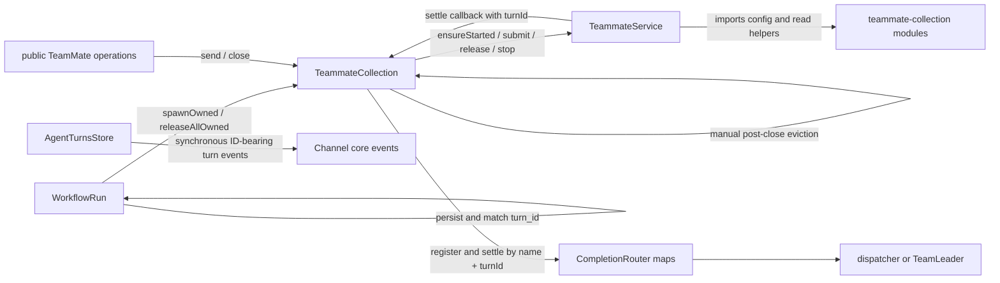

# Focused solution revision review: entity lock and in-process Turns

## Review basis and verdict

This review uses only the final clarified requirement at SHA-256
`4367fcdee10bbe23c5af6a2a3806772fcda3eb57887432552d3b0488e45c264a`
and source baseline `6b8ec14b080389bf6c6ae36fa336ec0451e401ec`. The existing
`technical-design/final.md` is treated only as superseded evidence of code that
must not survive into the revised solution.

**Verdict: APPROVE both operator-confirmed simplifications.** There is no
source-grounded consumer that requires either an external ownership registry or
a Dreamux Turn identifier. The final solution is nevertheless blocked until it
states and implements the race contracts below. Those blockers are reasons to
make the entity lock and object relationships precise; none is a reason to
restore `TeammateMutationClaims`, a public command adapter, a Workflow port, a
host `submission_id`, an ID-keyed router, or an observational Turn label.

The final clarification also resolves the last event ambiguity: remove the
unused Channel `turn.submitted` and `turn.settled` pair. Do not replace it with
an ID-free speculative turn feed. The TeamMate lifecycle event used for cache
retirement is a different, required owner fact and remains.

## Evidence summary

The current implementation uses strings to reconstruct relationships that are
entirely process-local:

- Collection exclusion is a process-local `exclusivelyOwned` map, and public
  `send`/`close` consult it before calling the entity
  (`packages/dreamux/src/service/teammate-collection/index.ts:145-154,311-331,600-611`).
- `spawnOwned` creates, caches, starts, submits, and only then returns to
  Workflow (`teammate-collection/index.ts:208-304`). Workflow therefore cannot
  retain a close capability while creation or initial provider admission is
  pending (`packages/dreamux/src/service/workflow-service/run.ts:296-360`).
- Runtime settlement is a callback carrying a provider ID; core buffers it in
  `Map<string, ...>` and later registers `producerName:turnId` with the router
  (`packages/dreamux/src/service/teammate-service/submission-readiness.ts:6-49`,
  `teammate-collection/index.ts:487-504,619-627`).
- Workflow persists the ID and later matches a callback back to the Agent call
  (`workflow-service/run.ts:430-451`). Its actual child-process protocol already
  correlates the business call by numeric Agent `index`, not by runtime Turn ID
  (`workflow-service/protocol.ts:16-37`,
  `workflow-service/runner.ts:143-167,231-240`).
- Current history appends split `submit` and `settled` rows and reconstructs a
  result through ID maps (`packages/dreamux/src/service/agent-entity/turns-store.ts:76-125`,
  `teammate-collection/read-helpers.ts:83-155`). No public command takes that ID
  back as input.
- Feishu inbound branches only on `delivery.status === 'submitted'`
  (`packages/channel/feishu-channel/src/feishu-session-inbound.ts:435-469`). The
  built-in Feishu provider subscribes only to binding events
  (`feishu-channel.ts:400-415`). The only in-repository listener for
  `turn.settled` is an external-provider test fixture
  (`packages/dreamux-types/tests/fixtures/external-provider.ts:194-215`), not a
  production consumer.
- Workflow crash recovery marks running Agents stopped from run status, index,
  and name without consulting `turn_id`
  (`packages/dreamux/src/service/workflow-service/index.ts:250-270`).

These facts support removal rather than replacement of the ownership and
correlation registries.

## Current and target dependency graphs

### Current



The defective arrows are not construction and lookup. They are the arrows that
make Collection execute an entity lifecycle command merely so Collection can
update its own cache, and the callback/registry arrows that recreate an
in-process object relationship from strings.

### Smallest target

```mermaid
flowchart LR
  Root[scope composition root] --> Collection[TeammateCollection factory / directory / reads]
  Root --> Workflow[WorkflowService]
  Root --> Delivery[stateless bounded delivery policy]
  Collection -->|construct, subscribe, publish canonical entity| Entity[TeammateService]
  Public[existing scope handlers] -->|resolve query| Collection
  Public -->|ordinary entity command| Entity
  Workflow -->|fresh materialize query; future resolve query| Collection
  Entity -->|lock returns restricted closure handle| Workflow
  Workflow -->|submit / close / unlock through handle| Entity
  Entity --> Runtime[AgentRuntimeProvider]
  Runtime -->|same RuntimeTurn object| Turn[canonical entity Turn]
  Workflow -->|AgentCall retains same Turn| Turn
  Turn -->|captured closure| Delivery
  Delivery --> Initiator[dispatcher or TeamLeader]
  Turn -->|one complete terminal row| History[AgentTurnsStore]
  Entity -. queued committed teammate.closed fact .-> Collection
```

There is deliberately no target arrow from `Turn` to Collection, from
Collection to a close bookkeeping step, or from a turn store to Channel turn
events.

## Stable-identifier challenge

| Boundary | What actually crosses or persists | Is a Turn identifier needed? | Concrete failure scenario and ruling |
| --- | --- | --- | --- |
| Codex adapter | App-server `turn.id` and notifications | **Provider-private only** | Removing the native key inside Codex would cross-wire `turn/completed` and item notifications; current protocol types and collector use it (`packages/agent-runtime/codex/src/types.ts:80-116`, `events.ts:74-95,144-233`). Let Codex keep its private ID/map, but return one opaque `RuntimeTurn` object to core. |
| Claude adapter | Native command/message UUID aliases for initial input and live steers | **Provider-private only** | Without private aliases, a delayed steer result can be mistaken for a new logical turn. Keeping the UUID in Claude fixes provider demultiplexing; exporting it would add no service capability. |
| Entity and Collection | Live object reference and entity name | **No** | If Collection indexes a completion by `name + turnId`, settlement can beat post-submit registration and be dropped. Passing the initiator closure into the entity before admission and retaining the Turn object closes the window. |
| Completion delivery | Captured initiator closure, one immutable completion fact, one Turn-owned delivery task | **No** | If duplicate settlement calls a stateless policy twice without a Turn-owned single-flight, the target receives two completion inputs. The Turn's one-shot terminal and cached delivery task are the at-most-once key. |
| Workflow in the server process | `AgentCall -> Turn` reference | **No** | If Workflow stores only an ID, a late callback can be matched to a reopened or reused TeamMate generation. A direct reference can only settle the call that owns it. |
| Workflow runner IPC | Agent call `index` | **No Turn ID** | Deleting `index` would prevent the child runner from matching `agent_result` to `agent_start`; retaining it is required business-call correlation, not model-turn correlation. No Turn object crosses the process boundary. |
| Workflow durability | `run_id`, Agent `index`, TeamMate `name`, status, timestamps | **No** | If runtime start precedes durable `name`, a crash leaves a live member that Workflow recovery cannot identify. Persist `index + name` before `handle.submit`; a Turn ID would not close that ordering window. |
| MCP/admin and Channel receipts | Acceptance status and optional error | **No** | Serializing a live object would fail at the JSON/provider boundary, while serializing an ID creates an unsupported lookup promise. Project the internal admission to `{status}`/`{status,error}` before it leaves core. |
| TeamMate `last`/history | Chronological, complete terminal records | **No** | Split rows need an ID only because the writer split one fact in two. A complete terminal row carries prompt/origin/intent, both timestamps, status, and output, so append order is sufficient. |
| Channel core events | Binding and collaboration facts only | **No** | Retaining an ID-bearing or surrogate-labelled turn event solely for the fixture creates a public compatibility contract with no production behavior. Delete both turn event kinds and their fixture/export assertions. |
| Completion spill files | An opaque, exclusive filesystem locator | **No Turn ID** | Naming every large result only by producer overwrites a prior result; using an owner-generated random/exclusive filename prevents collision. The path is a storage locator, not a correlation identity. Current code improperly derives it from `completion.id` (`packages/dreamux-utils/src/completion-body.ts:33-59,91-110`). |
| Process crash | Durable Workflow/identity state and already committed terminal rows | **No** | Reconstructing a Turn from a provider ID after restart would invent a new closure/latch and could redeliver an already accepted completion. Under the explicit no-replay scope, lost objects stay lost and recovery uses run/index/name only. |

No audited public input accepts a Turn identifier, no production Channel
subscriber needs one, and no cross-process protocol transports one for a
required behavior. There is therefore no basis for an observational replacement
label.

## True solution blockers

These are blockers to claiming the revised solution complete. They do not block
the two simplifications themselves.

### B1. Every mutation must linearize inside `TeammateService`

Current exclusion lives only in Collection. `TeammateService.send()` can reopen
and submit, `close()` mutates directly, and `ensureStarted()`/`stop()` are
independently callable (`packages/dreamux/src/service/teammate-service/index.ts:175-190,250-288,324-379`).

**Failure scenario:** remove `exclusivelyOwned`, add `lock()`, but leave one of
`channelInput`, scheduled input, completion input, `ensureStarted`, public close,
or worktree mutation outside the entity gate. That caller starts, folds into, or
stops a Workflow member despite the lock.

Required contract:

- `TeammateService` owns a synchronous admission gate. Every ordinary
  side-effecting method enters it before its first await. Read-only status and
  history queries remain available.
- Beginning an ordinary operation checks `unlocked && open && canonical`, then
  increments an entity-local operation count. `lock()` rejects while such an
  operation is admitted or while an unresolved ordinary Turn exists. This
  operation count is private implementation state, not an external permit
  service.
- `lock()` installs one opaque private token and returns a frozen restricted
  handle. Every handle method validates the token synchronously. A stale handle
  from Workflow A must fail after A unlocks and Workflow B later locks the same
  identity; otherwise A can submit to or close B's membership.
- Runtime start/resume/stop become private implementation steps of entity submit
  and close. Collection, Team, Dispatcher, and shutdown code receive no raw
  runtime-kill capability.
- A future attach-existing call resolves the ordinary entity and invokes this
  same `lock()`. It rejects a busy ordinary Turn rather than folding a Workflow
  call into pre-existing work.

The entity's minimum per-instance state is:

```ts
type EntityPhase = 'open' | 'closing' | 'closedHeld' | 'retired';

interface EntityConcurrencyState {
  phase: EntityPhase;
  ordinaryMutations: number;
  lockToken: object | null;       // private, process-local, never serialized
  closeTask: Promise<TeammateCloseResult> | null;
  currentTurn: Turn | null;       // a slot, not an ID map
  pendingAdmissions: number;
}
```

### B2. Unlock must retire the exact entity instance before publishing

An exact-source event check alone is insufficient. Current
`TeammateCollection.send()` awaits `mustEntity()` before it calls the resolved
entity (`teammate-collection/index.ts:311-317,506-515`). Even a cache hit crosses
that async boundary.

**Failure scenario:** a public call obtains the old closed entity reference and
yields. Workflow commits its terminal record, unlocks, and a delayed event
evicts that object. The public call resumes and reopens the now-uncached object;
the next lookup constructs a second `TeammateService`. Both runtimes can then
write the same last-writer-wins identity
(`packages/dreamux/src/service/agent-entity/identity-store.ts:335-368`).

Required contract:

1. Successful locked close commits durable identity `closed`, enters
   `closedHeld`, and keeps the lock. It publishes no retirement fact yet.
2. After Workflow terminal journal and record agree, `handle.unlock()` validates
   and revokes the token, synchronously moves the instance to irreversible
   `retired`, and only then queues `teammate.closed` publication.
3. An instance that has published its terminal fact never reopens. Any stale
   reference rejects in `retired`.
4. The Collection subscription closure captures the source object. Its handler
   synchronously deletes only when `entities.get(name) === source` and
   `source.isRetired()`. No serialized instance ID or lifecycle generation is
   needed.
5. If event delivery is delayed or fails, the next Collection resolve sees the
   cached retired source, replaces it from durable identity, and returns the new
   canonical instance. Ordinary reopen occurs only on that new instance.
6. An unlocked ordinary close similarly commits, retires, then queues the fact.

The narrow fact contract is intentionally free of a serialized source-instance
or generation identifier; the subscription closure already holds the exact
source object:

```ts
interface TeammateClosedFact {
  readonly schema_version: 1;
  readonly kind: 'teammate.closed';
  readonly dispatcher_id: string;
  readonly team_id: string | null;
  readonly name: string;
  readonly closed_at: number;
}
```

Publication is process-local, non-replayed, and queued only after durable
identity closure plus the applicable retirement boundary. The publisher does not
await or synchronously invoke subscribers. A listener failure is logged and
owned by Collection reconciliation; it cannot change `close()` or `unlock()`.

An overlapping public send may receive a specific retired/locked error and retry
through the directory. It may not mutate the old object. At the scope API level,
ordinary mutation is restored after unlock because the next resolve materializes
the retained durable identity; the event-publishing object itself is deliberately
not reusable.

### B3. Fresh Workflow creation must return the locked handle before runtime start

Current `spawnOwned` starts and submits before returning
(`teammate-collection/index.ts:260-304`). Current Workflow finalization drains
Agent tasks before bulk release (`workflow-service/run.ts:560-585`).

**Failure scenario:** provider submission never settles and `workflow_stop`
arrives. Workflow has no returned name, handle, or Turn, so it waits for the task
that can only finish after the close it cannot issue.

Required sequence:

1. The existing Collection factory allocates the name/worktree and writes a
   complete non-running durable identity.
2. It constructs the entity, subscribes to its lifecycle facts, calls
   `entity.lock()` synchronously, then publishes the canonical entity and returns
   the restricted handle. No runtime starts in this method.
3. `WorkflowRun` records the materialization promise before awaiting it. Stop
   closes admission and joins every such promise; each successful result is
   closed through its handle.
4. Workflow persists Agent `index + name` in journal and record before
   `handle.submit()` is allowed to start the runtime.
5. The Agent call retains the returned Turn object. On normal completion or stop,
   Workflow closes every handle before waiting for Agent-call drainage, commits
   Agent and run terminal state, then unlocks.
6. A pre-publication factory failure invokes the newly created entity's own close
   through the restricted handle and removes only the factory's unpublished
   reference. A post-return submit failure belongs to Workflow, which closes the
   handle. Neither path requires Collection-owned teardown.

This can be a narrow method/`Pick` on the actual Collection. Introducing a
`WorkflowTeammatePort` or reservation service adds no missing ownership fact.

### B4. One runtime object must produce one entity Turn, one terminal row, and one delivery

The current neutral seam returns `{status:'submitted', turnId}` and later calls
`onTurnSettled` (`packages/dreamux-types/src/turn.ts:48-65`,
`packages/dreamux-types/src/agent-runtime.ts:220-223,304-328`).

**Failure scenario:** two concurrent inputs fold into the same runtime work. Each
async continuation wraps the returned runtime object separately; a fast result
clears the first wrapper before the second continuation resumes. The second
creates another service Turn, so one logical model turn writes and delivers
twice. Replacing the string map with `Map<RuntimeTurn, Turn>` merely renames the
forbidden service registry.

Smallest neutral and entity contracts:

```ts
interface RuntimeTurn {
  /** Provider-owned, one-shot and permanently latched. */
  readonly settled: Promise<RuntimeTurnOutcome>;
}

type RuntimeAdmission =
  | { status: 'submitted'; turn: RuntimeTurn }
  | { status: 'duplicate' | 'stopped' }
  | { status: 'failed'; error: Error };

interface Turn {
  readonly runtime: RuntimeTurn;
  /** Resolves only after the winning outcome's terminal row is committed. */
  readonly settled: Promise<TurnOutcome>;
  /** Same single-flight task, used by close and delivery drainage. */
  readonly persistence: Promise<void>;
}
```

- Each provider owns one active logical slot. A fold/steer returns the exact same
  `RuntimeTurn` reference (`===`), not an equal wrapper. Codex may retain its
  native-ID maps entirely inside `agent-runtime/codex`.
- The entity serializes admission continuations or holds a direct pending
  admission barrier plus one `currentTurn` slot. It increments the barrier before
  provider I/O and does not process a fast terminal result until every join that
  was already admitted has installed its metadata/delivery closure.
- On the first returned runtime object, the entity constructs one `Turn`; a
  returned object equal to the current slot reuses that same Turn. The slot is
  not cleared until terminal processing and all admissions that could return it
  have drained. A provider must never accept a new alias after its RuntimeTurn is
  terminal.
- Runtime outcome and close-induced stop both call the same
  `Turn.trySettle(...)` one-shot. The winner fixes outcome, one terminal write,
  and one delivery task; a late provider result is a no-op and cannot recreate a
  Turn.
- The first accepted logical input seeds submitted time, origin, intent, and
  prompt summary. Folds may update a bounded in-memory prompt summary but do not
  increment `turn_count` or create another history row. The first
  delivery-requesting join installs the closure if none exists; Channel,
  scheduled, and reverse-completion inputs never clear it.
- A pending provider admission is tracked structurally before I/O. Close fences
  admission, reserves stopped on known Turns, stops the runtime, then joins
  pending admissions. A late accepted object joins/creates the canonical Turn
  and immediately loses to stopped; a definitive pre-accept stop produces no
  accepted Turn and no fabricated ID.

This is enough to replace `TurnSubmissionReadiness`; its ordering barrier is
retained conceptually, but its ID-keyed buffer is deleted.

### B5. CompletionRouter must become a direct policy, not an object registry

Current registration happens after submit (`teammate-collection/index.ts:311-323,494-504`),
and `CompletionRouter.settle()` drops an unregistered result
(`packages/dreamux/src/service/completion-router/index.ts:97-108`). Its maps and
terminal cache exist solely to compensate for string correlation
(`completion-router/index.ts:60-195`).

**Failure scenario:** a provider settles immediately, the entity persists and
calls `settle`, no registration exists, and the result is dropped. A later
register cannot observe the already-lost completion. Conversely, blindly
retrying a thrown delivery can submit the same completion twice if the first
call reached the target runtime before its response was lost.

Required replacement:

- Resolve/pass the initiator before runtime admission. The canonical Turn
  captures a closure over that initiator; Workflow `AgentCall` retains the Turn
  directly and does not use reverse delivery.
- Retain one shared `CompletionDeliveryPolicy`, but make it stateless:
  `deliver(initiator, preparedFact)`. The Turn caches the one invocation as
  `deliveryTask`; WorkflowRun similarly captures its initiator and owns one
  run-terminal delivery task.
- Preserve the current bound of three only for an explicit result whose contract
  proves failure occurred before target admission. `accepted` and `unsupported`
  are terminal. A throw or any post-admission/ambiguous failure is terminal with
  no retry. This is the at-most-once proof; a request ID is not.
- Prepare the immutable completion text/spill once before the retry loop. Every
  safe retry uses the same prepared value. The spill writer allocates an
  exclusive opaque path itself rather than deriving a filename from a completion
  ID.
- A target `completionInput` counts as accepted once it returns/retains its
  target Turn object. That target Turn carries no reverse-delivery closure, so a
  completion notification does not recursively route another completion.

The fact shapes need no generic `id`:

```ts
type CompletionFact =
  | { kind: 'teammate'; source: string; status: TurnStatus; result: string | null }
  | { kind: 'workflow'; run_id: string; status: WorkflowTerminalStatus; result: unknown };
```

`run_id` remains a Workflow domain identifier and display field; it is not a
Turn identity.

### B6. Claude live steer must gain a real provider-private terminal boundary

Object identity alone does not fix the current Claude heuristic. The current RPC
sets one `steered` boolean and settles on `setImmediate` after the first result
(`packages/agent-runtime/claude-code/src/rpc.ts:22-30,84-107,162-220`). Its test
places the original and steered result in one stdout chunk
(`packages/agent-runtime/claude-code/tests/rpc.test.ts:182-205`). Outbound user
messages currently carry no UUID (`claude-code/src/stream.ts:219-229`).

**Failure scenario:** the initial result arrives in one poll cycle, the
`setImmediate` fires, and the shared Turn persists/delivers. The queued steer
starts a tick later; its result is ignored because `pending` was cleared, while
core can already open another Turn against a still-running native command.

Official runtime evidence provides a non-heuristic boundary: the
[Anthropic Agent SDK 0.3.206 changelog](https://github.com/anthropics/claude-agent-sdk-typescript/blob/main/CHANGELOG.md#03206)
adds `command_lifecycle` frames for each UUID-stamped message with
`queued`, `started`, `completed`, `cancelled`, or `discarded` state. The audited
local Claude Code 2.1.228 binary advertises `msg_lifecycle_v1` and contains the
`command_lifecycle`/`command_uuid` fields.

The Claude adapter must stamp initial and live-steer SDK messages with private
UUIDs, alias every accepted UUID to the same `RuntimeTurn`, parse lifecycle
frames, and settle only after every accepted alias is terminal and the final
result is captured. A cancelled/discarded alias fails or stops the shared logical
Turn; it must not silently return the earlier answer. Pre-session folds combined
into one native message need one alias. Feature-detect the capability and fail
loud for unsupported live steer rather than retain the one-tick fallback. None
of these UUIDs leaves `agent-runtime/claude-code`.

### B7. Close must prevent queued provider work from starting after stop and must prove termination

Current Claude `stop()` sets `stopped`, stops only `this.session`, and returns
(`packages/agent-runtime/claude-code/src/runtime.ts:284-300`). A queued turn later
calls `ensureSession()` without a stopped check
(`claude-code/src/runtime.ts:421-449,525-559`). Current
`SupervisedChild.doStop()` sends `SIGKILL` and clears its handle without a final
liveness proof (`packages/dreamux-utils/src/supervised-child.ts:114-131`), while
`killProcessGroup` swallows `EPERM`
(`packages/dreamux-utils/src/os.ts:25-37`).

**Failure scenario:** a Claude submission is accepted while its queue has not
entered `ensureSession`; close sees no session, commits stopped/closed, and the
queued task then spawns a child. Separately, a surviving process group can be
reported terminated because the supervisor never verifies the post-kill state.

Mandatory fixes are provider-neutral at the entity seam and provider-owned
below it:

- Entity close changes admission to `closing` before its first await and shares
  one close task across all callers.
- Provider queues check stopped/generation before session creation, immediately
  before native submit, and after relevant awaits. No session factory may run
  after stop wins.
- Provider stop settles unresolved RuntimeTurns stopped once, performs bounded
  group teardown, and returns success only after a post-`SIGKILL` liveness check.
  Failure propagates; the entity does not commit a successful durable close.
- After runtime termination, the entity's live snapshot reports
  `closing/runtime_terminated` if a terminal-row, worktree, or identity write
  fails. Reads must not project the stale durable `running` value as an active
  runtime.

This is current-process termination proof required by the close contract. A
durable cross-daemon resource lease is not required by the explicit no-replay
scope and would not be replaced by a Turn ID.

### B8. History must write exactly one complete no-ID terminal row, and the old format needs an explicit break

Current `AgentTurnsStore` swallows append failures
(`packages/dreamux/src/service/agent-entity/turns-store.ts:200-218`), and the
rolling identity increments `turn_count` for every submitted alias
(`agent-entity/runtime-state.ts:32-50`). The JSONL helper blindly appends after a
possibly torn tail (`packages/dreamux/src/platform/jsonl.ts:1-8`), while the
reader silently skips malformed lines (`agent-entity/turns-store.ts:165-198`).

**Failure scenarios:**

- One folded logical turn creates two submit projections, inflates `turn_count`,
  and later produces multiple terminal rows.
- A stopped-row append fails but close reports success, so `last` has no
  observable stopped outcome.
- A crash leaves a partial last line; the first successful post-restart terminal
  append concatenates with it and is also unreadable.
- New code reuses `version: 1` for a different row shape; old history is silently
  misparsed rather than rejected.

Required persistence contract:

```ts
interface AgentTerminalTurnRecordV2 {
  version: 2;
  type: 'terminal';
  submitted_at: number;
  settled_at: number;
  turn_origin: AgentEntityTurnOrigin | null;
  prompt_preview: string | null;
  intent: string | null;
  settle_status: 'completed' | 'failed' | 'stopped';
  assistant: string | null;
  assistant_preview: string | null;
  assistant_truncated: boolean;
}
```

- The Turn owns a serialized, one-shot persistence phase. Append the complete
  record, then update rolling identity once. If the row committed and the
  identity projection failed, retry only the projection from the same in-memory
  phase; never append a second row.
- Entity close drains required Turn persistence. A failure is an operation error,
  not a successful close with missing history. Completion delivery starts only
  after the row commit.
- `last` streams complete rows directly in chronological order. Its DTO,
  history/admin types, MCP schema, Workflow Agent record/journal, and public
  acceptance receipt contain no `turn_id`.
- If JSONL remains the store, its serialized writer must detect/truncate a torn
  trailing fragment before the next append. This is bounded tail hygiene, not a
  replay journal or general ID-based repair engine.
- Remove Channel `turn.submitted` and `turn.settled` types, publication,
  subscriptions, fixture logging, exports, and tests. Do not publish a
  replacement terminal turn event.

The new row and Workflow record shapes cannot silently reuse version 1. The repo
0.x persisted-state rule requires a version bump, fail-loud loader behavior, an
exact manual rebuild instruction, maintenance-reference updates, and a breaking
Rush change. A steady-state legacy decoder that retains the old ID join would
contradict the final clarified boundary. An offline one-time conversion would
require a separate operator decision; it is not part of this solution.

## Lifecycle and flow contracts

### Entity lifecycle

```text
new complete non-running identity
  -> open/unlocked
  -> open/locked
  -> closing/locked
  -> closedHeld/locked          (runtime gone, Turns persisted, identity closed)
  -> retired/unlocked           (Workflow terminal durable; fact queued)

open/unlocked
  -> closing/unlocked
  -> retired/unlocked           (ordinary close; fact queued)

retired is terminal for that object instance. Reopen materializes a new canonical
instance over the same durable TeamMate identity.
```

`close()` is admission-fenced and single-flight. It reserves stopped on
unresolved Turns, terminates the runtime with a bound, joins admissions,
persists terminal Turn rows, performs only entity-owned worktree cleanup, commits
identity closed, and returns one stable result. Locked close stops at
`closedHeld`; only Workflow's post-terminal `unlock()` retires/publishes.

### Normal send/fold/settle

1. The existing scope handler queries Collection for the canonical entity and
   resolves the topologically correct initiator before submission.
2. Entity synchronously admits the ordinary operation and supplies the captured
   closure/metadata to its admission barrier.
3. Provider returns a new or existing `RuntimeTurn` object. Entity creates or
   reuses the one `Turn` in its active slot.
4. The public boundary projects the internal result to status/error only.
5. Runtime terminal and close race `Turn.trySettle`. The winner commits one
   terminal row, updates identity projection, then runs at most one captured
   delivery task through the stateless policy.
6. Once terminal processing and all possible join continuations drain, entity
   clears the slot. Late provider signals lose the latch and do nothing.

### Workflow create, stop, settle, and unlock

1. `AgentCall` exists and its materialization promise is tracked before awaiting
   the Collection factory.
2. Factory returns an already-locked handle before runtime start.
3. Workflow durably records `index + name`; then handle submission starts the
   runtime and returns the Turn retained by `AgentCall`.
4. Normal runtime completion is read from that Turn directly. Workflow validates
   schema, writes Agent result by `index`, and sends the child runner's
   `agent_result(index, ...)`.
5. Explicit stop first closes Workflow admission, joins materializations, and
   calls every available handle's entity-owned close. It does this before
   draining Agent tasks, so a never-settling provider is forcibly stopped.
6. After all close outcomes and Agent results agree, Workflow writes terminal
   journal and run record. Only then does it unlock handles. Each closed handle
   retires its entity and queues the lifecycle fact.
7. A close/persistence failure keeps the lock and prevents a successful terminal
   response. Retry joins the same entity close task/phases; Workflow never falls
   back to raw runtime kill.

### Team dissolve and Server shutdown

Containment callers close admission, stop Workflows through their retained
handles, then query Collection for remaining canonical unlocked entities and
invoke each entity's normal close capability. Team shared-worktree waiting uses
a read-only writer/`waitIdle` projection, not `AgentRuntime[]`; it never grants a
runtime stop bypass. Current `TeammateCollection.stopAll`, `releaseAllOwned`, and
raw `liveRuntimes` mutation exposure are removed.

Team-owned shared-worktree cleanup remains a legitimate owner command. After
Team closes members, Team/WorktreeManager performs cleanup and commands each
resolved entity to update its own identity projection. Delete the Collection
forwarder at `teammate-collection/index.ts:341-347`; a generalized worktree event
projector is unnecessary for this task.

### Crash under the explicit no-replay scope

- Crash before Workflow membership/name commit: no runtime has been allowed to
  start. The durable TeamMate identity is complete and non-running, not a live
  half-entity.
- Crash after name commit but before acceptance: Workflow recovery marks the
  run/Agent stopped by `run_id/index/name`; it does not create a Turn.
- Crash after acceptance but before terminal-row commit: the in-process Turn,
  closures, and provider-private alias maps are lost. There is no fabricated
  history row or completion delivery and no provider-ID lookup/replay.
- Crash after terminal-row commit but before completion delivery: the row stays
  readable via `last`; delivery is not replayed.
- An orphan native notification with no live provider-private object is ignored
  or provider-locally logged and cannot construct a core Turn.

Detached-process survival across an unclean daemon crash is separate resource
recovery work. A durable runtime lease/guarded-launch journal may address it in a
future task, but neither replay nor a service Turn ID is authorized here.

## Owner / command / query / event matrix

| Audited surface | Authoritative owner | Target interaction | Why the observer is not on the command path | Concrete failure if implemented otherwise |
| --- | --- | --- | --- | --- |
| Fresh identity/worktree materialization | Collection factory plus existing stores | Factory command, returning already-locked entity handle | Factory owns construction only; later lifecycle is the handle/entity | Starting before returning the handle recreates the create-vs-stop wedge. |
| Live entity cache | `TeammateCollection` | Collection-local write after lifecycle fact or resolve reconciliation | Entity does not call or await cache mutation | Awaiting eviction makes listener failure fail entity close. |
| Workflow membership | `WorkflowService` run/Agent record | Workflow command/state; entity lock is process-local fence | No collection owner map mirrors membership | A second owner map can clear before Workflow durability and admit public mutation. |
| Process-local mutation exclusion | `TeammateService` | `lock()` and private ordinary admission gate | No external claim/permit component participates | Any unguarded entity method bypasses Workflow exclusivity. |
| Public send | `TeammateService` | Collection resolve **query**, then direct entity **command** | Collection performs no registration or post-send bookkeeping | Post-submit router registration loses a fast settle. |
| Public close | `TeammateService` | Collection resolve **query**, then direct entity **command** | Cache retirement comes later as an event reaction | Current manual eviction makes Collection a second close owner. |
| Workflow submit | `TeammateService` through restricted handle | Direct authorized entity command returning Turn | Workflow retains object; Collection is absent | Collection-owned `spawnOwned` with callback fixes routing at construction and blocks reuse. |
| Workflow stop | Workflow decides timing; entity owns close mechanics | Direct `handle.close()` command | Workflow never interprets provider/runtime termination | A Workflow-local grace/kill algorithm diverges from public close. |
| Turn terminal outcome | Canonical `Turn` | Runtime promise and close call one one-shot entity method | No observer callback identifies the Turn | Separate callback wrappers can persist both completed and stopped. |
| Turn history and rolling projection | `Turn`/entity through `AgentTurnsStore` and identity store | One required terminal persistence task | Store does not publish Channel turn events or route completion | Best-effort split writes can report success without an observable outcome. |
| Completion delivery | Source Turn or WorkflowRun plus stateless policy | Direct captured closure after persistence | Collection/router registry is absent | An ID map can overwrite initiators or miss completion-before-register. |
| TeamMate lifecycle fact | `TeammateService` | Queued `teammate.closed` post-commit fact | Collection reaction is never awaited | Synchronous listeners can poison/slow the transition they merely observe. |
| Roster/list/status/history/last | `TeammateCollection` and stores | Read query, with live entity snapshot overlay | Reads do not issue entity commands | Reconstructing live state only from stale identity can report running after runtime termination. |
| Runtime start/resume/stop | `TeammateService` behind `AgentRuntime` | Private entity lifecycle command | Collection/Workflow see outcomes, never raw runtime | Raw shutdown sweep can kill a locked member without Workflow convergence. |
| Live-writer/idle view | Entity; Collection aggregates directory query | Read-only `{name, waitIdle}` projection | Consumer cannot stop or replace runtime | Exposing `AgentRuntime` permits an outer lifecycle bypass. |
| Spawn failure rollback | Factory before publication; Workflow after handle return | Command entity close through the held token | Eviction is local unpublished cleanup or later event reaction | A bespoke Collection release path can diverge from entity close. |
| Worktree cleanup | Entity for owned worktree; Team for shared worktree | Owner command plus explicit identity projection command | It is a required owner-to-projection command, not cache observation | Forcing it through Collection preserves an unrelated lifecycle forwarder. |
| Runtime/config resolution | Neutral config/runtime-profile module | Entity query at start | `TeammateService` imports no Collection module | Current reverse imports form a Collection/Entity module cycle (`teammate-service/index.ts:18-23`). |
| Reopen/materialization | Collection resolves durable identity; new entity owns reopen | Resolve query, then entity send command | Retired prior instance cannot reopen | Reopening an evicted old object creates two runtimes for one identity. |
| Workflow runner IPC | `WorkflowRun`/runner | `agent_start(index)` / `agent_result(index)` command messages | IPC correlates Agent calls, not runtime Turns | Sending an object across IPC is impossible; adding a Turn ID would duplicate `index`. |
| Channel inbound receipt | Core routing boundary | Status-only result | Provider has no object/ID lookup contract | Returning a live Turn leaks process state; returning an ID creates unsupported public correlation. |
| Channel turn events | No owner because feature is deleted | No event | No production subscriber exists | Keeping the pair fossilizes an unused public schema and surrogate identity. |
| Graceful Server shutdown | Server/Team/Workflow containment owners | Order scope; invoke the same handle/entity close commands | Collection only enumerates/query-resolves | Raw `stopAll` can terminate resources without terminal identity/Workflow state. |
| Crash recovery | Workflow/identity stores | Status reconciliation only; no Turn replay | Lost facts are not rebuilt from events/native IDs | Rehydrating a Turn can redeliver or contradict a terminal row. |

## Explicit command-path verification

The revised architecture passes the operator red line:

- **Public close:** the scope handler asks Collection only for a canonical entity
  reference, then calls the entity. Collection performs no post-close step.
- **Workflow close:** the restricted handle calls the entity directly.
- **Turn settlement:** RuntimeTurn outcome enters the canonical Turn; neither
  Collection nor an observer receives a callback needed to finish it.
- **Completion delivery:** the Turn invokes a captured closure through a
  stateless policy; Collection does not register or route it.
- **Cache eviction:** entity is already durably closed and irreversibly retired
  before the fact is queued. The Collection listener mutates only its own map and
  its failure cannot alter close/unlock.
- **Shutdown/dissolve:** Collection may enumerate or resolve; the containment
  caller invokes entity/handle commands. Enumeration is a query, not lifecycle
  bookkeeping.
- **Worktree projection:** the owning Team explicitly commands an entity-owned
  projection after shared cleanup; Collection forwarding is removed. This is not
  an observer reacting so it can maintain Collection state.

Therefore no Collection or observer remains on an entity command path merely
for bookkeeping.

## Scope discipline: mandatory now versus follow-up

| Concern | Classification | Reason |
| --- | --- | --- |
| Entity-owned lock, private token, all-method admission gate | Mandatory now | It is the active Workflow write fence. |
| Irreversible per-instance retirement and exact-object cache eviction | Mandatory now | It closes the demonstrated stale-reference/duplicate-instance race. |
| Current-process start/close guard and post-kill verification | Mandatory now | Successful close must prove no live runtime. |
| Durable resource lease / cross-daemon guarded launch | Follow-up | Crash replay/resource adoption is explicitly out of scope; no current-process behavior needs a durable lease. |
| Host `submission_id`, request fingerprint, provider replay ledger | Rejected | Explicitly prohibited and unnecessary with object identity/no replay. |
| Canonical RuntimeTurn/Turn objects and direct closure delivery | Mandatory now | This is the clarified service-correlation contract. |
| Provider-private Codex IDs and Claude UUID aliases | Mandatory where protocol requires | They are runtime implementation details and never cross core. |
| Persistent lifecycle/turn generation IDs | Rejected | Private handle token plus object identity solve stale access/eviction without another serialized identity. |
| Ephemeral per-start Workflow prompt/schema profile | Mandatory now | Current constructor-bound route/schema is ignored on cached reuse (`teammate-collection/index.ts:532-575`) and would break future attach. It is submit/start input, not a durable generation system. |
| Complete terminal row plus bounded torn-tail hygiene | Mandatory now | Required history and the first post-crash append must remain readable. |
| General strict JSONL repair/replay engine | Follow-up / not authorized | The requirement asks for no replay and no request fingerprint. |
| Worktree fact projector/event subsystem | Follow-up / unnecessary | Keep the existing owner command and remove only the Collection forwarder. |
| General store-event replacement | Rejected for Turn events | Delete the unused Channel turn pair; add only the narrow entity lifecycle source required for retirement. |
| Observational Turn label | Rejected | No production consumer exists, and the final clarification forbids speculative preservation. |

## Optional observability and hardening only

There is no optional service-level Turn label. The only justified optional
observability is data that does not become a correlation contract:

- Provider adapters may include their native ID/UUID in provider-scoped debug
  logs while handling that protocol. **Failure if it leaks:** core log parsers or
  operators can begin treating it as a durable Dreamux identifier, preventing a
  provider change. Do not copy it into core log fields, records, receipts, or
  events.
- Core may emit aggregate counts and latency histograms keyed by provider,
  TeamMate name/role, and terminal status. **Failure if a unique label is added:**
  the label recreates a public observation surface with no consumer requirement;
  use aggregate dimensions and timestamps only.
- Freezing/branding the restricted handle is optional defensive hardening; the
  private token check is mandatory. **Failure without a token check:** a stale
  handle mutates a later membership. Freezing alone does not supply that check.
- An opaque exclusive spill filename may be logged as a storage path.
  **Failure if treated as Turn identity:** cleanup or filename changes become a
  routing compatibility break. Nothing may look the Turn up by that path.

## Deterministic verification plan

### Lock, creation, and retirement

1. Pause a public mutation after it obtains the old entity but before it enters
   the method. Close locked entity, persist Workflow terminal, unlock/retire, and
   evict. Resume the old call: it must reject retired and start zero runtimes;
   a fresh Collection resolve/retry starts exactly one canonical runtime.
2. Drop/delay the lifecycle listener. The next resolve must replace the cached
   retired source; a later old event must not evict the replacement.
3. Race `lock()` against every public mutator. Exactly one gate wins. While
   locked, send, close, channel, scheduled, completion input, start/reopen, and
   worktree mutation perform zero writes/provider calls.
4. Unlock/relock and invoke the old handle. Every method rejects before mutation.
5. Pause fresh materialization before return and issue Workflow stop. Stop joins
   it and closes the returned handle; no runtime remains. Pause after return but
   before name persistence: submit cannot begin.
6. Race two public/concurrent closes and owner close. All authorized callers join
   one close task; a public caller against a lock rejects. Exactly one closed
   identity commit and retirement fact occur.

### Object Turn and provider races

7. Codex concurrent cold submissions and active folds return strict-equal
   RuntimeTurn objects; entity and Workflow receive strict-equal Turn objects.
   Assert one `turn_count`, one terminal row, and one delivery.
8. Settle the RuntimeTurn before provider admission promise returns. The latched
   outcome is processed after admitted joins; no callback, map, or registration
   is needed.
9. Begin with Channel input (no closure), fold a normal send, and settle during
   steer. The same Turn receives the normal initiator before terminal processing
   and delivers once. Two folded normal sends still deliver once.
10. Exercise runtime-complete-first and close-stop-first, including same-tick
    scheduling. Both paths call one latch; the loser writes/delivers nothing.
11. Hold provider acceptance pending and close. Test both outcomes: definitive
    pre-accept stop produces status stopped/no Turn; late accepted RuntimeTurn is
    bound to the canonical Turn and settles stopped once.
12. For Claude, deliver initial result, wait multiple event-loop ticks, then
    deliver steer lifecycle/result. The shared Turn stays pending until the final
    accepted alias. Cover two steers and cancelled/discarded aliases. Assert no
    UUID escapes the provider.
13. Queue a Claude Turn before `runActiveTurn` reaches `ensureSession`, then stop.
    `sessionFactory` is never called after stop and a late success cannot beat the
    stopped latch.
14. Simulate a process group alive after `SIGKILL`/permission failure. Provider
    stop and entity close fail; identity is not reported successfully closed or
    still actively running.

### Direct completion delivery

15. Settle before the initiating send returns. The captured closure still runs
    once; there is no register-after-settle step.
16. Return accepted, unsupported, explicit proven-pre-admission failure, and
    thrown/ambiguous failure. Assert attempts are respectively 1, 1, at most 3,
    and 1. Duplicate `trySettle` calls never run the policy again.
17. Make the first target call accept provider input and then throw. Assert no
    second runtime input. For a large result, all safe attempts use one prepared
    spill path and two simultaneous completions get distinct exclusive paths.
18. Workflow AgentCall retains its Turn, sends the runner result by `index`, and
    never accepts a producer/Turn callback. Workflow run terminal delivery uses
    its captured initiator and `run_id` only.

### Persistence, public contracts, events, and crash

19. One logical Turn with multiple folds writes exactly one V2 terminal row and
    increments `turn_count` once. `last` returns it in chronological order with
    no ID.
20. Fail terminal append: delivery does not run and close reports error. Fail the
    rolling identity projection after a committed row: same-process retry updates
    only the projection and does not append another row.
21. Seed a torn JSONL tail, restart the writer, append one new terminal row, and
    prove the new row is readable while the incomplete old row is not replayed.
22. Feed old V1 archive/Workflow state to new loaders. They fail loudly with the
    chosen breaking rebuild guidance; they are never silently reinterpreted by
    steady-state ID maps.
23. Snapshot MCP/admin spawn/send receipts, Workflow status/list records and
    journal, `last`/history, Channel exact-delivery results, and public type
    exports. Assert no `turn_id`, `turnId`, Turn object, or surrogate label.
24. Assert `turn.submitted`/`turn.settled` are absent from the Channel event union,
    scoped source, turns-store publisher, external fixture, root exports, and
    tests. Binding event behavior remains unchanged.
25. Crash before terminal append: recovery creates no Turn/row/delivery and marks
    persisted running Workflow/Agent stopped by index/name. Crash after terminal
    append but before delivery: row remains, no delivery replay occurs.
26. Static architecture gates assert no `TeammateService` import from
    `teammate-collection`, no Collection `releaseAllOwned`/manual post-close
    eviction, no core/provider-neutral Turn ID field/map, and no Channel turn
    event pair. Permit provider-private native-ID references only under provider
    packages.
27. Preserve and run load-bearing Team dissolve, Server shutdown, non-blocking
    inbound, close/reopen resume, worktree safety, and persistence suites. Add a
    never-settling Workflow turn to dissolve/shutdown and prove bounded return
    with zero live runtime.

## Rejected alternatives

- **Separate claims/public adapter/Workflow port.** The entity has the only state
  that can atomically fence its own methods. An external registry can disagree
  with entity admission and cannot protect a stale entity reference after
  unlock.
- **Same-instance reopen after publishing close.** A delayed eviction can remove
  that reopened object or leave an evicted object live. Irreversible per-instance
  retirement is smaller than a borrow/refcount registry.
- **Host submission or service Turn ID.** It cannot prove provider acceptance,
  is unnecessary in the no-replay process, and recreates the exact maps the
  clarification removes.
- **`WeakMap<RuntimeTurn, Turn>` in core.** It is still a service lookup registry.
  Current runtimes expose one active logical slot, so a direct slot and admission
  barrier are sufficient.
- **Keep CompletionRouter keys but hide them.** A hidden generated key still has
  post-submit registration, cache, and ambiguous retry races. Keep only the
  stateless policy.
- **Retain Channel turn events with timestamp/sequence as a surrogate.** There is
  no production subscriber; this creates an observational ID under another name.
- **Keep the V1 split-row join indefinitely.** It leaves persisted ID
  correlation in the history owner and silently conflicts with the clarified
  current-state contract.
- **Replay/catch up a terminal row after restart.** No durable delivery marker
  exists, so this can duplicate an accepted completion. Pull from `last` is the
  defined fallback.
- **Collection close forwarding for convenience.** Resolve is a valid directory
  query; post-close eviction is subscriber bookkeeping and must not make
  Collection the command executor.
- **Generalized durable leases, worktree projectors, or event-bus rewrite.** They
  do not solve a demonstrated requirement inside this no-replay task. Implement
  only the entity lifecycle source, provider teardown fixes, and bounded history
  tail hygiene required above.

## Final recommendation and deletion list

**Recommendation:** adopt entity-owned `lock()` plus an irreversible retired
instance boundary, and adopt canonical in-process RuntimeTurn/Turn objects with
direct captured completion delivery. The solution has no external ownership
registry and no Dreamux Turn identifier. Require the admission barrier, Claude
lifecycle fix, close/termination proof, one-row no-ID persistence, and explicit
state-version break before implementation approval.

Delete:

- `packages/dreamux/src/service/teammate-collection/owned-teammates.ts`,
  `OwnedTeammateOwner`, `exclusivelyOwned`, `spawnOwned`, `releaseExclusive`, and
  `releaseAllOwned`;
- the superseded `TeammateMutationClaims`, public permit/command adapter,
  `WorkflowTeammatePort`, reservation DTOs, public instance/generation IDs, and
  every caller/fixture proposed for them;
- Collection manual post-close eviction, raw runtime stop/release shutdown sweep,
  external `ensureStarted`/`stop`, and Collection worktree-projection forwarding;
- constructor-bound Workflow settle routing/schema ownership and
  `routeSettledCompletion`/`trackSettleCapture` Collection callbacks;
- neutral `TurnSettledSignal` and ID-bearing runtime submission result;
  `TurnSubmissionReadiness`'s ID map/buffer; core `turnId`, `turn_id`,
  `submission_id`, provider-turn-to-host maps, request fingerprints, and
  submission-ID generation;
- `CompletionRouter.pending`, `inFlight`, `terminal`, `completionKey`, all
  post-submit registration/settle/discard calls, and generic
  `CompletionEnvelope.id` (retain only a stateless bounded delivery policy);
- `nextSubmissionSeq`, `teammate:<name>:<seq>` and
  `completion:<completion.id>` service correlation, plus ID-derived completion
  spill filenames;
- Workflow Agent `turn_id`, submit-journal `turn_id`, callback matching, and all
  MCP/admin/Channel receipt projections of it;
- split V1 `submit`/`settled` steady-state writers and ID-joining `last` reader;
- Channel `turn.submitted` and `turn.settled` types, publisher branches,
  subscriptions, fixture logging, root exports, and tests;
- Claude `runtimeInstanceId`, `turnCounter`, `nextTurnId()`, the one-tick
  `steered` settlement heuristic, and tests expecting `claude-turn-*`;
- `TeammateService` imports from `teammate-collection`; move shared config
  resolution and read projection helpers to neutral lower modules.

Keep provider-native identifiers and their maps only inside the providers that
need them; keep Workflow `run_id`, Agent `index`, TeamMate `name`, channel
message/source IDs, session/checkpoint IDs, and opaque spill paths because those
identify their own real domain or storage objects, not a Dreamux Turn.
